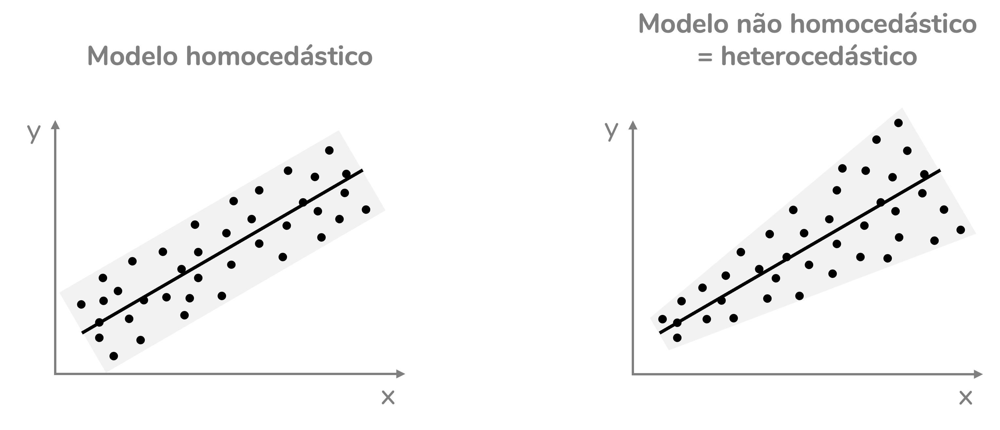
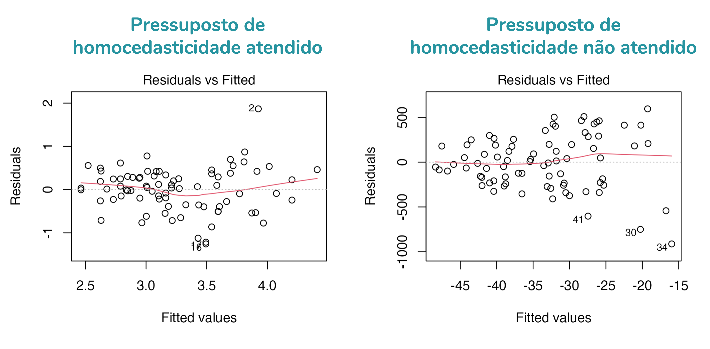
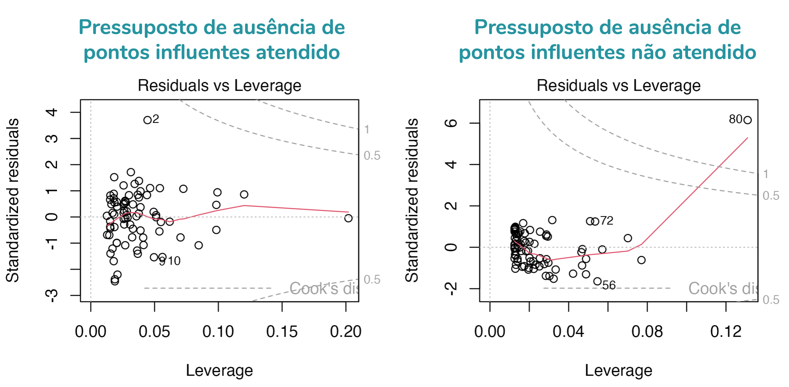

```{r, include=FALSE}
# knitr::opts_knit$set(upload.fun = knitr::imgur_upload, base.url = NULL)
knitr::opts_chunk$set(fig.width = 4, fig.height = 3.3, cache = FALSE,
                      fig.align = "center")
library(tidyverse)
library(ggpubr)
library(flextable)
library(ggstats)
source("/Users/fernandafperes/Documents/Blog_/content/blog/render_toc.R")
fstatix::paleta_f()
```
  
  
Este post está dividido nos seguintes tópicos:  
  
```{r toc, echo=FALSE}
render_toc("index.Rmd", toc_header_name = NULL, toc_depth = 2, base_level = 3)
```
  
   
   
### Conceitos importantes para que os gráficos façam sentido
  
Bom, antes de discutirmos os gráficos diagnósticos, eu preciso **rever** com você **alguns conceitos**. Lembrando que o foco desse post é te explicar os gráficos diagnósticos. Então, eu estou assumindo que você tem uma noção do que é uma regressão linear, ok?  
  
>Caso queira ler sobre a teoria por trás da regressão recomendo alguns posts do meu Instagram:  
>
* [Regressão linear - Parte 1](https://www.instagram.com/p/CC_PjHSpWi9/?utm_source=ig_web_copy_link)  
* [Regressão linear - Parte 2](https://www.instagram.com/p/CDmK4RWJHWe/?utm_source=ig_web_copy_link)  
* [Regressão linear - Parte 3](https://www.instagram.com/p/CEHfHfZAyKs/?utm_source=ig_web_copy_link)  
   
   
#### Valores previstos
  
Um conceito bem importante para pensarmos em gráficos diagnósticos é o conceito de **valores previstos** pelo modelo de regressão linear. Os valores previstos podem ser chamados também de **valores ajustados**. Em inglês, os termos utilizados são: *predicted values* ou *fitted values*.  
  
Para o valor previsto fazer mais sentido, vamos partir para um **exemplo**. Temos uma base de dados com as seguintes informações sobre crianças e adolescentes (idades entre 11 e 18 anos):  
  
* fev: Volume expiratório forçado, em litros. Uma medida da capacidade pulmonar.
* idade: Idade das crianças e adolescentes, em anos.
* altura: Altura das crianças e adolescentes, em centímetros.
  
Queremos avaliar se a idade e a altura dos jovens prevê a sua capacidade pulmonar. Para isso, vamos criar um modelo de regressão linear com `fev` como variável dependente e `idade` e `altura` como variáveis independentes.  
  
```{r, include=FALSE}
set.seed(1808)
dados <- read.csv2("FEV.csv") |> 
  filter(idade > 10) |> 
  dplyr::slice_sample(n = 80) |> 
  mutate(altura = round(altura*2.54),
         fumante = factor(fumante, levels = c(2, 1),
                          labels = c("Não", "Sim")))


write.csv2(dados, "FEV_80.csv", row.names = F)
```

```{r}
dados <- read.csv2("FEV_80.csv")

mod <- lm(fev ~ altura + idade, data = dados)

summary(mod)
```
  
O resultado nos indica um intercepto de **-6,29** e coeficientes para altura e idade de **0,053** e **0,059**, respectivamente. O modelo, portanto, resulta na seguinte **equação** para prever o fev:  
  
<center>
fev = -6,29 + 0,053 x altura + 0,059 x idade
</center>
<br /><br />
  
Portanto, se estamos falando de uma criança de **11 anos** e **165 cm** de altura, temos:  
  
<center>
fev = -6,29 + 0,053 x altura + 0,059 x idade  
  
fev = -6,29 + 0,053 x 165 + 0,059 x 11  
  
fev = -6,29 + 8,745 + 0,649  
  
fev = 3,104
</center>
<br /><br />
  
Isso significa que para essa criança o modelo está **prevendo um fev de 3,104 litros**.  
   
   
Veja os valores previstos para outros jovens da base:  
  
```{r, echo=FALSE}
dados$previsto <- predict(mod)

set.seed(1808)
dados |> 
  select(c(fev, altura, idade, previsto)) |> 
  mutate(fev = fstatix::arred(fev),
         previsto = fstatix::arred(previsto)) |> 
  slice_sample(n = 10) |> 
  flextable::flextable() |> 
  flextable::bold(part = "header") |> 
  flextable::autofit() |> 
  flextable::align(align = "center", part = "all")
```
<center><font size='2'>Os valores previstos podem variar um pouco em relação ao nosso cálculo manual porque fizemos arredondamentos.</font></center>

   
   
   
#### Resíduos
  
Mas toda criança de 11 anos e 165 cm de altura terá esse mesmo valor de fev? Não, é claro. Haverá diferenças entre o valor observado e o valor que o modelo está prevendo. Essas diferenças recebem o nome de **resíduos**.  
  
Os resíduos são a **diferença** entre o **valor observado** (o valor real, que consta na base) e o **valor previsto** pelo modelo de regressão.  
  
<center>
Resíduo = Valor observado - Valor previsto
</center>
<br /><br />
  
Veja os valores previstos e os resíduos para alguns jovens da base:  
  
```{r, echo=FALSE}
dados$previsto <- predict(mod)
dados$residuo <- residuals(mod)

set.seed(1808)

dados |> 
  select(c(fev, altura, idade, previsto, residuo)) |> 
  mutate(fev = fstatix::arred(fev),
         previsto = fstatix::arred(previsto),
         residuo = fstatix::arred(residuo)) |> 
  slice_sample(n = 10) |> 
  flextable::flextable() |> 
  flextable::bold(part = "header") |> 
  flextable::autofit() |> 
  flextable::align(align = "center", part = "all")
```

  
#### Resíduos padronizados
  
O resíduo está na mesma unidade de medida da variável dependente. No nosso caso, como fev está em litros, o resíduo está em litros.  
  
É comum também calcularmos os **resíduos padronizados** (em inglês, *standardized residuals*). Esses resíduos são padronizados para terem média zero e desvio-padrão igual a 1.  
  
```{r, echo=FALSE}
dados$previsto <- predict(mod)
dados$residuo <- residuals(mod)
dados$res_padronizado <- rstandard(mod)

set.seed(1808)

dados |> 
  select(c(fev, altura, idade, previsto, residuo, res_padronizado)) |> 
  mutate(fev = fstatix::arred(fev),
         previsto = fstatix::arred(previsto),
         residuo = fstatix::arred(residuo),
         res_padronizado = fstatix::arred(res_padronizado)) |> 
  slice_sample(n = 10) |> 
  flextable::flextable() |> 
  flextable::bold(part = "header") |> 
  flextable::autofit() |> 
  flextable::align(align = "center", part = "all")
```

  
#### Distância de Cook
  
A distância de Cook é uma medida que avalia o quanto uma determinada observação influencia o modelo de regressão. Por isso, ela é uma ferramenta que nos ajuda a identificar **pontos influentes**.  
  
Há vários pontos de corte sugeridos para a distância de Cook, mas uma **regra** bem usada (e implementada em um dos gráficos diagnósticos do R) é: pontos com distância de Cook **acima de 1** são influentes; pontos com distância de Cook **acima de 0,5** já devem ser avaliados com atenção.  
  
Mas, há outras sugestões de ponto de corte. Um dos pontos de corte sugeridos é **4/n**. Ou seja, em um modelo com 80 observações, teremos:  
  
<center>
4/80 = 0,05
</center>
<br /><br />
  
Isso significa que observações com distância de Cook acima de 0,05 já seriam observações **potencialmente influentes**.  

   
   
### Pressupostos do modelo de regressão linear
  
Ok, relembramos os conceitos importantes. Agora, vamos rever os pressupostos do modelo de regressão linear:  
  
<br />
  
**1. Linearidade**
  
O modelo de regressão linear assume que há uma **relação linear** entre a variável dependente e quaisquer variáveis independentes numéricas.  
  
<br />
  
**2. Normalidade dos resíduos**
  
Os **resíduos** do modelo de regressão linear devem apresentar **distribuição normal**. Podemos avaliar esse pressuposto com um teste estatístico, como o Shapiro-Wilk, ou com um gráfico, como o Q-Q plot, que usaremos aqui.  
  
<br />
  
**3. Homocedasticidade**
  
Homocedasticidade é um nome bonito (ok, talvez não *tão* bonito) para **homogeneidade de variâncias**. Para que o modelo de regressão seja válido, ele deve **errar de forma semelhante** ao prever valores mais baixos e mais altos. Para um modelo com uma única variável independente numérica, isso significa que quando plotamos um gráfico com a variável dependente no eixo y e a independente no eixo x, os pontos devem apresentar um padrão de distribuição **retangular** -- não triangular, em formato de gravata, etc. Ou seja: o espalhamento dos pontos ao redor da reta deve ser semelhante ao longo de toda a reta.  
  
```{r, echo=FALSE, fig.align='center', out.width = '580px'}

```
  
Essa inspeção visual acima só funciona quando temos apenas uma variável independente. Quando temos mais de uma, um gráfico adequado para analisar essa relação é um que traz os **resíduos** no eixo y e os **valores previstos** no eixo x. De novo, esperamos um padrão retangular na distribuição dos dados.  
  
```{r, echo=FALSE, fig.align='center', out.width = '580px'}
knitr::include_graphics("img2.png")
```
  
<br />
  
**4. Ausência de pontos influentes**
  
Pontos influentes são aqueles que influenciam de forma significativa o modelo de regressão, podendo distorcer seus coeficientes. Como discutimos, uma boa forma de avaliar essa influência é pela distância de Cook. Temos um gráfico diagnóstico para ela.  
  
<br />
  
**5. Ausência de multicolinearidade**
  
Multicolinearidade corresponde a uma **alta correlação entre variáveis independentes**. A presença de multicolinearidade leva a distorções nos coeficientes do modelo de regressão e nos seus valores de p. Por isso, é fundamental que **não haja** multicolinearidade no modelo.  
  
Avaliamos a multicolinearidade pelo cálculo do Fator de Inflação da Variância (**VIF**, do inglês *Variance Inflation Factor*). Como a multicolinearidade não é avaliada por gráficos diagnósticos, ela **não será abordada nesse post**. Mas posso fazer um post específico sobre ela. Me conta se tiver interesse, combinado?  
  
<br />
  
  
### Gráficos diagnósticos
  
Quando criamos um modelo de regressão no R, podemos usar a função `plot()` para acessar seus gráficos diagnósticos. O R mostrará um gráfico por vez. Para ver em uma única figura os quatro principais gráficos diagnósticos, devemos rodar antes a função `par(mfrow = c(2,2))`:  
  
```{r eval=FALSE, fig.width=6, fig.height=5}
par(mfrow = c(2,2))
plot(mod)
par(mfrow = c(1,1))
```
  
```{r echo=FALSE, fig.width=6, fig.height=5}
par(mfrow = c(2,2))
plot(mod)
par(mfrow = c(1,1))
```
  
Vamos, então, discutir cada um desses gráficos em detalhes.  
  
#### Gráfico 1. Avaliação da linearidade
  
O primeiro gráfico mostra a relação entre os resíduos (eixo y) e os valores previstos (eixo x). Ele também traz uma linha de tendência em vermelho e uma linha horizontal pontilhada em zero.  
  
Caso a gente queira acessar apenas esse gráfico, podemos usar a função plot com o argumento `which = 1`:  
  
```{r, fig.width=3.5}
plot(mod, which = 1)
```
  
Esse gráfico nos permite avaliar o pressuposto de linearidade. Caso esse pressuposto seja atendido, os pontos devem apresentar uma **linha de tendência** (em vermelho) aproximadamente **horizontal**.  
  
O gráfico à esquerda da figura abaixo mostra um modelo com o pressuposto de linearidade atendido. Já o gráfico da direita, mostra um modelo que não atendeu a esse pressuposto. Veja como a linha de tendência do gráfico à direita forma uma parábola -- ou seja, não é horizontal.  
  
```{r, include=FALSE, fig.width=6.5}
set.seed(4321)
dados2 <- as.data.frame(list(x = rnorm(n = 80, mean = 4, sd = 4))) |> 
  mutate(y = -3*x^2) |> 
  mutate(y = jitter(y, amount = 150))

mod2 <- lm(y ~ x, data = dados2)

par(mfrow = c(1,2))
plot(mod, which = 1)
plot(mod2, which = 1)
par(mfrow = c(1,1))
```
  
```{r, echo=FALSE, fig.align='center', out.width = '580px'}
knitr::include_graphics("img3.png")
```
  
  
#### Gráfico 2. Avaliação da normalidade
  
O segundo gráfico é um **Q-Q plot**: mostra a relação entre os resíduos padronizados (eixo y) e os quantis teóricos (eixo x). Esses quantis correspondem aos valores que seriam esperados caso os resíduos seguissem a distribuição normal. Ele também traz uma linha de referência (pontilhada) na diagonal.  
  
Caso a gente queira acessar apenas esse gráfico, podemos usar a função plot com o argumento `which = 2`:  
  
```{r, fig.width=3.5}
plot(mod, which = 2)
```
  
Esse gráfico nos permite avaliar o pressuposto de **normalidade dos resíduos**. Caso esse pressuposto seja atendido, os pontos devem estar **sobrepostos à linha diagonal** -- ou, pelo menos, bem próximos a ela.  
  
O gráfico à esquerda da figura abaixo mostra um modelo com o pressuposto de normalidade atendido -- veja que os pontos estão próximos à linha diagonal. Já o gráfico da direita, mostra um modelo que não atendeu a esse pressuposto: note como os pontos se distanciam bastante dessa linha, principalmente em quantis baixos e altos (esquerda e direita do gráfico).  
  
```{r, include=FALSE, fig.width=6.5}
set.seed(4321)
dados2 <- as.data.frame(list(x = rnorm(n = 80, mean = 4, sd = 4))) |> 
  mutate(y = -3*x^2) |> 
  mutate(y = jitter(y, amount = 150))

mod2 <- lm(y ~ x, data = dados2)

par(mfrow = c(1,2))
plot(mod, which = 2)
plot(mod2, which = 2)
par(mfrow = c(1,1))
```
  
```{r, echo=FALSE, fig.align='center', out.width = '580px'}
knitr::include_graphics("img4.png")
```
  
E como você já deve ter percebido: sim, essa é uma avaliação bem subjetiva. Faz parte.  
  
  
#### Gráfico 3. Homocedasticidade
  
A homocedasticidade pode ser avaliada pelo gráfico 1, que discutimos anteriormente. Ao avaliarmos o gráfico 1, consideramos que os dados apresentam homocedasticidade quando o padrão de distribuição dos pontos é retangular. Caso esse padrão seja triangular, ou em formato de gravata, temos dados heterocedásticos (= não-homocedásticos). Perceba como os pontos do gráfico à direita seguem um **padrão triangular**, mas os da esquerda, não:   
  
```{r, include=FALSE, fig.align='center', out.width = '580px'}
set.seed(6789)
dados2 <- as.data.frame(list(x = rnorm(n = 80, mean = 3.25, sd = 0.8))) |> 
  mutate(y = 2*x) |> 
  mutate(y = -1*x^(1.3)*jitter(y, amount = 100))

mod2 <- lm(y ~ x, data = dados2)

par(mfrow = c(1,2))
plot(mod, which = 1)
plot(mod2, which = 1)
par(mfrow = c(1,1))
```

```{r, echo=FALSE, fig.align='center', out.width = '580px'}

```
  
  
Mas o gráfico 3 é ainda melhor para avaliarmos homocedasticidade. Esse gráfico mostra a relação entre a raiz quadrada do valor absoluto dos resíduos padronizados (eixo y) e os valores previstos (eixo x). Caso a gente queira acessar apenas esse gráfico, podemos usar a função plot com o argumento `which = 3`:  
  
```{r, fig.width=3.5}
plot(mod, which = 3)
```
  
Como esse gráfico mostra a raiz quadrada dos resíduos em módulo, ele traz apenas resíduos positivos. Isso nos ajuda a enxergar o padrão de disribuição desses resíduos. Caso a variação seja constante ao longo dos valores previstos, a linha de tendência desse gráfico será aproximadamente **horizontal**. Modelos heterocedásticos terão gráficos com linhas de tendência **inclinadas**.  
  
O gráfico à esquerda da figura abaixo mostra um modelo com o pressuposto de homocedasticidade atendido -- veja que a linha de tendência é aproximadamente horizontal. Já o gráfico da direita, mostra um modelo que não atendeu a esse pressuposto: note como a linha de tendência está inclinada, ela sobe ao longo do gráfico.  
  
```{r, include=FALSE, fig.width=6.5}
par(mfrow = c(1,2))
plot(mod, which = 3)
plot(mod2, which = 3)
par(mfrow = c(1,1))
```
  
```{r, echo=FALSE, fig.align='center', out.width = '580px'}
knitr::include_graphics("img6.png")
```
  
  
#### Gráfico 4. Pontos influentes
  
O quarto gráfico mostra a relação entre os resíduos padronizados (eixo y) e a alavancagem (eixo x). A alavancagem reflete o quanto um ponto se distancia dos demais em relação aos valores das variáveis independentes. Esse gráfico também traz linha pontilhadas que indicam as distâncias de Cook 0,5 e 1 (por padrão).  
  
Caso a gente queira acessar apenas esse gráfico, podemos usar a função plot com o argumento `which = 5`:  
  
```{r, fig.width=3.5}
plot(mod, which = 5)
```
  
Se quisermos alterar os valores de distância de Cook representados no gráfico, podemos adicionar o argumento `cook.levels`. No exemplo, pedi para que fossem plotados os valores 0,05 e 0,5.  
  
```{r, fig.width=3.5}
plot(mod, which = 5, cook.levels = c(0.05, 0.5))
```
  
  
Esse gráfico nos permite avaliar o pressuposto de **ausência de pontos influentes**. Caso esse pressuposto seja atendido, os pontos não devem ultrapassar a linha pontilhada. O gráfico à esquerda da figura abaixo mostra um modelo com o pressuposto de ausência de pontos influentes atendido. Já o gráfico da direita, mostra um modelo que não atendeu a esse pressuposto: note como os pontos se distanciam bastante dessa linha, principalmente em quantis baixos e altos (esquerda e direita do gráfico).  
  
```{r, include=FALSE, fig.width=6.5}
set.seed(4321)
dados2 <- as.data.frame(list(x = rnorm(n = 80, mean = 4, sd = 4))) |> 
  mutate(y = -3*x) |> 
  mutate(y = jitter(y, amount = 10))

dados2[80,] <- c(15, 10)

mod2 <- lm(y ~ x, data = dados2)

par(mfrow = c(1,2))
plot(mod, which = 5)
plot(mod2, which = 5)
par(mfrow = c(1,1))
```
  
```{r, echo=FALSE, fig.align='center', out.width = '580px'}

```
  

  
  
  
  
### Como citar esse post, nas normas da ABNT
  
  
> PERES, Fernanda F. **Gráficos diagnósticos: Avaliando os pressupostos da regressão linear**. Blog Fernanda Peres, São Paulo, 15 jul. 2025. Disponível em: https://fernandafperes.com.br/blog/graficos-diagnosticos-lm/.
  
  
<br />

*** 
  
  
### Referências  
  
* FÁVERO, Luiz Paulo; BELFIORE, Patrícia. **Manual de análise de dados: estatística e modelagem multivariada com Excel®, SPSS® e Stata®**. Elsevier Brasil, 2017.  
  
* FIELD, Andy; MILES, Jeremy; FIELD, Zoë. **Discovering Statistics Using R**. Great Britain: Sage Publications, Ltd, v. 958, 2012.  
  
* [Understanding Diagnostic Plots for Linear Regression Analysis](https://data.library.virginia.edu/diagnostic-plots/)

