```{r, include=FALSE}
# knitr::opts_knit$set(upload.fun = knitr::imgur_upload, base.url = NULL)
knitr::opts_chunk$set(fig.width = 4, fig.height = 3.3, cache = FALSE,
                      fig.align = "center")
library(tidyverse)
library(ggpubr)
library(flextable)
library(ggstats)
source("/Users/fernandafperes/Documents/Blog_/content/blog/render_toc.R")
fstatix::paleta_f()
```
   
   
### O que é o Índice de Validade de Conteúdo (IVC)?
  
Imagine que você desenvolveu um questionário composto por vários itens (perguntas) referentes a depressão. Como **garantir que esse questionário é válido**, isso é, de fato está aferindo o que se propõe a aferir, a depressão? Para que tenhamos essa garantia, esse questionário precisa passar por validações. Uma delas é a chamada **validade (ou validação) de conteúdo** (em inglês, *content validity*).  
  
Na validação de conteúdo, especialistas (chamados também de *experts*, avaliadores ou juízes) avaliam cada item do novo questionário com uma nota de 1 a 4 que se refere à relevância/ representatividade para o constructo que se deseja mensurar (no exemplo acima, depressão). As notas de 1 a 4 correspondem, geralmente, a:  
  
* 1 = o item não é relevante ou representativo
* 2 = o item precisa de uma grande revisão para ser relevante/ representativo
* 3 = o item precisa de uma pequena revisão para ser relevante/ representativo
* 4 = o item é relevante ou representativo  
  
<br />
  
Duas questões importantes podem estar passando pela sua cabeça:

* Como definir **quem** serão os avaliadores?
* **Quantos** avaliadores eu devo incluir no estudo?
  
Com relação ao **quem**, a decisão é mais subjetiva: você deve contatar **especialistas naquele constructo** que você pretende aferir com o questionário. Por exemplo, se o constructo é depressão, devem ser contatados psicólogos e psiquiatras com experiência em depressão.  
  
Mas a segunda pergunta tem uma resposta mais objetiva. @lynn1986ivc recomenda incluir **pelo menos 5 avaliadores**, sendo que quanto mais, melhor -- mas não há necessidade de mais do que 10. Além disso, ela discute que pode ser difícil encontrar experts em alguns domínios/ constructos. Nesses casos, o pesquisador deve recrutar no mínimo 3 avaliadores [@lynn1986ivc].  
  
O IVC é uma medida calculada a partir das avaliações desses *experts*. Mas aqui eu preciso te contar que há três tipos de IVC (em inglês abreviado como CVI, de *Content Validity Index*):  
  
* IVC-I: um índice calculado para cada **item** (daí vem o I da sigla) do questionário, que reflete a relevância/ representatividade daquele item, de acordo com os *experts*.
* IVC-S/Ave: um índice calculado para a escala como um todo (daí vem o S, do inglês *Scale*) que corresponde à **média** (Ave, do inglês *Average*) de todos os IVC-I.
* IVC-S/UA: um índice também calculado para a escala como um todo que corresponde à proporção de IVC-I iguais a 1. O UA da sigla vem de **"Universal Agreement"**, em tradução livre "concordância universal".  
  
Vamos, então, discutir como calcular e interpretar cada um deles.  
  
  
>Você chegou a esse post porque precisa calcular o IVC para os seus dados, mas **não tem tempo** para aprender a calculá-lo? Eu ofereço um serviço de análise de dados em que você pode **me contratar** para realizar esse cálculo. O contato é via formulário que está [nesta página](https://fernandafperes.com.br/servicos).  
  
  
### Como calcular o IVC-I?
  
O cálculo do IVC-I, ou seja, do IVC para cada item, é simples. Para isso, basta dividirmos a quantidade de avaliações 3 ou 4 que aquele item recebeu pela quantidade total de respostas:  
  
```{r, echo=FALSE, fig.align='center', out.width = '400px'}
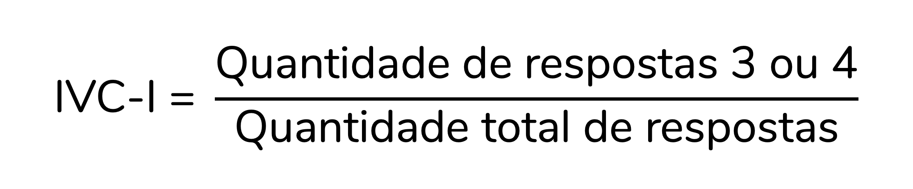
```
  
Para isso fazer mais sentido, vamos calcular o IVC-I para alguns itens:  
  
```{r, echo=FALSE, fig.align='center', out.width = '500px'}
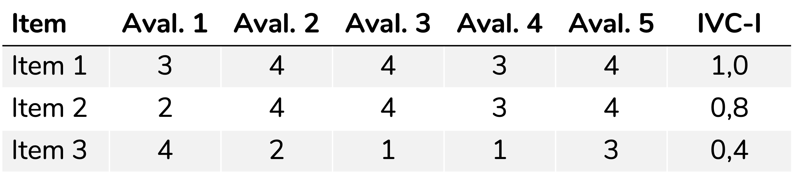
```
  
Veja que há 5 avaliadores e para o primeiro item há 5 avaliações 3 ou 4. Logo, o IVC-I será:  
  
```{r, echo=FALSE, fig.align='center', out.width = '200px'}
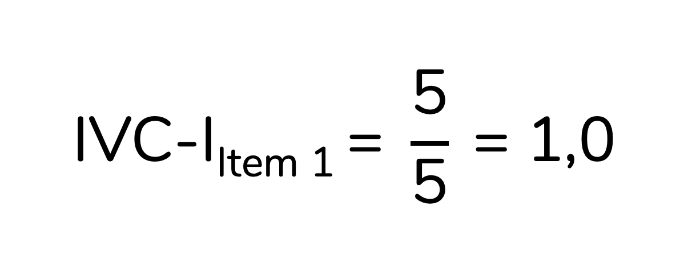
```
  
Já para o Item 3, há apenas 2 avaliações 3 ou 4, em 5 avaliações no total. Portanto, o IVC-I será:  
  
```{r, echo=FALSE, fig.align='center', out.width = '200px'}
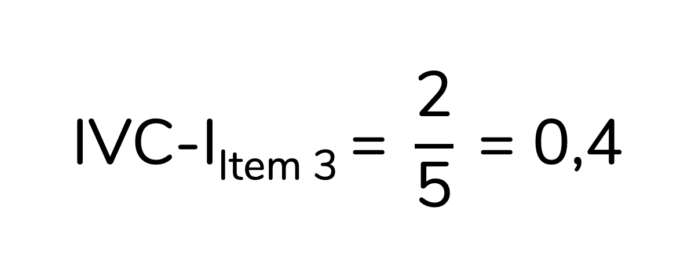
```
  
  
#### Como interpretar o IVC-I? Quando um item é considerado adequado, de acordo com o IVC-I?
  
Perceba que o IVC-I corresponde à **proporção de concordância** entre os avaliadores para aquele item, considerando-se que os avaliadores que responderam 3 ou 4 concordam que o item é relevante/ representativo.  
  
@polit2007kappa recomendam que itens com **IVC-I superior a 0,78** sejam considerados adequados.  

  
  
### Como calcular os IVC-S?
  
Como discutimos, há dois tipos de IVC para a escala (IVC-S): o Ave e o UA. Vale dizer que essa divisão e nomenclatura não são um consenso. Muita gente calcula um deles e o reporta apenas como "IVC-S", sem que fique claro qual das versões foi calculada. Polit e Beck discutem justamente isso em seu artigo de 2006, o qual propõe a nomenclatura IVC-S/Ave e IVC-S/UA [@polit2006ivc]. Portanto, eu recomendo que você **calcule as duas versões do IVC-S** no seu trabalho e referencie esse artigo.  
  
O IVC-S/Ave é bem simples de calcular: ele corresponde à média de todos os IVC-I. Já IVC-S/UA corresponde à proporção de IVC-I iguais a 1. Note que para que um item tenha um IVC-I igual a 1 todos os *experts* precisam tê-lo avaliado como 3 ou 4. Ou seja, trata-se de um item que **todos** os *experts* consideraram representativo/ relevante. Daí vem o "concordância universal" (UA, do inglês *Universal Agreement*). Para isso fazer mais sentido, vamos calcular o IVC-S/Ave e o IVC-S/UA para a escala abaixo:  
  
  
```{r, echo=FALSE, fig.align='center', out.width = '500px'}
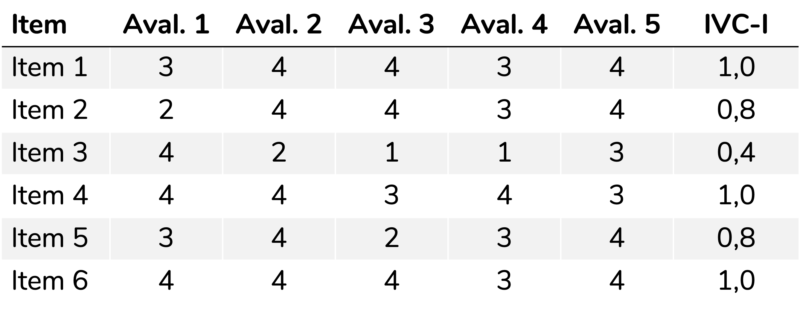
```
  
O IVC-S/Ave será a média de todos os IVC-I:  
  
```{r, echo=FALSE, fig.align='center', out.width = '500px'}
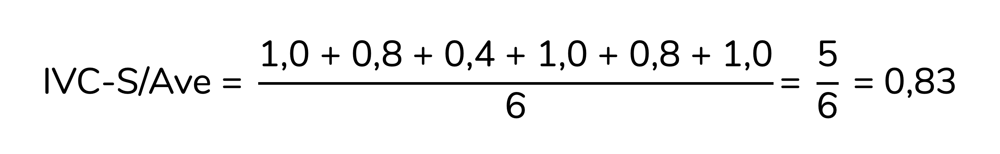
```
  
Já para calcular o IVC-S/UA devemos contar quantos IVC-I são iguais a 1,0 e então dividir essa quantidade pelo total de itens:  
  
```{r, echo=FALSE, fig.align='center', out.width = '400px'}
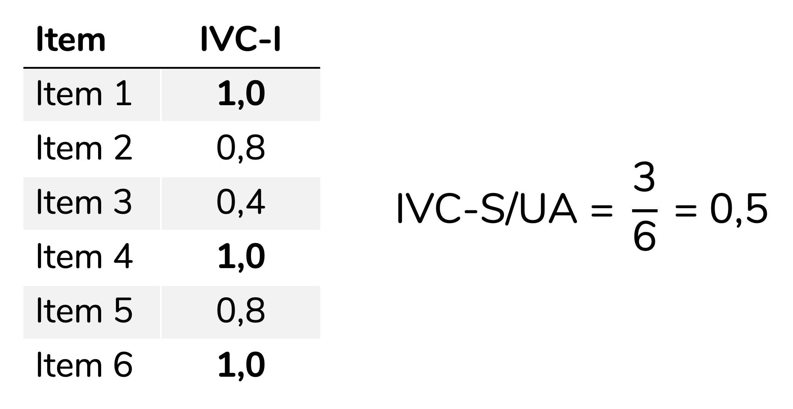
```

  
Para o **IVC-S/Ave**, @polit2007kappa sugerem que valores **iguais ou superiores a 0,9** indicam uma escala adequada. Para o **IVC-S/UA**, recomenda-se valores **iguais ou superiores a 0,8** -- mas os autores discutem que esse ponto de corte pode ser muito conservador [@polit2007kappa].  
  
  
  
### E o kappa?
  
É bem comum que trabalhos que calculem o IVC também calculem o kappa. O kappa seria uma medida de concordância com uma correção para a concordância entre os avaliadores que seria esperada ao acaso (em inglês, *chance agreement*).  
  
Aqui também os artigos divergem. Alguns calculam o kappa para a escala como um todo, geralmente utilizando o kappa de Fleiss. Eu tenho vídeos que ensinam a calcular essa medida [no SPSS](https://youtu.be/1JNZCZftKT0?si=qJwGARoyKtjnjY3D) e [no R](https://youtu.be/LO4lk1dzvmc?si=Jy0qf0ZV31GndElX).  
  
Mas, eu quero discutir nesse post o **kappa modificado**, proposto por @polit2007kappa. A proposta dos autores é calcular um kappa que corresponda ao IVC-I **corrigido para a probabilidade de concordância ao acaso**. A fórmula para esse cálculo não é difícil, mas são raros os materiais didáticos -- principalmente em português -- que o discutem. Inclusive, esse kappa modificado foi a minha principal motivação para escrever esse post. Vamos ao seu cálculo, então.  
  
>Lembrando que eu ofereço um serviço de análise de dados em que você pode **me contratar** para realizar esse cálculo. O contato é via formulário que está [nesta página](https://fernandafperes.com.br/servicos).  
  
O primeiro passo para calcular o kappa modificado -- que os autores sugerem que seja **representado como κ* **-- é calcular a probabilidade de concordância ao acaso, representada por p~c~ (c de *chance agreement*, em inglês):  
  
```{r, echo=FALSE, fig.align='center', out.width = '280px'}
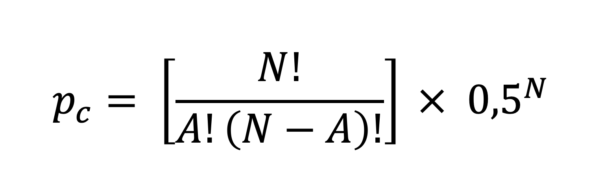
```
  
Sendo:  
  
* N = a quantidade de avaliadores
* A = a quantidade de avaliaçoes 3 ou 4 que aquele item recebeu
  
Para isso fazer mais sentido, vamos calcular essas probabilidades para o item abaixo:  
  
```{r, echo=FALSE, fig.align='center', out.width = '450px'}
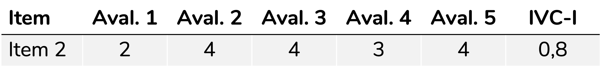
```
  
Veja que esse item foi avaliado por **cinco avaliadores** recebeu **quatro avaliações** 3 ou 4. Portanto, para esse item, N = 5 e A = 4. Logo, o cálculo da p~c~ será:  
  
```{r, echo=FALSE, fig.align='center', out.width = '310px'}
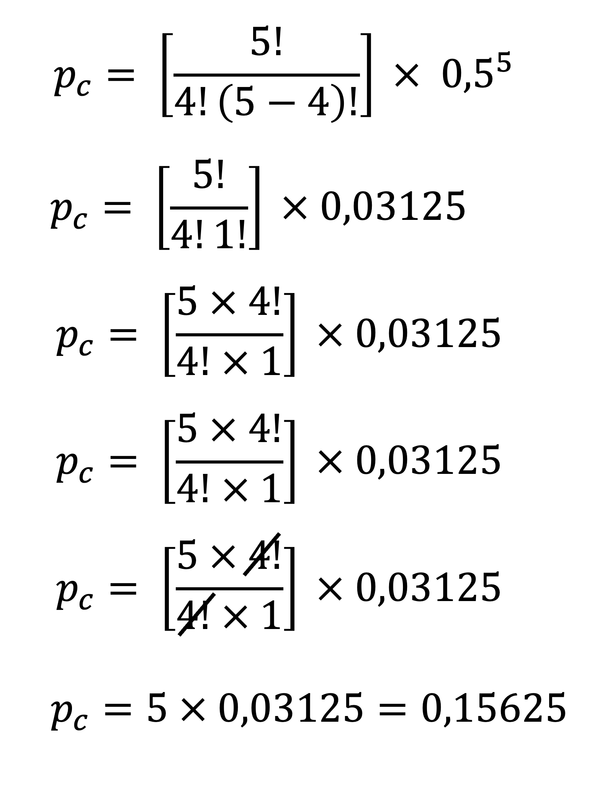
```
  
Sabendo a p~c~ para aquele item, podemos agora calcular o kappa modificado (κ*), com a equação abaixo. Reforçando: todo esse cálculo é baseado no artigo de 2007 de Polit e colaboradores [@polit2007kappa].  
  
```{r, echo=FALSE, fig.align='center', out.width = '200px'}
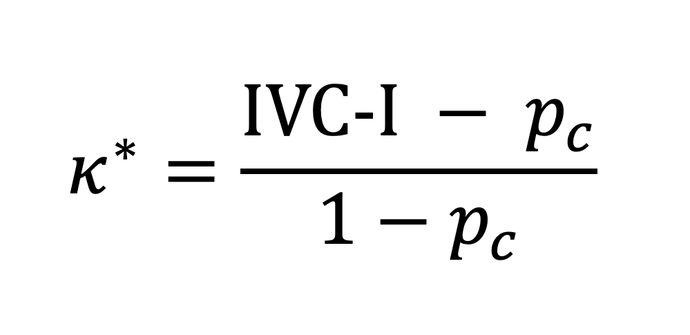
```
  
Aplicando a fórmula acima ao item 2, para o qual p~c~ = 0,15625 e IVC-I = 0,8, teremos:  
  
```{r, echo=FALSE, fig.align='center', out.width = '580px'}
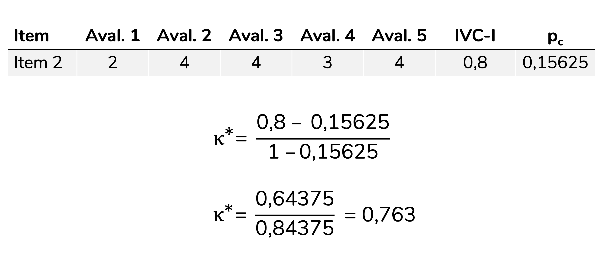
```
  
Esse valor de kappa modificado pode ser interpretado conforme as sugestões da literatura, sendo uma das mais utilizadas a de @landis1977kappa. De acordo com essa classificação, valores de kappa entre 0,21 e 0,40 indicam confiabilidade fraca; entre 0,41 e 0,60, moderada; entre 0,61 e 0,80, substancial e acima de 0,81, quase perfeita.  
  

  
  
#### Como citar esse post, nas normas da ABNT
  
  
> PERES, Fernanda F. **O que é e como calcular o Índice de Validade de Conteúdo (IVC)?**. Blog Fernanda Peres, São Paulo, 09 mai. 2025. Disponível em: https://fernandafperes.com.br/blog/ivc-kappa/.
  
  
<br />

*** 
  
  
### Referências  
  


