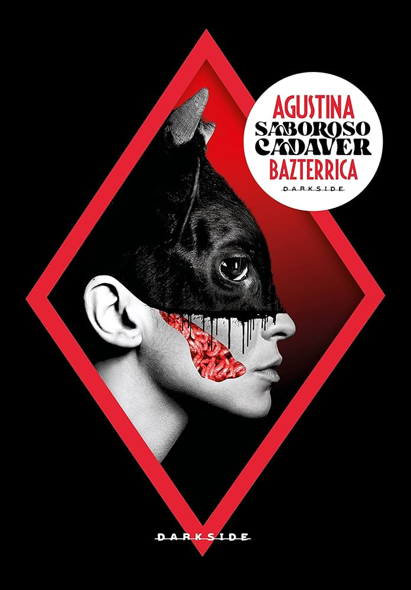
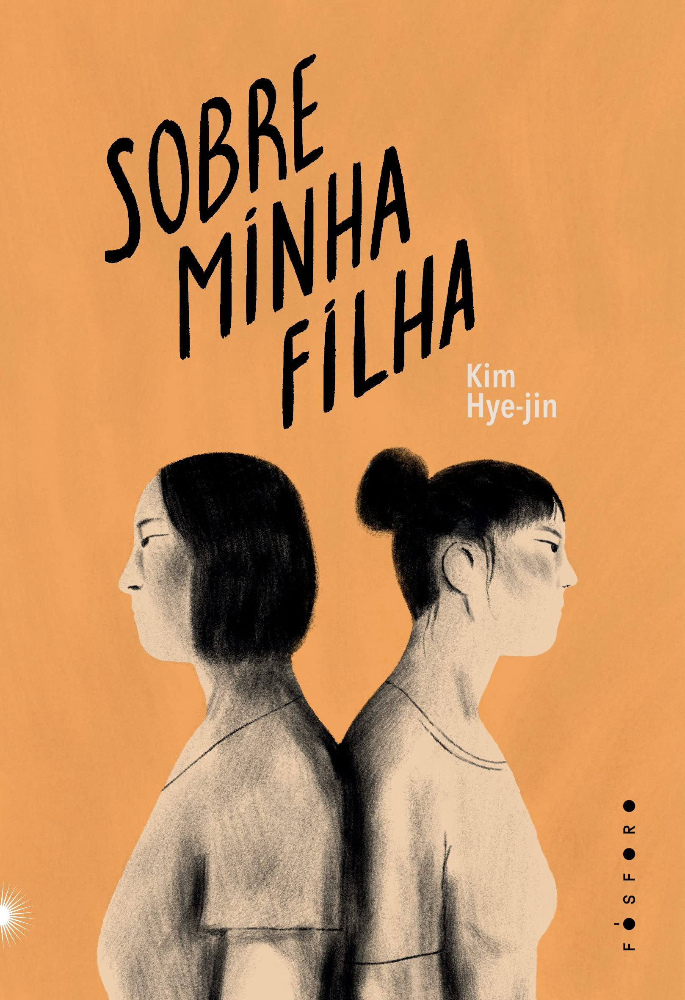
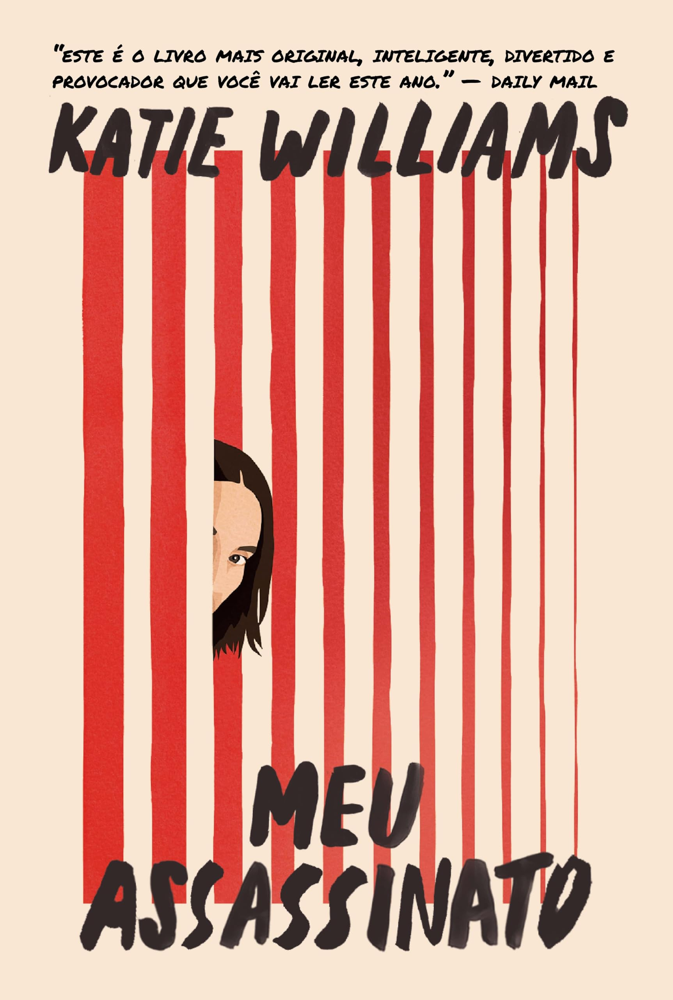
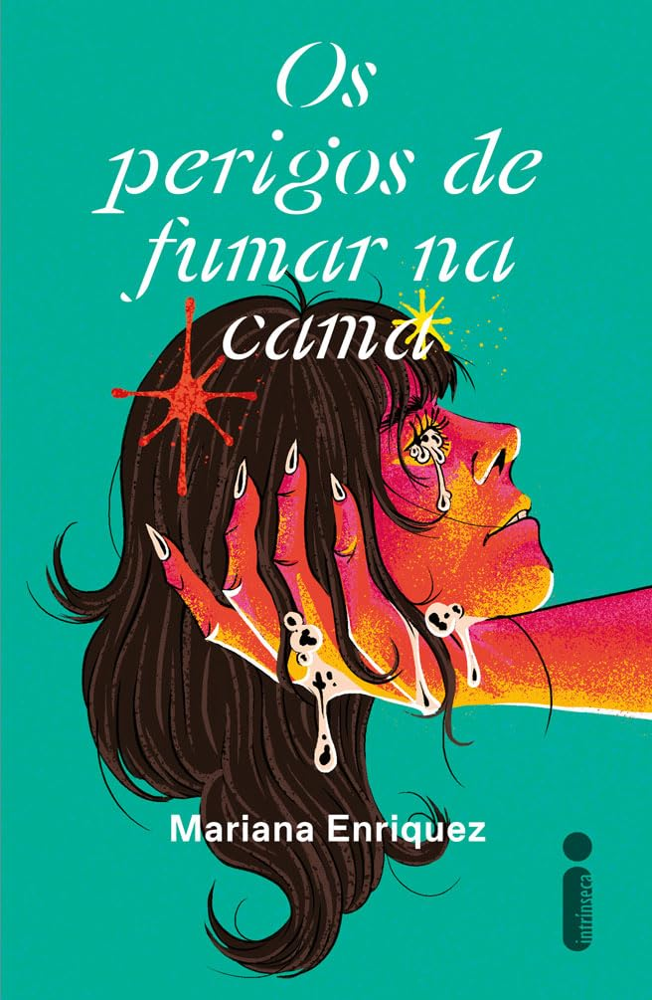
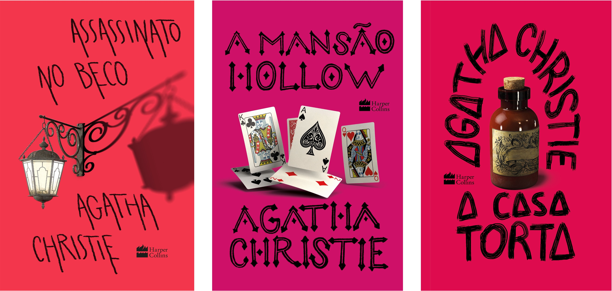
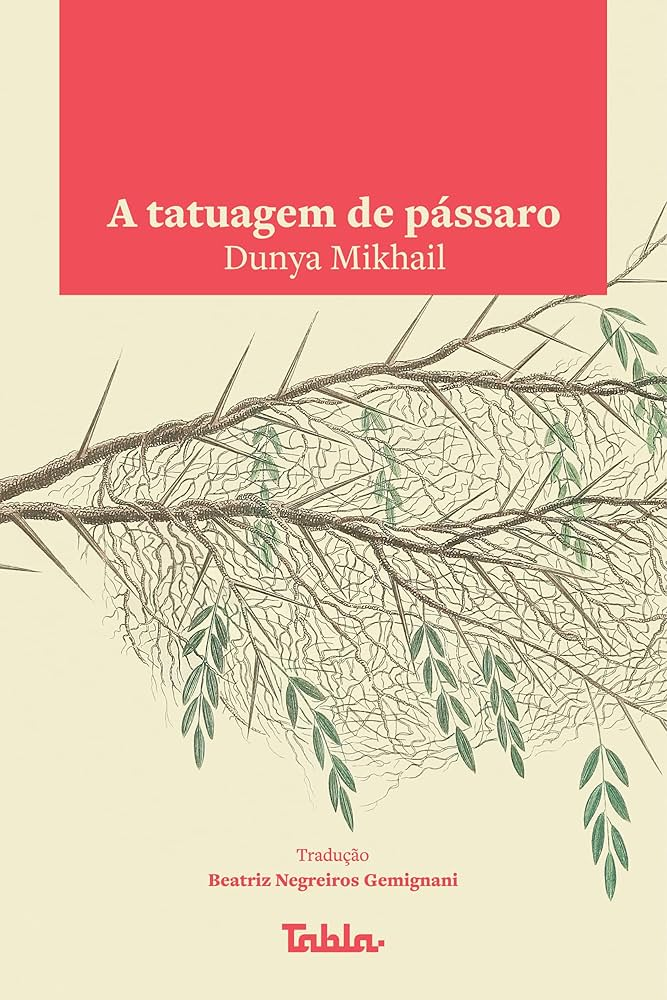
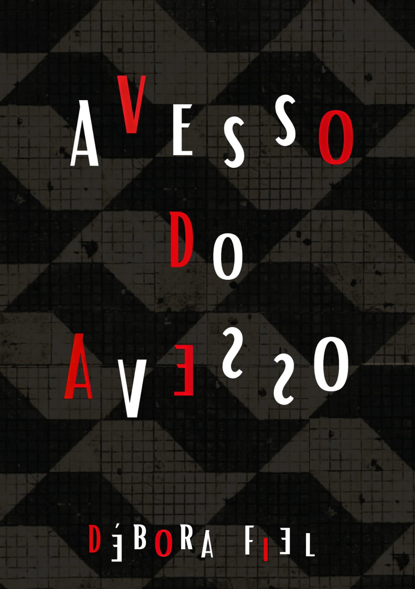
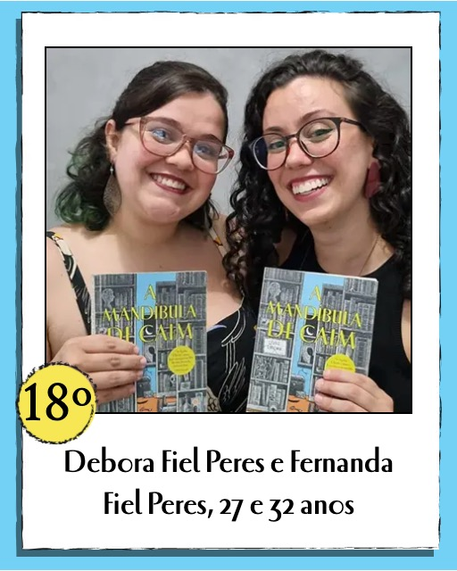
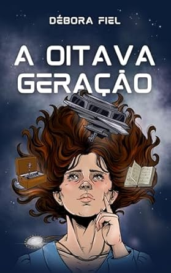

<center>
<font size = '1'>
Imagem de <a href="http://www.freepik.com">Freepik</a>
</font>
</center>
  
  
```{r, include=FALSE}
knitr::opts_chunk$set(fig.width = 5, fig.height = 5, cache = TRUE)
pacman::p_load(rnaturalearth, rnaturalearthdata, ggiraph, tidyverse)
fstatix::paleta_f()

dados <- readxl::read_excel("Livros.xlsx")
```
  
<br />
  
Fortemente inspirada no [post da Beatriz Milz](https://beamilz.com/posts/2024-07-25-leituras-1sem/pt/), eu decidi fazer uma análise exploratória das minhas leituras em 2024. Antes de você seguir nesse post, eu preciso te dizer que minhas leituras seguem aquele ditado **"um pouco de droga, um pouco de salada"**. Eu curto livros mais sérios, mas também amo ler livros bem comerciais e com tramas mais óbvias (os livros que são ridicularizados nos clubes do livro *cults* por aí).  
  
Uma outra informação é que em 2024 eu participei de dois **clubes do livro**. Isso com certeza contribuiu para que minhas leituras fossem mais diversas -- principalmente no que diz respeito à nacionalidade dos autores. Os clubes também me fizeram ler livros que eu normalmente não leria (e alguns que, depois de ler, eu confirmei que não queria ter lido, haha!).  
  
Ao final, trago uma mini resenha dos meus livros favoritos do ano -- e já te adianto que alguns deles estão entre os meus favoritos da vida. Então, caso tenha interesse em sugestões de leituras, não pule essa parte, ok?  
  
  
### Principais características dos livros
  
```{r, include=FALSE}
dados |> 
  summarise(`Quantidade de livros` = n(),
            `Total de páginas` = sum(`Quantidade de páginas`),
            `Média de páginas por dia` = `Total de páginas`/365)

table(dados$`Clube do livro`)
```
  
No total, eu li 30 livros, que totalizaram 7.068 páginas -- uma média de 19,4 páginas por dia. De todos os livros lidos, 15 (50%) foram para algum clube do livro. Eu tenho preferido e-books a livros físicos. Mas em 2024 eu li mais livros físicos do que normalmente e eles corresponderam a 30% das leituras.  
  
```{r, echo=FALSE, fig.width=4.5, fig.height=2.5, fig.align='center'}
dados |> 
  count(`Tipo do livro`) |> 
  mutate(rotulo = paste0(n, " (", 100*n/sum(n), "%)")) |> 
  ggplot(aes(y = `Tipo do livro`, x = n)) +
  geom_bar(stat = "identity", fill = azul) +
  geom_text(aes(label = rotulo), size = 3.5, family = "Nunito", hjust = -0.1) +
  scale_x_continuous(expand = expansion(mult = c(0, 0.2))) +
  labs(y = NULL, titulo = "Formato do livro", x = "Quantidade de livros") +
  theme_classic() +
  theme(text = element_text(family = "Nunito", size = 13))
```


  
  
### Ano da publicação
  
A maior parte dos livros que eu li em 2024 foram publicados entre 2022 e 2024. Os dois mais antigos são da rainha do crime (e dona do meu coração): Assassinato no Beco (1937) e A mansão Hollow (1946).  
  
```{r, echo=FALSE, fig.width=5, fig.height=3.5, fig.align='center'}
dados |> 
  count(`Ano da publicação`) |> 
  filter(!is.na(`Ano da publicação`)) |> 
  ggplot(aes(x = factor(`Ano da publicação`), y = n)) +
  geom_bar(stat = "identity", fill = azul) +
  geom_text(aes(label = n), size = 3, family = "Nunito", vjust = -0.5) +
  scale_y_continuous(expand = expansion(mult = c(0, 0.2)),
                     breaks = seq(0, 10, by = 2)) +
  labs(y = "Quantidade de livros", x = "Ano da publicação") +
  theme_classic() +
  theme(text = element_text(family = "Nunito", size = 13))
```

  
### Perfil dos autores
  
Mulheres predominaram a autoria das minhas leituras (83,3%), como acontece há uns bons anos. Dos cinco livros escritos por homens que eu li, três foram para um clube do livro (e eu não amei nenhum, haha!) e os outros dois foram: 1) a autobiografia do Matthew Perry ("Amigos, amores e aquela coisa terrível"), que eu não gostei muito; 2) o livro novo do Vitor Martins ("Mais ou menos nove horas"), do qual eu gostei bastante, mas nem de perto tanto quanto o meu livro favorito dele, "Quinze dias".  
  
```{r, echo=FALSE, fig.width=4.5, fig.height=2.5, fig.align='center'}
dados |> 
  count(`Gênero do autor`) |> 
  mutate(rotulo = paste0(n, " (", scales::number(100*n/sum(n), accuracy = 0.1,
                                                 decimal.mark = ","), "%)")) |> 
  ggplot(aes(y = `Gênero do autor`, x = n)) +
  geom_bar(stat = "identity", fill = azul) +
  geom_text(aes(label = rotulo), size = 3.5, family = "Nunito", hjust = -0.1) +
  scale_x_continuous(expand = expansion(mult = c(0, 0.3))) +
  labs(y = NULL, titulo = "Formato do livro", x = "Quantidade de livros") +
  theme_classic() +
  theme(text = element_text(family = "Nunito", size = 13))
```
  
  
Eu tentei avaliar a cor/raça dos autores, me baseando em fotos deles. Apliquei aqui o critério do IBGE, ainda que ele não se estenda necessariamente a países além do Brasil. Há um predomínio de pessoas brancas (76,7%). Essa diversidade de cor/raça é algo que eu gostaria de melhorar nos próximos anos. Das sete pessoas não-brancas lidas, apenas uma é um homem -- Tamiki Hara, o autor de "Flores de verão", um sobrevivente da bomba de Hiroshima e o pioneiro em literatura sobre esse tema.  
  
```{r, echo=FALSE, fig.width=4.5, fig.height=3.2, fig.align='center'}
dados |> 
  count(`Cor/raça do autor`) |> 
  mutate(rotulo = paste0(n, " (", scales::number(100*n/sum(n), accuracy = 0.1,
                                                 decimal.mark = ","), "%)")) |> 
  ggplot(aes(y = forcats::fct_infreq(`Cor/raça do autor`, n), x = n)) +
  geom_bar(stat = "identity", fill = azul) +
  geom_text(aes(label = rotulo), size = 3.5, family = "Nunito", hjust = -0.1) +
  scale_x_continuous(expand = expansion(mult = c(0, 0.25))) +
  labs(y = NULL, titulo = "Formato do livro", x = "Quantidade de livros") +
  theme_classic() +
  theme(text = element_text(family = "Nunito", size = 13))
```
  
  
### Países dos autores
  
O país mais prevalente entre os autores foi os Estados Unidos (26,7%) -- aqui predominaram os livros menos *cults*, como "Estou feliz que a minha mãe morreu" (que eu gostei bastante, diga-se de passagem) e "A empregada" (que tem uma trama praticamente idêntica à de um livro que eu li há muitos anos, e do qual eu gostei muito mais, chamado "A outra Sra. Parrish").  
  
Em segundo lugar veio o Brasil, empatado com Argentina. Eu acho que antes desse ano eu nunca tinha lido um livro argentino. Mas dois dos quatro livros de autoras argentinas estão nos meus favoritos do ano -- sério, latinas que escrevem terror, obrigada por tanto!  
  
Depois vieram França e Inglaterra. França me surpreendeu com a posição nessa lista. Mas, todos os livros franceses que eu li foram para um mesmo clube do livro. Aqui "A última filha" se destaca, um livro belíssimo da Fatima Daas. Quanto à Inglaterra, todos os livros são da Agatha.  
  
Os demais países aparecem apenas uma vez, mas considero as leituras bem diversas quanto a país. Eu nunca tinha lido livros de vários deles até esse ano.  
  
```{r, echo=FALSE, warning=FALSE, message=FALSE}
dados |> 
  count(`País do autor`) |> 
  mutate(`%` = scales::number(100*n/sum(n), decimal.mark = ",", accuracy = 0.1,
                              suffix = "%")) |> 
  arrange(-n) |> 
  flextable::flextable() |> 
  flextable::bold(part = "header") |> 
  flextable::align(j = -c(1), align = "center", part = "all") |> 
  flextable::autofit()
```

  
```{r, echo=FALSE, warning=FALSE, message=FALSE}
mundo <- rnaturalearth::ne_countries(scale = "medium", returnclass = "sf")

dados_paises <- dados |> 
  count(`País do autor`) |> 
  rename("name_pt" = "País do autor") |> 
  mutate(name_pt = ifelse(name_pt == "Inglaterra", "Reino Unido", name_pt))

dados_mapa <- mundo |> 
  select(geometry, name_pt) |> 
  dplyr::left_join(dados_paises) |> 
  mutate(n = ifelse(is.na(n), 0, n),
         porc = n/sum(n),
         rotulo = scales::number(100*porc, decimal.mark = ",",
                                 accuracy = 0.1, suffix = "%"))

oceano <- rnaturalearth::ne_download(scale = "medium", type = "ocean", category = "physical")

mapa <- ggplot(data = dados_mapa, aes(geometry = geometry, fill = n)) +
  geom_sf_interactive(
    aes(tooltip = paste0("País: ", name_pt,
                         "\nLivros lidos: ", n, " (", rotulo, ")")),
    color = "black") +
  geom_sf(data = oceano, fill = "aliceblue", color = NA) +
  scale_fill_gradientn(colours = c("white",
                                   c(colorspace::lighten(amarelo, amount = 0.4),
                                     rosa)),
                       values = scales::rescale(c(0, 1, max(dados_mapa$n, na.rm = TRUE))),
                       na.value = "white",
                       limits = c(0, max(dados_mapa$n, na.rm = TRUE))) +
  guides(fill = guide_colorbar(title.hjust = 0.5, title.position = "top",
                               barwidth = 15, barheight = 0.5)) +
  labs(fill = "Quantidade de livros lidos") +
  theme_void() +
  theme(
    legend.position = "bottom",
    legend.title = element_text(size = 8),
    text = element_text(family = "Nunito", size = 13),
    legend.text = element_text(size = 6)
  )

girafe(ggobj = mapa)
```
  
  
### Eu *versus* o Skoob

Eu fiquei curiosa também para entender o quanto a minha avaliação diferiria da opinião geral. Para isso, usei as notas dadas aos livros no [Skoob](https://www.skoob.com.br/), a rede social de livros mais popular no Brasil. Os dados foram coletados no último dia de 2024.  
  
```{r, echo=FALSE, fig.width=4.5, fig.height=3.5, fig.align='center', warning=FALSE, message=FALSE}
ggplot(dados, aes(x = `Minha avaliação`, y = `Avaliação no Skoob`)) +
  geom_point(aes(text = Título),
             color = azul,
             position = position_jitter(width = 0.02, height = 0.02, seed = 1234)) +
  scale_y_continuous(labels = scales::number_format(decimal.mark = ",")) +
  theme_classic() +
  theme(text = element_text(family = "Nunito", size = 13))
```
  
Dá para ver que eu e Skoob não concordamos muito, haha!  
  
Dentre os livros em que a minha avaliação foi muito inferior à do Skoob se destacam:  
  
* "O coração do dano", da Maria Negroni -- Minha nota foi 2, a nota mais baixa desse ano (eu realmente detestei!), *versus* 3,8 do Skoob
* "A vergonha é um sentimento revolucionário", do Frédéric Gros -- Esse é um livro famoso e amado, mas eu não curti muito a escrita, achei meio pretensiosa (Minha nota = 3 *versus* Skoob = 4,5)
* "Amigos, amores e aquela coisa terrível", do Matthew Perry -- Também esperado que o mundo ame, mas eu não amei 😬 (Minha nota = 3 *versus* Skoob = 4,5)
  
  
Quanto às discordâncias no sentido contrário, se destacam três que estão na minha lista de favoritos do ano (todos devidamente detalhados abaixo):  
  
* "Meu assassinato", da Katie Williams -- Minha nota = 5 *versus* Skoob = 3,4
* "Os perigos de fumar na cama", da Mariana Enriquez -- Minha nota = 5 *versus* Skoob = 3,6
* "Saboroso cadáver", da Agustina Bazterrica -- Minha nota = 5 *versus* Skoob = 3,7
  
<br />
  
### Os meus favoritos do ano
  
Esses foram os meus livros favoritos do ano. Basta clicar no nome para ler uma mini resenha. Ah, vale dizer que a ordem é totalmente aleatória. Todos são livros que eu avaliei como 5 esse ano!  
  
  
<details>
<summary>Saboroso cadáver, por Agustina Bazterrica (Argentina)</summary>
  
<br>
<div style="width:300px; margin:0 auto; text-align:center;">

<p style="font-size:0.8em;">Capa do livro "Saboroso cadáver", de Agustina Bazterrica, publicado por Darkside. Imagem usada apenas para fins de divulgação.</p>
</div>
  
Desde que li esse livro, eu gasto uma energia considerável tentando convencer mais pessoas a lê-lo, haha! Até agora, só fui bem sucedida uma vez.  
  
O livro narra um futuro distópico no qual um vírus infecta animais e torna o consumo de sua carne mortal aos humanos. Todos os animais -- pets, em zoológico, criados para abate -- são sacrificados. A solução encontrada é criar humanos para o abate.  
  
Então, sim, é um livro sobre **canibalismo**. O que faz com que ele não seja para todo mundo. Mas se você acha que tem estômago para isso, eu recomendo fortemente a leitura. Para mim, muito mais do que um livro sobre canibalismo, esse é um livro sobre **desumanização**. Eu **amei** demais o final. E vale dizer que eu não gosto de livros com a proposta de chocar por chocar, algo que beira ao fetiche do sofrimento alheio. Saboroso cadáver não se encaixa nessa categoria -- há **muito** mais nesse livro do que cenas de horror.  
  
Inclusive, se você já leu esse ou outro livro da Agustina Bazterrica, me conta? Quero muito ler mais livros dela!  
  
  
</details>
  
  
<br />
  
<details>
<summary>Sobre minha filha, por Kim Hye-jin (Coreia do Sul)</summary>
  
<br>
<div style="width:300px; margin:0 auto; text-align:center;">

<p style="font-size:0.8em;">Capa do livro "Sobre minha filha", de Kim Hye-jin, publicado por Fósforo. Imagem usada apenas para fins de divulgação.</p>
</div>
  
Esse é o segundo livro coreano que eu leio -- o primeiro foi "Kim Jiyoung, nascida em 1982", da Cho Nam-joo -- e o segundo livro coreano que eu amo.  
  
Eu gosto quando o livro me desperta emoções, e esse me engatilhou inteira, me fez passar **muito ódio**, haha! O livro tem uma mãe como narradora e -- como o título entrega -- vamos acompanhando a visão dela sobre a vida da filha. Vale a pena ler o livro sem saber seus temas centrais, porque isso permite que você vá pegando pistas e desvendando o que está por trás da relação conflituosa entre elas. É também um livro que fala sobre o envelhecimento, mais especificamente as condições precárias às quais muitas pessoas são submetidas nesse período da vida.  
  
  
</details>
  
  
<br />
  
<details>
<summary>Meu assassinato, por Katie Williams (Estados Unidos)</summary>
  
<br>
<div style="width:300px; margin:0 auto; text-align:center;">

<p style="font-size:0.8em;">Capa do livro "Meu assassinato", de Katie Williams, publicado por Astral Cultural. Imagem usada apenas para fins de divulgação.</p>
</div>
  
Eu confesso que não entendo o porquê esse livro está tão mal avaliado no Skoob. Além de ser um ótimo livro, é uma obra mais palatável que os meus outros favoritos, como os terrores escritos por latinas.  
  
"Meu assassinato" narra uma sociedade em que tornou-se possível clonar pessoas. Os clones "nascem" com a idade que a pessoa tinha ao ser clonada e com todas as suas memórias. O primeiro uso em larga escala dessa tecnologia é a clonagem de um grupo de mulheres assassinadas pelo mesmo *serial killer*. No livro, acompanhamos Louise, uma dessas vítimas, enquanto ela se readequa à sua nova vida.  
  
A trama tem uma resolução **não óbvia** que eu gostei muito. E é um livro que nos traz algumas reflexões sobre trauma e sobrevivência.  
  
  
</details>  
  
  
<br />
  
<details>
<summary>Os perigos de fumar na cama, por Mariana Enriquez (Argentina)</summary>
  
<br>
<div style="width:300px; margin:0 auto; text-align:center;">

<p style="font-size:0.8em;">Capa do livro "Os perigos de fumar na cama", de Mariana Enriquez, publicado por Intrínseca. Imagem usada apenas para fins de divulgação.</p>
</div>
  
Há anos Mariana Enriquez estava na minha lista mental de leituras e em 2024 lemos "Os perigos de fumar na cama" em um dos meus clubes do livro. Vale dizer que Mariana Enriquez não é para todo mundo. Tem quem ame, tem quem odeie. Eu **amei demais**.  
  
Trata-se de um livro de contos com um estilo que me lembra bastante Edgar Alan Poe. Sendo mais específica, quando eu era criança eu tive que ler para a escola um livro chamado "Histórias Fantásticas", da série "Para gostar de ler" (certeza que você leu livros dessa série na escola também!). O livro trazia contos de Poe, Dickens, Lima Barreto, entre outros. A primeira vez que eu li esse livro, achei totalmente sem pé nem cabeça, detestei. Anos mais tarde, já adolescente, eu reli e amei. Para mim, Mariana Enriquez tem uma *vibe* bem parecida. Com o bônus de ser uma mulher latina que inclui no livro elementos que são comuns à nossa cultura.  
  
Já vou aproveitar para dizer que em 2025 eu li "As coisas que perdemos no fogo" e gostei ainda mais. O primeiro e o último conto desse livro são um primor. Então, talvez eu recomende começar por esse, para sentir se é o seu estilo de leitura.  

  
</details>  
  
  
<br />
  
<details>
<summary>Assassinato no Beco, A casa torta e A mansão Hollow, por Agatha Christie (Inglaterra)</summary>
  
<br>
<div style="width:400px; margin:0 auto; text-align:center;">

<p style="font-size:0.8em;">Capa dos livros "Assassinato no Beco", "A casa torta" e "A mansão Hollow", de Agatha Christie, publicados por HarperCollins. Imagem usada apenas para fins de divulgação.</p>
</div>
  
Eu leio Agatha Christie desde o início da minha adolescência, uma coleção do meu pai, que saiu pela editora Record nos anos 1980. Isso significa que eu já li todos os livros da Agatha, quase todos pelo menos duas vezes, alguns mais. Há uns três anos, eu decidi começar a minha própria coleção, com esses livros belíssimos e com tradução nova que estão saindo pela HarperCollins.  
  
Esse ano eu li apenas três, mas são todos excelentes. "Assassinato no beco" é um livro de contos e o primeiro conto, que dá nome ao livro, é um dos meus contos favoritos da Agatha (e olha que há muitos!). "A casa torta" é um dos livros cujo assassino mais me surpreendeu. Eu me lembro de ler, ainda no início da adolescência, e ficar completamente surpresa! Então, eu tenho muito carinho por ele até hoje. E "A mansão Hollow" é um dos livros que subiu no meu conceito nessa releitura. **Eu amo a experiência de ler o mesmo livro muitos anos depois, porque nós já não somos os mesmos, e a nossa leitura também não será.** "A mansão Hollow" tem alguns elementos que fizeram muito mais sentido para a Fernanda adulta. Há uma descrição de relacionamento abusivo sutil e absolutamente precisa, por exemplo. Eu gosto também da resolução do caso.  
  
Infelizmente esse ano não li nenhum livro com a Miss Marple. Na adolescência, meu detetive favorito era o Poirot. Hoje em dia, sem sombra de dúvidas, é ela.  
  
Agatha Christie é minha leitura de conforto, o que eu leio quando quero me distrair. Se você nunca leu nada dela, eu recomendo **demais**.  
  
  
</details>  


<br />
  
<details>
<summary>A tatuagem de pássaro, por Dunya Mikhail (Iraque)</summary>
  
<br>
<div style="width:300px; margin:0 auto; text-align:center;">

<p style="font-size:0.8em;">Capa do livro "A tatuagem de pássaro", de Dunya Mikhail, publicado por Tabla. Imagem usada apenas para fins de divulgação.</p>
</div>
  
O livro acompanha a história de Helin, uma mulher iazidi, que é sequestrada e mantida em cativeiro pelo o autointitulado Estado Islâmico (esse é um trecho da sinopse, que pode ser encontrada na íntegra [aqui](https://editoratabla.com.br/catalogo/a-tatuagem-de-passaro/)). Trata-se de um livro baseado em histórias reais relatadas à autora.  
  
Acho importante dizer que esse livro retrata violência sexual. Então, leia apenas se você estiver confortável com o tema. Aqui eu preciso dizer que **eu amei a forma como a autora conduziu a história**. Normalmente, livros com essa temática iniciam nos apresentando a personagem, a sua vida pregressa, vão fazendo com que a gente se apegue a ela enquanto vamos nos angustiando imaginando quais sofrimento inimagináveis a aguardam no futuro. Mas Dunya Mikhail inverte essa construção: ela parte do pior. O livro se inicia com o sequestro seguido por escravização sexual. Só depois vamos entender quem era Helin antes daquele momento e como ela seguiu com a sua vida depois dessa experiência. Eu amei essa estrutura. Me parece uma estratégia excelente para fugir do que às vezes me soa como fetichização do sofrimento.  
  
É um livro difícil, indigesto, mas excelente. Recomendo demais a leitura. E fica a dica: se no início parecer que está pesado demais e que você não dará conta de ler, dê uma insistida, porque o pior está nessas primeiras páginas.  
  
A autora também tem um livro chamado "The Beekeeper of Sinjar: Rescuing the Stolen Women of Iraq" que conta a história real de um apicultor que ajudou muitas mulheres a escaparem. Infelizmente, esse livro ainda não foi traduzido para o português.  
  
</details>  
  
  
<br />
  
<details>
<summary>Avesso do avesso, por Débora Fiel (Brasil)</summary>
  
<br>
<div style="width:300px; margin:0 auto; text-align:center;">

<p style="font-size:0.8em;">Capa do livro "Avesso do avesso", de Débora Fiel. Imagem usada apenas para fins de divulgação.</p>
</div>
  
Aqui eu preciso declarar um conflito de interesse e dizer que a autora é minha irmã 🙃  
  
A história da escrita desse livro começa em maio de 2023, no meu aniversário. Débora me deu de presente o livro "A mandíbula de Caim", um livro quebra-cabeça, em que as páginas estão embaralhadas. O livro narra seis assassinatos e cabe ao leitor desvendá-los após organizar as páginas corretamente. Eu e Débora passamos três meses obcecadas com o livro, até que finalmente o resolvemos 🎉  
  
<br>
<div style="width:300px; margin:0 auto; text-align:center;">

<p style="font-size:0.8em;">Essas somos nós, no [Hall da Fama da Intrínseca](https://www.intrinseca.com.br/a-mandibula-de-caim/quem-ja-descobriu/).</p>
</div>  
  
E aí, depois de resolvermos, se abateu sobre nós uma sensação de vazio, hahah! Inclusive, caso você tenha interesse, [nesse vídeo](https://youtu.be/ItFwfKl3JHI?si=YgtEk1xzbEHzzn4p) nós conversamos sobre como foi a experiência de solucionar "A mandíbula de Caim" e compartilhamos algumas dicas (aquelas que poderiam ser compartilhadas sem quebrar o contrato de confidencialidade que assinamos, claro, porque ainda não sou milionária).  
  
Uma vez que a sensação que ficou foi "cadê o próximo livro quebra-cabeça para resolvermos?", Débora decidiu escrever um e me dar de presente de aniversário! E sério, o livro está demais! Ao longo das 60 páginas embaralhadas há seis assassinatos e seis narradores diferentes. Ao ordenar, o leitor descobre quem são as vítimas e os assassinos. Na minha opinião, é um livro que tem algumas vantagens em relação a "A mandíbula de Caim": 1) a história é mais bem amarrada, com personagens mais esféricos; 2) é um livro que se passa no Brasil e traz referências à nossa cultura; 3) é um livro um pouco mais fácil de resolver que "A mandíbula de Caim" (que tem uma taxa de desistência altíssima).  
  
Infelizmente, esse livro ainda não está publicado. Mas, se você tiver algum contato em editora, conta pra gente, haha!  
  
</details>  
  
  
<br />
  
<details>
<summary>A oitava geração, por Débora Fiel (Brasil)</summary>
  
<br>
<div style="width:300px; margin:0 auto; text-align:center;">

<p style="font-size:0.8em;">Capa do livro "A oitava geração", de Débora Fiel. Imagem usada apenas para fins de divulgação.</p>
</div>
  
Caso você não tenha lido a resenha anterior, fica aqui a minha declaração de conflito de interesse: Débora é minha irmã 🙃  
  
Débora me contou, há alguns anos, que estava escrevendo um livro e me pediu para lê-lo. Eu aceitei, mas já montei um discurso na minha cabeça de: "olha, nem todo mundo nasceu para ser escritor, pelo menos você é uma psicóloga fantástica, formada em uma das melhores universidades do país, tem uma ótima carreira pela frente". Mas bastou alguns capítulos para que eu jogasse esse discurso fora.  
  
"A oitava geração" é um livro Young Adult -- um tipo de livro que eu amo, mas acho a maior parte dos publicados sofríveis. No livro, acompanhamos a jornada de Nora Fontenelle, uma adolescente de 18 anos com uma vida "normal", ainda que ela viva em uma nave espacial. A história se passa em um futuro no qual a Terra se tornou inabitável. A solução encontrada foi construir uma nave -- batizada de Arca -- que permitisse que os humanos viajassem para um outro planeta que ofereceria condições de sobrevivência à espécie. Mas essa viagem durará cerca de 1000 anos. Nora faz parte da oitava geração que ocupa essa Arca.  
  
Eu sei que você talvez não confie na minha opinião, mas, para mim, esse é um livro Young Adult com tudo que um bom livro Young Adult deve ter: boa escrita, uma bela aventura e alguns ótimos romances (que não roubam a cena da trama principal). Se tiver interesse, o livro está à venda na [Amazon](https://www.amazon.com.br/Oitava-Gera%C3%A7%C3%A3o-D%C3%A9bora-Fiel-ebook/dp/B0DRTMZB94).  
  
  
</details>  

  
<br />

