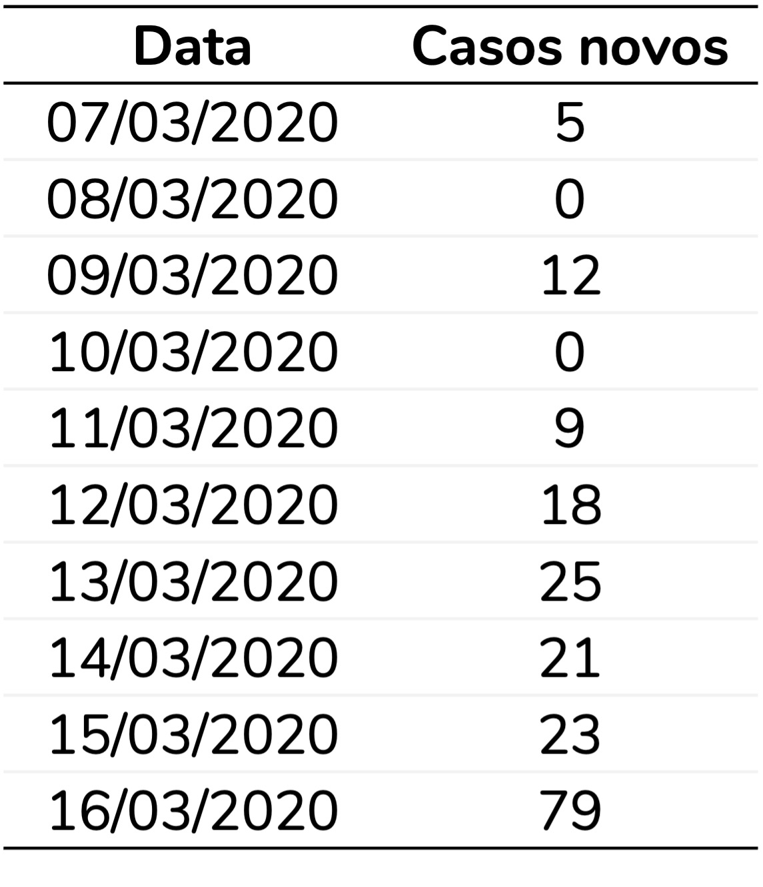
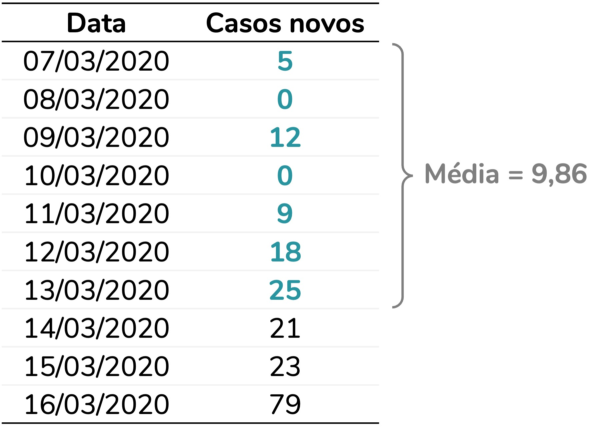
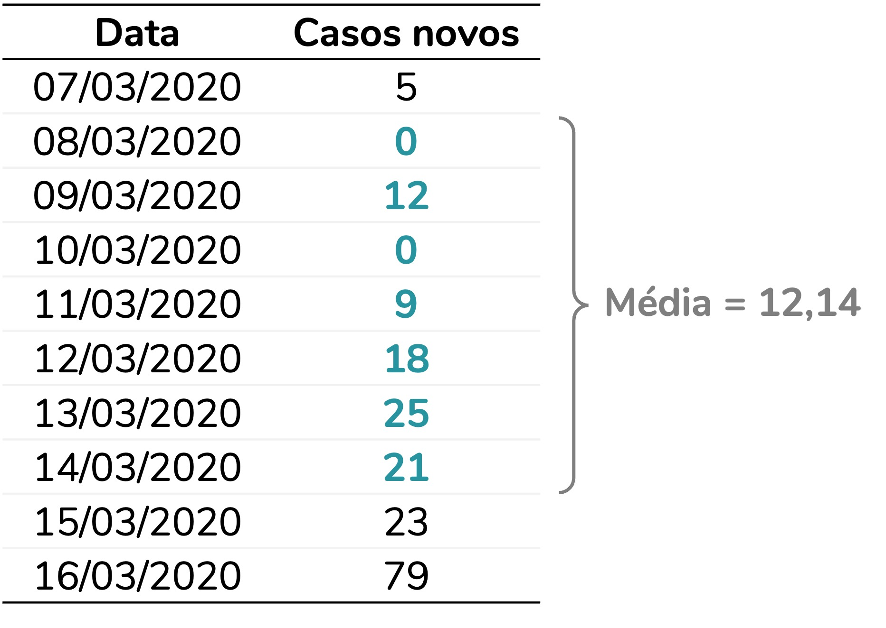
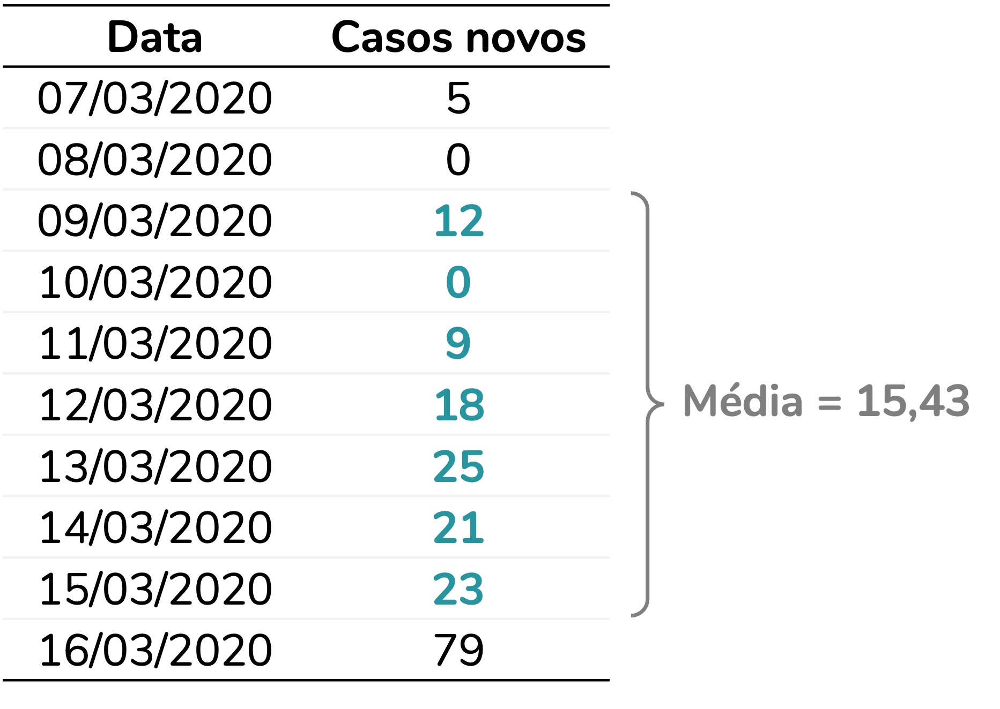
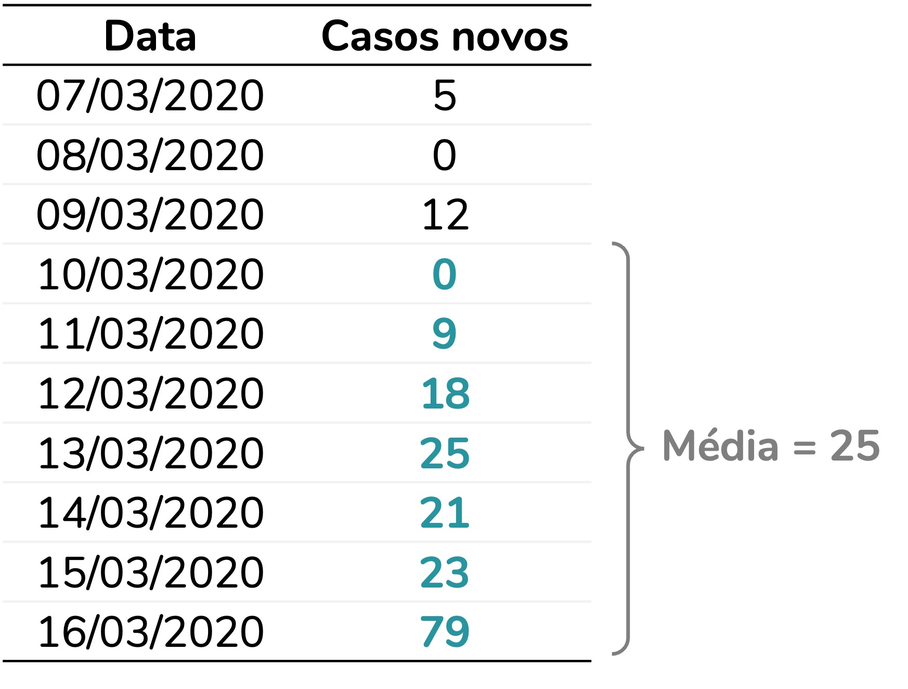
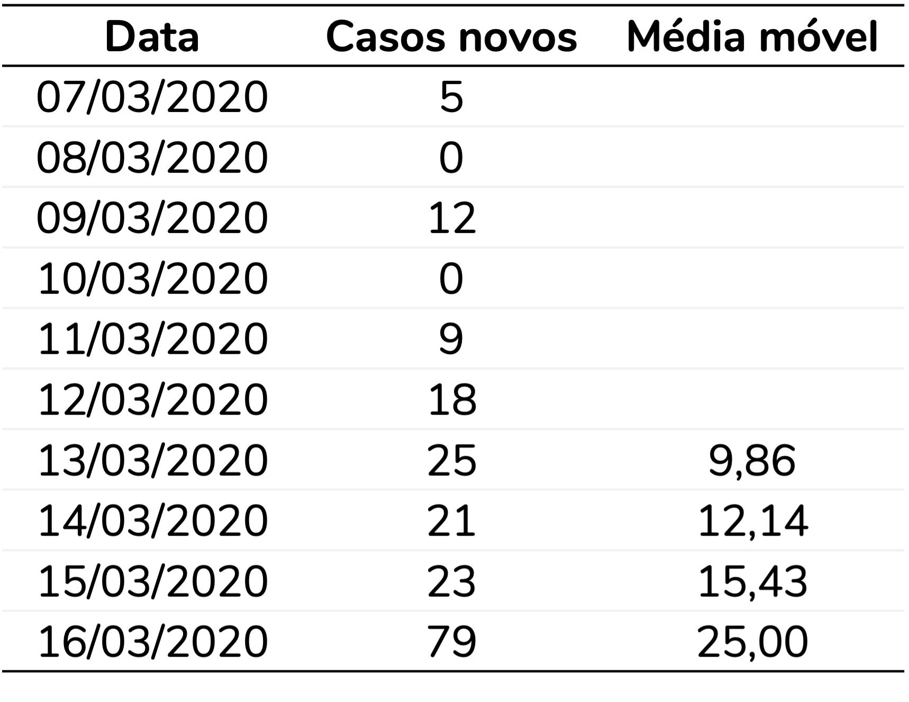
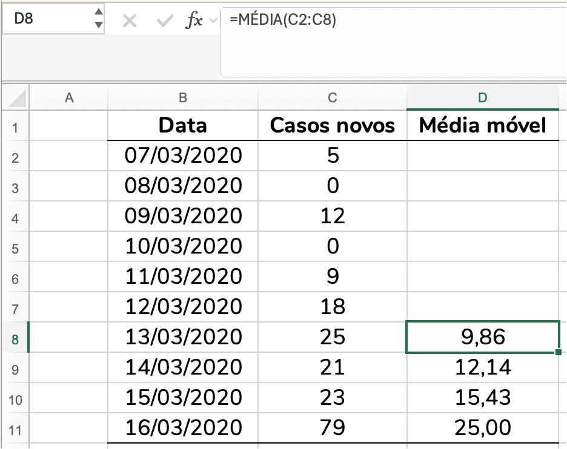

<center>
<font size='1'>Fonte da imagem: elaboração própria</font>
</center>
  
</br>
</br>
  
  
```{r, include=FALSE}
knitr::opts_chunk$set(fig.width = 4, fig.height = 3.3, cache = FALSE,
                      fig.align = "center", warning = FALSE,
                      message = FALSE, echo = FALSE)
library(tidyverse)
library(flextable)
library(stringi)
source("/Users/fernandafperes/Documents/Blog_/content/blog/render_toc.R")
fstatix::paleta_f()

invisible(Sys.setlocale("LC_TIME", "pt_BR.UTF-8"))
```
   
   
   
**Média móvel** era um conceito que nunca tinha feito parte da minha realidade, até que chegou 2020. E com ele, a pandemia de COVID-19 e os **gráficos** com quantidade de casos e suas médias móveis em **todos os telejornais** do país.  
  
Foi aí que eu fiz questão de entender essa medida -- inclusive para explicá-la, como eu fiz [nesse post](https://www.instagram.com/p/CDOsLUTp8C2/?utm_source=ig_web_copy_link&igsh=NTc4MTIwNjQ2YQ==) do meu Instagram.  
  
Os anos se passaram, a popularidade da média móvel diminuiu, mas eventualmente eu [atendo algum cliente](https://fernandafperes.com.br/servicos/) que precisa calculá-la. E sinto falta de um material mais estruturado que **explique o que é uma média móvel e qual o cálculo por trás dessa medida**. Então, a proposta deste post é preencher essa lacuna.  
   
   
```{r toc, echo=FALSE}
render_toc("index.Rmd", toc_header_name = NULL, toc_depth = 2, base_level = 3)
```
   
   
  
### Por que calcular uma média móvel?
  
Na minha opinião, o exemplo da quantidade de **casos novos de COVID-19** segue sendo o mais **didático**. Então, vamos a ele. Em julho de 2020, o cenário era esse:  
  
```{r, fig.width=6.5, fig.height=4}
dados <- read.csv2("owid-covid-data2.csv") |> 
  mutate(date = as.Date(date, format = "%d/%m/%Y"))

ggplot(dados, aes(x = date, y = new_cases)) +
  geom_line() +
  labs(y = "Casos novos de COVID-19 no Brasil", x = NULL,
       caption = "Fonte: Our World in Data\nDownload em: 29 de julho de 2020") +
  scale_y_continuous(labels = scales::number_format(decimal.mark = ",",
                                                    big.mark = ".")) +
  scale_x_date(labels = scales::label_date("%b/%y")) +
  theme_minimal()
```
  
A partir de 11 de março, novos casos de COVID-19 eram registrados todos os dias no Brasil. O maior pico do período foi o registro de **67.860 casos novos** em 23 de julho.  
  
No entanto, há uma grande flutuação na quantidade de casos novos. No gráfico de linhas, observamos subidas seguidas de quedas. Perceba como a quantidade de casos novos varia muito de um dia para o outro, ao redor da data do pico (23/07):  
  
```{r}
dados |> 
  filter(date >= as.Date("18/07/2020", format = "%d/%m/%Y") &
           date <= as.Date("29/07/2020", format = "%d/%m/%Y")) |> 
  mutate(dia_semana = stringr::str_to_sentence(
    lubridate::wday(date, label = TRUE, abbr = FALSE))) |> 
  select(c("date", "new_cases", "dia_semana")) |> 
  mutate(date = format(date, "%d/%m/%Y"),
         new_cases = fstatix::arred(new_cases, digitos = 0, bm = ".")) |> 
  rename("Data" = "date",
         "Casos novos" = "new_cases",
         "Dia da semana" = "dia_semana") |> 
  flextable::flextable() |> 
  flextable::align(align = "center", part = "all") |> 
  flextable::bold(part = "header") |> 
  flextable::width(width = c(1.2,1.2,1.2))
```
  
  
Há um **padrão** de aumento e queda que se repete, aproximadamente, **a cada sete dias**. Em geral, quantidades **menores** de casos são observadas às **segundas e terças**, enquanto quantidades **maiores** são registradas **entre quinta e sábado**.  
  
Essa variação não representa necessariamente uma **flutuação real** na quantidade de novos casos em cada dia. A principal **hipótese** levantada na época era um **atraso na notificação** dos casos e no processamento dos resultados dos testes, fazendo com que os registros se concentrassem em determinados dias da semana.  
  
A questão é que essa flutuação **atrapalha a análise da tendência dos dados**. Ao olharmos para o gráfico, temos dificuldade de identificar se a quantidade de casos está aumentando ou diminuindo. Esse é exatamente o tipo de situação em que a média móvel pode ser mais informativa.  
  
### O que, afinal, é uma média móvel?
  
Ainda que o nome não seja dos mais intuitivos, a média móvel é uma sequência de médias calculadas sobre um **período fixo** de observações. Esse período, também chamado de **janela**, depende do contexto da análise.  
  
No caso da **COVID-19**, faz sentido utilizar um **período de sete dias**, já que os registros apresentam um padrão semanal de aumento e redução de casos. Ao calcular a média dos últimos sete dias, esse padrão é suavizado, facilitando a visualização da tendência da série de dados.  
  
Vamos **calcular manualmente** uma média móvel para entendê-la. Imagine que temos o seguinte conjunto de dados:  
  

  
Como o **período** é de **sete dias**, a primeira média só pode ser calculada quando o sétimo dia da série é observado. Essa primeira média corresponde à média dos sete primeiros dias:  
  

  
A segunda média será calculada quando for coletado o oitavo dia. E corresponderá à média dos últimos sete dias. Isso significa que agora a média desconsiderará o primeiro dia e passará a considerar o oitavo:  
  

  
E assim sucessivamente. A cada novo dia observado, a janela de sete dias desloca-se uma posição para frente, descartando o dia mais antigo e incluindo o mais recente. É justamente esse deslocamento da janela ao longo do tempo que dá origem ao nome média móvel.  
  

  

  
Ao final, para essa base de dados, vamos obter as seguintes médias móveis:  
  

  
  
  
### A média móvel no exemplo do COVID-19
  
Ao calcularmos a média móvel (representada pela linha azul no gráfico), obtemos uma série com muito menos flutuações do que os dados originais. Com isso, a tendência fica muito mais nítida. Por exemplo, agora conseguimos observar com mais clareza uma tendência de aumento no final da série de dados.  
  
```{r, fig.width=6.5, fig.height=4}
dados |> 
  mutate(media_movel = zoo::rollmean(new_cases, k = 7, fill = NA, align = "right")) |> 
  ggplot(aes(x = date, y = new_cases)) +
  geom_line(color = "grey60") +
  geom_line(aes(y = media_movel), color = azul, linewidth = 0.8) +
  labs(y = "Casos novos de COVID-19 no Brasil", x = NULL,
       caption = "Fonte: Our World in Data\nDownload em: 29 de julho de 2020") +
  scale_y_continuous(labels = scales::number_format(decimal.mark = ",",
                                                    big.mark = ".")) +
  scale_x_date(labels = scales::label_date("%b/%y")) +
  theme_minimal()
```
  
  
  
### Como calcular a média móvel no Excel?
  
Imagine que você tem uma base de dados com um dia por linha e deseja considerar um período de sete dias. Para calcular a média móvel no Excel, insira a **fórmula da média** (`=MÉDIA()`) na linha correspondente ao **sétimo dia**. Nessa célula, a função deve calcular a média dos sete primeiros dias da série.  
  
Em seguida, basta **arrastar a fórmula** até o final da planilha. A cada nova linha, o Excel **ajustará automaticamente** as células sendo consideradas no cálculo, fazendo com que a média seja calculada sempre com base nos **últimos sete dias**:  
  

  

  
  
### Como calcular a média móvel no R?
  
Há mais de uma forma de calcular a média móvel no R. Mas duas funções são razoavelmente populares para esse cálculo: a função `rollmean` do pacote `zoo` e a função `slide_dbl` do pacote `slider`.  
  
Para os exemplos abaixo, considere que temos a seguinte base de dados:  
  
```{r, include=FALSE}
dados_reserva <- dados

dados <- dados |> select(c("date", "new_cases")) |> 
  filter(date >= as.Date("07/03/2020", format = "%d/%m/%Y") &
           date <= as.Date("01/04/2020", format = "%d/%m/%Y")) |> 
    rename("data" = "date",
         "casos_novos" = "new_cases")
```
  
```{r}
dados
```

  
#### Com a função rollmean do pacote zoo
  
Para usarmos a função `rollmean()` precisamos definir 4 argumentos:  
  
* x: variável para a qual se deseja calcular a média móvel
  - No nosso exemplo, a variável `casos_novos`
* k: quantidade de linhas a ser considerada no cálculo
  - No nosso caso, cada linha corresponde a um dia e queremos considerar um período de 7 dias; logo, k = 7
* fill: valor utilizado para preencher as posições em que a média móvel ainda não pode ser calculada
  - No exemplo, vamos deixar como valor ausente, `NA`
* align: define em qual linha do intervalo a média será registrada
  - Ao utilizar `align = "right"`, média dos dias 1 a 7 será registrada no dia 7, a média dos dias 2 a 8 será registrada no dia 8, e assim sucessivamente -- ou seja, a média será registrada no último dia do período
  - Essa configuração é a mesma que utilizamos no cálculo manual e no exemplo em Excel
  
```{r, eval=FALSE, echo=TRUE}
library(dplyr)
library(zoo)

dados |> 
  mutate(media_movel = zoo::rollmean(x = casos_novos, k = 7,
                                     fill = NA, align = "right"))
```

  
```{r, eval=TRUE, echo=FALSE}
dados |> 
  mutate(media_movel = zoo::rollmean(x = casos_novos, k = 7,
                                     fill = NA, align = "right"))
```
  
  
#### Com a função slide_dbl do pacote slider
  
Para usarmos a função `slide_dbl()` precisamos definir também 4 argumentos:  
  
* .x: variável para a qual se deseja calcular a média móvel
  - No nosso exemplo, a variável `casos_novos`
* .f: função a ser utilizada no cálculo
  - No nosso caso, vamos usar a função `mean`, que calcula a média
  - A função `slide_dbl()` pode ser utilizada para diversos outros cálculos -- por exemplo, bastaria substituir `mean` por `sum` para calcular uma soma móvel
* .before: quantidade de observações anteriores que devem ser incluídas no cálculo
  - Como queremos calcular uma média móvel de sete dias, definimos `.before = 6`, indicando que serão considerados o dia atual e os seis dias anteriores
* .complete: indica se o cálculo só deve ser realizado quando houver observações suficientes para completar o período
  - Ao utilizarmos `.complete = TRUE`, os seis primeiros dias da série recebem `NA`, pois ainda não há sete observações disponíveis para calcular a média móvel
  
```{r, eval=FALSE, echo=TRUE}
library(dplyr)
library(slider)

dados |>
  mutate(media_movel = slider::slide_dbl(.x = casos_novos, .f = mean,
                                         .before = 6, .complete = TRUE))
```

```{r}
dados |>
  mutate(media_movel = slider::slide_dbl(.x = casos_novos, .f = mean,
                                         .before = 6, .complete = TRUE))
```


   
   
***

### Como citar esse post, nas normas da ABNT
  
  
> PERES, Fernanda F. **O que é uma média móvel?**. Blog Fernanda Peres, São Paulo, 01 jul. 2026. Disponível em: https://fernandafperes.com.br/blog/media-movel/.
  
  
<br />


