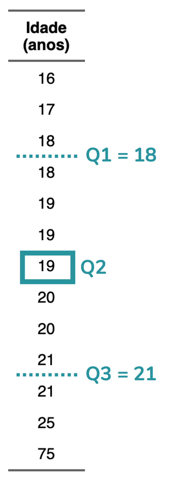

<center>
<font size='1'>Fonte da imagem: elaboração própria</font>
</center>
  
</br>
</br>
  

  
```{r, include=FALSE}
knitr::opts_chunk$set(fig.width = 4, fig.height = 3.3, cache = FALSE,
                      fig.align = "center", warning = FALSE, message = FALSE)
library(tidyverse)
library(ggpubr)
source("/Users/fernandafperes/Documents/Blog_/content/blog/render_toc.R")
fstatix::paleta_f()
```
   
   
```{r toc, echo=FALSE}
render_toc("index.Rmd", toc_header_name = NULL, toc_depth = 2, base_level = 3)
```
   
   
   
### A definição de *outlier*
  
A definição de *outlier* é simples: trata-se de um **valor discrepante**, que **destoa dos demais**. *Outlier* é o termo em inglês; em português, podemos dizer "valor discrepante" ou "**valor atípico**". Mas a verdade é que o termo em inglês é muito mais utilizado no contexto de análise de dados, então, seguirei com ele, ok?
  
Por exemplo, na base de dados abaixo, com idades de alunos de um cursinho pré-vestibular, organizadas em ordem crescente, percebemos que **a idade de 75 anos destoa das demais**, todas na faixa de 16 a 25 anos:  
  
```{r, echo=FALSE}
set.seed(4321)
idades <- sample(x = 16:25, replace = T, size = 12,
                 prob = c(0.1, 0.2, 0.27, 0.2, 0.1, 0.05, 0.02, 0.02, 0.02, 0.02))
dados <- as.data.frame(list(Idade = c(sort(idades), 75)))

dados |> 
  rename("Idade (anos)" = "Idade") |> 
  flextable::regulartable() |>
  flextable::align(align = "center", part = "all") |>
  flextable::bold(part = "header")
```
  
  
Se colocarmos essas idades em um gráfico de dispersão, com um ponto representando cada aluno, veremos que a idade de 75 anos **se distancia** de todas as demais:  
  
```{r, echo=FALSE, fig.width=2.5}
ggplot(dados, aes(y = Idade, x = "")) +
  ggbeeswarm::geom_beeswarm(method = "center", color = azul,
                            alpha = 0.5, cex = 2) +
  scale_y_continuous(breaks = seq(0, 80, by = 10)) +
  labs(x = NULL, y = "Idade (anos)") +
  theme_classic() +
  theme(text = element_text(family = "Nunito"),
        axis.ticks.x = element_blank())

# ggplot(dados, aes(y = Idade, x = "")) +
#   ggbeeswarm::geom_beeswarm(method = "center",
#                             color = ifelse(dados$Idade > 30, rosa, azul),
#                             cex = 2) +
#   scale_y_continuous(breaks = seq(0, 80, by = 10)) +
#   labs(x = NULL, y = "Idade (anos)") +
#   theme_classic() +
#   theme(text = element_text(family = "Nunito"),
#         axis.ticks.x = element_blank())
# 
# ggsave("graf_cover.png", width = 2.5, height = 3, dpi = 400)
```

  
  
  
### Como identificar se um valor é um *outlier*?  
  
Você talvez tenha visto o exemplo acima e pensado: "Ok, nesse exemplo é bem óbvio que o valor 75 é um *outlier*. Mas e se for menos óbvio? Por exemplo, caso existisse alguém de **30 anos**, eu diria que **é um *outlier***? Onde traçar esse **limite**?".  
  
Bom, agora esbarramos em uma questão mais delicada. Como definir se um determinado valor é um *outlier*?  
  
Há **mais de uma forma** de definir se um valor é um *outlier* **univariado**. E estamos falando de "univariado" aqui porque estamos pensando nos valores daquela observação para **uma única variável** -- no caso do exemplo, a variável idade.  
  
  
#### O ponto de corte baseado em quartis
  
O ponto de corte mais comumente utilizado para definir se um valor é um *outlier* é o utilizado na construção de um gráfico chamado **boxplot**.  
  
  
>Explicar boxplot foge da proposta deste post, mas eu tenho um post **bem detalhado** sobre isso -- que, inclusive, é o mais lido do blog!  
Caso queira entender como esse gráfico é construído, basta [clicar aqui](https://fernandafperes.com.br/blog/interpretacao-boxplot/).  
  
  
O boxplot clássico, chamado de **boxplot de Tukey**, define se um valor é um outlier com base na **amplitude interquartil** (que eu vou abreviar aqui como AIQ, mas que é também frequentemente abreviada como IQR, do inglês *Interquartile Range*). A AIQ é a diferença entre o quartil 3 (Q3) e o quartil 1 (Q1):  
  
  
<center>
AIQ = Q3 - Q1  
  
</center>
  
  
Para o boxplot de Tukey, um valor será um outlier caso ele esteja **abaixo** do **limite inferior teórico** ou **acima** do **limite superior** teórico:  
  
  
<center>
Limite inferior teórico = Q1 - 1,5 x AIQ  
Limite superior teórico = Q3 + 1,5 x AIQ  
  
</center>
  
  
No nosso exemplo, os quartis 1 e 3 correspondem a **18** e **21**, respectivamente.  
*Lembrando que você encontra uma definição mais detalhada de quartis no [post de boxplot](https://fernandafperes.com.br/blog/interpretacao-boxplot/).*  
  
  
```{r, echo=FALSE, fig.align='center', out.width = '160px'}

```
  
  
Portanto, a AIQ nessa amostra é 5:  
  
  
<center>
AIQ = Q3 - Q1  
AIQ = 21 - 18  
AIQ = 5  
  
</center>
  
  
Sabendo a AIQ podemos calcular os limites inferior e superior teóricos:  
  
<center>
Limite inferior teórico = Q1 - 1,5 x AIQ  
Limite inferior teórico = 18 - 1,5 x 5  
Limite inferior teórico = 18 - 7,5  
**Limite inferior teórico = 10,5**  
  
  
Limite superior teórico = Q3 + 1,5 x AIQ  
Limite superior teórico = 21 + 1,5 x 5  
Limite superior teórico = 21 + 7,5  
**Limite superior teórico = 28,5**  
  
</center>
  
  
Ou seja, de acordo com a definição de *outlier* utilizada pelo boxplot de Tukey, qualquer valor **abaixo de 10,5 anos** ou **acima de 28,5 anos** será considerado um *outlier* nessa amostra de idades. A idade de 75 anos, portanto, será considerada um *outlier* de acordo com esse critério.  
  
  
Perceba que ao construirmos um boxplot, a idade de 75 anos de fato é identificada como um *outlier*, sendo representada por um ponto:  
  
```{r, echo=FALSE, fig.width=2.5}
ggplot(dados, aes(y = Idade, x = "")) +
  geom_errorbar(stat = "boxplot", width = 0.3) +
  geom_boxplot(outlier.shape = 1, fill = azul) +
  scale_y_continuous(breaks = seq(0, 80, by = 10)) +
  labs(x = NULL, y = "Idade (anos)") +
  theme_classic() +
  theme(text = element_text(family = "Nunito"),
        axis.ticks.x = element_blank())
```
  
  
#### O ponto de corte baseado em escore-z
  
De longe, a técnica mais utilizada para identificar um *outlier* univariado é a que eu expliquei acima, baseada na AIQ. Mas há outra possibilidade: definir se um valor é um *outlier* com **base em seu escore-z** (em inglês, *z-score*).  
  
O escore-z consiste no seguinte cálculo, que padroniza os valores:  
  
$$
\text{Escore}\text{-}z = 
\frac{\text{Valor} - \text{Média}}{\text{Desvio}\text{-}\text{padrão}}
$$

Ou seja, calculamos a média, a subtraímos de cada valor e então dividimos esse resultado pelo desvio-padrão.  
  
>De novo, explicar desvio-padrão foge do escopo do post, mas você pode ler um texto bem didático sobre essa medida [clicando aqui](https://fernandafperes.com.br/blog/variancia-desvio-padrao/).  
  
Ao fazermos esse cálculo, fazemos com que os dados passem a ter média igual a zero e desvio-padrão igual a 1. Portanto, uma idade que tenha um **escore-z igual a 3** será uma idade que está **três desvios-padrão acima da média**. Na nossa amostra, a média é igual a 23,7 e o desvio-padrão é igual a 15,6. Aplicando a conta, obtemos os seguintes escores-z:  
  

```{r, echo=FALSE}
dados |> 
  mutate(`Idade − Média` = Idade-round(mean(Idade),1),
         `Escore-z` = round(`Idade − Média`/round(sd(Idade), 1), 1)) |> 
  mutate(across(2:3, \(x) fstatix::arred(x, 1))) |> 
  rename("Idade (anos)" = "Idade") |> 
  flextable::regulartable() |>
  flextable::align(align = "center", part = "all") |>
  flextable::bold(part = "header")
```
  
  
</br>
  
Uma convenção é considerar que é um *outlier* qualquer valor cujo escore-z esteja **fora do intervalo [-3; 3]**. Ou seja, escores abaixo de -3 ou acima de 3.  
  
Note que a **idade de 75 anos** também é considerada um *outlier* por esse critério, já que o seu **escore-z é 3,3**.  
  
Vale dizer que essa definição de *outlier* com base no escore-z é mais adequada a dados que apresentam **distribuição normal**, uma distribuição em formato de sino. Se os dados seguirem a distribuição normal, **apenas cerca de 0,3% dos dados** estarão fora desse intervalo.  
  
```{r, include=FALSE}
100*2*pnorm(q = 3, lower.tail = F)
```
  
  
  
#### Por que os *outliers* são uma preocupação?
  
Até aqui você pode estar pensando: "ok, tem um valor discrepante na amostra, e daí?". A nossa maior **preocupação** quando temos um *outlier* na amostra é com relação à **média**. A média é uma medida muito **influenciada por valores extremos** -- o que significa que na presença desses valores ela pode **não ser** uma boa representação do conjunto de dados.  
  
Para isso ficar menos abstrato, vou retomar o exemplo das idades. Nós vimos que a média da amostra é de **29,7 anos**. Se eu te digo: "olha, tenho uma turma de pré-vestibular com idade média de 29,7 anos", **o que viria à sua cabeça?** Eu mesma imaginaria que os alunos tem em torno de 30 anos, com idades variando entre 25 e 35. Mas veja: isso está bem longe da realidade da nossa amostra.  
  
Quando a gente constrói um gráfico com todas as idades e coloca uma barra indicando a média, dá para ver que **quase todos os alunos** -- com exceção de dois -- **têm idades abaixo da média**:  
  
```{r, echo=FALSE, fig.width=2.5}
ggplot(dados, aes(y = Idade, x = "")) +
  ggbeeswarm::geom_beeswarm(method = "center", color = azul,
                            alpha = 0.5, cex = 2) +
  geom_crossbar(stat = "summary", fun = "mean", middle.linewidth = 0.5,
                width = 0.3) +
  scale_y_continuous(breaks = seq(0, 80, by = 10)) +
  labs(x = NULL, y = "Idade (anos)") +
  theme_classic() +
  theme(text = element_text(family = "Nunito"),
        axis.ticks.x = element_blank())
```

Ao excluírmos a idade *outlier*, a média passa a ser 19,4 anos, um valor que representa a amostra de forma mais adequada:  
  
```{r, echo=FALSE, fig.width=2.5}
ggplot(dados |> filter(Idade < 30), aes(y = Idade, x = "")) +
  ggbeeswarm::geom_beeswarm(method = "center", color = azul,
                            alpha = 0.5, cex = 2) +
  geom_crossbar(stat = "summary", fun = "mean", middle.linewidth = 0.5,
                width = 0.3) +
  scale_y_continuous(breaks = seq(0, 50, by = 2)) +
  labs(x = NULL, y = "Idade (anos)") +
  theme_classic() +
  theme(text = element_text(family = "Nunito"),
        axis.ticks.x = element_blank())
```
  
  
Ao impactar a média, os *outliers* impactam não apenas as **análises descritivas**, mas também os **testes de hipóteses** baseados em médias, como o teste-t e a ANOVA.  


>Mas, se acalme. Isso **não significa** que você pode simplesmente **excluir** os valores *outliers*, ok?  
>  
>Abaixo eu vou explicar o conceito de outliers bivariados. Se você não tem interesse nesse tema, mas quer saber como lidar com os *outliers* das suas análises, recomendo pular para <a href="#como-lidar-com-outliers">essa seção</a>.  
>  
>Ah, eu também incluo essa explicação no [meu curso](https://curso.fernandafperes.com.br/), caso você tenha interesse em aprender análise de dados do zero ao avançado, com vídeo-aulas bem didáticas :)
  
  
  
### *Outliers* bivariados
  
Até agora te expliquei como identificar um *outlier* univariado. Mas muitas vezes -- principalmente ao rodarmos uma análise de regressão -- a nossa preocupação é com os *outliers* **bivariados**. Então, vamos entender isso melhor!  
  
>O que eu vou explicar a seguir é fortemente baseado nesses dois posts incríveis:  
>
* [Distinction Between Outliers and High Leverage Observations](https://online.stat.psu.edu/stat462/node/170/), da Penn State
* [Outliers - leverage and influence](https://stats.libretexts.org/Bookshelves/Advanced_Statistics/Intermediate_Statistics_with_R_(Greenwood)/06%3A_Correlation_and_Simple_Linear_Regression/6.09%3A_Outliers_-_leverage_and_influence), de autoria de Mark Greenwood
  
  
Vamos imaginar que queremos avaliar a **relação** entre **idade e pressão arterial sistólica**. Essa relação de fato existe: a nossa pressão arterial tende a aumentar conforme envelhecemos. Mas aqui eu vou exagerar um pouco essa relação para fins didáticos, ok?  
  
```{r, echo=FALSE}
url1 <- "https://online.stat.psu.edu/stat462/sites/onlinecourses.science.psu.edu.stat462/files/data/influence1/index.txt"

df1 <- read.table(url1, sep = '\t', header = TRUE, fileEncoding = "UTF-16LE")

df1$idade <- round(df1$x*3.5+50, 0)
df1$pressao <- round(abs(df1$y)*50/45+110, 0)

# df1 |> 
#   rename("Idade (anos)" = "idade",
#          "Pressão arterial sistólica (mmHg)" = "pressao") |> 
#   select(c(4,5)) |> 
#   flextable::regulartable() |>
#   flextable::align(align = "center", part = "all") |>
#   flextable::bold(part = "header")
```

  
Perceba que nessa amostra, conforme a idade aumenta, a pressão aumenta. Podemos, inclusive, traçar uma linha que descreve essa relação (pontilhada em preto). Ao rodarmos uma [regressão linear simples](https://youtu.be/CBo3FHMtt1s), vemos que o **coeficiente** para a idade é **1,6**, indicando que a pressão aumenta, em média, 1,6 mmHg a cada um ano de aumento na idade.  
  
```{r, echo=FALSE}
mod <- lm(pressao ~ idade, data = df1)
equacao <- paste0("Pressão = ", fstatix::arred(coef(mod)[1], digitos = 1),
                  " + ", fstatix::arred(coef(mod)[2], digitos = 1), " x Idade")

g1 <- ggplot(df1, aes(x = idade, y = pressao)) +
  geom_point(color = azul) +
  scale_y_continuous(labels = scales::number_format(decimal.mark = ",")) +
  scale_x_continuous(labels = scales::number_format(decimal.mark = ",")) +
  labs(x = "Idade (anos)", y = "Pressão arterial sistólica (mmHg)") +
  geom_smooth(method = "lm", se = F, color = "black", linetype = "dashed",
              linewidth = 0.5) +
  annotate(geom = "label", label = equacao, x = -Inf, y = Inf,
           vjust = 1.5, hjust = -0.05, size = 3.5, 
           family = "Nunito") +
  theme_classic() +
  theme(text = element_text(family = "Nunito"))

g1
```
  

#### Caso 1: *outlier* bivariado
  
Essa amostra inclui pessoas com idades **entre 50 e 85 anos** e com pressões arteriais **entre 110 e 166 mmHg**. Suponha agora que incluímos na amostra uma pessoa com **64 anos** e **154 mmHg** de pressão arterial.  
  
Não parece um *outlier*, certo? Tanto a idade quanto a pressão estão dentro do intervalo observado nos demais dados. Mas vamos visualizar o gráfico com a inclusão desse novo participante (em rosa):  
  
  
```{r, echo=FALSE}
url2 <- "https://online.stat.psu.edu/stat462/sites/onlinecourses.science.psu.edu.stat462/files/data/influence2/index.txt"

df2 <- read.table(url2, sep = '\t', header = TRUE, fileEncoding = "UTF-16LE")

df2 <- df2 |> mutate(cor = case_when((y > 35 & x < 5) ~ "rosa",
                                      TRUE ~ "azul"))

df2$idade <- round(df2$x*3.5+50, 0)
df2$pressao <- round(abs(df2$y)*50/45+110, 0)

mod <- lm(pressao ~ idade, data = df2)
equacao <- paste0("Pressão = ", fstatix::arred(coef(mod)[1], digitos = 1),
                  " + ", fstatix::arred(coef(mod)[2], digitos = 1), " x Idade")

g2 <- ggplot(df2, aes(x = idade, y = pressao, color = cor)) +
  geom_point(show.legend = F) +
  scale_y_continuous(labels = scales::number_format(decimal.mark = ",")) +
  scale_x_continuous(labels = scales::number_format(decimal.mark = ",")) +
  scale_color_manual(values = c(azul, rosa)) +
  labs(x = "Idade (anos)", y = "Pressão arterial sistólica (mmHg)") +
  # geom_smooth(method = "lm", se = F, color = "black", linetype = "dashed",
  #             linewidth = 0.5) +
  # annotate(geom = "label", label = equacao, x = -Inf, y = Inf,
  #          vjust = 1.5, hjust = -0.05, size = 3.5, 
  #          family = "Nunito") +
  theme_classic() +
  theme(text = element_text(family = "Nunito"))

g2
```
  
  
No gráfico de dispersão conseguimos perceber que essa nova pessoa (ponto em rosa) **destoa do padrão** das demais: trata-se de alguém com pressão arterial mais alta do que o esperado para a sua idade. Portanto, a pessoa em rosa é um *outlier* -- mas um ***outlier* bivariado**, que só passa a ser considerado *outlier* quando analisamos simultaneamente a idade e a pressão.  
  
Nem todo *outlier* representa um **problema** no contexto da **regressão**. O problema aparece quando esse ponto é **influente** -- ou seja, quando influencia, modifica, a estimação da reta de regressão.  
  
Note que o *outlier* em rosa não modifica de forma significativa a estimação da reta: a reta estimada com ele (em preto, linha sólida) se assemelha muito à reta estimada sem ele (pontilhada).  

```{r, echo=FALSE}
ggplot(df2, aes(x = idade, y = pressao, color = cor)) +
  geom_point(show.legend = F) +
  scale_y_continuous(labels = scales::number_format(decimal.mark = ",")) +
  scale_x_continuous(labels = scales::number_format(decimal.mark = ",")) +
  scale_color_manual(values = c(azul, rosa)) +
  labs(x = "Idade (anos)", y = "Pressão arterial sistólica (mmHg)") +
  geom_smooth(method = "lm", se = F, linewidth = 0.5, color = "black") +
  geom_smooth(data = df2 |> filter(cor != "rosa"),
              method = "lm", se = F, linewidth = 0.5, color = "black",
              linetype = "dashed") +
  annotate(geom = "label", label = equacao, x = -Inf, y = Inf,
           vjust = 1.5, hjust = -0.05, size = 3.5,
           family = "Nunito") +
  theme_classic() +
  theme(text = element_text(family = "Nunito"))
```
  
  
#### Caso 2: ponto de alavancagem
  
Um outro conceito importante no contexto da regressão é o de "ponto de alavancagem". Dizemos que um ponto tem **alta alavancagem** quando ele apresenta **valores extremos nas variáveis explicativas**. No caso de uma regressão linear simples, com uma única variável explicativa, um ponto será considerado "de alavancagem" quando estiver distante da maior parte dos dados no eixo x.  
  
Para isso fazer mais sentido, vamos voltar ao exemplo. Agora vamos incluir uma pessoa com **99 anos e 186 mmHg** de pressão arterial (em rosa no gráfico):  
  
```{r, echo=FALSE}
url3 <- "https://online.stat.psu.edu/stat462/sites/onlinecourses.science.psu.edu.stat462/files/data/influence3/index.txt"

df3 <- read.table(url3, sep = '\t', header = TRUE, fileEncoding = "UTF-16LE")

df3 <- df3 |> mutate(cor = case_when(x > 10 ~ "rosa",
                                      TRUE ~ "azul"))

df3$idade <- round(df3$x*3.5+50, 0)
df3$pressao <- round(abs(df3$y)*50/45+110, 0)

mod <- lm(pressao ~ idade, data = df3)
equacao <- paste0("Pressão = ", fstatix::arred(coef(mod)[1], digitos = 1),
                  " + ", fstatix::arred(coef(mod)[2], digitos = 1), " x Idade")

g3 <- ggplot(df3, aes(x = idade, y = pressao, color = cor)) +
  geom_point(show.legend = F) +
  scale_y_continuous(labels = scales::number_format(decimal.mark = ",")) +
  scale_x_continuous(labels = scales::number_format(decimal.mark = ",")) +
  scale_color_manual(values = c(azul, rosa)) +
  labs(x = "Idade (anos)", y = "Pressão arterial sistólica (mmHg)") +
  # geom_smooth(method = "lm", se = F, color = "black", linetype = "dashed",
  #             linewidth = 0.5) +
  # annotate(geom = "label", label = equacao, x = -Inf, y = Inf,
  #          vjust = 1.5, hjust = -0.05, size = 3.5, 
  #          family = "Nunito") +
  theme_classic() +
  theme(text = element_text(family = "Nunito"))

g3
```
  
Perceba que essa pessoa **não é um *outlier* bivariado**. Isso porque o ponto **segue a tendência linear** dos demais dados e não destoa do padrão observado. No entanto, trata-se de um **ponto de alavancagem**, com um valor de idade (eixo x) bem distante do restante da amostra.  
  
Ok, mas o ponto de alavancagem é um **problema** para a **regressão**? Não necessariamente. Isso porque ele pode ser um ponto de alavancagem, mas não influenciar a estimação da reta -- ou seja, não ser um **ponto influente**. Note que no exemplo o ponto em rosa não modifica de forma significativa a reta de regressão: a reta estimada com ele (linha preta sólida) é muito semelhante à estimada sem ele (linha pontilhada).  
  
```{r, echo=FALSE}
ggplot(df3, aes(x = idade, y = pressao, color = cor)) +
  geom_point(show.legend = F) +
  scale_y_continuous(labels = scales::number_format(decimal.mark = ",")) +
  scale_x_continuous(labels = scales::number_format(decimal.mark = ",")) +
  scale_color_manual(values = c(azul, rosa)) +
  labs(x = "Idade (anos)", y = "Pressão arterial sistólica (mmHg)") +
  geom_smooth(method = "lm", se = F, linewidth = 0.5, color = "black") +
  geom_smooth(data = df2 |> filter(cor != "rosa"),
              method = "lm", se = F, linewidth = 0.5, color = "black",
              linetype = "dashed") +
  annotate(geom = "label", label = equacao, x = -Inf, y = Inf,
           vjust = 1.5, hjust = -0.05, size = 3.5,
           family = "Nunito") +
  theme_classic() +
  theme(text = element_text(family = "Nunito"))
```

  
#### Caso 3: ponto influente
  
Como já discutimos, um **ponto influente** é aquele que **modifica a estimação da reta** de regressão. Vamos voltar ao nosso exemplo e adicionar à amostra (em rosa) uma pessoa com idade de **96 anos** e pressão arterial de **127 mmHg**:  
  
```{r, echo=FALSE}
url4 <- "https://online.stat.psu.edu/stat462/sites/onlinecourses.science.psu.edu.stat462/files/data/influence4/index.txt"

df4 <- read.table(url4, sep = '\t', header = TRUE, fileEncoding = "UTF-16LE")

df4 <- df4 |> mutate(cor = case_when(x > 10 ~ "rosa",
                                      TRUE ~ "azul"))

df4$idade <- round(df4$x*3.5+50, 0)
df4$pressao <- round(abs(df4$y)*50/45+110, 0)

mod <- lm(pressao ~ idade, data = df4)
equacao <- paste0("Pressão = ", fstatix::arred(coef(mod)[1], digitos = 1),
                  " + ", fstatix::arred(coef(mod)[2], digitos = 1), " x Idade")

g4 <- ggplot(df4, aes(x = idade, y = pressao, color = cor)) +
  geom_point(show.legend = F) +
  scale_y_continuous(labels = scales::number_format(decimal.mark = ",")) +
  scale_x_continuous(labels = scales::number_format(decimal.mark = ",")) +
  scale_color_manual(values = c(azul, rosa)) +
  labs(x = "Idade (anos)", y = "Pressão arterial sistólica (mmHg)") +
  # geom_smooth(method = "lm", se = F, color = "black", linetype = "dashed",
  #             linewidth = 0.5) +
  # annotate(geom = "label", label = equacao, x = -Inf, y = Inf,
  #          vjust = 1.5, hjust = -0.05, size = 3.5, 
  #          family = "Nunito") +
  theme_classic() +
  theme(text = element_text(family = "Nunito"))

g4
```
  
Perceba que esse ponto em rosa é:  

1. **Um *outlier* bivariado**, porque ele destoa do padrão linear dos demais pontos -- em outras palavras, trata-se de uma pessoa com pressão arterial inferior à esperada para a sua idade
2. **Um ponto de alavancagem**, porque a sua idade (eixo x) está acima das idades do restante da amostra, que vão até 82 anos
  
Uma vez que esse ponto é tanto um ponto de alavancagem quanto um *outlier* bivariado, ele influencia a estimação da reta, é um **ponto influente**. Perceba como a reta estimada com esse ponto (linha sólida em preto) **difere muito** da reta estimada quando ele é excluído (linha pontilhada):  
  
```{r, echo=FALSE}
ggplot(df4, aes(x = idade, y = pressao, color = cor)) +
  geom_point(show.legend = F) +
  scale_y_continuous(labels = scales::number_format(decimal.mark = ",")) +
  scale_x_continuous(labels = scales::number_format(decimal.mark = ",")) +
  scale_color_manual(values = c(azul, rosa)) +
  labs(x = "Idade (anos)", y = "Pressão arterial sistólica (mmHg)") +
  geom_smooth(method = "lm", se = F, linewidth = 0.5, color = "black") +
  geom_smooth(data = df2 |> filter(cor != "rosa"),
              method = "lm", se = F, linewidth = 0.5, color = "black",
              linetype = "dashed") +
  annotate(geom = "label", label = equacao, x = -Inf, y = Inf,
           vjust = 1.5, hjust = -0.05, size = 3.5,
           family = "Nunito") +
  theme_classic() +
  theme(text = element_text(family = "Nunito"))
```
  
  
#### Como identificar um ponto influente?
  
Até aqui eu te falei que um ponto influente é aquele que é tanto um ponto de alavancagem quanto um *outlier* bivariado, certo? Mas podemos **expandir essa definição** para **cenários multivariados** (isso é, quando temos mais de duas variáveis no modelo).  
  
De forma geral, um ponto influente é uma observação que apresenta, simultaneamente:  

1. **Alta alavancagem** -- ou seja, apresenta valores extremos nas variáveis explicativas (variáveis independentes)
2. **Resíduo elevado** -- o que indica que esse ponto foge do padrão da relação descrita pelo modelo
  
Quando dizemos que um ponto tem **resíduo elevado**, não significa necessariamente que ele esteja distante dos demais pontos no conjunto de dados, mas sim que ele **se afasta** do valor que **seria esperado** pelo modelo ajustado. Caso queira entender melhor o **conceito de resíduo**, eu recomendo a leitura do primeiro tópico [desse post](https://fernandafperes.com.br/blog/graficos-diagnosticos-lm/).  
  
##### A distância de Cook
  
Uma medida que nos ajuda a identificar se um ponto é influente é a **distância de Cook**, um valor cujo cálculo considera o resíduo e a alavancagem de cada observação. A distância de Cook pode ser pensada como uma medida que indica o quanto os **coeficientes** estimados pelo modelo **mudariam**, em média, se uma observação específica fosse **removida** do conjunto de dados.  
  
Para isso fazer mais sentido, vamos voltar à amostra representada no gráfico abaixo. Vimos que o ponto em rosa é um ponto influente, uma vez que a sua inclusão na amostra modifica a estimação da reta:  
  
```{r, echo=FALSE}
ggplot(df4, aes(x = idade, y = pressao, color = cor)) +
  geom_point(show.legend = F) +
  scale_y_continuous(labels = scales::number_format(decimal.mark = ",")) +
  scale_x_continuous(labels = scales::number_format(decimal.mark = ",")) +
  scale_color_manual(values = c(azul, rosa)) +
  labs(x = "Idade (anos)", y = "Pressão arterial sistólica (mmHg)") +
  geom_smooth(method = "lm", se = F, linewidth = 0.5, color = "black") +
  geom_smooth(data = df2 |> filter(cor != "rosa"),
              method = "lm", se = F, linewidth = 0.5, color = "black",
              linetype = "dashed") +
  annotate(geom = "label", label = equacao, x = -Inf, y = Inf,
           vjust = 1.5, hjust = -0.05, size = 3.5,
           family = "Nunito") +
  theme_classic() +
  theme(text = element_text(family = "Nunito"))
```
  
Calculando a distância de Cook para cada observação da amostra, obtemos os resultados abaixo, organizados da maior para a menor distância:   
  
```{r, echo=FALSE}
mod <- lm(pressao ~ idade, data = df4)

tab_cook <- df4 |> 
  select(c(idade, pressao)) |> 
  rename("Idade (anos)" = "idade",
         "Pressão arterial sistólica (mmHg)" = "pressao") |> 
  mutate(`Distância de Cook` = cooks.distance(mod))

tab_cook1 <- slice_max(tab_cook, order_by = `Distância de Cook`, n = 5) |> 
  mutate(`Distância de Cook` = fstatix::arred(`Distância de Cook`))
tab_cook2 <- slice_min(tab_cook, order_by = `Distância de Cook`, n = 5) |> 
  mutate(`Distância de Cook` = fstatix::arred(`Distância de Cook`))
linha_vazia <- tab_cook1 |>
  filter(`Idade (anos)` == 96) |> 
  mutate(across(everything(), \(x) x = "..."))

tab_cook <- rbind(tab_cook1, linha_vazia, tab_cook2)

tab_cook |>
  flextable::regulartable() |>
  flextable::align(align = "center", part = "all") |>
  flextable::bold(part = "header") |> 
  flextable::width(width = c(0.8, 1.5, 1.3))

dados <- df4
```
  
Repare que a **maior distância de Cook** (4,195) é da pessoa com 96 anos e pressão arterial de 127 mmHg, ou seja, o ponto que está indicado em **rosa**.  
  
Ok, mas **a partir de qual valor** de distância de Cook consideramos que um ponto **é influente**?  
  
Há vários **pontos de corte** sugeridos para a distância de Cook, mas uma regra bem usada é: pontos com distância de Cook **acima de 1** são influentes; pontos com distância de Cook **acima de 0,5** já devem ser avaliados com atenção.  
  
Mas há outras sugestões. Um dos pontos de corte sugeridos é **4/n**. Por exemplo, em um modelo com 100 observações, teremos:  
  
<center>
4/100 = 0,04 
  
</center>

Isso significa que observações com distância de Cook acima de 0,04 já seriam observações potencialmente influentes.  
  
##### Calculando a distância de Cook
  
Em R, conseguimos calcular a distância de Cook com a função `cooks.distance()`:  
  
```{r}
mod <- lm(pressao ~ idade, data = dados)

cooks.distance(mod) |>
  round(3) # Arredondei os valores para 3 casas decimais
```
  
Veja que a distância de Cook de **4,195** está na **linha 21** da minha base de dados -- e essa é justamente a pessoa com idade 96 anos e pressão 127 mmHg.  
  
A gente também pode pedir um **gráfico** que mostra a relação entre resíduo e alavancagem, e inclui uma linha correspondente à distância de Cook. Trata-se do gráfico 5 quando rodamos a função `plot()` para um modelo linear:  
  
```{r}
plot(mod, which = 5)
```
  
>Caso queira mais detalhes sobre a interpretação deste gráfico, recomendo [esse post](https://fernandafperes.com.br/blog/graficos-diagnosticos-lm/) que detalha os gráficos diagnósticos para regressão.  


  
  
### Como lidar com *outliers*?
  
Eu constantemente recebo a pergunta: "como eu **excluo** os *outliers* da minha amostra?".  
Ou então: "já rodei toda a minha análise **sem** os *outliers*, como meu orientador pediu!".  
  
E aqui eu preciso te dizer uma coisa importante: a primeira pergunta **nunca** deveria ser "**como** excluir?", mas sim "**devo** excluir?".  
Já adianto que, **na maior parte dos casos**, *outliers* não devem ser simplesmente **removidos**.  
  
  
#### Passo 1: definir como os *outliers* serão avaliados
  
O primeiro passo é entender que **tipo** de *outlier* é uma preocupação para você. Essa decisão depende da sua **pergunta experimental** e da análise estatística que será utilizada para respondê-la. Como assim?  
  
Em **análises descritivas** ou em **testes de comparação de médias entre grupos**, faz sentido nos preocuparmos com ***outliers* univariados**, já que estamos olhando para o comportamento de cada variável isoladamente. Ah, nos casos em que a análise envolve grupos, a avaliação deve ser feita **dentro de cada grupo**, ok?  
  
Por outro lado, em análises como **regressão**, remover *outliers* univariados **não faz sentido**. Um ponto pode ter um valor discrepante em uma variável e, ainda assim, não destoar do padrão dos dados. Vimos isso nos exemplos de <a href="#caso-1-outlier-bivariado">*outlier* bivariado</a> e <a href="#caso-2-ponto-de-alavancagem">ponto de alavancagem</a>.  
Para esse tipo de análise, o foco não deve estar em *outliers* univariados, mas sim em <a href="#caso-3-ponto-influente">**pontos influentes**</a> -- isto é, observações que têm impacto relevante sobre a estimação do modelo.  
  
  
#### Passo 2: entender por que aquela observação é um *outlier*
  
Identificado um possível *outlier*, o passo seguinte é avaliar por que aquela observação difere das demais:  
  
* É um **erro** de digitação ou de aferição?
* É um valor **real**, mas raro?
  
Imagine que estamos estudando idades e encontramos um *outlier*: 350 anos. Trata-se de um valor **impossível**, concorda? Portanto, esse valor só pode ser um **erro de digitação**. Nesse cenário, o que fazer?  
  
1. Caso seja possível, o valor deve ser **corrigido** -- por exemplo, consultando a anotação original que foi digitada ou a fonte primária dos dados.
2. Se a correção não for possível, a observação pode ser **excluída**, já que não representa um valor real do fenômeno estudado.  
  
>Caso você opte por remover *outliers* da sua amostra, essa decisão precisa estar explicitada no seu texto -- seja em um artigo, dissertação, TCC ou tese. É fundamental **justificar** essa escolha e informar **quantas observações** foram removidas. Esse nível de transparência é fundamental para a **avaliação crítica** e a **reprodutibilidade** dos resultados.  
  
  
Agora, pense em um cenário diferente: suponha que o *outlier* identificado corresponda a um valor **real** e **plausível**, ainda que raro. É o caso do aluno de 75 anos em uma turma de pré-vestibular, exemplo que abriu este post. Nesse caso, a lógica muda completamente.  
  
Quando o valor é **real**, **não devemos excluí-lo**. Uma estratégia mais adequada é recorrer a **análises menos sensíveis** a esse valor extremo. No caso da **análise descritiva**, além da média -- que, como discutimos, é fortemente influenciada por *outliers* -- podemos reportar a mediana, uma medida robusta a eles. O mesmo raciocínio se aplica aos **testes estatísticos**. Testes clássicos de comparação de médias, especialmente em amostras pequenas, dependem fortemente da média e da variância e, por isso, podem ser bastante afetados por valores extremos. Nesses casos, uma possibilidade é recorrer a abordagens **robustas a *outliers***, como testes não-paramétricos ou modelos que assumem distribuições diferentes da normal, em vez de simplesmente remover observações válidas.  
  
Em análises de **regressão**, o foco deixa de ser o *outlier* em si e passa a ser a influência da observação. Uma estratégia possível é estimar o modelo **com e sem a observação potencialmente influente** e comparar os resultados. Se os dois modelos chegarem às **mesmas conclusões**, significa que aquela observação não exerceu uma influência relevante sobre a análise. Caso contrário, a divergência entre os modelos precisa ser devidamente **discutida e justificada**.  
  
  
</br>
   
***

### Como citar esse post, nas normas da ABNT
  
  
> PERES, Fernanda F. **O que é um outlier?**. Blog Fernanda Peres, São Paulo, 16 jan. 2026. Disponível em: https://fernandafperes.com.br/blog/outliers/.
  
  
<br />


