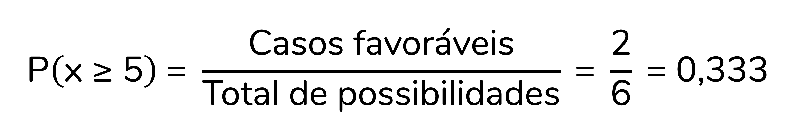
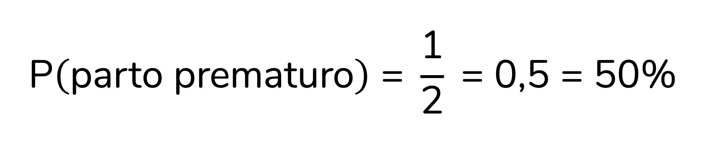
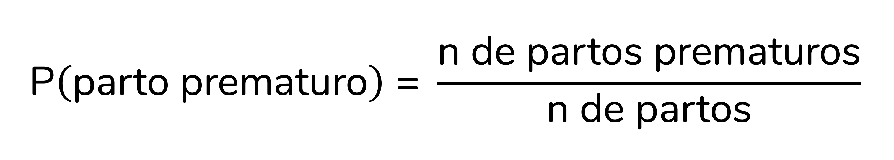
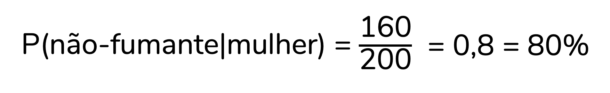
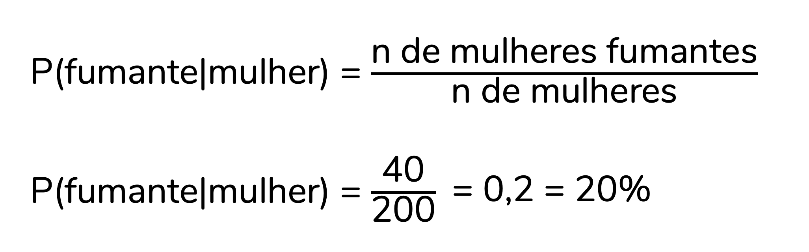
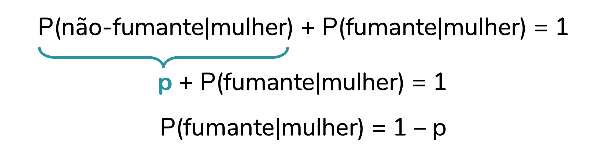
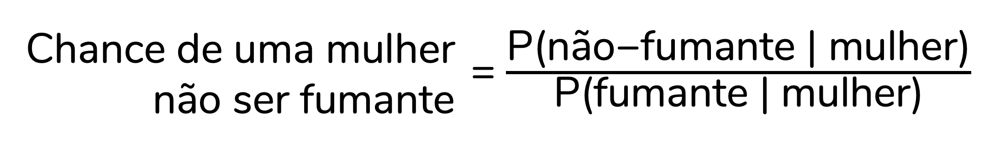
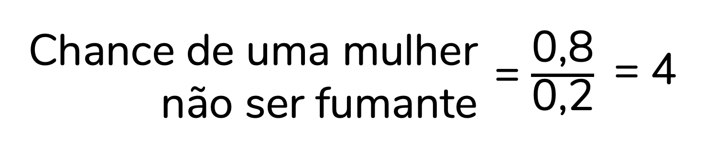
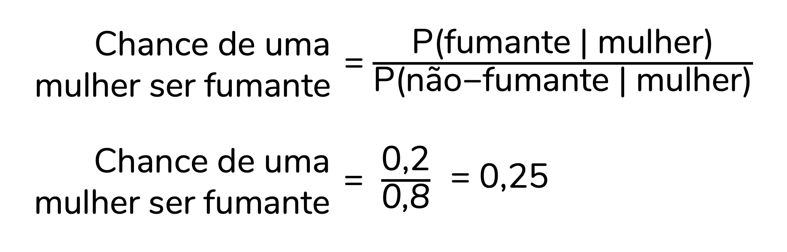

```{r, include=FALSE}
# knitr::opts_knit$set(upload.fun = knitr::imgur_upload, base.url = NULL)
knitr::opts_chunk$set(fig.width = 4, fig.height = 3.3, cache = FALSE,
                      fig.align = "center")
library(tidyverse)
library(ggpubr)
library(flextable)
library(ggstats)
source("/Users/fernandafperes/Documents/Blog_/content/blog/render_toc.R")
fstatix::paleta_f()
```
   
   
No dia-a-dia, é comum usarmos os termos chance e probabilidade como sinônimos. "Qual a chance de eu ganhar na mega da virada?", você provavelmente já se perguntou alguma vez. Mas na estatística, chance e probabilidade significam coisas **consideravelmente diferentes**. E confundi-las vai levar a uma **interpretação errada dos seus resultados**, principalmente ao rodar modelos de regressão logística. Nesse post, vamos entender de uma vez por todas o que esses dois conceitos significam.  
  
   
### O que é probabilidade?
  
Antes de discutirmos o que é chance, precisamos definir probabilidade. Essa não é uma tarefa tão simples, porque **há mais de uma definição** de probabilidade. Por exemplo, na escola você aprendeu a **probabilidade clássica** -- aquela, que a gente geralmente ensina usando dados e moedas como exemplo.  
  
A probabilidade clássica é calculada dividindo-se a quantidade de casos favoráveis pelo total de possibilidades. Como assim? Imagine que queremos saber a probabilidade de sair **um número maior ou igual a 5 em um dado**. Nesse caso, nosso evento de interesse é "sair um número ≥ 5". Há **dois** "casos favoráveis" (isso é, resultados que correspondem ao nosso evento de interesse): 5 e 6. E, no total, temos **seis** possibilidades de resultados. Logo, essa probabilidade será calculada como:  
  
```{r, echo=FALSE, fig.align='center', out.width = '380px'}

```
  
Ou seja, chegamos a uma probabilidade de 0,333. Esse valor também pode ser pensado em porcentagem, basta que ele seja multiplicado por 100:  
  
<center>0,333 x 100 = 33,3%</center>
  
<br />
Essa forma de calcular probabilidade é útil, mas bastante **limitada**, porque se aplica **apenas** a eventos **equiprováveis** -- ou seja, a situações em que todos os eventos têm a mesma probabilidade de ocorrer, como é o caso do lançamento de um dado ou de uma moeda não viciados.  
  
Perceba como **não faz sentido** aplicarmos esse raciocínio a outras situações. Vamos imaginar que queremos saber a probabilidade de um bebê nascer prematuro (sem termos qualquer outra informação sobre o bebê ou sua mãe). Se formos seguir a probabilidade **clássica**, discutida acima, nosso raciocínio seria:  
  
* Temos duas (2) possibilidades ao total: parto prematuro e parto não-prematuro.
* Queremos saber a probabilidade de uma (1) das possibilidades, logo:
  
```{r, echo=FALSE, fig.align='center', out.width = '300px'}

```
  
Ou seja, seguindo essa raciocínio consideraríamos que há 50% de probabilidade de um parto ser prematuro. Mas essa raciocínio está **errado**! Isso porque a probabilidade de um parto ser prematuro é **bem menor** que a probabilidade de ele não ser prematuro. Esses dois eventos **não são equiprováveis**. Como calcular a probabilidade nessas situações, então?  
  
É aqui que entra a **probabilidade frequentista**, que se baseia na frequência de ocorrência do evento. Na estatística clássica usamos essa definição de probabilidade -- até por isso essa estatística é também chamada de **estatística frequentista**.  
  
Imagine que fizemos uma pesquisa e descobrimos que ocorreram 2.621.015 partos no Brasil em 2022. Desses, 314.518 foram prematuros. Sabendo dessas informações podemos calcular a probabilidade de um parto ser prematuro como:  
  
```{r, echo=FALSE, fig.align='center', out.width = '360px'}

```
  
Aplicando os valores que encontramos à fórmula, temos:  
  
```{r, echo=FALSE, fig.align='center', out.width = '320px'}
knitr::include_graphics("img4.png")
```
  
Portanto, a probabilidade de um parto prematuro no Brasil em 2022 é de **0,12**.  
Aqui também podemos pensar em porcentagem. Lembrando que para isso basta multiplicar o valor por 100:  
  
<center>0,12 x 100 = 12%</center>
  
<br />
Ou seja, há uma probabilidade de 12% de um parto ser prematuro nesse cenário.  
  
##### Mais um exemplo...
  
Vamos imaginar que coletamos uma amostra de homens e mulheres e os classificamos quanto ao seu hábito de fumar. Os resultados estão resumidos na tabela abaixo:  
  
```{r, echo=FALSE, fig.align='center', out.width = '380px'}
knitr::include_graphics("img5.png")
```
  
Agora, tente responder o seguinte: **qual a probabilidade de uma mulher dessa amostra não ser fumante?**  
  
Reforçando: aqui vamos usar a **estatística clássica** e, portanto, consideraremos que **probabilidade é sinônimo de frequência**. Vamos, então, calcular a frequência de mulheres não-fumantes nessa amostra.  
  
Perceba que a amostra inclui **200** mulheres, sendo **160** delas não-fumantes:  
  
```{r, echo=FALSE, fig.align='center', out.width = '380px'}
knitr::include_graphics("img6.png")
```
  
A probabilidade de uma mulher dessa amostra não ser fumante é dada pela frequência de mulheres não-fumantes, ou seja:  
  
```{r, echo=FALSE, fig.align='center', out.width = '430px'}
knitr::include_graphics("img7.png")
```
  
>Essa notação "P(não-fumante | mulher)" é a notação que usamos para probabilidades condicionais -- isso é, que se baseiam em uma condição. A barra vertical ( | ) significa "dado que". Portanto, lemos "P(não-fumante | mulher)" como probabilidade de não ser fumante dado que é uma mulher.  
  
Adicionando os valores à fórmula, temos:  
  
```{r, echo=FALSE, fig.align='center', out.width = '340px'}

```
  
Ou seja, a probabilidade de uma mulher dessa amostra **não ser fumante** é de **0,8 ou 80%**.  
  
  
Ok, para finalizar esse raciocínio, quero que a gente calcule a probabilidade de uma **mulher** dessa amostra **ser fumante**. Perceba que a amostra inclui **200** mulheres, sendo **40** delas não-fumantes:  
  
```{r, echo=FALSE, fig.align='center', out.width = '380px'}

```
  
A probabilidade de uma mulher dessa amostra ser fumante é dada pela frequência de mulheres fumantes, ou seja:  
  
```{r, echo=FALSE, fig.align='center', out.width = '360px'}

```
  
A probabilidade de uma mulher dessa amostra **ser fumante** é, portanto, de **0,2 ou 20%**.  
  
  
>Ah, um cuidado importante aqui: probabilidades condicionais **não podem ser invertidas**. O que eu quero dizer com isso? Que a probabilidade de não ser fumante dado que é uma mulher **é diferente** da probabilidade de ser uma mulher dado que não é fumante:  
>  
><center>P(não-fumante | mulher) ≠ P(mulher | não-fumante)</center>
>  
><br /><br />
> Para isso fazer mais sentido, vamos calcular a probabilidade de ser uma mulher dado que é não-fumante, P(mulher | não-fumante):  
>  
><center>{width='340px'}</center>
>  
><br /><br />
><center>{width='400px'}</center>
>  
><br /><br />
>Note que chegamos a probabilidades diferentes!
  

##### Probabilidades de eventos complementares
  
Os eventos "não ser fumante" e "ser fumante" são o que chamamos de **eventos complementares**. Isso porque, em conjunto, incluem todas as possibilidades: ou a mulher é fumante ou ela não é fumante, não há outras opções.  
  
A **soma** das probabilidades de eventos complementares **dá 100%** -- ou 1, se representarmos a probabilidade em decimal. Perceba como isso é verdade para os dados do nosso exemplo:  
  
```{r, echo=FALSE, fig.align='center', out.width = '340px'}
knitr::include_graphics("img13.png")
```
  
Por isso, se representarmos a probabilidade de não ser fumante como **p**, a probabilidade de ser fumante pode ser representada como **1 – p**:  
  
```{r, echo=FALSE, fig.align='center', out.width = '400px'}

```
  
Por enquanto, **guarde essa informação**. Ela vai voltar ao longo do texto, quando formos definir chance.  
  
##### Probabilidades variam de 0 a 1
  
Antes de encerrarmos a nossa definição de probabilidade, quero chamar a sua atenção para o fato de que qualquer probabilidade estará entre 0 e 1 -- ou, pensando em porcentagem, entre 0% e 100%.  
Isso porque o denominador do cálculo da porcentagem é o total, o que torna impossível valores acima de 100%.  
  
  
### Ok, mas o que é chance afinal?
  
A chance é uma **razão entre probabilidades**.  
Se queremos saber a chance uma mulher não ser fumante, devemos **dividir** a probabilidade de ela não ser fumante pela probabilidade de ela ser fumante:  
  
```{r, echo=FALSE, fig.align='center', out.width = '400px'}

```
  
Perceba que a probabilidade que vai no **numerador** (parte superior da divisão) é a que **nos interessa**. Se queremos saber a chance de uma mulher da amostra **não ser fumante** é a probabilidade de **não ser fumante** que vai no numerador. Já no denominador (parte inferior da divisão) vai a probabilidade do **evento complementar** ao que nos interessa.  
  
Para os dados do nosso exemplo, temos:  
  
```{r, echo=FALSE, fig.align='center', out.width = '270px'}

```
  
Ou seja, a **chance** de uma mulher dessa amostra não ser fumante **é igual a 4**.  
  
  
##### Como eu devo interpretar uma chance?
  
Essa é, provavelmente, a maior dificuldade no que diz respeito a chances. A **interpretação** delas, na minha opinião, não é das mais intuitivas. Se a chance de uma mulher da amostra **não ser fumante** é **igual a 4**, o que isso significa? A interpretação correta é:  
  
>"A probabilidade de uma mulher dessa amostra não ser fumante é **4 vezes** a probabilidade de uma mulher dessa amostra ser fumante."  
  
Perceba como isso é verdade: se multiplicarmos a probabilidade de ser fumante por 4 chegamos à probabilidade de não ser fumante:  
  
<center>4 x 0,2 = 0,8</center>
  
<br />
Ah, e **cuidado** para não dizer "4 vezes **maior**". Isso está **errado**! Se quisermos montar a frase dessa forma, precisamos subtrair 1 da chance:  
  
<center>4 - 1 = 3</center>
  
<br />
Agora, sim, podemos interpretar como "vezes maior". Podemos dizer:  
  
>"A probabilidade de uma mulher dessa amostra não ser fumante é **3 vezes maior** que a probabilidade de ela ser fumante"  
  
Como 3, em porcentagem, corresponde a 300% (3 x 100 = 300%), podemos também montar a frase da seguinte forma:  
  
>"A probabilidade de uma mulher dessa amostra não ser fumante é **300% maior** que a probabilidade de ela ser fumante"  
  
  
Ok, Fernanda, mas e se a chance for **menor que 1**, como eu interpreto? Bom, a lógica segue a mesma. Mas vamos treinar com um exemplo.  
  
Vamos agora calcular a **chance** de uma mulher dessa amostra **ser fumante**. Se queremos saber a chance uma mulher ser fumante, devemos **dividir** a probabilidade de ela ser fumante pela probabilidade de ela não ser fumante:  
  
```{r, echo=FALSE, fig.align='center', out.width = '360px'}

```
  
Ou seja, a chance de uma mulher dessa amostra **ser fumante** é de 0,25. Como interpretar esse valor? A interpretação correta é:  
  
>"A probabilidade de uma mulher dessa amostra ser fumante é **0,25 vezes** a probabilidade de uma mulher dessa amostra não ser fumante."  
  
De novo, cuidado para não dizer "vezes maior" ou "vezes menor". Isso estaria **errado**. Para montarmos a frase dessa forma, assim como fizemos com a chance maior que 1, devemos subtrair 1:  
  
<center>0,25 - 1 = -0,75</center>
  
<br />
Perceba que o resultado dessa subtração foi negativo. Isso significa que esse valor calculado representa o quantas vezes **menor** é aquela probabilidade. A frase correta fica:  
  
>"A probabilidade de uma mulher dessa amostra ser fumante é **0,75 vezes menor** que a probabilidade de ela não ser fumante"  
  
Como 0,75, em porcentagem, corresponde a 75% (0,75 x 100 = 75%), podemos também montar a frase da seguinte forma:  
  
>"A probabilidade de uma mulher dessa amostra ser fumante é **75% menor** que a probabilidade de ela não ser fumante"  
  
Já disse e repito: eu não considero essa interpretação muito intuitiva. Minha sugestão? Pega um papel e esquematiza essas probabilidades e chances. Eu te garanto que vai ficar menos abstrato!  
  

##### Chances variam de 0 ao infinito positivo
  
Perceba que, ao contrário das probabilidades, as chances não se limitam ao intervalo entre 0 e 1. Elas variam de 0 ao infinito positivo.  
Isso porque o denominador do cálculo da chance não é um total -- logo, valores acima de 1 são posíveis. Por outro lado, como as chances são uma razão entre probabilidades, elas nunca serão negativas, já que probabilidades nunca são negativas -- isso faz com que o menor valor possível para uma chance seja zero.  
  
  
##### Uma notação comum para chances...
  
Mais acima eu te contei que se representamos a probabilidade de um evento como "p", a probabilidade do seu evento complementar pode ser representada como "1 - p". Como a chance é a divisão entre esses eventos, podemos representá-la como:  
  
```{r, echo=FALSE, fig.align='center', out.width = '140px'}
knitr::include_graphics("img18.png")
```
  
É bem provável que você encontre a chance representada dessa forma em livros didáticos.  
  


  
  
#### Como citar esse post, nas normas da ABNT
  
  
> PERES, Fernanda F. **Probabilidade x chance**. Blog Fernanda Peres, São Paulo, 15 jun. 2025. Disponível em: https://fernandafperes.com.br/blog/probabilidade-chance/.
  
  
<br />


