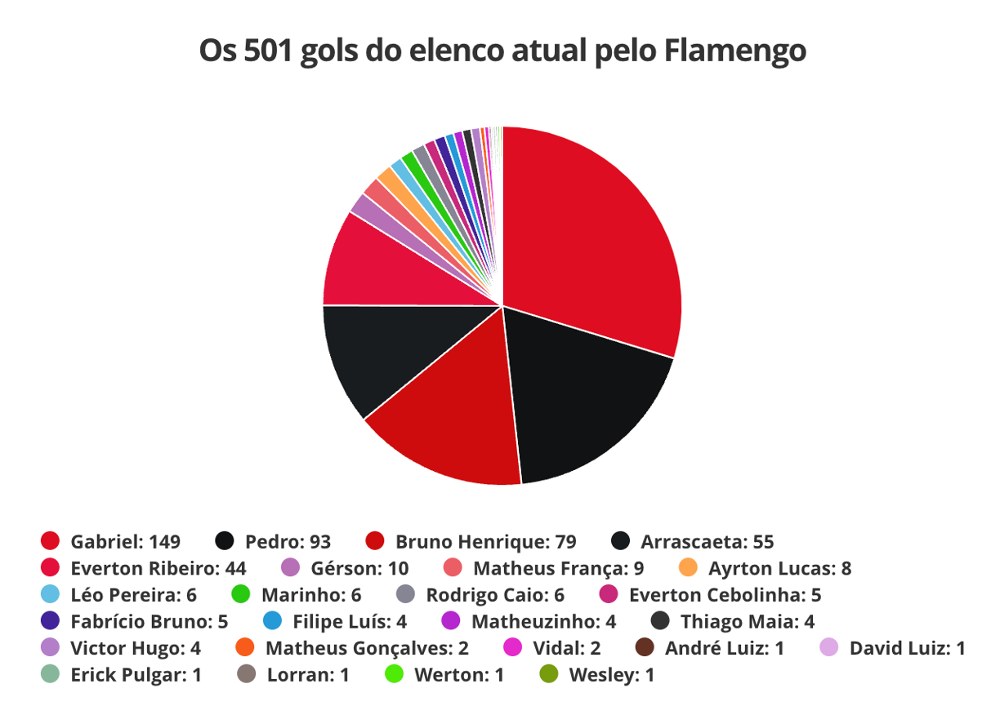
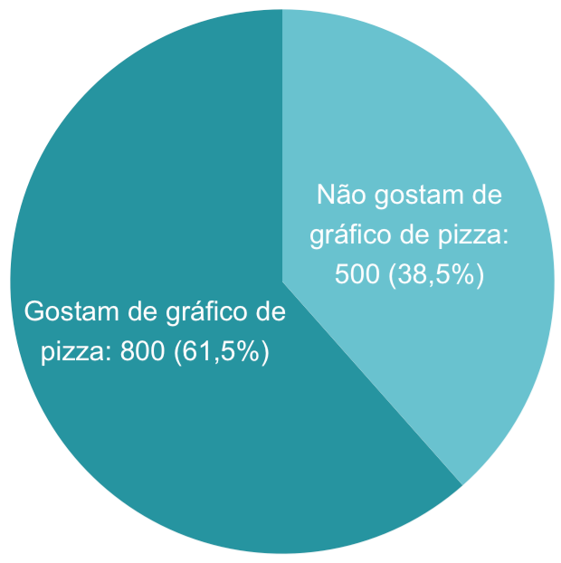
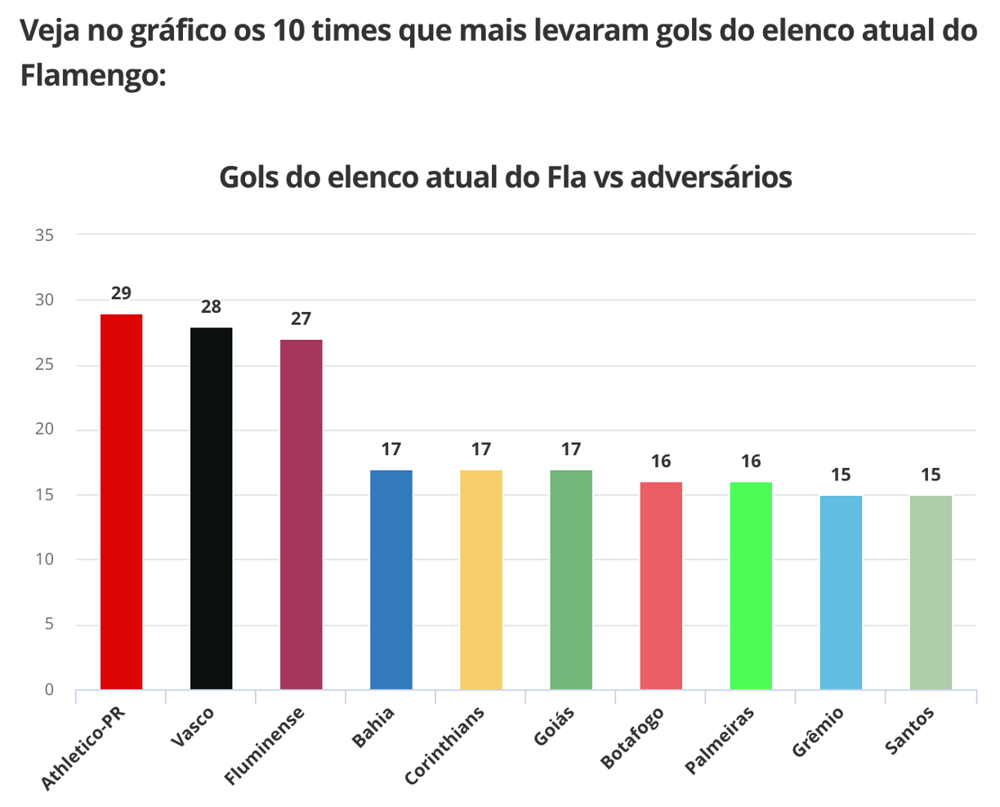

 
```{r, include=FALSE}
knitr::opts_chunk$set(fig.width = 5, fig.height = 5, cache = TRUE)
library(tidyverse)
```
  
Essa semana a [professora Fernanda Maciel](https://instagram.com/proffernandamaciel) publicou em seu instagram o gráfico abaixo (que também ilustra o post), que aparecia em uma [reportagem do Globo Esporte](https://ge.globo.com/futebol/times/flamengo/noticia/2023/06/09/elenco-atual-do-flamengo-passa-dos-500-gols-pelo-clube-veja-numeros-dos-times-da-serie-a.ghtml) sobre os gols marcados pela equipe atual do Flamengo.
  
```{r, echo=FALSE, fig.align='center', out.width = '600px'}

```
  
Antes de começarmos essa conversa, preciso te explicar que as pessoas que trabalham com análise de dados se dividem em dois grupos: 1) as que não gostam de gráficos de pizza e acham que sempre há uma forma mais adequada que essa de representar os dados; 2) as que defendem que há, sim, espaço para gráficos de pizza, contanto que eles sejam bem construídos. Eu confesso que faço parte do primeiro grupo, principalmente depois de ler o livro **fantástico** da Cole Nussbaumer Knaflic, o [Storytelling com dados](https://www.amazon.com.br/Storytelling-com-Dados-Visualiza%C3%A7%C3%A3o-Profissionais/dp/8550804681).  
  
Mas, com relação ao gráfico acima, te garanto que os dois grupos entram em um consenso: trata-se de um gráfico inadequado. Vamos nesse post discutir: em quais contextos faz sentido usar o gráfico de pizza e quais as alternativas a ele (vou reconstruir, em R, o gráfico do Globo Esporte).  
  
  
### Como construir um bom gráfico de pizza?  
  
Para um gráfico ser bom, ele deve ser entendido pelo público-alvo sem requerer grandes esforços. Deveríamos ser capazes de bater o olho e entender o que o gráfico está representando.  
  
No caso do gráfico de pizza, isso só é possível quando:  
  
* Há poucas categorias (caso contrário, vai ser muito difícil diferenciar as fatias) - recomenda-se no máximo 4 ou 5, mas preferencialmente, ainda menos
* Não há categorias muito pouco frequentes, ou seja, fatias muito pequenas (que serão muito difíceis de visualizar em um gráfico como esse)
* As fatias são de cores facilmente distinguíveis - quanto mais diferentes forem as cores, mais rapidamente o leitor vai conseguir identificar a qual categoria cada fatia pertence  
  
Veja que o gráfico da matéria do Globo Esporte peca nesses três pontos:  
  
* Há fatias **muito** pequenas, que praticamente se aglomeram em um borrão branco
* Há muitas fatias, o que torna difícil compará-las
* As cores das principais fatias são **muito** parecidas - eu duvido que você consiga diferenciar o vermelho-escuro do vermelho-não-tão-escuro, ou o preto do... outro preto  
  
```{r, echo=FALSE, fig.align='center', out.width = '600px'}

```
  
E, sim, eu entendo que a proposta foi criar um gráfico com as cores do Flamengo. Mas, não funcionou. Perceba que a legenda é mais explicativa que o gráfico em si. Ou seja, o gráfico não está acrescentando informação, não tem utilidade.  
  
> Ah, acho fundamental dizer que essa é uma crítica ao gráfico, com uma proposta de discutir boas práticas na confecção desse tipo de material. Não é uma crítica ao autor. Eu já fiz gráficos horríveis na vida, faz parte. A ideia é aprendermos, a proposta é que nossos gráficos de amanhã sejam melhores que os de hoje.  
  
  
Um gráfico de setores que atende a esses requisitos, por exemplo, é esse abaixo, criado com dados fictícios.  
  
```{r, include=FALSE}
covid <- c("Gostam de gráfico de pizza", "Não gostam de gráfico de pizza")
n <- c(800, 500)
dados <- as.data.frame(cbind(covid, n))
dados$n <- as.numeric(dados$n)

dados <- dados |> 
  mutate(porc = 100*n/sum(n),
         label = paste0(covid, ": ", n, " (", fstatix::arred(porc,1), "%)"))

ggplot(dados, aes(y = n, fill = covid, x = "")) +
  geom_bar(stat = "identity", width = 1) +
  coord_polar("y", start = 0) +
  geom_text(aes(label = fstatix::separar_texto(label, 20)),
            position = position_stack(vjust = 0.5), size = 4,
            color = "white") +
  scale_fill_manual(values = c("#2794A0", "#6AC2CF")) +
  theme_void() +
  theme(legend.position="none",
        panel.spacing.x=unit(0, "lines"),
        panel.spacing.y=unit(0, "lines"),
        plot.margin = margin(-15, -15, -15, -15))
```

```{r, echo=FALSE, fig.align='center', out.width = '250px'}

```

Mas, ainda um gráfico de setores bem construído está aberto a críticas. Estudos indicam que ao ler um gráfico de setores, as pessoas focam nas áreas das fatias. No entanto, seres humanos são péssimos avaliadores de áreas. Em geral, temos dificuldade de comparar as áreas de fatias. Por isso, gráficos de barras seriam preferíveis - já que esse tipo de gráfico requer que analisemos o comprimento, algo que somos muito bons fazendo.  
  
A Cole, autora do Storytelling com dados, tem um ótimo blog sobre visualização de dados. Em um dos [posts](https://www.storytellingwithdata.com/blog/2020/5/14/what-is-a-pie-chart) ela destrincha essas críticas ao gráfico de pizza (em inglês, *pie chart*). Recomendo também [esse texto](https://medium.com/@hypsypops/pie-chart-vs-donut-chart-showdown-in-the-ring-5d24fd86a9ce) que compara os gráficos de pizza e os de donuts (que são, basicamente, os gráficos de pizza com um círculo branco no meio).  
  
  
### Tá, mas como eu representaria os dados dos gols do Flamengo?  
  
Eu faria um gráfico de barras, com barras na horizontal para facilitar a leitura dos nomes dos jogadores. Já que a identidade visual do Flamengo parece ser importante no contexto, eu deixaria as barras na cor vermelha do time:  
  
> Ah, vou deixar o banco de dados no próprio código, para você poder construir a sua própria versão do gráfico se desejar.  
  
```{r, include = F}
dados <- readxl::read_xlsx("Gols.xlsx")
```

  
```{r, fig.height=6, fig.width=5, fig.align='center'}
library(tidyverse)
library(ggtext)

dados <- as.data.frame(list(Jogador = c("Gabriel", "Pedro", "Bruno Henrique", 
"Arrascaeta", "Everton Ribeiro", "Gérson", "Matheus França", 
"Ayrton Lucas", "Léo Pereira", "Marinho", "Rodrigo Caio", "Everton Cebolinha", 
"Fabrício Bruno", "Filipe Luís", "Matheuzinho", "Thiago Maia", 
"Victor Hugo", "Matheus Gonçalves", "Vidal", "André Luiz", 
"David Luiz", "Erick Pulgar", "Lorran", "Werton", "Wesley"),
Gols = c(149, 93, 79, 55, 44, 10, 9, 8, 6, 6, 6, 5, 5, 4,
          4, 4, 4, 2, 2, 1, 1, 1, 1, 1, 1)))

dados |>
  mutate(porc = Gols/sum(Gols),
         label = paste0(Gols, " (", fstatix::arred(100*porc, 1), "%)")) |> 
  ggplot(aes(y = fct_reorder(Jogador, Gols), x = Gols)) +
  geom_bar(stat = "identity", fill = "#8C0303") +
  geom_text(aes(label = label), size = 2.8, color = "black",
            hjust = -0.1) +
  coord_cartesian(clip = "off") +
  scale_x_continuous(expand = expansion(mult = c(0, 0.05))) +
  labs(y = NULL,
       title = "Distribuição dos 501 gols do<br>elenco atual pelo <b style='color:#8C0303'>Flamengo</b><br>por jogador",
       x = "Gols marcados") +
  theme_minimal() +
  theme(plot.margin = margin(5, 40, 5, 5),
        plot.title = element_markdown(margin = margin(0,0,2,0), size = 11),
        plot.background = element_rect(fill = "white", colour = "white"),
        panel.grid = element_blank(),
        axis.line.x = element_line(color = "grey80"))
```
  
  
Uma outra opção seria agrupar os jogadores com menos gols marcados (no exemplo, excolhi aqueles que marcaram 4 gols ou menos) e agrupá-los em uma categoria "Outros", para dar destaque aos jogadores com mais gols.  
  
```{r, fig.height=4.5, fig.width=5, fig.align='center'}
dados |>
  mutate(Jogador_unido = ifelse(Gols <= 4, "Outros", Jogador)) |> 
  group_by(Jogador_unido) |> 
  mutate(Gols = sum(Gols)) |> 
  select(-Jogador) |> 
  distinct() |> 
  ungroup() |> 
  mutate(porc = Gols/sum(Gols),
         label = paste0(Gols, " (", fstatix::arred(100*porc, 1), "%)")) |> 
  ggplot(aes(y = fct_inorder(Jogador_unido), x = Gols)) +
  geom_bar(stat = "identity", fill = "#8C0303") +
  geom_text(aes(label = label), size = 2.8, color = "black",
            hjust = -0.1) +
  scale_y_discrete(limits = rev) +
  scale_x_continuous(expand = expansion(mult = c(0, 0.05))) +
  coord_cartesian(clip = "off") +
  labs(y = NULL,
       title = "Distribuição dos 501 gols do<br>elenco atual pelo <b style='color:#8C0303'>Flamengo</b><br>por jogador",
       x = "Gols marcados") +
  theme_minimal() +
  theme(plot.margin = margin(5, 40, 5, 5),
        plot.title = element_markdown(margin = margin(0,0,2,0), size = 11),
        plot.background = element_rect(fill = "white", colour = "white"),
        panel.grid = element_blank(),
        axis.line.x = element_line(color = "grey80"))
```
  
Inclusive, dá para deixar esse gráfico ainda melhor, destacando algumas categorias, investindo no storytelling com anotações... O pacote `ggplot2` e outros pacotes associados, como o `ggtext` nos dão essas possibilidades. Se tiver curiosidade, recomendo pesquisar por #TidyTuesday e ver os gráficos incríveis que as pessoas produzem, tudo no R :)

  
### Uma conversa sobre cores  
  
Na [mesma matéria](https://ge.globo.com/futebol/times/flamengo/noticia/2023/06/09/elenco-atual-do-flamengo-passa-dos-500-gols-pelo-clube-veja-numeros-dos-times-da-serie-a.ghtml), há o gráfico de barras abaixo:  
  
  
```{r, echo=FALSE, fig.align='center', out.width = '600px'}

```
  
Apesar de eu concordar com a escolha do gráfico de barras, eu discordo da escolha das cores. E, sim, eu entendi que a proposta foi construir barras com as cores dos times. Mas, perceba que não funcionou: as cores foram acabando e Corinthians virou amarelo, Santos virou verde...  
  
Mesmo que as cores não tivessem "acabado", discute-se que em um bom gráfico as cores devem ter um propósito. Caso contrário, só confudem o leitor. Veja que a informação contida nesse gráfico não seria em nada modificada caso as barras fossem todas preenchidas com a mesma cor.  
  
Outra recomendação na construção de gráficos é não deixar os textos inclinados (como no gráfico acima). Isso dificulta a leitura. Quando o texto que acompanha as categorias é grande, a recomendação é deixar as barras na horizontal, o que torna a leitura mais fluida.  
  
Como eu reconstruiria o gráfico acima? Com barras na horizontal, todas na mesma cor. Decidi manter a cor do Flamengo, já que o gráfico se refere a gols marcados pelo Flamengo contra os outros times. Além disso, já que uma infomação visual sobre o time parece ser importante, eu adicionei os escudos do time junto ao nome deles. E, sim, tudo feito no R:    
  
```{r, echo=FALSE, fig.height=5.2, fig.width=5, fig.align='center'}
dados2 <- readxl::read_xlsx("Gols.xlsx", sheet = 2)

imagens <- c("https://conteudo.cbf.com.br/cdn/imagens/escudos/00004pr.jpg",
             "https://conteudo.cbf.com.br/cdn/imagens/escudos/60646rj.jpg",
             "https://conteudo.cbf.com.br/cdn/imagens/escudos/00009rj.jpg",
             "https://conteudo.cbf.com.br/cdn/imagens/escudos/00005ba.jpg",
             "https://conteudo.cbf.com.br/cdn/imagens/escudos/00021sp.jpg",
             "https://conteudo.cbf.com.br/cdn/imagens/escudos/00009go.jpg",
             "https://conteudo.cbf.com.br/cdn/imagens/escudos/60175rj.jpg",
             "https://conteudo.cbf.com.br/cdn/imagens/escudos/00019sp.jpg",
             "https://conteudo.cbf.com.br/cdn/imagens/escudos/00008rs.jpg",
             "https://conteudo.cbf.com.br/cdn/imagens/escudos/00018sp.jpg")


dados2$labels <- setNames(
  paste0("<br>", dados2$Time),
  dados2$Time
)


ggplot(dados2, aes(y = fct_inorder(Time), x = Gols)) +
  geom_bar(stat = "identity", fill = "#8C0303", width = 0.6) +
  scale_y_discrete(labels = rev(dados2$labels), limits = rev) +
  geom_text(aes(label = Gols), size = 2.8, color = "white",
            hjust = 1.3, fontface = "bold") +
  coord_cartesian(clip = "off") +
  scale_x_continuous(expand = expansion(mult = c(0, 0.05))) +
  labs(y = NULL,
       title = "Times que mais levaram gols do<br>elenco atual do <b style='color:#8C0303'>Flamengo</b>",
       x = "Gols sofridos") +
  theme_minimal() +
  theme(axis.text.y  = element_markdown(color = "black", size = 7),
        plot.margin = margin(5, 10, 5, 5),
        plot.title = element_markdown(margin = margin(0,0,2,0)),
        plot.background = element_rect(fill = "white", colour = "white"),
        panel.grid = element_blank(),
        axis.line.x = element_line(color = "grey80"))
```
  
Ok, mas como fazer isso no R? Para isso, precisamos do pacote `ggtext`, que já na sua [documentação](https://cran.r-project.org/web/packages/ggtext/readme/README.html) traz exemplos de como inserir imagens como rótulos das categorias.  
  
Para incluir os escudos no gráfico eu busquei por essas imagens em sites. No [site da CBF](https://www.cbf.com.br/futebol-brasileiro/times/campeonato-brasileiro-serie-a/2023) há o escudo de todos os times. Ao clicar em um escudo com o botão direito do mouse você tem a opção "Copiar endereço da imagem"). E, pronto! Está copiado o endereço de que precisamos. Montei uma lista com todos eles, na ordem que apareciam no banco:   
  
```{r}
imagens <- c("https://conteudo.cbf.com.br/cdn/imagens/escudos/00004pr.jpg",
             "https://conteudo.cbf.com.br/cdn/imagens/escudos/60646rj.jpg",
             "https://conteudo.cbf.com.br/cdn/imagens/escudos/00009rj.jpg",
             "https://conteudo.cbf.com.br/cdn/imagens/escudos/00005ba.jpg",
             "https://conteudo.cbf.com.br/cdn/imagens/escudos/00021sp.jpg",
             "https://conteudo.cbf.com.br/cdn/imagens/escudos/00009go.jpg",
             "https://conteudo.cbf.com.br/cdn/imagens/escudos/60175rj.jpg",
             "https://conteudo.cbf.com.br/cdn/imagens/escudos/00019sp.jpg",
             "https://conteudo.cbf.com.br/cdn/imagens/escudos/00008rs.jpg",
             "https://conteudo.cbf.com.br/cdn/imagens/escudos/00018sp.jpg")
```
  
Para inserir como imagem, precisamos que o rótulo tenha a seguinte estrutura:  
  
<center>
``
</center>
  
<br>
  
Na verdade, o `width` é dispensável, mas eu o adicionei para controlar o tamanho da imagem. Além da imagem em si, eu queria que aparecesse o nome do time embaixo. Por isso, adicionei ao final da imagem um `<br>`, que corresponde à quebra de linha em `html` e na sequência adicionei o nome. A estrutura completa ficou como abaixo:  
  
```{r, eval = FALSE}
dados2 <- as.data.frame(list(Time = c("Athletico-PR", "Vasco", "Fluminense", 
"Bahia", "Corinthians", "Goiás", "Botafogo", "Palmeiras", "Grêmio", 
"Santos"), Gols = c(29, 28, 27, 17, 17, 17, 16, 16, 15, 15)))

imagens <- c("https://conteudo.cbf.com.br/cdn/imagens/escudos/00004pr.jpg",
             "https://conteudo.cbf.com.br/cdn/imagens/escudos/60646rj.jpg",
             "https://conteudo.cbf.com.br/cdn/imagens/escudos/00009rj.jpg",
             "https://conteudo.cbf.com.br/cdn/imagens/escudos/00005ba.jpg",
             "https://conteudo.cbf.com.br/cdn/imagens/escudos/00021sp.jpg",
             "https://conteudo.cbf.com.br/cdn/imagens/escudos/00009go.jpg",
             "https://conteudo.cbf.com.br/cdn/imagens/escudos/60175rj.jpg",
             "https://conteudo.cbf.com.br/cdn/imagens/escudos/00019sp.jpg",
             "https://conteudo.cbf.com.br/cdn/imagens/escudos/00008rs.jpg",
             "https://conteudo.cbf.com.br/cdn/imagens/escudos/00018sp.jpg")


dados2$labels <- setNames(
  paste0("<br>", dados2$Time),
  dados2$Time
)


ggplot(dados2, aes(y = fct_inorder(Time), x = Gols)) +
  geom_bar(stat = "identity", fill = "#8C0303", width = 0.6) +
  scale_y_discrete(labels = rev(dados2$labels), limits = rev) +
  geom_text(aes(label = Gols), size = 2.8, color = "white",
            hjust = 1.3, fontface = "bold") +
  coord_cartesian(clip = "off") +
  scale_x_continuous(expand = expansion(mult = c(0, 0.05))) +
  labs(y = NULL,
       title = "Times que mais levaram gols do<br>elenco atual do <b style='color:#8C0303'>Flamengo</b>",
       x = "Gols sofridos") +
  theme_minimal() +
  theme(axis.text.y  = element_markdown(color = "black", size = 7),
        plot.margin = margin(5, 10, 5, 5),
        plot.title = element_markdown(margin = margin(0,0,2,0)),
        plot.background = element_rect(fill = "white", colour = "white"),
        panel.grid = element_blank(),
        axis.line.x = element_line(color = "grey80"))
```
  
  
***
  
