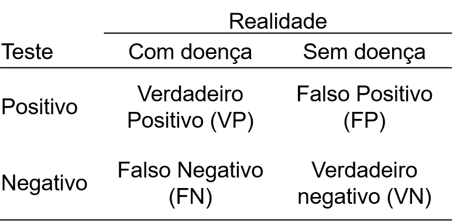
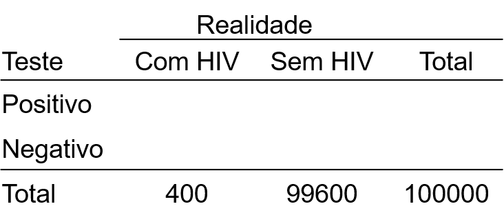
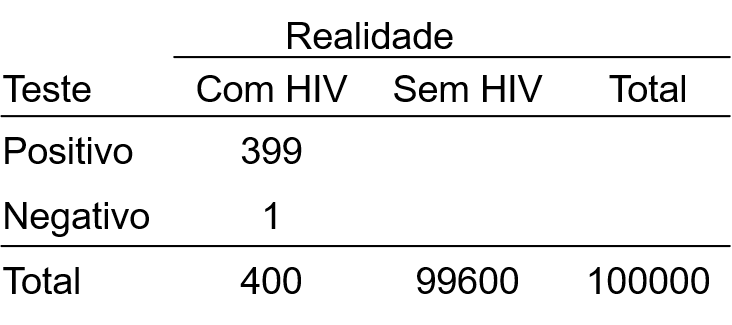
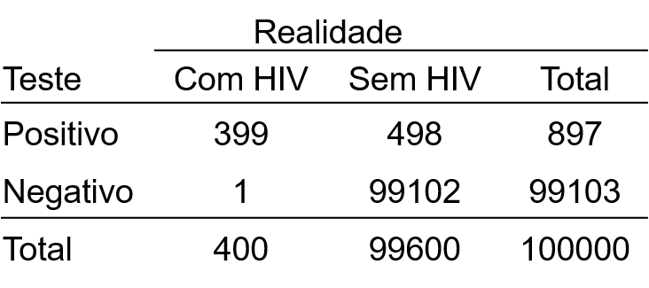
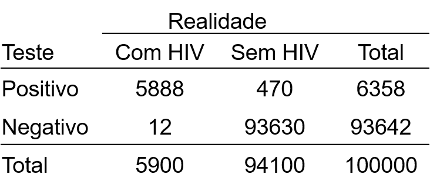

```{r, include=FALSE}
knitr::opts_knit$set(upload.fun = knitr::imgur_upload, base.url = NULL)
knitr::opts_chunk$set(fig.width = 5, fig.height = 5, cache = TRUE)
```

Imagine que você fez um teste rápido de HIV e o resultado deu positivo. Qual a probabilidade de você, de fato, ter uma infecção por HIV?
  
Para analisar essa questão, precisamos antes entender que os testes diagnósticos podem falhar. Essas falhas são o que chamamos de falsos positivos e falsos negativos.
Quando o teste tem um resultado positivo, mas na realidade o paciente não tem a doença/ condição, trata-se de um **falso positivo**. Já quando o teste apresenta um resultado negativo, mas na realidade o paciente tem a doença/ condição, temos em mãos um **falso negativo**. Podemos esquematizar todas as possibilidades da seguinte forma:


```{r, out.width = '350px', fig.align = 'center', echo=FALSE}

```

Você pode estar se perguntando: mas como é definido se na realidade a pessoa tem ou não a doença? Isso é definido com base no método de diagnóstico considerado o “padrão-ouro”. O padrão-ouro sempre será o método com maior acurácia - ou seja, com menor taxa de falsos positivos e falsos negativos. Esse padrão-ouro pode ser um teste diagnóstico ou um critério clínico.
Já que o padrão-ouro é o método mais acurado, por que não utilizá-lo? Bom, porque muitas vezes trata-se de um método que não é o mais adequado à prática clínica. Por exemplo, pode ser um método muito invasivo.

Tendo entendido os conceitos de falso positivo (FP), falso negativo (FN), verdadeiro positivo (VP) e verdadeiro negativo (VN), conseguimos discutir a definição de: **sensibilidade e especificidade.**


### Sensibilidade

A sensibilidade é calculada dividindo-se os verdadeiros positivos pelo total de pessoas com a doença/ condição (ou seja, a soma dos verdadeiros positivos e os falsos negativos).

$$
Sensibilidade = \frac{VP}{VP + FN}
$$

A sensibilidade, portanto, se refere à probabilidade do teste ser positivo, dado que o paciente tem a doença.


### Especificidade

Já a especificidade corresponde à divisão entre os verdadeiros negativos e o total de pessoas sem a doença/ condição (ou seja, a soma entre verdadeiros negativos e falsos positivos).

$$
Especificidade = \frac{VN}{VN + FP}
$$


Ou seja, a especificidade se refere à probabilidade do teste ser negativo, dado que o paciente não tem a doença.
  
  
### Sensibilidade x Especificidade

Talvez faça mais sentido pensar assim: um teste com alta sensibilidade vai apresentar poucos falsos negativos. Se a sensibilidade for 100%, significa que não haverá falsos negativos.
Seguindo o mesmo raciocínio, um teste com alta especificidade, vai apresentar poucos falsos positivos. Um teste com especificidade de 100% não apresentará falsos positivos.
  
Raramente na prática teremos um teste com 100% de sensibilidade e 100% de especificidade – um teste que, portanto, não terá resultados falsos. Em geral, se há aumento na sensibilidade do teste, há redução na especificidade.
  
Em bancos de sangue, por exemplo, geralmente são usados testes com 100% de sensibilidade, ainda que isso implique em uma especificidade mais baixa. Nessa situação, não podemos correr o risco de ter falsos negativos.


### Voltando ao exemplo do teste de HIV...
  
Vamos considerar que o teste rápido para o HIV apresenta uma **sensibilidade de 99,8%** e uma **especificidade de 99,5%**. Se o seu resultado foi positivo, qual a probabilidade de você, de fato, estar infectado?

Você pode ficar tentado a pensar que a probabilidade é 99,8% ou 99,5%. Ou seja, uma probabilidade bem alta. Mas, na verdade, a probabilidade de um resultado positivo ser um verdadeiro positivo é dada por um valor chamado **“Valor Preditivo Positivo” (VPP)**, o qual depende da sensibilidade e da especificidade do teste, mas também da **prevalência da doença na população**.

Assim como há o VPP, há o **VPN (Valor Preditivo Negativo)** que se refere à probabilidade de um teste negativo ser um verdadeiro negativo. Da mesma forma que o VPP, o VPN depende da sensibilidade, da especificidade e da prevalência da doença na população.

Há fórmulas para calcular o VPP e o VPN, mas, para simplificar, vamos primeiramente calculá-los com base em um exemplo.
  
  
Imagine que a pessoa que teve o resultado positivo é uma mulher heterossexual, sem comportamentos de risco. A prevalência da infecção por HIV nessa população é de aproximadamente 0,4%.

Essa prevalência indica que em 100 mil mulheres dessa população, teremos aproximadamente:

* 100.000 x 0,4% = 400 mulheres com HIV
* 100.000 – 400 = 99600 mulheres sem HIV

Vamos adicionar essas informações à tabela:

```{r, out.width = '300px', fig.align = 'center', echo=FALSE}

```

Agora vamos pensar: se todas essas mulheres fizessem o teste, quantas das 400 mulheres com HIV teriam um teste positivo?
Podemos calcular a quantidade de verdadeiros positivos multiplicando o total de mulheres com a infecção pela sensibilidade do teste:

$$
Sensibilidade = \frac{VP}{VP + FN}
$$

$$
VP = Sensibilidade \times (VP + FN)
$$
$$
VP = 99,8\% \times 400
$$
$$
VP = 399,2
$$
Arredondando esse valor, isso significa que o teste será positivo em 399 dessas mulheres e, portanto, negativo em uma (um falso negativo).

```{r, out.width = '300px', fig.align = 'center', echo=FALSE}

```

Ok, e das 99600 mulheres sem HIV, quantas terão resultados corretos? Ou seja: verdadeiros negativos?
Para esse cálculo, multiplicamos o total de mulheres sem infecção pela especificidade do teste:

$$
Especificidade = \frac{VN}{VN + FP}
$$

$$
VN = Especificidade \times (VN + FP)
$$

$$
VP = 99,5\% \times 99600
$$

$$
VP = 99102
$$
Ou seja, das 99600 mulheres não infectadas, 99102 terão um teste negativo, mas as outras 498 terão um teste positivo (ou seja, falsos positivos).
Então, vamos atualizar a tabela para responder à pergunta inicial...

```{r, out.width = '300px', fig.align = 'center', echo=FALSE}

```

Portanto, se uma mulher dessa população tem um resultado positivo, qual a probabilidade de ser um positivo verdadeiro (VPP)?
Podemos calcular isso dividindo o total de positivos verdadeiros (399) pelo total de resultados positivos (897):

$$
VPP = \frac{399}{897}
$$
$$
VPP = 44,8\%
$$

Ou seja, há uma probabilidade de **apenas 44,48%** de o resultado ser um verdadeiro positivo!

Podemos também aplicar esse raciocínio aos resultados negativos: se um resultado for negativo, a probabilidade de que ele seja um negativo verdadeiro (VPN) pode ser calculada através da divisão entre a quantidade de negativos verdadeiros (99102) e o total de resultados negativos (99103):

$$
VPN = \frac{99102}{99103}
$$

$$
VPN = 99,99\%
$$

Portanto, existe uma probabilidade de 99,99% de que um resultado negativo nessa população seja um negativo verdadeiro. Bem mais confiável, né?

E o menos intuitivo é que essas probabilidades **variam de acordo com a prevalência da doença na população testada**. Se fizermos o mesmo raciocínio, mas agora para uma mulher heterossexual que é usuária de droga injetável, os valores de VPP e VPN se alteram. Nessa população, estima-se que a prevalência de HIV seja de 5,9%. Logo, a tabela para 100 mil mulheres seria:

```{r, out.width = '300px', fig.align = 'center', echo=FALSE}

```


Realizando os mesmos cálculos que fizemos anteriormente:

$$
VPP = \frac{VP}{VP + FP} = \frac{5888}{6358} = 92,6\%
$$


$$
VPN = \frac{VN}{VN + FN} = \frac{93630}{93642} = 99,99\%
$$


Portanto, um resultado positivo em uma mulher que pertencesse a uma população com essa prevalência de HIV teria uma probabilidade de 92,6% de ser um verdadeiro positivo.

Observe que, ainda que estejamos utilizando o mesmo teste - portanto, com os mesmos valores de sensibilidade e especificidade - os valores de VPP e VPN mudam quando a prevalência da infecção na população se altera.

Muito contraintuitivo, não?


> Se você queria entender como analisar a probabilidade de um resultado positivo ser um falso positivo, você pode parar a leitura por aqui. Mas, caso queira aprofundar na matemática por trás dessas probabilidades, te convido a continuar lendo.


### E quais as fórmulas para o cálculo do VPP e do VPN?

O VPP e o VPN podem ser calculados usando o raciocínio que utilizamos acima, ou através das fórmulas abaixo. Os resultados dessas duas formas de calcular serão idênticos.

$$
VPP = \frac{Sensibilidade \times Prevalência}
{Sensibilidade \times Prevalência + (1 - Especificidade) \times (1 - Prevalência)}
$$
<br><br>
$$
VPN = \frac{Especificidade \times (1 - Prevalência)}
{Especificidade \times (1 - Prevalência) + (1 - Sensibilidade) \times Prevalência}
$$

O cálculo parece bem mais complexo do que o que fizemos anteriormente, mas está utilizando exatamente a mesma lógica.

### Teorema de Bayes

Os conceitos de VPP e VPN seguem um famoso teorema, o **Teorema de Bayes**. O foco desse teorema é a probabilidade condicional: a probabilidade de um determinado evento ocorrer, dado que outro evento já ocorreu.

Talvez você se recorde de ter aprendido o cálculo de probabilidades condicionais no Ensino Médio. Representamos uma probabilidade condicional como P(A|B), sendo A o evento cuja probabilidade será calculada e B o evento que já aconteceu. De acordo com o teorema, essa probabilidade pode ser calculada da seguinte forma:

$$
P(A|B) = \frac{P(B|A) \times P(A)}{P(B)}
$$

Cabe um post inteiro para discutirmos apenas esse teorema. Mas, em termos práticos, ele permite ajustar o cálculo da probabilidade de um evento, com base em um conhecimento *a priori* sobre outro evento relacionado.
É isso que estamos fazendo no caso do teste de HIV: ajustando a probabilidade de ser um positivo verdadeiro com base no conhecimento que já temos sobre aquela população (no caso, a prevalência da doença).


### Um comentário sobre probabilidades pré-teste e pós-teste


Os valores de VPP e VPN podem também ser chamados de **probabilidades pós-teste**. Isso porque se referem à probabilidade de o paciente ter a doença/ condição, considerando-se o resultado do seu teste diagnóstico.

A **probabilidade pré-teste** se refere ao conhecimento que se tem *a priori* (ou seja, antes do teste diagnóstico ser realizado) sobre a probabilidade de aquele paciente ter a doença/ condição.

Essa probabilidade pré-teste pode ser apenas a prevalência, como usamos no exemplo deste post. Mas, pode também ser uma probabilidade estimada pelo clínico ao considerar a prevalência, os exames físicos e os fatores de risco do paciente.

### Analisando essas informações no contexto da pandemia por COVID-19

Enquanto eu escrevo esse post, em dezembro de 2020, nós estamos enfrentando a pandemia provocada pelo Sars-Cov-2. Os valores de sensibilidade e especificidade variam muito entre os testes diagnósticos para COVID-19 produzidos por indústrias diferentes. No entanto, estima-se que os testes de RT-PCR apresentem, em média, uma sensibilidade de 87% e uma especificidade de 97%.

  

Com base nesses valores, vamos imaginar um cenário: uma pessoa apresenta vários sintomas de infecção por COVID-19 (febre, tosse seca, perda de olfato, diarreias). Com base nesses sintomas e na prevalência da infecção por COVID-19 na cidade em que essa pessoa reside, o clínico estima uma probabilidade pré-teste de 80%. O resultado do exame de RT-PCR dá negativo. Qual a probabilidade desse resultado corresponder a um negativo verdadeiro?
Essa probabilidade será dada pelo VPN (calculado da mesma forma que vimos acima): 65,1%. Ou seja, há uma probabilidade de apenas 65% de esse resultado negativo ser verdadeiro. Portanto, ainda que o resultado seja negativo, o mais adequado seria essa pessoa cumprir os 14 dias de quarentena.
  
  
Da mesma forma, vamos imaginar outra situação: uma pessoa faz um teste RT-PCR sem ter nenhum sintoma, apenas para checar se está infectada, e obtém um resultado positivo. Vamos estimar que a probabilidade pré-teste para ela é de 5% (o que corresponde à prevalência em várias cidades). Qual a probabilidade de esse resultado positivo ser verdadeiro? Como vimos, isso é dado pelo VPP, que nesse caso é de 60,41%. Ou seja, há uma probabilidade de apenas 60% de o resultado do teste estar correto. Claro, nesse caso o apropriado é seguir com a quarentena de qualquer forma. Mas, o risco em acreditar completamente no teste diagnóstico vem após o período de confinamento: essa pessoa provavelmente passará a ter mais comportamentos de risco, já que se considera imunizada.


Conhecer essas limitações matemáticas e estatísticas é algo fundamental à tomada de decisões no nosso cotidiano.

<br>
<hr>
<br>

### Referências:

* Mlodinow, L. (2009). O andar do bêbado: como o acaso determina nossas vidas. Editora Schwarcz-Companhia das Letras.
* Boletim epidemiológico. Aids no Brasil: epidemia concentrada e estabilizada em populações de maior vulnerabilidade. Secretaria de Vigilância em Saúde – Ministério da Saúde – Brasil. Volume 43 – 2012.
* Bastos, F. I. P. M. (2000). A feminização da epidemia de AIDS no Brasil: determinantes estruturais e alternativas de enfrentamento.
* Taquette, S. (2009). Feminização da Aids e adolescência. Adolescencia e Saude, 6(1), 33-40.
* Reis, E., & Reis, I. (2002). Avaliação de Testes Diagnósticos. Técnico do Departamento de Estatística da Universidade Federal de Minas Gerais.
* Kawamura, T. (2002). Interpretação de um teste sob a visão epidemiológica: eficiência de um teste. Arquivos Brasileiros de Cardiologia, 79(4), 437-441.
* DGITIS/SCTIE (2020). Acurácia dos testes diagnósticos registrados na ANVISA para a COVID-19. [Acesso](https://portalarquivos2.saude.gov.br/images/pdf/2020/June/02/AcuraciaDiagnostico-COVID19-atualizacaoC.pdf).

<br><br><br>
  

