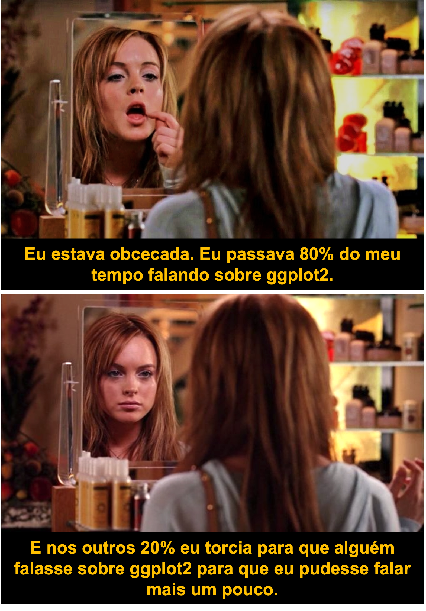
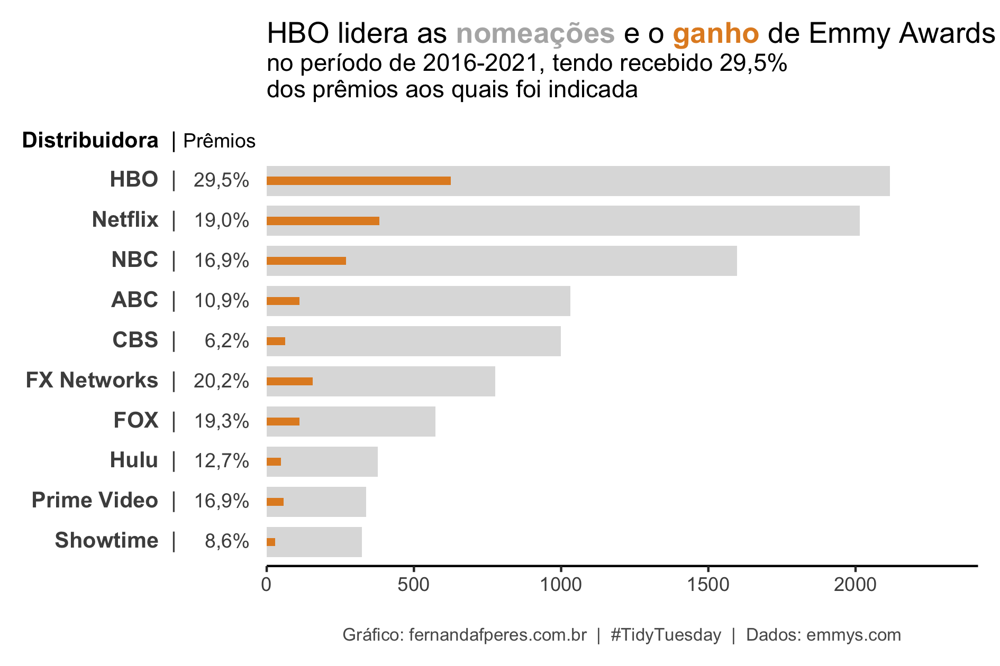
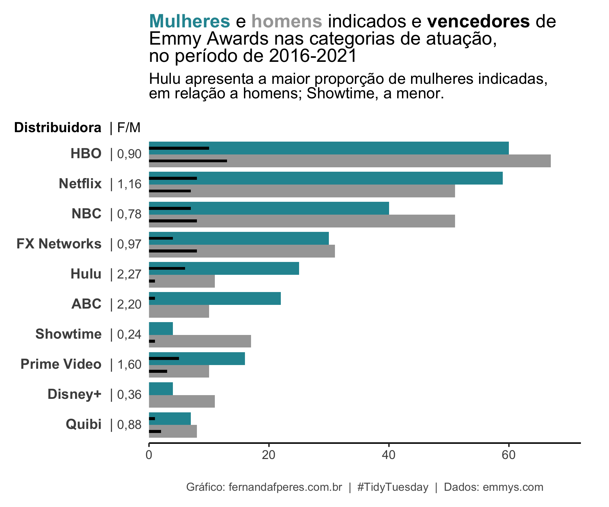

### O que é a #TidyTuesday?
  
Há um tempo eu acompanho os vídeos **incríveis** da [Julia Silge](https://www.youtube.com/c/JuliaSilge) que aplicam `tidymodels` e `tidyverse` na análise dos dados do [projeto #TidyTuesday](https://github.com/rfordatascience/tidytuesday).  
O #TidyTuesday é um projeto com a proposta de incentivar as pessoas a analisarem dados no R usando as ferramentas do ecossistema do `tidyverse`, uma coleção de pacotes que inclui alguns dos meus favoritos, como o `ggplot2` e o `dplyr`. Um novo conjunto de dados - reais! - é liberado toda segunda-feira no [repositório oficial do projeto](https://github.com/rfordatascience/tidytuesday) e, na terça-feira (daí vem o *tuesday*) as pessoas compartilham os resultados e os códigos utilizados nessa análise, usando a hashtag do projeto. Na página principal do repositório, você encontra mais detalhes sobre o projeto.  
  
Eu estava meio resistente a participar, porque: 1) eu não sou lá muito *expert* em manipulação e visualização de dados no R e 2) a proposta é publicar os resultados no Twitter - e, pelo bem da minha saúde mental, eu não tenho um Twitter, rs. Mas, recentemente eu tenho me divertido muito estudando o pacote `ggplot2` e tenho aprendido coisas super interessantes de manipulação de dados com o `dplyr` (aqui vai um agradecimento especial ao grupo de estudos das [R-Ladies SP](https://www.instagram.com/rladiessaopaulo/)). Comecei a ver os dados da #TidyTuesday como um ótimo jeito de continuar estudando esses pacotes.  
Essa é então a minha primeira participação no #TidyTuesday. Eu aprendi **tanta** coisa organizando esses dados e montando esses gráficos que, com certeza, valeu a pena :)  
  
  
<center>
```{r, echo=FALSE, fig.align='center', out.width = '300px'}

```
<font size='3'>Eu mesma, nesse último mês</font>
</center><br>
  
Ah, eu participei atrasada - comecei a mexer nesses dados na quarta-feira - e, como é a minha primeira participação, eu me dei a colher de chá de me inspirar em trabalhos de outros participantes. Os gráficos criados foram em parte inspirados no trabalho do @[thomas_mock](https://twitter.com/thomas_mock/status/1440352188102942721?s=20) e do @[leeolney](https://twitter.com/leeolney3/status/1440163856949547015?s=20).
  
### Os dados
  
O dados dessa semana (semana 39 de 2021) são referentes aos prêmios e indicações ao Emmy Awards. Os dados foram obtidos do site [emmys.com](https://www.emmys.com/awards/nominations/award-search).  
  
> O Emmy Award, ou simplesmente Emmy, é o maior e mais prestigioso prêmio atribuído a programas e profissionais de televisão. É apresentado em vários eventos anuais realizados ao longo do ano, cada um homenageando um dos vários setores da indústria televisiva. Os dois eventos que recebem maior cobertura dos meios de comunicação são os Emmy do Primetime e os Prêmios Emmy do Daytime que reconhecem o trabalho de destaque na programação americana do horário nobre e entretenimento diurno, respectivamente.  
Fonte: [Wikipedia](https://pt.wikipedia.org/wiki/Emmy_Award)  
  
  
### Leitura do banco de dados e carregamento dos pacotes  
  
```{r}
pacman::p_load(tidyverse, ggtext, glue, forcats)
```

  
```{r, message=FALSE, warning=FALSE}
df <- readr::read_csv('https://raw.githubusercontent.com/rfordatascience/tidytuesday/master/data/2021/2021-09-21/nominees.csv')
```
  
```{r}
head(df, 10)
```
  
```{r}
glimpse(df)
```
  
Trata-se de um banco com `r nrow(df)` linhas e `r ncol(df)` colunas, que inclui dados do período de `r min(df$year)` a `r max(df$year)`. Cada linha corresponde a uma indicação ao prêmio, e a coluna `type` especifica se o indicado foi vencedor daquela categoria (`Winner`) ou não (`Nominee`). A variável `distributor` especifica qual a distribuidora responsável pela produção indicada ao Emmy.
  
### Quais são as dez distribuidoras mais indicadas ao Emmy nos últimos cinco anos?  
  
Eu achei interessante trabalhar com os dados mais recentes, para investigar o cenário atual dos Emmy Awards. Para isso, selecionei as 10 distribuidoras mais indicadas a Emmy Awards nos anos de 2016 a 2021.  
  
```{r}
df %>%
  filter(year > 2015) %>%
  group_by(distributor) %>% 
  summarise(n = n()) %>% 
  arrange(-n) %>%
  slice_max(n, n = 10)
```
  
Nesse período, a HBO foi a distribuidora mais indicada a Emmys, com 2116 indicações, sendo seguida pela Netflix, com 2014.  
Decidi criar os gráficos apenas com essas distribuidoras mais indicadas nos últimos cinco anos. Para isso, salvei os seus nomes no objeto `top_10`.  
  
```{r}
top_10 <- df %>%
  filter(year > 2015) %>%
  group_by(distributor) %>% 
  summarise(n = n()) %>% 
  arrange(-n) %>%
  slice_max(n, n = 10) %>% 
  pull(distributor)
```
   
  
### Indicações e prêmios recebidos, nos últimos cinco anos, pelas 10 distribuidoras mais indicadas  
  
Optei por fazer um gráfico de barras com a quantidade total de indicações aos Emmy Awards, por distribuidora, no período de 2016-2021. Além disso, decidi incluir no gráfico a quantidade de prêmios que cada distribuidora recebeu e a porcentagem de indicações que resultaram em prêmios.  
Para isso, organizei um *data frame* incluindo apenas os dados dos últimos cinco anos e das distribuidoras em `top_10`. Contei a quantidade de indicações e prêmios por distribuidora - as distribuidoras que não tinham vencido nenhum prêmio ficaram com a coluna `Winner` como NA, então substituí os NAs nessa coluna por zeros. Por fim, criei algumas variáveis de interesse. A variável `Total Nominee` foi criada a partir da soma de `Winner` e `Nominee`, para obter o total de indicações. Calculei também a porcentagem (`porc`) de prêmios recebidos, de acordo com o total de indicações.  
Além disso, tive que criar as colunas `espaco` e `distributortxt` para unir as informações da distribuidora com a porcentagem - o que eu defini que seria o rótulo do meu eixo vertical - e formatá-las adequadamente. Para a formatação, eu usei os pacotes `glue` e `ggtext`, que eu nunca tinha usado na vida. A ideia de usá-los para deixar o rótulo do eixo como eu queria foi inspirada no gráfico de @[leeolney](https://twitter.com/leeolney3/status/1440163856949547015?s=20). Amei a descoberta do pacote `ggtext`!
  
```{r}
df_top10 <- df %>% filter(distributor %in% top_10,
                          year > 2015) %>% 
  group_by(distributor, type) %>% 
  summarise(n = n()) %>% 
  ungroup() %>%
  spread(type, n) %>% 
  mutate(across(Winner, ~replace_na(.x, 0))) %>% 
  mutate(TotalNominee = Nominee + Winner,
         porc = Winner/TotalNominee,
         espaco = case_when(porc >= 0.1 ~ paste0("_"),
                            porc < 0.1 ~ paste0("__")),
         porc = scales::percent(porc, decimal.mark = ",",
                                 accuracy = 0.1),
         distributortxt = as.factor(glue::glue("<b>{distributor} </b>   |  <span style='color:#FFFFFF;font-size:12px'>{espaco}</span><span style='font-size:12px'>{porc}  </span>")))

```
  
O *data frame* modificado ficou assim:  
  
```{r}
head(df_top10, 10)
```
  
E o gráfico ficou assim:  
  
```{r fig.width=6.3, fig.height=4.2, dpi=300, fig.align='center', out.width='600px', eval=FALSE}
ggplot(df_top10, aes(x = forcats::fct_reorder(distributortxt,
                                              TotalNominee, max))) +
  geom_bar(aes(y = TotalNominee), stat = "identity",
           fill = "grey87", width = 0.75) +
  geom_bar(aes(y = Winner), stat = "identity",
           fill = "#E28C27", width = 0.2) +
  scale_y_continuous(expand = expansion(add = c(0,300))) +
  labs(y = "Total de nomeações",
       title = "HBO lidera as <b style='color:grey70'>nomeações</b>
       e o <b style='color:#E28C27;'>ganho</b> de Emmy Awards",
       subtitle = "no período de 2016-2021, tendo recebido 29,5%\ndos prêmios aos quais foi indicada",
       x = "<b>Distribuidora </b>  |  <span style='font-size:12px'>Prêmios</span>",
       caption = "Gráfico: fernandafperes.com.br  |  #TidyTuesday  |  Dados: emmys.com") +
  coord_flip() +
  theme_classic() +
  theme(axis.ticks.y = element_blank(),
        axis.title.y = element_markdown(angle = 0,
                                    margin = margin(0,-105,0,0),
                                    vjust = 1.065,
                                    size = 10,
                                    color = "black"),
        axis.line.y = element_blank(),
        axis.text.y = element_markdown(color = "grey30", size = 10),
        axis.title.x = element_blank(),
        plot.margin = margin(10, 10, 10, 10),
        plot.title = element_markdown(margin = margin(0,0,2,0)),
        plot.subtitle = element_text(margin = margin(0,0,25,0)),
        plot.caption = element_text(hjust = 0.5, margin = margin(15,0,0,0),
                                    color = "grey35", size = 8))
```
  
```{r, echo=FALSE, fig.align='center', out.width = '600px'}

```
  
Minhas maiores dificuldades com esse gráfico foram: 1) criar um rótulo para as categorias do eixo y que ficasse alinhadas adequadamente e 2) colocar o título do eixo y acima das categorias. Inclusive, cheguei a achar respostas no StackOverflow dizendo que isso não era possível. Mas, colocando uma margem direita negativa, e modificando o `vjust`, depois de muita tentativa e erro, eu consegui!
  
  
### Os prêmios por gênero  
  
Para me forçar a trabalhar com pacotes que manipulam *strings*, eu decidi também fazer um gráfico separando as indicações aos prêmios de melhor ator e melhor atriz. A ideia era avaliar se havia uma diferença na quantidade de homens e mulheres indicados e premiados, de acordo com a distribuidora.  
  
Primeiramente, separei no objeto `top10_gen` as 10 distribuidoras mais indicadas aos prêmios de melhor ator ou melhor atriz. Para isso usei a função `str_detect` do pacote `stringr` e filtrei para categorias que contivessem "actress" ou "actor" no título.  
  
```{r}
top10_gen <- df %>%
  filter(year > 2015 &
           (str_detect(category, fixed('Actress', ignore_case=TRUE)) |
              str_detect(category, fixed('Actor', ignore_case=TRUE)))) %>%
  group_by(distributor) %>% 
  summarise(n = n()) %>% 
  arrange(-n) %>%
  slice_max(n, n = 10) %>% 
  pull(distributor)
```
  
Então, criei um *data frame* que incluía o gênero do indicado àquela categoria.  
  
```{r}
df_genero <- df %>% filter(year > 2015, distributor %in% top10_gen) %>%
  mutate(gender = case_when(str_detect(category, "Actress") ~ "F",
                              str_detect(category, "Actor") ~ "M")) %>% 
  filter(!is.na(gender)) %>% 
  group_by(gender, distributor, type) %>%
  count() %>%
  spread(type, n) %>% 
  mutate(across(Winner, ~replace_na(.x, 0))) %>% 
  mutate(TotalNominee = Nominee + Winner,
         porc = Winner/TotalNominee,
         distributor = factor(distributor),
         gender = as.factor(gender))
```
  
Também criei um *data frame* à parte para incluir a razão entre a quantidade de mulheres e homens indicados em cada distribuidora:

```{r}
razao_genero <- df_genero %>%
  select(distributor, gender, TotalNominee) %>% 
  spread(gender, TotalNominee) %>% 
  mutate(ratio = F/M)
```
  
```{r}
head(razao_genero, 10)
```
  
Portanto, valores acima de 1 indicam que, naquela distribuidora, mais mulheres foram indicadas a categorias de atuação que homens. Valores abaixo de 1, significam que mais homens foram indicados. A distribuidora Hulu se destaca com a maior proporção de mulheres indicadas, em relação aos homens - o que provavelmente se deve a The Handmaid's Tale. Já a Showtime é a distribuidora com a maior proporção de homens indicados em relação a mulheres - curiosamente, é a distribuidora de The L Word Generation Q, uma série focada em mulheres e com um elenco quase em sua totalidade feminino.
  
O próximo passo foi unir esses dois *data frames* e criar a variável `distributortxt` para incluir como rótulo do eixo y tanto a distribuidora como a razão entre os gêneros.
  
```{r}
df_genero <- inner_join(df_genero, razao_genero[c(1,4)], by = "distributor") %>% 
  mutate(ratio = scales::number(ratio, accuracy = 0.01, decimal.mark = ","),
         distributortxt = as.factor(glue::glue("<b>{distributor} </b>   |  <span style='font-size:13px'>{ratio}</span>")))
```
  
Então, criei um gráfico, com uma proposta semelhante ao sem separação por gênero:
  
```{r fig.width=6.3, fig.height=7, dpi=300, fig.align='center', out.width='700px', eval=FALSE}
ggplot(df_genero, aes(x = forcats::fct_reorder(distributortxt,
                                               TotalNominee, max),
                      group = factor(gender, levels = c("M", "F")))) +
  geom_bar(aes(y = TotalNominee, fill = gender),
           stat = "identity", position = "dodge", width = 0.85) +
  geom_bar(aes(y = Winner),
           stat = "identity", fill = "black", width = 0.2,
           position = position_dodge(.85)) +
  scale_y_continuous(expand = expansion(add = c(0,5))) +
  scale_fill_manual(values = c("#2794A0", "grey65")) +
  labs(y = "Total de nomeações",
       title = "<b style='color:#2794A0'>Mulheres</b> 
       e <b style='color:grey65;'>homens</b> indicados e <b style='color:black'>vencedores</b> de<br>Emmy Awards
       nas categorias de atuação,<br>no período de 2016-2021",
       subtitle = "Hulu apresenta a maior proporção de mulheres indicadas,<br>
       em relação a homens; Showtime, a menor.",
       x = "<b>Distribuidora </b>  |  <span style='font-size:13px'>F/M</span>",
       caption = "Gráfico: fernandafperes.com.br  |  #TidyTuesday  |  Dados: emmys.com") +
  coord_flip() +
  theme_classic() +
  theme(axis.ticks.y = element_blank(),
        axis.title.y = element_markdown(angle = 0,
                                    margin = margin(0,-88.5,0,0),
                                    vjust = 1.05,
                                    size = 10,
                                    color = "black"),
        axis.line.y = element_blank(),
        axis.text.y = element_markdown(color = "grey30", size = 10),
        axis.title.x = element_blank(),
        plot.margin = margin(10, 20, 10, 10),
        plot.title = element_markdown(margin = margin(0,0,2,0)),
        plot.caption = element_text(hjust = 0.5, margin = margin(15,0,0,0),
                                    color = "grey35", size = 8),
        plot.subtitle = element_markdown(margin = margin(3,0,25,0)),
        legend.position = "none")
```
  
```{r, echo=FALSE, fig.align='center', out.width = '600px'}

```
  
Nesse, a minha maior dificuldade foi decidir cores que ficassem coordenadas, mas ainda fossem facilmente diferenciáveis. Depois de muitos testes, acabei optando por esse gráfico com azul como destaque, e o restante em tons de cinza.  
  
### Como foi a experiência?  
  
Eu definitivamente me diverti e aprendi muita coisa nova com essa #TidyTuesday. Pretendo participar das próximas, e vou postando por aqui, para quem quiser acompanhar :)  
  