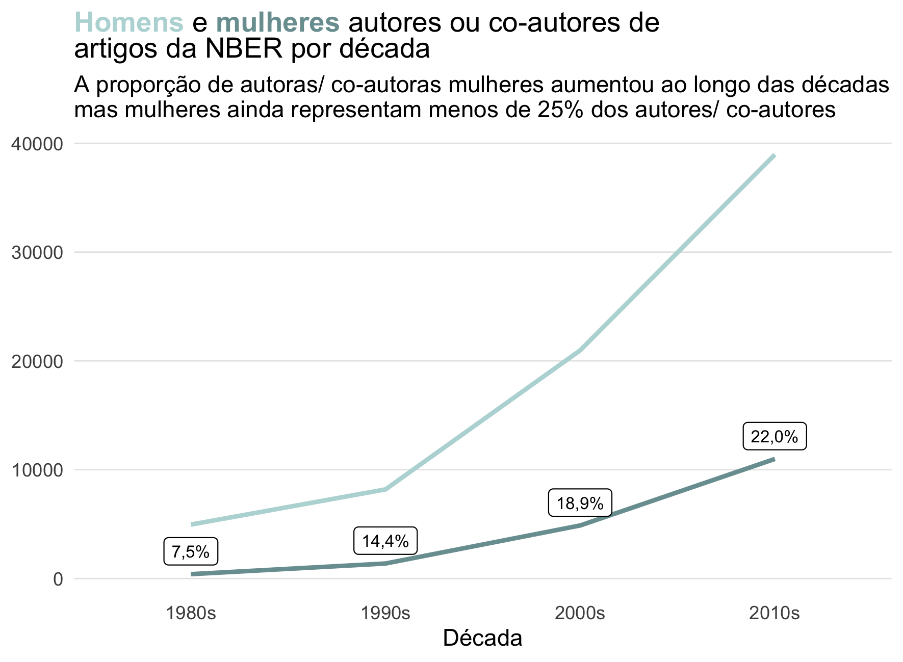
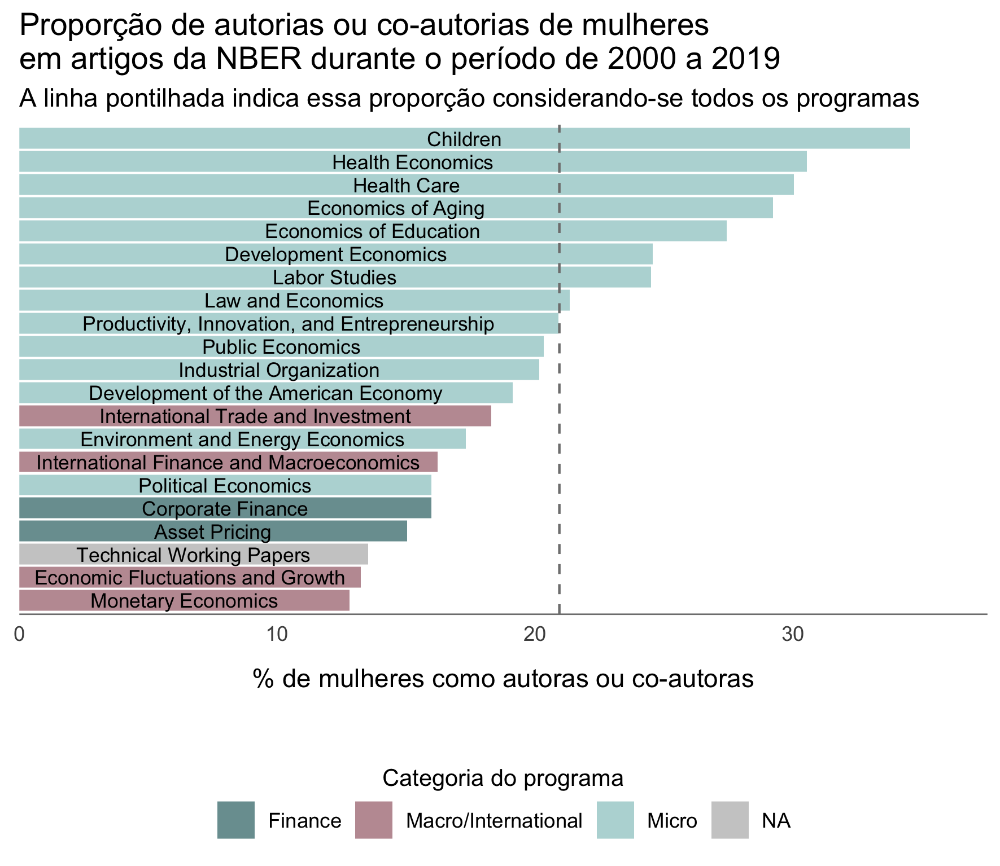

### Os dados analisados  
  
O post de hoje explora os dados dos artigos publicados pela National Bureau of Economic Research (NBER), que fazem parte da semana 40 do projeto [#TidyTuesday](https://github.com/rfordatascience/tidytuesday). Os dados estão disponíveis no [repositório oficial do projeto](https://github.com/rfordatascience/tidytuesday/blob/master/data/2021/2021-09-28/readme.md).  
  
> National Bureau of Economic Research (NBER) é uma organização sem fins lucrativos norte-americana voltada para pesquisa e "comprometida em realizar e disseminar pesquisas econômicas imparciais entre formuladores de políticas públicas, profissionais de negócios e a comunidade acadêmica".  
Fonte: [Wikipedia](https://pt.wikipedia.org/wiki/National_Bureau_of_Economic_Research)
  
Essa é a minha segunda participação no #TidyTuesday e tem sido super proveitoso participar, porque acabo aprendendo novas funções de pacotes que eu uso e amo, como o `dplyr` e o `ggplot2`, e também acabo explorando outros pacotes. Essa semana, além do `ggtext` que eu conheci semana passada, também usei o pacote `gender`, que há um tempo eu tinha vontade de usar, mas ainda não tinha tido coragem de explorar.  
Ah, se você não sabe o que é a #TidyTuesday, eu explico melhor no meu [post anterior](https://fernandafperes.com.br/blog/tidy-tuesday-emmy/).  
  
  
### Leitura do banco de dados e carregamento dos pacotes  
  
Como comentei, eu usei os pacotes `gender`, `ggtext` e o `tidyverse`. No primeiro uso do pacote `gender` também é necessário instalar o `genderdata`, que eu só consegui instalar usando o código comentado abaixo - por alguma razão, não instalou automaticamente no meu computador.   
  
```{r}
pacman::p_load(tidyverse, ggtext, gender)
# devtools::install_github("ropensci/genderdata")
```
  
Para ler o banco de dados, usei o código fornecido no repositório do #TiduTuesday, que une vários bancos diferentes com a função `left_join`:

```{r, message=FALSE, warning=FALSE}
papers <- readr::read_csv('https://raw.githubusercontent.com/rfordatascience/tidytuesday/master/data/2021/2021-09-28/papers.csv')
authors <- readr::read_csv('https://raw.githubusercontent.com/rfordatascience/tidytuesday/master/data/2021/2021-09-28/authors.csv')
programs <- readr::read_csv('https://raw.githubusercontent.com/rfordatascience/tidytuesday/master/data/2021/2021-09-28/programs.csv')
paper_authors <- readr::read_csv('https://raw.githubusercontent.com/rfordatascience/tidytuesday/master/data/2021/2021-09-28/paper_authors.csv')
paper_programs <- readr::read_csv('https://raw.githubusercontent.com/rfordatascience/tidytuesday/master/data/2021/2021-09-28/paper_programs.csv')


joined_df <- left_join(papers, paper_authors) %>% 
  left_join(authors) %>% 
  left_join(paper_programs) %>% 
  left_join(programs)%>% 
  mutate(
    catalogue_group = str_sub(paper, 1, 1),
    catalogue_group = case_when(
      catalogue_group == "h" ~ "Historical",
      catalogue_group == "t" ~ "Technical",
      catalogue_group == "w" ~ "General"
    ),
    .after = paper
  )
```
  
```{r}
sample_n(joined_df, 10)
```
  
O banco incluí uma lista de artigos da NBER acompanhados da data de publicação, nome dos autores e programa ao qual o artigo pertence. O banco inclui artigos do período de 1973 a 2021.  
  
  
### Identificando o gênero dos autores  
  
Há um tempo eu ouço falar no pacote `gender`, mas nunca o havia utilizado. Esse pacote permite identificar o gênero da pessoa com base no primeiro nome e no seu ano de nascimento. Por exemplo, de todos as pessoas chamadas Steve que nasceram em 1983, 99,4% eram homens e 0,6% eram mulheres. Logo, o pacote classificará um Steve nascido nesse ano como alguém do gênero masculino.    
Vale dizer que é um pacote que usa um banco de dados com nomes em inglês, então seu funcionamento é limitado esse tipo de dado. Para os autores dos artigos da NBER, o pacote foi capaz de identificar o gênero de mais de 80% dos autores, então segui com a análise.  
As análises que eu conduzi aqui foram baseadas no artigo [Female representation and collaboration at the NBER](https://bldavies.com/blog/female-representation-collaboration-nber/), escrito por Ben Davies. Eu tentei criar meu próprio script, sem "colar" do dele para me desafiar (e porque, para ser honesta, eu demorei para perceber que o post tinha um link para o script, haha!). Mas, eventualmente, o [script do Ben Davies](https://github.com/bldavies/bldavies.com/tree/master/content/blog/2021-03-29-female-representation-collaboration-nber/) foi consultado.
  
O meu primeiro passo foi criar duas colunas: uma coluna com o primeiro nome de cada autor (coluna `first_name`) e uma coluna com a data de nascimento estimada para cada autor (coluna `birth_year`). Estimei como ano de nascimento a data de publicação do artigo menos 35 anos - uma estratégia que não é à prova de falhas, mas que eu considerei uma estimativa válida.  
  
```{r}
joined_df$first_name <- sapply(strsplit(joined_df$name, " "), `[`, 1)
joined_df$birth_year <- joined_df$year - 35
```
  
O próximo passo foi aplicar a função `gender_df` ao *data frame* para estimar os gêneros dos autores.
  
```{r}
df_gender <- gender::gender_df(joined_df,
                               name_col = "first_name",
                               year_col = "birth_year",
                               method = "ssa")
```
  
Isso resultou no seguinte banco de dados:  
  
```{r}
sample_n(df_gender, 10)
```
  
O próximo passo foi unir o banco de dados com os artigos, o `joined_df`, ao banco com os gêneros, o `df_gender`. Para isso, eu inicialmente tive que filtrar o banco `df_gender` para incluir apenas os casos não repetidos de nome e ano de nascimento, além de renomear algumas colunas para possibilitar o `left_join`. Ao final, fiquei com um *data frame* chamado `df`.
  
```{r}
df_gender <- df_gender %>% rename(first_name = name,
                                  birth_year = year_min) %>%
  select(first_name, birth_year, gender) %>% distinct()

df <- left_join(joined_df, df_gender)
```
  
```{r}
sample_n(df, 10)
```
  
### Proporção de mulheres autoras ou co-autoras de artigos da NBER por década
  
O próximo passo foi criar uma variável que correspondesse à década de publicação do artigo, chamada de `decade`. Eu incluí as décadas de 1980 a 2010 em um objeto ( `decades`), para filtrar o banco posteriormente. Essas décadas foram escolhidas por serem as com dados completos, referentes aos 10 anos.  
  
```{r}
df <- df %>% mutate(decade = factor(paste0((floor(year / 10) * 10),"s")))

decades <- c("1980s", "1990s", "2000s", "2010s")
```
  
A tabela abaixo resume a proporção de mulheres autoras/ co-autoras por década, bem como a proporção de autores em cada década cujo gênero não pode ser identificado.  
  
```{r}
tbl_sum <- df %>% filter(decade %in% decades) %>%
  group_by(decade, gender) %>% 
  count() %>% 
  spread(gender, n) %>% 
  rename(NI = "<NA>") %>% 
  mutate(total = female + male,
         prop.f = round(100*female/total,2),
         prop.m = round(100*male/total,2),
         estimated.sex = 100-round(100*NI/(female+male+NI),2))

tbl_cont <- df %>% filter(!is.na(gender),
                          decade %in% decades) %>%
  group_by(decade, gender) %>% 
  count()
```
  
  
```{r, echo = FALSE}
tabela <- tbl_sum %>% select(decade, female, male, prop.f, estimated.sex) %>% 
  rename(Década = decade,
         `Autoras/ Co-autoras mulheres` = female,
         `Autores/ Co-autores homens` = male,
         `Proporção de autoras mulheres (%)` = prop.f,
         `Proporção de autores com gênero identificado (%)` = estimated.sex)

tabela %>% flextable::regulartable() %>%
  flextable::align(align = "center", part = 'all') %>% 
  flextable::colformat_num(big.mark = "", decimal.mark = ",") %>% 
  flextable::width(j = 2:5, width = 1.4)
```
  
Então, eu optei por criar um gráfico de linhas para mostrar a evolução da quantidade de autores/ co-autores de ambos os gêneros ao longo das décadas. Além disso, incluí no gráfico um rótulo indicando a proporção de mulheres. Usei para isso a camada `geom_label`, que por alguma razão eu sempre evito, tanto que essa foi a primeira vez que usei essa camada na vida, haha.  
  
```{r, eval=FALSE}
ggplot() +
  geom_line(data = tbl_cont,
            aes(x = decade, y = n,
                group = gender, color = gender),
            size = 1) +
  geom_label(data = tbl_sum, aes(x = decade, y = (female+2100),
                                 label = scales::number(prop.f,
                                                        decimal.mark = ",",
                                                        suffix = "%")),
             size = 2.8) +
  labs(x = "Década", color = "Gênero do autor",
       title = "<b style='color:#B8D8D8'>Homens</b> e <b style='color:#7A9E9F'>mulheres</b> autores ou co-autores de<br>
       artigos da NBER por década",
       subtitle = "A proporção de autoras/ co-autoras mulheres aumentou ao longo das décadas\nmas mulheres ainda representam menos de 25% dos autores/ co-autores") +
  scale_color_manual(values = c("#7A9E9F", "#B8D8D8")) +
  theme_classic() +
  theme(axis.ticks = element_blank(),
        axis.line = element_blank(),
        panel.grid.major.y = element_line(color = "grey90",
                                          size = 0.3),
        axis.title.y = element_blank(),
        legend.position = "none",
        plot.title = element_markdown())
```
  
```{r, echo=FALSE, fig.align='center', out.width = '700px'}

```
  
  
### Proporção de mulheres autoras ou co-autoras de artigos da NBER por programa, no período de 2000 a 2019
  
Como próximo passo, eu tentei reproduzir o gráfico gerado pelo Ben Davies no artigo [Female representation and collaboration at the NBER](https://bldavies.com/blog/female-representation-collaboration-nber/), o qual representa a proporção de mulheres de acordo com o programa no qual o artigo foi publicado.  
Para isso, selecionei os 10 programas com mais publicações e agrupei os demais em "outros". Calculei a proporção de mulheres em cada um desses programas, bem como a proporção de mulheres no geral. Ah, eu selecionei como período de interesse apenas as décadas de 2000 e 2010.
  
```{r}
top_20 <- df %>% filter(decade %in% c("2000s", "2010s")) %>% 
  mutate(program = factor(program)) %>% 
  group_by(program) %>% 
  summarise(n = n()) %>% 
  arrange(-n) %>%
  slice_max(n, n = 20) %>% 
  pull(program)

df <- df %>% mutate(program_top = factor(case_when(program %in% top_20 ~ program,
                                                   TRUE ~ "Other")))

df_prog <- df %>% filter(decade %in% c("2000s", "2010s"),
                         !is.na(gender), !is.na(program)) %>%
  group_by(program, program_desc, program_category, gender) %>% 
  count() %>% 
  spread(gender, n) %>%
  mutate(total = female + male,
         prop.f = round(100*female/total,2),
         program = factor(program))


prop.f.all <- df %>% filter(decade %in% c("2000s", "2010s"),
                            !is.na(gender), !is.na(program)) %>%
  group_by(gender) %>% 
  count() %>% 
  spread(gender, n) %>%
  mutate(total = female + male,
         prop.f = round(100*female/total,2)) %>% 
  pull(prop.f)
```
  
O gráfico, no final, ficou assim:  
  
```{r, eval=FALSE}
ggplot(df_prog) +
  geom_bar(aes(x = fct_reorder(program,
                               prop.f),
               y = prop.f, fill = program_category), stat = "identity") +
  geom_hline(yintercept = prop.f.all,
             color = "grey50",
             lty = "dashed") +
  geom_text(aes(label = program_desc, x = program, y = (prop.f/2)),
            size = 3) +
  scale_y_continuous(expand = expansion(add = c(0,3))) +
  scale_fill_manual(values = c("#7A9E9F", "#C09BA2","#B8D8D8"),
                    na.value = "grey80") +
  labs(y = "% de mulheres como autoras ou co-autoras",
       title = "Proporção de autorias ou co-autorias de mulheres\nem artigos da NBER durante o período de 2000 a 2019",
       subtitle = "A linha pontilhada indica essa proporção considerando-se todos os programas",
       fill = "Categoria do programa") +
  coord_flip() +
  theme_classic() +
  theme(axis.title.y = element_blank(),
        axis.text.y = element_blank(),
        axis.ticks = element_blank(),
        axis.line = element_blank(),
        axis.line.x = element_line(color = "grey50", size = 0.3),
        axis.title.x = element_text(margin = margin(10,10,15,10)),
        legend.position = "bottom",
        legend.title = element_text(size = 10)) +
  guides(fill = guide_legend(title.position = "top", title.hjust = 0.5))
```
  
```{r, echo=FALSE, fig.align='center', out.width = '700px'}

```
  
