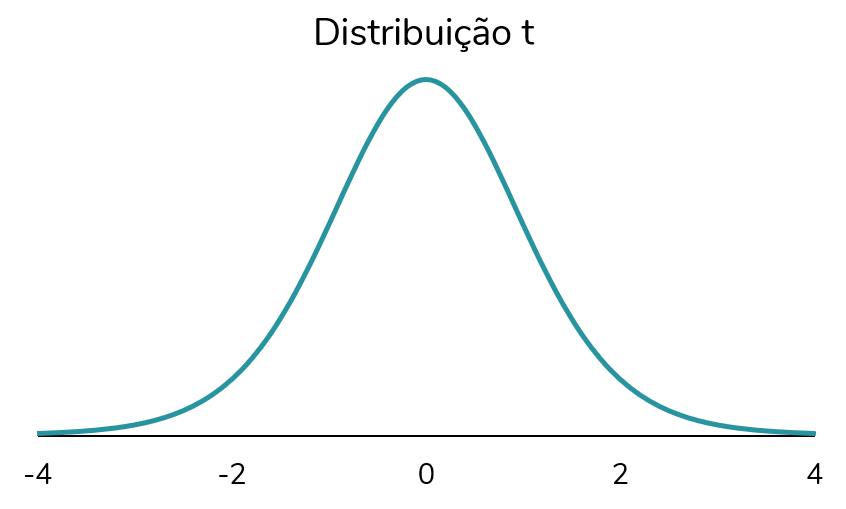
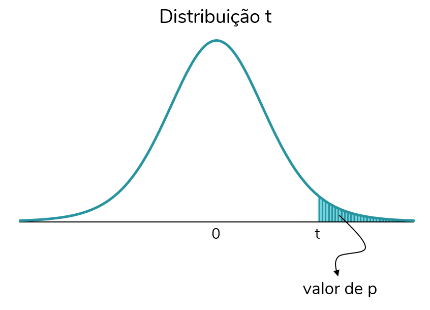
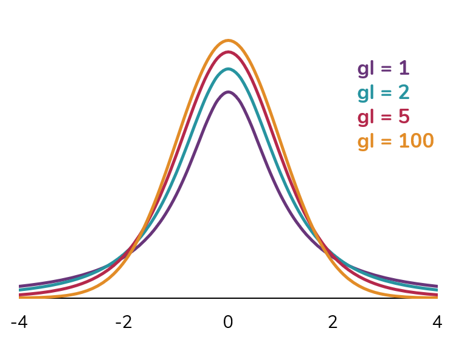
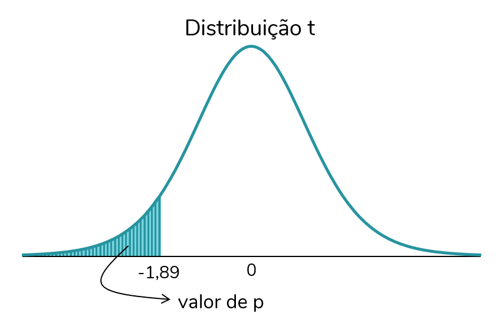
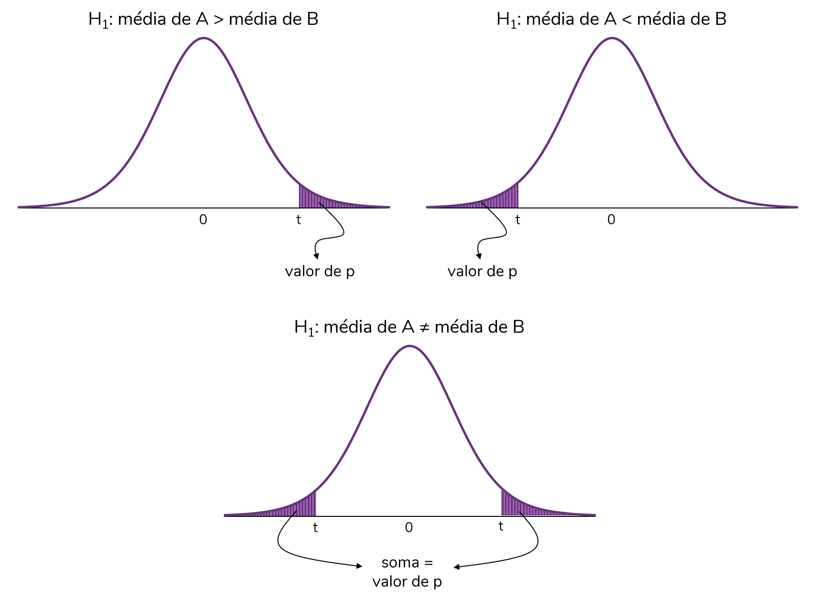

```{r, include=FALSE}
# knitr::opts_knit$set(upload.fun = knitr::imgur_upload, base.url = NULL)
knitr::opts_chunk$set(fig.width = 5, fig.height = 5)
```

Em um [post anterior](https://fernandafperes.com.br/blog/doutora-toma-cha/), discutimos os conceitos de teste de hipóteses, nível de significância e valor de p, com base no experimento "Uma senhora toma chá", descrito por Ronald Fisher no seu livro "The design of experiments". A proposta desse post é explicar como o valor de p é calculado em um teste estatístico, mais especificamente o teste-t independente. Também discutiremos a diferença entre testes uni e bicaudais (e qual deles é o mais adequado à sua pergunta experimental).  
  
> Esse também é um post baseado em um vídeo do meu canal. Então, se você prefere consumir esse conteúdo em vídeo, clique [aqui](https://youtu.be/bYbW-2BnMk4).  
  
  
### A pergunta experimental  
  
Antes de partirmos para qualquer coleta de dados e análise estatística, precisamos ter uma pergunta experimental relevante. É essa pergunta que vai guiar tanto o planejamento do experimento e a coleta de dados, quanto as análises estatísticas a serem realizadas ao final.  
A pergunta por trás do exemplo que veremos nesse post é: há **diferenças nas médias** de glicemia de jejum de dois grupos de pessoas, um que **faz exercício físico**, e outro **sedentário**?  
Nesse caso, como nosso objetivo é **comparar as médias de dois grupos independentes** (ou seja, formados por pessoas diferentes), vamos usar o **teste-t para duas amostras independentes** (ou simplesmente teste-t independente).  
  
> A escolha do teste estatístico adequado não é algo simples. Nesse [vídeo](https://youtu.be/EtV3_3aN884) eu faço uma discussão sobre os principais testes estatísticos, e quando usar cada um deles.
  
  
Vamos trabalhar aqui com dados hipotéticos e com grupos pequenos para facilitar o cálculo. O foco desse post é entender a teoria por trás dos testes de hipóteses.  
Imagine que sorteamos uma amostra e obtivemos os seguintes valores de glicemia desses dois grupos, exercício físico (EF) e sedendários (SED):  
  
```{r, echo=FALSE, fig.align='center', out.width = '200px'}
knitr::include_graphics("Img1.png")
```
  
Podemos facilmente calcular e comparar as médias desses dois grupos:  
  
```{r, echo=FALSE, fig.align='center', out.width = '285px'}

```
  
Note que há uma diferença de 11 mg/dl entre os grupos. Mas, essa diferença é **estatisticamente significativa**?  
É importante entender que estamos trabalhando com uma **amostra** de pessoas. Logo, os valores de glicemia reais (da população) de pessoas que praticam exercícios e são sedentárias provavelmente serão diferentes dos que obtivemos aqui. Podemos, então, usar a inferência estatística para extrapolar esses resultados e avaliar se na população os valores de glicemia difeririam entre esses grupos. É aí que entram os testes estatísticos. Nesse caso, mais especificamente, o teste-t.  
  
> Se os conceitos de população, amostra e inferência estatística não estão muito claros para você, recomendo a leitura desse [texto](https://fernandafperes.com.br/blog/intervalo-de-confianca/). 
  
  
### As hipóteses do teste-t  
  
Vamos discutir isso com mais detalhes mais para frente, mas o teste-t independente é um teste de hipóteses que tem como hipótese nula:  
  
* H<sub>0</sub>: média do grupo A $=$ média do grupo B  
  
Ou seja, a hipótese nula desse teste é que os grupos apresentam médias iguais.  
E a hipótese alternativa? Bom, discutiremos mais a frente que há mais de uma possibilidade para a hipótese alternativa. Mas, a hipótese alternativa sempre contradiz a hipótese nula. Portanto, nesse caso, a hipótese alternativa é a de que os dois grupos **não** apresentam médias iguais.  
  
  
### O cálculo do valor de t
  
O teste-t vai comparar as médias desses dois grupos, levando em consideração também os seus tamanhos e desvios-padrão. Os grupos apresentam um tamanho (n) de 6. Já o desvio-padrão pode ser calculadoEsse [vídeo](https://youtu.be/A-N-eEB1owQ) explica como o cálculo do desvio-padrão é realizado, obtendo-se:  
  
```{r, echo=FALSE, fig.align='center', out.width = '285px'}

```
  
Há algumas fórmulas para o cálculo do **valor de t**, do teste-t. A fórmula abaixo é uma das mais usadas, pois permite que os grupos apresentem variâncias e tamanhos diferentes:  
  
  
  
$$t = \frac{media_A - media_B}{\sqrt{\frac{(DP_A)^2}{n_A}+\frac{(DP_B)^2}{n_B}}}$$
  
Sendo A e B os dois grupos independentes, DP os seus desvios-padrão e n os seus tamanhos.  
Substituindo os valores da fórmula pelos que calculamos, teremos:  
  
$$t = \frac{98,8 - 109,8}{\sqrt{\frac{(7,4)^2}{6}+\frac{(12,1)^2}{6}}}$$


Resolvendo, teremos:  
  
$$t = \frac{-11}{\sqrt{\frac{54,8}{6}+\frac{146,4}{6}}}$$  
  


$$t = \frac{-11}{\sqrt{9,1+24,4}}$$  
  


$$t = \frac{-11}{\sqrt{33,5}}$$  
  


$$t = \frac{-11}{5,8}$$  
  


$$t = -1,897$$  
  


Ok, chegamos a um valor de t. E agora? O que esse valor significa?  
  
Em geral, o valor de t não será interpretado. Mas, é a partir dele que calculamos um valor fundamental para a nossa tomada de decisão, o valor de p. Vamos então entender como o valor de p é calculado a partir do valor de t.  
  
### O cálculo do valor de p a partir do valor de t  
  
O valor de p (valor de probabilidade, discutido [aqui](https://fernandafperes.com.br/blog/doutora-toma-cha/)) pode ser calculado a partir do valor de p. Como?  
Para isso usamos uma distribuição de probabilidade para valores de t, que **assume que a hipótese nula (H<sub>0</sub>) é verdadeira**. Ou seja, trata-se de uma distribuição dos valores de t em um cenário em que as médias dos dois grupos sejam iguais.  
É uma distribuição simétrica cujo **centro é o t = 0**. Analisando a fórmula do t, percebemos que o t = 0 é obtido quando as médias dos grupos A e B são idênticas (logo, média A - média B = 0). Portanto, uma vez que essa distribuição assume a hipótese nula como verdadeira, os valores mais prováveis serão os valores de t próximos a zero.
  
$$t = \frac{media_A - media_B}{\sqrt{\frac{(DP_A)^2}{n_A}+\frac{(DP_B)^2}{n_B}}}$$  
  


A distribuição t tem o seguinte formato:  
  
  
```{r, echo=FALSE, fig.align='center', out.width = '450px'}

```
  
A **probabilidade de obtermos um determinado valor de t**, ou um valor ainda mais extremo que aquele, **considerando-se a hipótese nula verdadeira**, é dado pela área sob a curva dessa distribuição. Note que essa probabilidade é o nosso famigerado valor de p.  
Por mais extremo, devemos entender o seguinte: caso t seja positivo (como na figura abaixo), o valor de p corresponde à probabilidade de obtermos um valor de t igual àquele ou ainda superior; caso t seja negativo, o valor de p será a probabilidade de obtermos um valor de t igual àquele ou ainda menor ("mais negativo").
  
```{r, echo=FALSE, fig.align='center', out.width = '450px'}

```
  
Há ainda mais um fator que precisamos considerar antes de calcularmos o valor de p para o valor de t do nosso exemplo (t = -1,89). O formato da distribuição t – e, portanto, também as áreas sob a curva – variam de acordo com os graus de liberdade (gl). Portanto, o cálculo deve considerá-los.  
  
```{r, echo=FALSE, fig.align='center', out.width = '380px'}

```
  
> **O que são, afinal, os graus de liberdade?**  
Está aí um dos conceitos de estatística mais difíceis de definir, na minha opinião. Uma explicação detalhada está fora do escopo desse post.  
Mas, os graus de liberdade dependem da quantidade de informações dispoíveis (e, portanto, do n) e da quantidade de parâmetros que serão estimados no teste.  
No caso do teste-t independente, os graus de liberdade (gl) correspondem ao n total menos 2. Para o exemplo, temos:  
<center>gl = 12 - 2  
gl = 10</center><br>  
  
Agora, sim, podemos calcular o valor de p para o nosso exemplo. Esse valor corresponderá à área sob a curva a partir do valor de t calculado (t = -1,98) até o extremo mais próximo, o extremo negativo (esquerdo):  
  
```{r, echo=FALSE, fig.align='center', out.width = '380px'}

```
  
Esse cálculo depende de integrais (já que trata-se de uma área sob uma curva). Mas, podemos usar uma função do Excel ou do R para calculá-lo rapidamente.  
  
No R usamos a função `pt` que recebe como argumentos o valor de t e os graus de liberdade:  
```{r}
pt(-1.89, 10)
```
  
No Excel, a função ficaria: `=DIST.T(-1,89;10;VERDADEIRO)`.  
  
> Ah, uma informação importante: essas funções calculam a área da **cauda esquerda** da distribuição. Então, são as funções que usamos quando temos um **t negativo**. Caso o t fosse positivo, por exemplo, t = 2,54, as funções ficariam:  
>
>* No R: `pt(2.54, 10, lower.tail = FALSE)`  
* No Excel: `=DIST.T.CD(2,54;10;VERDADEIRO)`  
  
Bom, calculamos o nosso valor de p, e obtivemos: p = 0,044.  
A qual conclusão iremos chegar? As médias dos dois grupos podem ser consideradas diferentes?  
A resposta a essas perguntas é um sonoro: **depende**.  
  
Depende de dois fatores:  

* O nível de significância ($\alpha$) estabelecido  
* Se estamos fazendo um teste uni ou bicaudal  
  
Vamos discutir cada um desses fatores com mais detalhes.  
  
### O nível de significância ($\alpha$)  
  
Como já discutimos no post [Uma doutora toma chá](https://fernandafperes.com.br/blog/doutora-toma-cha), o nível de significância ($\alpha$) é o nosso ponto de corte para o valor de p. Esse ponto de corte deve ser definido *a priori*, ou seja, antes das análises dos dados iniciarem.  
É **padrão** na maior parte das áreas usar um **nível de significância de 5% (0,05)**. Mas, é possível estabelecer outros valores, como 1% ou ainda 0,1%.  
  
Ao estabelecermos um nível de significância de 5% estamos dizendo que só rejeitaremos a hipótese nula caso a probabilidade de obter aquele determinado valor de p, sendo a hipótese nula verdadeira, seja inferior a 5%.  
  
Vamos adaptar a frase acima ao nosso exemplo. Lembre-se que a nossa hipótese nula é a de que **os dois grupos apresentam médias de glicemia iguais**. E não se esqueça que a distribuição t, a partir da qual calculamos o valor de p, está assumindo que a hipótese nula é verdadeira.  
Caso optemos por um nível de significância de 5%, só rejeitaremos a hipótese nula se a probabilidade de termos obtido aqueles resultados, dado que a hipótese nula é verdadeira, for inferior a 5%.  
  
Vamos, no nosso exemplo, estabelecer que $\alpha$ = 5%.  
  
Então:  
  
*  Rejeitaremos H<sub>0</sub> caso nosso valor de p seja inferior ou igual ao $\alpha$ (p $\leq$ $\alpha$)
*  Não rejeitaremos H<sub>0</sub> caso nosso valor de p seja superior ao $\alpha$ (p $>$ $\alpha$)  
  
No nosso caso, dado que p (0,044) foi inferior a 5% (0,050), rejeitaríamos a hipótese nula (H<sub>0</sub>) e consideraríamos que os grupos apresentam médias estatisticamente diferentes.  
Mas, ainda não podemos chegar a essa conclusão. Antes concluirmos algo a partir do nosso valor de p, precisamos considerar se o teste é uni ou bicaudal.  
  
### Testes uni *vs.* bicaudais  
  
Vimos que o teste-t independente sempre terá como hipótese nula (H<sub>0</sub>):  
  
* H<sub>0</sub>: média do grupo A $=$ média do grupo B  
  
No entanto, a hipótese alternativa (H<sub>1</sub>), aquela que contraria a hipótese nula, pode variar. A nossa hipótese alternativa vai depender da teoria por trás daquela análise.  
  
A hipótese alternativa mais comum - e a mais recomendada, salvo raras exceções - é a de que há uma **diferença** entre os grupos:  
  
* H<sub>1</sub>: média do grupo A $\neq$ média do grupo B  
  
Observe que aqui estamos estabelecendo apenas que, caso os grupos não sejam iguais, eles serão diferentes. Não estamos nos comprometendo com o sentido dessa diferença, se o grupo A terá uma média superior ou inferior à do grupo B.  
  
No entanto, é possível construirmos hipóteses alternativas que estabeleçam o sentido dessa diferença:  
  
* H<sub>1</sub>: média do grupo A $>$ média do grupo B  
* H<sub>1</sub>: média do grupo A $<$ média do grupo B  
  
A decisão de qual será a hipótese alternativa considerada deve ser tomada **antes da análise dos dados**. E, como eu já disse, mas vale reforçar: deve ser **baseada em razões teóricas**. Só você, pesquisador que formulou aquela pergunta de pesquisa, pode decidir qual será a hipótese alternativa mais adequada.  
De forma geral, eu recomendo a hipótese de **diferença** entre as médias. Muito raramente teremos razões teóricas fortes o suficiente para assumir um sentido para essa diferença.  
  
Vamos agora analisar essas hipóteses levando em consideração o cálculo do valor de t:  
  
$$t = \frac{media_A - media_B}{\sqrt{\frac{(DP_A)^2}{n_A}+\frac{(DP_B)^2}{n_B}}}$$  
  


Note que o numerador da conta define o sinal do t. Esse numerador será **positivo** quando a média do grupo A for **superior** à do grupo B; por outro lado, esse numerador será **negativo** quando a média do grupo A for **inferior** à do grupo B.  
  
Voltando às hipóteses alternativas (H<sub>1</sub>), a primeira delas (média do grupo A $\neq$ média do grupo B) assume que t poderá ser tanto positivo quanto negativo. Já as outras assumem que o t será obrigatoriamente positivo ou obrigatoriamente negativo:  
  
```{r, echo=FALSE, fig.align='center', out.width = '680px'}

```
  
Caso optemos pela primeira hipótese alternativa, estamos fazendo um teste bicaudal. Isso porque assumimos que o valor de p poderá considerar qualquer uma das caudas (extremidades) da distribuição t. Por outro lado, caso optemos por uma das duas últimas hipóteses, estaremos fazenrdo um teste unicaudal (cujo valor de p considerará apenas uma das caudas da distribuição).  
  
```{r, echo=FALSE, fig.align='center', out.width = '830px'}
knitr::include_graphics("Img9.png")
```
  
E a escolha do tipo de teste, se uni ou bicaudal, impacta o cálculo do valor de p.  
Os testes **unicaudais** consideram a área de **apenas um lado** da distribuição, como mostra a figura abaixo. Já os testes **bicaudais** consideram os **dois lados** da distribuição no cálculo da área (ou seja, do valor de p). O valor de p será dado pela soma das áreas sob a curva de cada lado.
  
```{r, echo=FALSE, fig.align='center', out.width = '700px'}

```
  
Voltando ao nosso exemplo, vamos optar por um **teste bicaudal**. Portanto, para obter o valor de p para o nosso teste devemos multiplicar o valor calculado, que considerava apenas uma cauda, por dois:  
  
<center>p = 0,044 $\times$ 2  
p = 0,088</center>  
  
### A conclusão  
  
Agora, sim, podemos analisar os resultados da nossa análise.  
O nosso valor de p foi de 0,088 e o nível de significância estabelecido foi de 5% (0,050).  
Podemos escrever nossas hipóteses como:  
  
* H<sub>0</sub>: média do grupo EF $=$ média do grupo SED  
* H<sub>1</sub>: média do grupo EF $\neq$ média do grupo SED  
  
Lembrando que:  

*  Rejeitamos H<sub>0</sub> caso p $\leq$ $\alpha$  
*  Não rejeitamos H<sub>0</sub> caso p $>$ $\alpha$  
  
Como, no nosso caso, p > $\alpha$, não vamos rejeitar H<sub>0</sub>. Ou seja, não temos evidências suficientes para dizer que as médias dos grupos EF e SED são estatisticamente diferentes.  
  
> Ah, uma última observação: note que, caso tivéssemos optado por um teste unicaudal, o nosso valor de p seria 0,044 e rejeitaríamos a hipótese nula. Passaríamos a considerar que os grupos apresentam médias estatisticamente diferentes.  
É por isso que é tão fundamental decidir, antes da análise dos dados, se o teste será considerado unicaudal ou bicaudal. É uma forma de evitar posturas antiéticas, que forcem um resultado mais conveniente.  
  
  
  
#### Como citar esse post, nas normas da ABNT
  
  
> PERES, Fernanda F. **Valor de p, nível de significância e testes uni vs. bicaudais**. Blog Fernanda Peres, São Paulo, 10 jun. 2021. Disponível em: https://fernandafperes.com.br/blog/valor-de-p-calculo/.
  
  
***
  
  
  
  
