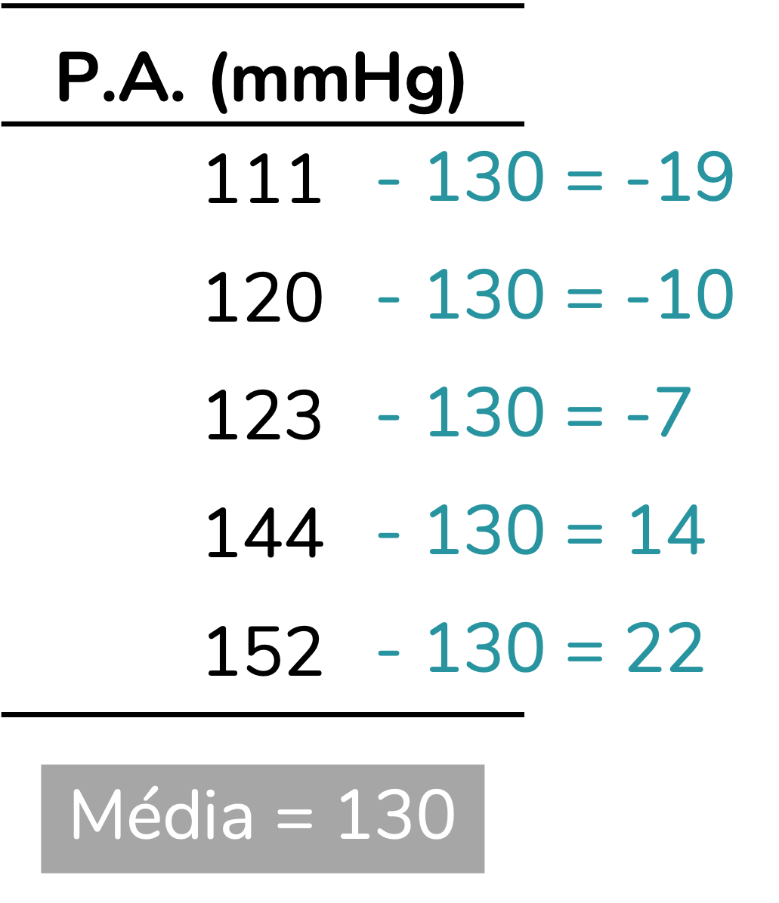
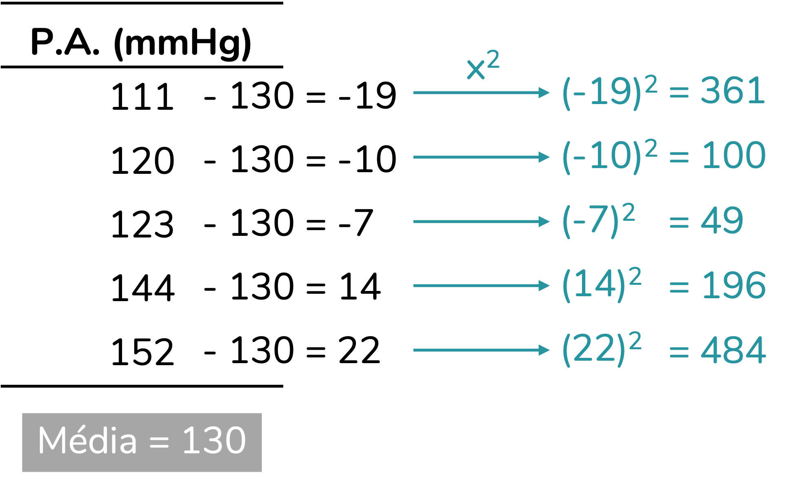
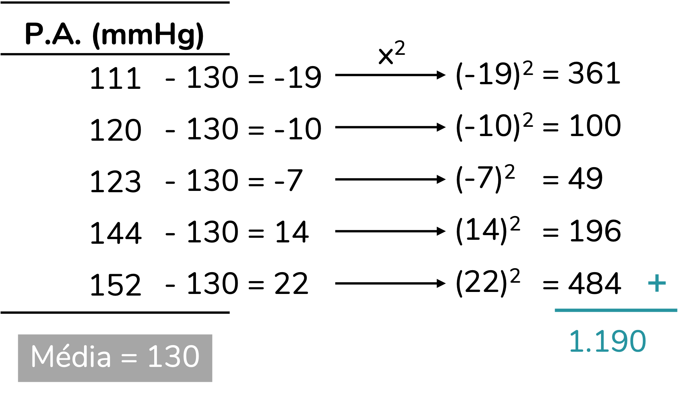
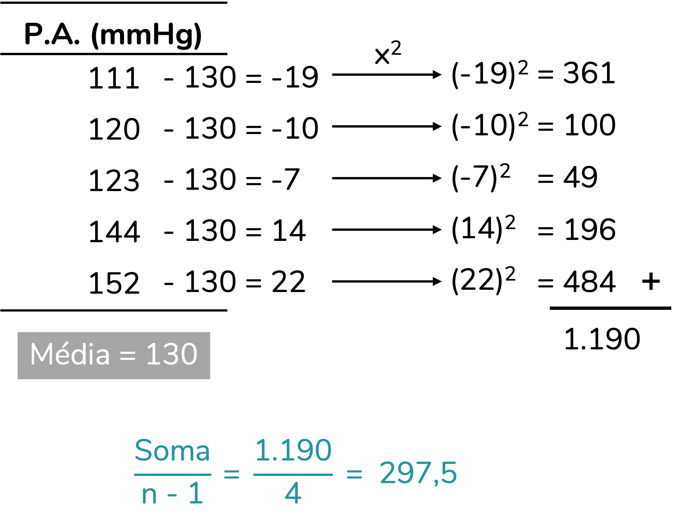
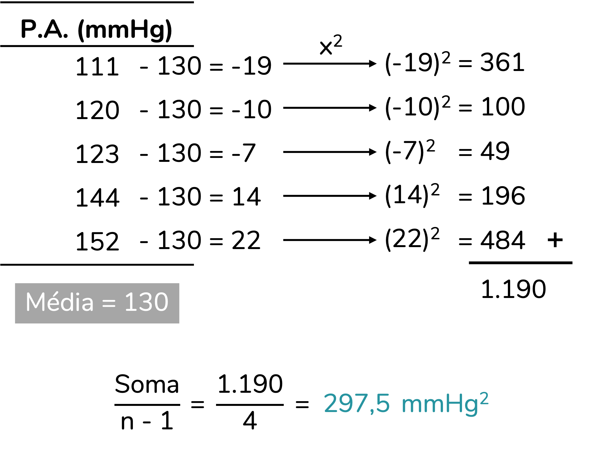
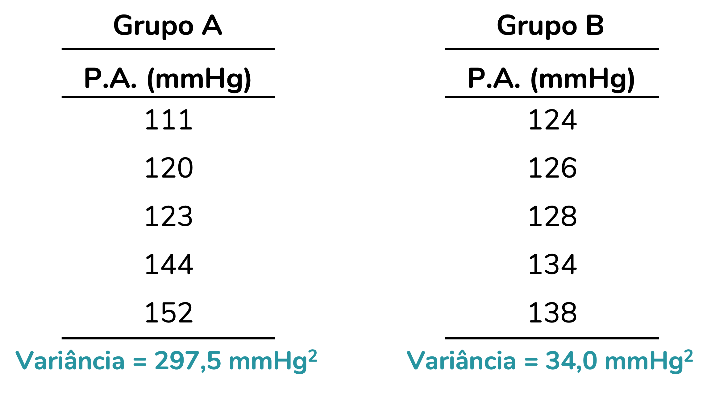
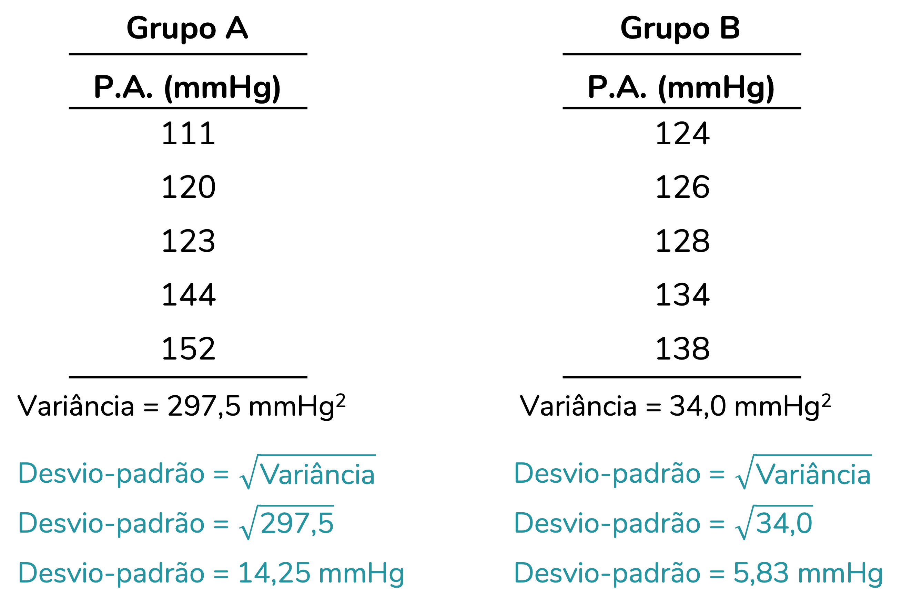
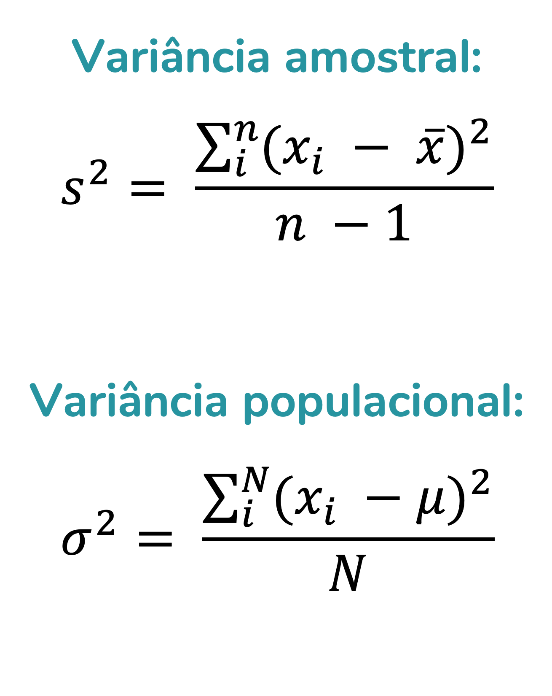
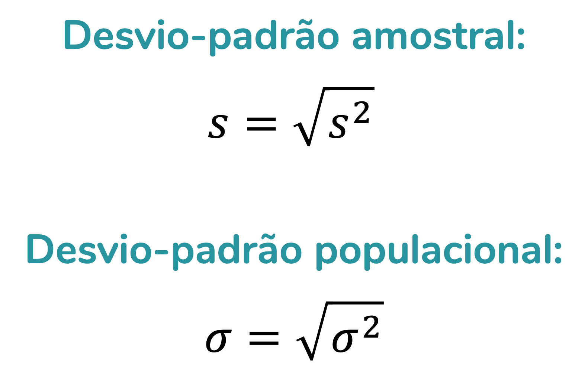

```{r, include=FALSE}
# knitr::opts_knit$set(upload.fun = knitr::imgur_upload, base.url = NULL)
knitr::opts_chunk$set(fig.width = 4, fig.height = 3.3, cache = FALSE,
                      fig.align = "center")
library(tidyverse)
library(ggpubr)
```
   
   
#### Por que você deveria se preocupar com a variação dos dados?
   
   
As medidas de tendência central, como a média, a moda e a mediana, são usadas para resumir um conjunto de dados. No entanto, na maior parte dos casos, é importante medirmos também a variação dos dados. Isso porque, ao olharmos apenas para uma medida resumo (como a média), podemos perder informações relevantes à nossa pergunta experimental.  
  
  
> Esse é um conteúdo que eu já gravei para o meu canal no YouTube. Caso prefira aprender em um vídeo, o link está [aqui](https://youtu.be/A-N-eEB1owQ?si=QKzPxN_KHv2KgzrP).
  
  
Imagine a seguinte situação: você tem dois grupos, um recebendo placebo e outro recebendo um anti-hipertensivo novo no mercado. Você, então, administra o medicamento aos pacientes de cada grupo, afere a pressão arterial de cada um deles e monta um gráfico com as médias de pressão em cada grupo:  
  
  
```{r, echo=FALSE, fig.cap="Gráfico de barras para as médias de pressão arterial sistólica (mmHg) dos grupos Placebo e Anti-hipertensivo. N = 20."}
set.seed(4321)
dados <- as.data.frame(list(Grupo = c(rep("Placebo", 10),
                                      rep("Anti-hipertensivo", 10)),
                            PA = c(rnorm(10, mean = 160, sd = 8),
                                   rnorm(10, mean = 130, sd = 25)))) |> 
  mutate(Grupo = factor(Grupo, levels = c("Placebo", "Anti-hipertensivo")))

ggplot(dados, aes(x = Grupo, y = PA)) +
  geom_bar(stat = "summary", fun = "mean", fill = "grey65", width = 0.7) +
  labs(y = "Pressão arterial sistólica\n(mmHg)") +
  scale_y_continuous(expand = expansion(mult = c(0, 0.05))) +
  theme_classic() +
  theme(text = element_text(family = "Nunito", size = 13))
```
  
  
Ótimo, o grupo que tomou anti-hipertensivo apresentou uma média de pressão arterial sistólica inferior à do grupo que tomou placebo. Mas... Será que **investigar a média basta**? Vamos olhar para esses dados com mais detalhes? No gráfico abaixo, o traço em preto representa a média e os círculos em amarelo correspondem à pressão arterial de cada participante.  
  
  
```{r, echo=FALSE, fig.cap="Gráfico de dispersão para a pressão arterial sistólica (mmHg) de acordo com o grupo. As linhas horizontais correspondem à média aritmética do grupo. N = 20."}
ggplot(dados, aes(x = Grupo, y = PA)) +
  geom_point(color = "#E28C27", alpha = 0.6) +
  geom_crossbar(stat = "summary", fun = "mean", fatten = 1, width = 0.4) +
  # geom_errorbar(stat = "summary", fun.data = "mean_sd", width = 0.15) +
  labs(y = "Pressão arterial sistólica\n(mmHg)") +
  theme_classic() +
  theme(text = element_text(family = "Nunito", size = 13))
```
  
  
> Vou chamar sua atenção para uma coisa: a escala do gráfico acima é diferente da escala do primeiro gráfico. Isso porque em gráficos de barras é obrigatório que o eixo y inicie em zero (tenho uma discussão sobre isso [aqui](https://www.instagram.com/p/CUFncUBgWai/?utm_source=ig_web_copy_link&igsh=MzRlODBiNWFlZA==)). Em gráficos de dispersão, nosso eixo y pode iniciar em um ponto diferente de zero, para facilitar a visualização dos dados. Aqui, ele inicia em 90.
  
Perceba uma coisa: ainda que a média tenha reduzido no grupo anti-hipertensivo, as pessoas desse grupo apresentam pressões arteriais **muito diferentes** entre si. Para algumas pessoas (os pontos amarelos mais altos), a pressão não baixou. Para outras (os pontos amarelos mais baixos), a pressão ficou bem baixa após a ingestão do medicamento. Ou seja, o efeito do anti-hipertensivo está **variando muito**. Essa variação (dispersão) é visível. Mas... Será que temos como **quantificá-la**? A resposta é sim.  
  
  
  
#### A variância
  
  
Esse é um ponto do post em que eu poderia simplesmente te mostrar a **fórmula** para o cálculo da **variância**, uma das medidas que quantifica a variação dos dados. Mas eu não acho essa fórmula muito intuitiva, pelo menos não em um primeiro contato. O que eu vou fazer aqui é calcular a variância usando a lógica - mas, não se preocupe, eu vou seguir exatamente os mesmos passos da fórmula.  
  
  
Vamos primeiro pensar no nosso objetivo: medir a variação dos dados. Para medir essa variação, a gente precisa ter um referencial. Nesse caso, eu quero medir a variação dos dados em relação à **média**. Ou seja, eu quero avaliar o quão distantes as pressões de cada participante estão da média do seu grupo. Esse é um cálculo bem simples, que você aprendeu na primeira ou segunda série. Sim, vamos fazer uma **subtração**.  
  
  
Para simplificar o nosso cálculo, eu vou trabalhar com um único grupo de apenas cinco pessoas. O **primeiro passo**, como conversamos, será subtrair de cada valor a média do grupo:  
  

```{r, echo=FALSE, fig.align='center', out.width = '185px'}

```
  
  
Essas diferenças que calculamos podem ser chamadas de **resíduos**. Mas, veja, nós não queremos saber o quanto **cada pessoa** difere da média. Queremos saber o quanto **o grupo**, como um todo, está variando em relação à média. Ainda não temos essa informação. Uma possibilidade -- que você também aprendeu na primeira série -- seria somar essas diferenças, para uni-las. No entanto, perceba que temos valores negativos e positivos e que **a soma seria zero**. Como unir esses valores sem "cancelá-los"?  
  
  
Uma possibilidade seria trabalharmos com o módulo (ou seja, o valor absoluto, desconsiderando o sinal) desses valores. Isso funcionaria. Mas não foi essa a estratégia utilizada no cálculo da variância. Para o cálculo da variância, a estratégia escolhida foi **elevar essas diferenças ao quadrado**. Lembre-se que elevar um número ao quadrado é o mesmo que multiplicá-lo por ele mesmo. E você aprendeu na sua trajetória escolar que, na multiplicação, positivo com positivo dá positivo e negativo com negativo dá positivo. Ou seja, quando elevamos um número positivo ao quadrado, ele segue sendo positivo. Quando elevamos um número negativo ao quadrado, ele passa a ser positivo. Pronto, resolvemos o nosso problema dos sinais. A vantagem de trabalharmos com o quadrado ao invés do módulo é dar mais peso a valores mais distantes da média.  
  
  
```{r, echo=FALSE, fig.align='center', out.width = '350px'}

```
  
  
Pronto! Agora podemos unir (somar) esses valores para saber a variação total do grupo em relação à média:  
  
  
```{r, echo=FALSE, fig.align='center', out.width = '370px'}

```
  
  
A soma dá 1.190. Mas, temos que pensar em mais uma coisa: essa soma é influenciada pela quantidade de pessoas incluídas no grupo. Quanto maior for esse grupo, maior será a soma. Portanto, faria sentido dividir essa soma pela quantidade de pessoas incluídas no cálculo.  
  
  
Mas aqui o cálculo vai depender do nosso delineamento. Se estamos estudando uma **população**, iremos dividir essa soma por N, sendo N o tamanho da população. Se estamos estudando uma **amostra**, dividiremos a soma por n-1, sendo n o tamanho da amostra. Esse "menos 1" é uma forma de sermos mais rígidos com o cálculo por estarmos trabalhando com uma amostra, e não com toda a população. O n-1, nesse contexto, pode ser chamado de grau de liberdade.  
  
  
> Explicar a diferença entre população e amostra está fora do escopo deste post. Mas eu tenho uma explicação bem detalhada [aqui](https://fernandafperes.com.br/blog/intervalo-de-confianca/).
  
  
No nosso exemplo, vou assumir que estamos trabalhando com uma amostra. Portanto, vou dividir a soma por n-1. Como havia 5 pessoas na amostra, nosso n = 5. Logo, dividirei a soma por 4:  
  
  
```{r, echo=FALSE, fig.align='center', out.width = '370px'}

```
  
  
Esse valor de 297,5 é uma medida de variação chamada **variância**. Sim, acabamos de calcular manualmente a variância dessa amostra.  
  
  
Quero chamar a sua atenção com relação a mais uma coisa: ok, a variância é 297,5. Mas é 297,5 o que? Começamos com pressões arteriais que estavam em mmHg. Podemos pensar que chegamos a uma medida de 297,5 mmHg. Mas, esse pensamento está **errado**. Quando elevamos os valores ao quadrado, no meio da nossa conta, acabamos elevando ao quadrado também a nossa **unidade de medida**. Portanto, a nossa variância é de 297,5 mmHg²:  
  
  
```{r, echo=FALSE, fig.align='center', out.width = '370px'}

```
  
  
Você pode ter pensado "poxa, não sei como interpretar essa unidade de medida ao quadrado". A boa notícia é: nem você, nem ninguém. Por ter a unidade de medida elevada ao quadrado, a variância não é **diretamente interpretável**. A única interpretação que conseguimos fazer é: quanto maior a variância, mais os dados estão variando em relação à média.  
  
  
Observe os dois grupos abaixo, que apresentam a mesma média, 130 mmHg. É visível que o grupo A varia mais em relação à média. A variância confirma essa nossa percepção: o grupo A apresenta uma variância bem maior que a do grupo B, indicando que as pressões no grupo A variam mais em relação à média.  
  
  
```{r, echo=FALSE, fig.align='center', out.width = '370px'}

```
  
  
Ok, já entendemos que o "ao quadrado" complica a interpretação. Você pode estar se perguntando: "mas não temos como nos livrar dele?". A resposta, de novo, está na matemática que você aprendeu na escola: para nos livrarmos de um "ao quadrado", tiramos a raiz quadrada. Esse é exatamente o cálculo de outra medida de variação, mais famosa que a variância por sua interpretabilidade: **o desvio-padrão**.  
  
  
  
#### O desvio-padrão
  
  
O desvio-padrão, como eu já te adiantei, consiste na raiz quadrada da variância. Ao calcularmos a raiz quadrada da variância amostral, obtemos o desvio-padrão amostral. Se calcularmos a raiz quadrada da variância populacional, obtemos o desvio-padrão populacional. A vantagem do desvio-padrão é que, ao tirarmos a raiz quadrada, chegamos à unidade de medida original, o que facilita a nossa interpretação. Veja como ficaria o desvio-padrão para os grupos A e B:  
  
  
```{r, echo=FALSE, fig.align='center', out.width = '470px'}

```
  
  
Perceba que a **interpretação** que discutimos para a variância se mantém: quanto maior o desvio-padrão, mais os dados variam em relação à média. Mas agora, como temos uma medida de variação na unidade de medida original (mmHg), podemos ir além e dizer que as pressões arteriais no grupo A variam, em média, 14,25 mmHg para mais ou para menos, em relação à média. É isso que torna o desvio-padrão o grande queridinho quando se trata de medidas de variação em relação à média, a sua interpretabilidade.  
  
  
  
#### Adicionando o desvio-padrão ao gráfico
  
  
Em geral representamos o desvio-padrão em gráficos como uma barra de erros. Para isso fazer sentido, vou criar um gráfico com os dados dos grupos A e B acima, ok?  
  
  
```{r, echo=FALSE, fig.cap="Gráfico de dispersão para a pressão arterial sistólica (mmHg) de acordo com o grupo. As linhas horizontais correspondem à média aritmética do grupo. As barras de erro correspondem ao desvio-padrão. N = 10."}
dados_grupos <- as.data.frame(list(Grupo = c(rep("Grupo A", 5),
                                             rep("Grupo B", 5)),
                                   PA = c(111,120,123,144,152,
                                          124,126,128,134,138))) |> 
  mutate(Grupo = factor(Grupo, levels = c("Grupo A", "Grupo B")))

ggplot(dados_grupos, aes(x = Grupo, y = PA)) +
  geom_point(color = "#E28C27", alpha = 0.6) +
  geom_crossbar(stat = "summary", fun = "mean", fatten = 1, width = 0.4) +
  geom_errorbar(stat = "summary", fun.data = "mean_sd", width = 0.15) +
  labs(y = "Pressão arterial sistólica\n(mmHg)") +
  theme_classic() +
  theme(text = element_text(family = "Nunito", size = 13))
```
  
  
Perceba que, apesar de os dois grupos terem a mesma média (barra horizontal na mesma altura), o grupo A apresenta um desvio-padrão bem maior. A barra de erros (T para cima e para baixo) do grupo A tem um tamanho de 14,25 mmHg (o desvio-padrão desse grupo) para cima e para baixo. Já a barra de erros do grupo B tem um tamanho de apenas 5,83 mmHg para cima e para baixo, uma vez que esse é o desvio-padrão desse grupo.  
  
    
  
#### Símbolos usados para variância e desvio-padrão
  
  
Variância e desvio-padrão são medidas chamadas de **medidas de dispersão** -- afinal, avaliam o quão dispersos os dados estão em relação à média. A variância amostral é representada por um "s" ao quadrado. Já a variância populacional é representada pela letra grega sigma minúscula (σ) também ao quadrado. O desvio-padrão, por sua vez, segue essa mesma representação, mas sem o "ao quadrado". O quadro abaixo resume essas representações:  
  
  
```{r, echo=FALSE, fig.align='center', out.width = '380px'}

```
  
  
  
#### Mas, e a fórmula?
  
  
Eu desenvolvi essa explicação que você acabou de ler há uns bons anos, quando precisei explicar desvio-padrão no cursinho comunitário em que eu era professora. Desde então já expliquei variância e desvio-padrão dessa forma para várias turmas de graduação e pós-graduação. E em todas essas turmas sempre surgia um aluno indignado com a quantidade de passos e querendo apenas "aplicar a fórmula". Eu entendo. Vamos à fórmula, então.  
  
  
```{r, echo=FALSE, fig.align='center', out.width = '230px'}

```
  
  
Vamos entender primeiro a fórmula da variância amostral (s²). O numerador (parte de cima) dessa fórmula está nos dizendo para calcular a somatória ($\sum$) dos seguintes resultados: cada valor ($x_i$), menos a média da amostra ($\bar{x}$), elevado ao quadrado. O denominador nos diz para dividir esse resultado pelo tamanho da amostra (n) menos 1. Note que, para aplicar a fórmula, precisamos seguir exatamente os mesmos passos do post.  
  
  
A fórmula da variância populacional (σ²) é praticamente idêntica, traz apenas uma mudança no denominador. O numerador nos diz para calcular a somatória ($\sum$) dos seguintes resultados: cada valor ($x_i$), menos a média da população (μ), elevado ao quadrado. O denominador nos diz para dividir essa soma pelo tamanho da população (N). Ou seja, mesmos passos, mas agora, como estamos trabalhando com uma população, não há o "menos 1" no denominador.   
   
   
Já as fórmulas dos desvios-padrão são simples: correspondem à raiz quadrada da variância. Perceba que não temos como calcular manualmente o desvio-padrão sem realizar o cálculo da variância.  
  
  
```{r, echo=FALSE, fig.align='center', out.width = '250px'}

```
  
  
  
#### Dá sempre esse trabalho calcular a variância e o desvio-padrão?

Aqui calculamos a variância e o desvio-padrão à mão. Eu sempre brinco com os alunos que calcular o desvio-padrão à mão constroi caráter. E, de fato, eu acho esse um passo fundamental para entender o que, afinal, é o desvio-padrão. Se ele aparece magicamente na sua tela ao digitar um comando, é bem difícil você entender qual o seu propósito.  
  
  
Mas, Fernanda, então você está me dizendo que tem como o desvio-padrão aparecer magicamente na minha tela? Sim! Podemos calculá-lo no Excel, no R ou em qualquer programa de estatística. A tabela abaixo resume as fórmulas usadas no Excel e no R para esse cálculo. No R, as funções calculam apenas a versão amostral (que é a mais utilizada). Para calcular as versões populacionais precisamos criar uma função personalizada, ou partir para algum pacote.   
  
  
```{r, echo=FALSE, fig.align='center', out.width = '500px'}

```
  
  
Vou aproveitar para incluir aqui um glossário. Em inglês, variância é **variance**. Já desvio-padrão é **standard deviation**. Por isso a fórmula em R para o desvio-padrão é `sd()`.  
  
  
  
#### A média não é tudo nessa vida
  

Para encerrar esse post (aliás, se ele foi útil, me conta nos comentários?) eu preciso te lembrar que nem sempre a média é a medida-resumo mais adequada a um conjunto de dados. A média é uma medida bem sensível a valores discrepantes (que chamamos em inglês de *outliers*). Lembre-se que variância e desvio-padrão são medidas de dispersão baseadas na média. Portanto, se a média não for uma representação adequada daquele conjunto de dados, a variância e o desvio-padrão também não o serão. Uma possibilidade nesses casos é calcular a amplitude interquartil, que eu discuto em detalhes [aqui](https://fernandafperes.com.br/blog/interpretacao-boxplot/).

  
  
#### Como citar esse post, nas normas da ABNT
  
  
> PERES, Fernanda F. **O que é variância? E desvio-padrão?**. Blog Fernanda Peres, São Paulo, 03 jan. 2025. Disponível em: https://fernandafperes.com.br/blog/variancia-desvio-padrao/.
  
  
<br>

*** 
  

