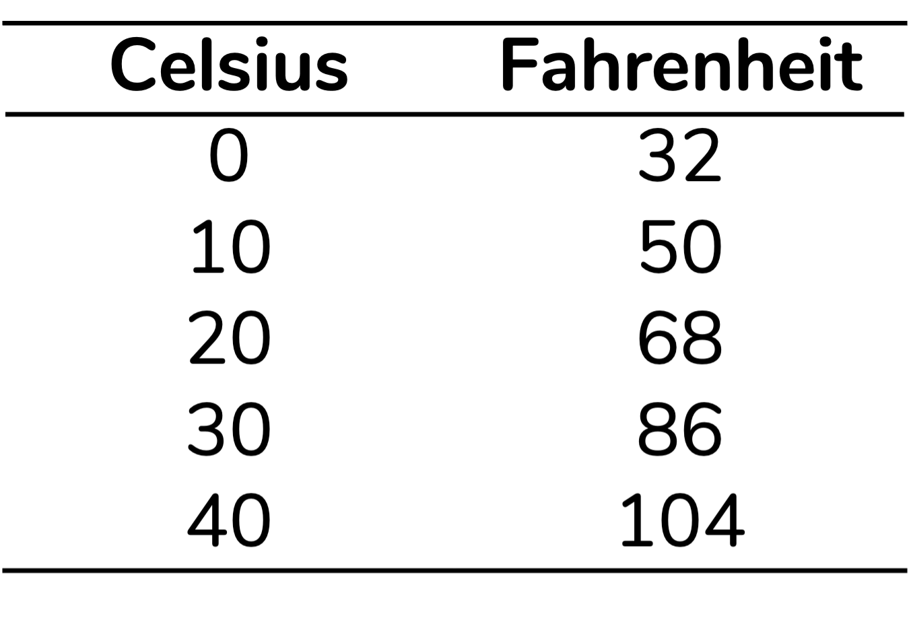

```{r, include=FALSE}
# knitr::opts_knit$set(upload.fun = knitr::imgur_upload, base.url = NULL)
knitr::opts_chunk$set(fig.width = 4, fig.height = 3.3, cache = FALSE,
                      fig.align = "center")
library(tidyverse)
library(ggpubr)
fstatix::paleta_f()
```
   
   
> Antes de você iniciar a leitura, eu preciso te dar um *spoiler*: o coeficiente de variação, tema deste post, é calculado a partir da média e do desvio-padrão. O texto vai assumir que você tem familiaridade com o conceito de desvio-padrão. Se não for o seu caso, recomendo que você leia antes [o post que explica o que é e como interpretar o desvio-padrão](https://fernandafperes.com.br/blog/variancia-desvio-padrao/), combinado?
   
   
#### Um breve resumo sobre variância e desvio-padrão
   
No post anterior, sobre variância e desvio-padrão, nós discutimos que:

1. Variância e desvio-padrão são **medidas de dispersão** que quantificam o quão dispersos os dados estão **em relação à média**
2. Quanto **maior** a variância ou o desvio-padrão, **mais dispersos** estão os dados – ou seja, mais eles variam
3. A unidade de medida da variância é a unidade original **elevada ao quadrado**, o que a torna uma medida muito mais **difícil de interpretar** que o desvio-padrão, que está na unidade de medida **original**
  
Hoje vamos conversar sobre uma outra medida de dispersão, o **coeficiente de variação**. Mas, para esse coeficiente fazer sentido, vou partir de um **exemplo** -- um exemplo um pouco estranho, mas vou te pedir para confiar na minha construção de raciocínio, ok?  
  
  
#### O que varia mais? A altura de mulheres ou de gatos domésticos?
  
Vamos imaginar que estamos interessados em comparar as variações nas alturas de mulheres e de gatos. Para isso, aferimos as alturas de duas amostras: uma composta por 10 mulheres e outra composta por 10 gatos. As alturas que encontramos estão detalhadas a seguir:  
  
```{r, echo=FALSE, fig.align='center', out.width = '280px'}

```
  
  
Se estamos interessados na variação dos dados, podemos calcular o desvio-padrão para cada uma dessas amostras, seguindo exatamente os passos que discutimos no [post anterior](https://fernandafperes.com.br/blog/variancia-desvio-padrao/). Claro, poderíamos também calcular a variância, mas aqui vou focar no desvio-padrão por ser uma medida mais interpretável. As médias e desvios-padrão para cada uma dessas amostras estão representados abaixo:  
  
```{r, echo=FALSE, fig.align='center', out.width = '350px'}

```
  
O desvio-padrão calculado nos indica que as alturas das mulheres estão variando, em média, 8,5 cm para mais ou para menos, em relação à média da amostra, que é 161,2 cm. Já as alturas dos gatos estão variando 6,0 cm, para mais ou para menos, em relação à sua média de 26,2 cm.  
  
Podemos, agora, voltar à pergunta que abriu esse tópico: quais alturas **variam mais** em relação à média? As de mulheres ou as de gatos?  
  
Perceba que os desvios-padrão estão na mesma unidade de medida (cm). Portanto, uma possibilidade seria **compará-los**. Como o desvio-padrão para mulheres é maior, podemos dizer que as alturas das mulheres variam mais em relação à média do que as alturas dos gatos.  
  
Mas você pode estar pensando: poxa, mas variar 6 cm em relação a 26,2 cm parece uma **variação muito maior** do que variar 8,5 cm em relação a 161,2 cm! E você tem razão nesse raciocínio.  
  
  
#### Visualizando a variação nas duas amostras
  
Para entender isso melhor, vamos visualizar essa variação. Nos dois gráficos abaixo, a barra central se refere à média de altura daquela amostra (mulheres no gráfico à esquerda e gatos à direita), a barra à esquerda corresponde à média menos um desvio-padrão (DP) e a barra à direita corresponde à média mais um DP.  
  
```{r, echo=FALSE, message=FALSE, fig.width=4.8, fig.height=2.5, out.width = '500px'}
dados <- as.data.frame(list(alturas = c(161.2-8.5, 161.2, 161.2+8.5,
                                        26.2-6, 26.2, 26.2+6),
                            id = c("Média - DP", "Média", "Média + DP",
                                   "Média - DP", "Média", "Média + DP"),
                            especie = c(rep("Mulheres", 3),
                                        rep("Gatos", 3))))

dados$id <- factor(dados$id, levels = c("Média - DP", "Média", "Média + DP"))
dados$especie <- factor(dados$especie, levels = c("Mulheres", "Gatos"))

ggplot(dados, aes(x = id, y = alturas)) +
  geom_bar(stat = "identity", fill = roxo,
           width = 0.6) +
  labs(y = "Altura (cm)", x = NULL) +
  facet_wrap(~ especie, scales = "free_y") +
  theme_minimal() +
  theme(text = element_text(family = "Nunito"),
        panel.grid.major.x = element_blank(),
        panel.grid.minor.x = element_blank(),
        axis.title.y = element_text(size = 10),
        axis.text.x = element_text(size = 9, color = "black",
                                   margin = margin(-5,0,0,0)),
        panel.spacing = unit(2, "lines"))
```


Perceba como o desvio-padrão das alturas das mulheres corresponde a uma variação muito menor – **em termos relativos** – que o desvio-padrão das alturas dos gatos. Tá, mas como avaliar essa variação em termos relativos? Uma das formas é pensarmos **percentualmente**.  
  
  
#### Calculando e interpretando o coeficiente de variação
  
A lógica aqui é pensar: o desvio-padrão calculado corresponde a **quantos porcento** da média? Por exemplo, se a média for 20 cm e o desvio-padrão for 10 cm, então o desvio-padrão é metade da média. O que significa dizer que o desvio-padrão é **50% da média** (1/2 = 0,5 = 50%).  
  
O coeficiente de variação (CV) faz **exatamente esse cálculo**. Para calcularmos o CV, devemos dividir o desvio-padrão pela média. Além disso, geralmente multiplicamos esse resultado por 100, para facilitar a sua interpretação como porcentagem.  
  

```{r, echo=FALSE, fig.align='center', out.width = '235px'}

```
  
  
Vamos aplicar esse cálculo às nossas amostras, e interpretar o coeficiente de variação (CV) obtido. Para mulheres, o cálculo será:  
  
```{r, echo=FALSE, fig.align='center', out.width = '270px'}

```
  
  
Já para gatos, o cálculo do coeficiente de variação (CV) resultará em...  
  
```{r, echo=FALSE, fig.align='center', out.width = '240px'}

```
  
  
Ok, vamos agora interpretar esse resultados:  
  
```{r, echo=FALSE, fig.align='center', out.width = '310px'}

```
  
O coeficiente de variação nos indica que as alturas das mulheres estão variando, em média, **5,3%** em relação à média. Já as alturas dos gatos variam **22,9%** em relação à sua média. Portanto, se pensarmos em termos **relativos** – isso é, percentualmente – as alturas dos gatos **variam mais**.  
  
#### Quando faz sentido usar o coeficiente de variação?
  
Como conversamos, o coeficiente de variação fornece uma informação sobre a variação dos dados em termos relativos, percentuais. Um coeficiente de variação de 10%, por exemplo, indica que o desvio-padrão corresponde a 10% da média. Mas, você pode estar se perguntando: em quais situações faz sentido calcular o coeficiente de variação? Bom, a resposta óbvia é: quando o seu interesse é avaliar essa variação em termos relativos. Mas vou detalhar duas situações nas quais esse tende a ser o nosso interesse.  
  
  
##### Quando os grupos apresentam médias muito diferentes
  
O exemplo de comparar as alturas de mulheres e gatos não está aqui por acaso. Perceba que são grupos com médias de altura **muito diferentes**. A média de altura das mulheres é mais de seis vezes a média de altura dos gatos. Por isso, soa estranho, até "injusto", comparar os desvios-padrão -- ou seja, comparar uma medida absoluta de variação. O coeficiente de variação resolve esse problema ao permitir que a gente compare o quanto cada grupo está variando usando a média desse grupo como "escala".  
  
Então, um dos principais uso do coeficiente de variação é na comparação de grupos com médias muito diferentes.  
  
  
##### Quando queremos comparar desvios-padrão que estão em unidades de medida diferentes
  
Perceba que o coeficiente de variação (CV) é uma medida de dispersão **adimensional**, isso é, **sem unidade de medida**. Isso porque, ao calcularmos o CV, dividimos o desvio-padrão pela média. E, lembre-se, o desvio-padrão e a média estão na mesma unidade de medida. Ao dividirmos um pelo outro, essas unidades "se cancelam".  
  
```{r, echo=FALSE, fig.align='center', out.width = '190px'}

```
  
Já discutimos como o coeficiente de variação é uma medida útil para compararmos a dispersão de grupos com médias muito diferentes, ainda que na mesma unidade de medida (como as alturas de mulheres em gatos, ambas em cm). Mas, por ser adimensional, o coeficiente de variação é também uma excelente forma de compararmos dispersões quando temos dados em **unidades de medida diferentes**.  

  
#### Alguns cuidados!
  
  
##### O coeficiente de variação não é adequado para algumas variáveis  
  
Muiros autores dirão que o coeficiente de variação só pode ser calculado para variáveis de razão, que apresentam um zero absoluto [@favero2017manual; @abdi2010coefficient; @santos2021note]. Ok, mas o que isso significa?  
  
Podemos dividir as variáveis numéricas em variáveis de **intervalo** e variáveis de **razão** [@favero2017manual]. A diferença entre elas é que apenas as variáveis de razão apresentam um **zero absoluto**. Para isso fazer sentido, vamos pensar em temperaturas. Se aferimos uma temperatura em graus Celsius (°C), o zero (0°C) não indica ausência de temperatura. A escolha do zero é arbitrária. Por isso, a temperatura em **Celsius** está em uma escala **intervalar**. O mesmo vale para a temperatura em **Fahrenheit** (°F): há um zero arbitrário, que não indica ausência de temperatura. Portanto, Fahrenheit também é uma escala **intervalar**. Por outro lado, a temperatura em **Kelvin** (K) apresenta um zero absoluto: 0K corresponde a ausência de temperatura. Logo, a temperatura em Kelvin está em uma escala de **razão**.  
  
<br />
A forma como interpretamos dados em escalas intervalares e de razão também é ligeiramente diferente. Se estamos trabalhando com uma escala de **razão**, como Kelvin, em que há um zero absoluto, podemos dizer que:  

  - A diferença de temperatura entre 10K e 20K é a mesma que entre 35K e 45K, por exemplo
  - A temperatura 20K é o **dobro** da temperatura 10K
  
<br />
Se estamos falando de um dado medido em uma escala intervalar, a primeira frase se mantém, mas a segunda não. Por exemplo, para graus Celsius podemos dizer que:  

  - A diferença de temperatura entre 10°C e 20°C é a mesma que entre 35°C e 45°C  
  
Mas, **não podemos dizer** que 20°C é o dobro da temperatura 10°C. Isso porque como não há um zero absoluto, não podemos dizer que um intervalo específico é multiplo de outro [@favero2017manual].
  
<br />
Em geral, as análises e estatísticas descritivas que usamos para variáveis intervalares e de razão são as mesmas. Mas, o coeficiente de variação é uma **exceção**. Esse coeficiente deveria ser calculado **apenas para dados em escala de razão**.  
  
Aqui preciso compartilhar que um exemplo que me fez enxergar o problema de usarmos dados intervalares para calcular o coeficiente de variação é o que consta na página sobre coefiente de variação da [Wikipedia](https://en.wikipedia.org/wiki/Coefficient_of_variation). Vou discutir uma versão simplificada aqui. Imagine que temos uma base de dados com cinco temperaturas em °C: 0, 10, 20, 30 e 40. Para representar essas mesmas temperaturas em Fahrenheit, devemos multiplicar cada valor em Celsius por 9/5 e então somar 32 ao resultado. Isso resulta nos valores representados na tabela abaixo:  
  
```{r, include=F}
dados <- as.data.frame(list(celsius = c(seq(0, 40, by = 10)))) |> 
                         mutate(fahrenheit = celsius*9/5+32)
```
  
```{r, echo=FALSE, fig.align='center', out.width = '200px'}

```
  
Se os dados são exatamente os mesmos, apenas em escalas diferentes, esperaríamos um mesmo coeficiente de variação, certo? Mas... Isso não acontece:  
  
```{r, echo=FALSE, fig.align='center', out.width = '335px'}

```
  
  
Além disso, alguns autores dirão que o coeficiente de variação pode ser utilizado apenas quando **todos** os valores do conjunto são **positivos** [@abdi2010coefficient]. Outros dirão que o coeficiente de variação pode ser calculado quando há valores negativos, mas apenas quando **todos** os valores do conjunto de dados são **negativos** [@santos2021note]. E, nesses casos, para calcular o coeficiente de variação devemos dividir o desvio-padrão pelo **módulo** -- isso é, pelo valor absoluto -- da média.  
  
Mas, há aqui um consenso: **não podemos usar** o coeficiente de variação quando o conjunto de dados inclui valores **positivos e negativos**. Isso porque, nessas situações, o cálculo do coeficiente de variação resulta em uma valor que não segue interpretação que discutimos aqui.  
  
  
   
##### A média não é tudo nessa vida
   
Já disse isso no post de desvio-padrão, e repito: nem sempre a média é a medida-resumo mais adequada a um conjunto de dados. A média é uma medida bem sensível a valores discrepantes (que chamamos em inglês de *outliers*). Lembre-se que o coeficiente de variação, assim como o desvio-padrão, é uma medida de dispersão **baseada na média**. Portanto, se a média não for uma representação adequada daquele conjunto de dados, o coeficiente de variação também não o será. Uma possibilidade nesses casos é calcular a amplitude interquartil, que eu discuto em detalhes [aqui](https://fernandafperes.com.br/blog/interpretacao-boxplot/).
  
  
  
  
#### Como citar esse post, nas normas da ABNT
  
  
> PERES, Fernanda F. **O que é um coeficiente de variação?**. Blog Fernanda Peres, São Paulo, 10 fev. 2025. Disponível em: https://fernandafperes.com.br/blog/coeficiente-de-variacao/.
  
  
<br />

*** 
  
  
### Referências  
  


