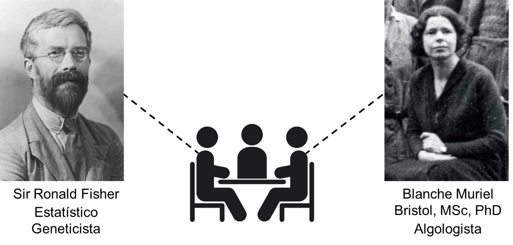
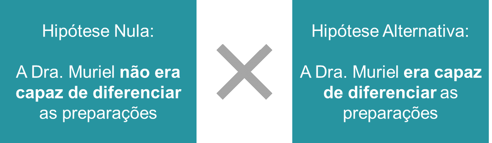
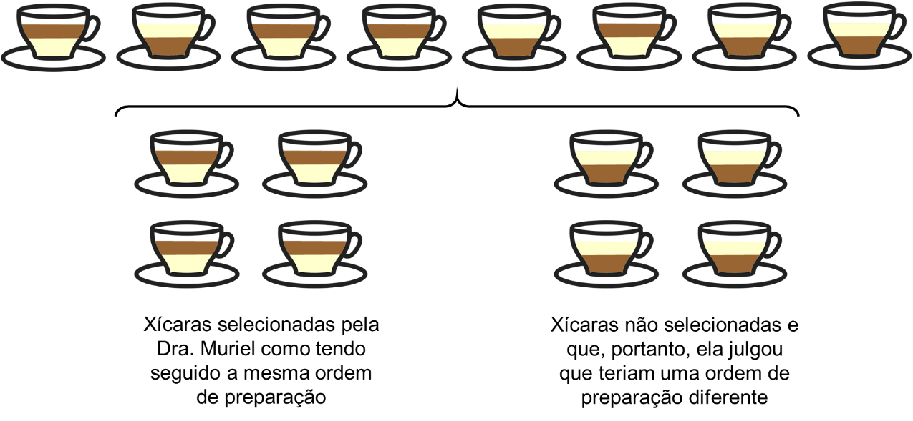
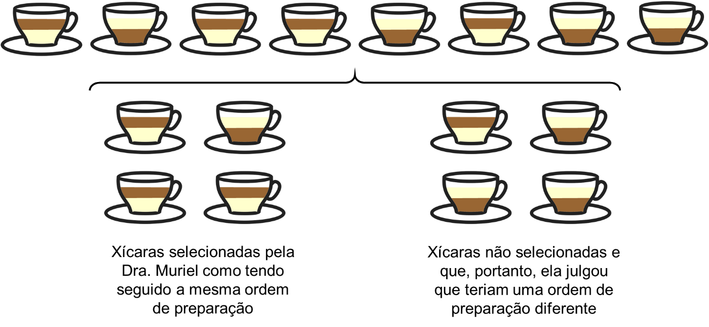

```{r, include=FALSE}
knitr::opts_knit$set(upload.fun = knitr::imgur_upload, base.url = NULL)
knitr::opts_chunk$set(fig.width = 5, fig.height = 5, cache = TRUE)
```
  
### Afinal, o que o valor de p – essa medida tão famosa e tão controversa – indica?
  
Na minha opinião, os conceitos de valor de p e nível de significância estão entre os mais confusos e desafiadores de explicar quando se trata de estatística. Eu comecei a usar a estatística como ferramenta para analisar os meus dados em 2010, mas considero que só fui entender de fato esses dois conceitos sete anos depois, em um curso dado pelo professor Marcus Vinícius C. Baldo no congresso da SBNeC (Sociedade Brasileira de Neurociências e Comportamento).  
A proposta desse post é explicar esses conceitos através da história da criação do teste de hipóteses, conhecida como "Uma senhora toma chá" (em inglês, *Lady tasting tea*).
  
> Esse post é inspirado em um vídeo publicado no meu canal do YouTube, que se tornou muito popular. Então, se você prefere consumir esse tipo de conteúdo em vídeo, clique [aqui](https://www.youtube.com/watch?v=kOUZw-wMmXU).
  
### O problema
  
Diz a lenda (e a biografia de Ronald Fisher) que, em uma tarde no final da década de 1920, três pesquisadores – dois homens e uma mulher – que trabalhavam na Estação experimental agrícola de Rothamsted, na Inglaterra, fizeram uma pausa para tomar chá. Como bons ingleses, esses três pesquisadores tomavam o seu chá com leite.
  
```{r, echo=FALSE, fig.align='center', out.width = '450px'}

```
<center><font size = '3'>Estação experimental agrícola de Rothamsted</font></center>
<br><br>  
   
  
Um dos homens adicionou leite à xícara, complementou-a com chá, mexeu o conteúdo e serviu-a à mulher. Ela educadamente recusou, dizendo que preferia quando o chá era adicionado antes do leite. Ele protestou, dizendo que a ordem não fazia diferença. Ela continuou insistindo que sentia diferença, e preferia quando o chá era adicionado antes.
  
```{r, echo=FALSE, fig.align='center', out.width = '150px'}

```
  
Se as pessoas envolvidas nessa história fossem outras, ela provavelmente teria acabado aqui. Mas, o homem em questão era Ronald Fisher, um estatístico e geneticista, que anos depois ganharia o título de Sir. Já a pesquisadora era Blanche Muriel Bristol, uma algologista que na época já possuía os títulos de mestre e doutora. Infelizmente, muitas informações sobre a Dra. Muriel se perderam com o tempo, mas sabe-se que uma espécie de alga recebeu o nome de C. *muriella* em homenagem a ela, indicando que ela contribuiu de forma significativa com a sua área.
  
```{r, echo=FALSE, fig.align='center', out.width = '500px'}

```
  
Ronald Fisher, sem acreditar que a Dra. Muriel seria capaz de diferenciar uma xícara com chá adicionado antes do leite de uma com o chá adicionado depois, propôs um experimento para testá-la.

### As hipóteses

Podemos pensar que o experimento permitia contrapor duas hipóteses:
* Hipótese 1: a Dra. Muriel, na realidade, **não era capaz de diferenciar** as preparações;
* Hipótese 2: a Dra. Muriel, na realidade, **era capaz de diferenciar** as preparações.

Para usar a terminologia que usamos hoje e facilitar o raciocínio, vamos chamar a primeira hipótese de “Hipótese nula (H<sub>0</sub>)” e a segunda hipótese, que se contrapõe à H<sub>0</sub> de “Hipótese alternativa (H<sub>1</sub>)”:
  
```{r, echo=FALSE, fig.align='center', out.width = '450px'}

```
  
### Ok, mas... E como testá-la?

Fisher poderia apresentar à Dra. Muriel apenas uma xícara, e pedir para que ela identificasse se o chá havia sido colocado antes ou após o leite. Mas, nesse caso, a probabilidade de ela acertar – ainda que não fosse capaz de diferenciar as preparações – seria de 50%. A mesma probabilidade valeria para caso a Dra. Muriel fosse apresentada a duas xícaras, sabendo que havia uma de cada tipo de preparação.
  
```{r, echo=FALSE, fig.align='center', out.width = '150px'}

```
  
Fisher acabou propondo um experimento no qual 8 xícaras seriam apresentadas à Dra. Muriel: 4 com o chá adicionado antes e 4 com o chá adicionado depois do leite. A ordem de apresentação dessas xícaras seria determinada de forma verdadeiramente aleatória, definida por uma moeda, de forma que não fosse possível prevê-la.  
Ao final, a Dra. Muriel – que tinha conhecimento de como o experimento havia sido delineado – teria que identificar quais quatro xícaras pertenciam a um mesmo tipo de preparação. Note que, se ela identificasse corretamente essas 4, isso significaria que ela acertou como foram preparadas todas as 8 xícaras.  
  
```{r, echo=FALSE, fig.align='center', out.width = '600px'}

```
  
Com experimento sendo delineado dessa forma, a probabilidade de a Dra. Muriel selecionar corretamente as quatro xícaras seria de 1 em 70, o que corresponde a:
$$\frac{1}{70} = 1,43%$$
  
> Entender como esse cálculo foi feito é totalmente dispensável à compreensão dos conceitos de valor de p e nível de significância, ok? Mas, se ficou curiosa(o), acompanhe o meu raciocínio abaixo. Se preferir, pode pular esse quadro e seguir a leitura.
De onde vêm os 70, do denominador da fração? Ele corresponde às possibilidades de selecionarmos um conjunto de 4 xícaras dentre as 8. Para calcular a quantidade de possibilidades, devemos usar a fórmula da combinação (aquela mesma, que você aprendeu no ensino médio):  
$$C_{(8, 4)} = \binom{8}{4} = \frac{8!}{4! \times 4!} = \frac{8 \times 7 \times 6 \times 5}{4 \times 3 \times 2 \times 1} = 70$$
Dentre todas essas combinações, há uma única que corresponde a acertar todas as xícaras. Logo, a probabilidade de uma pessoa selecionar corretamente as 4 xícaras com a mesma preparação é de 1 em 70.  
  
Agora vem a grande questão: se a Dra. Muriel acertasse todas as xícaras, você acreditaria que ela tem a capacidade de diferenciar as preparações? Considere que a probabilidade de isso acontecer sem que ela tivesse essa capacidade é de apenas 1,43%. Eu acreditaria nela, imagino que você também.
  
Mas, ainda que ela consiga diferenciar as preparações, é possível que ela erre uma das 4 xícaras selecionadas, concorda? Uma pode não ter sido mexida adequadamente, ou pode estar com uma proporção diferente de chá e leite...
  
```{r, echo=FALSE, fig.align='center', out.width = '600px'}

```
  
E nesse caso, você acreditaria nela? Vamos novamente calcular as probabilidades. A probabilidade de ela acertar pelo menos 3 xícaras (ou seja, acertar 3 ou acertar 4) é de 17 em 70, o que corresponde a:
$$\frac{17}{70} = 24,29%$$
  
> Novamente, se quiser saber como esse cálculo foi feito, acompanhe o raciocínio abaixo. Caso isso não seja do seu interesse, pule esse quadro.
Já sabemos que há 70 combinações possíveis de 4 xícaras em 8. Dessas, apenas um corresponde ao acerto de todas as xícaras. Vamos agora calcular quantas das 70 possibilidades correspondem a um acerto de 3 xícaras, das 4 selecionadas. Para isso, devemos fazer uma combinação de 3, 4 a 4 (ou seja, selecionar 3 xícaras dentre as 4 corretas) e uma combinação de 1, 4 a 4 (ou seja, selecionar uma xícara dentre as 4 incorretas). Como queremos selecionar 3 corretas **e** uma incorreta, devemos multiplicar esses resultados:
$$C_{(4, 3)} \times C_{(4, 1)}$$
$$\binom{4}{3} \times \binom{4}{1}$$
$$\frac{4!}{3! \times 1!} \times \frac{4!}{1! \times 3!}$$
$$4 \times 4 = 16$$
Logo, a probabilidade de acertar pelo menos 3 xícaras é de 17 (16 + 1) em 70.
  
Sabendo que a probabilidade de a Dra. Muriel acertar pelo menos 3 xícaras das selecionadas (ou seja, pelo menos 6 xícaras no total), sem saber diferenciar as preparações, é de 24,29%, você acreditaria na capacidade dela de diferenciação, caso ela acertasse seis xícaras? Imagino que a sua resposta tenha sido: “não!”. A minha também seria.
  
Nessa história, usamos os conceitos de valor de p e nível de significância, sem que tenhamos dado nome a eles. Vamos então defini-los, fazendo a relação com a história.  
  
### O valor de p
  
O valor de p corresponde à probabilidade de termos obtido aquele resultado, ou um resultado ainda mais extremo, dado que a hipótese nula é verdadeira.
  
É uma definição confusa, mas que faz mais sentido quando pensamos na história.
No caso, a nossa hipótese nula era a de que a Dra. Muriel, na realidade, **não era capaz de diferenciar** as preparações. Então, nós calculamos a probabilidade de ela acertar as 8 xícaras, considerando a hipótese nula verdadeira. O valor de probabilidade calculado (1,43%) corresponde ao nosso valor de p.  
Da mesma forma, calculamos a probabilidade de outro resultado, de ela acertar pelo menos 6 xícaras, novamente considerando que a hipótese nula era verdadeira. Obtivemos, então, outro valor de p, o de 24,29%.  
  
### E o nível de significância?
  
O nível de significância é o “ponto de corte” que nós estabelecemos para a rejeição da hipótese nula.
  
Eu te perguntei se você acreditaria na capacidade de diferenciação da Dra. Muriel, caso ela acertasse 8 xícaras. Sabendo que a probabilidade de ela acertar, sem ser capaz de diferenciar as preparações era de 1,43%, você me respondeu (eu imagino) que sim. Mas, quando eu te perguntei se você acreditaria nela caso ela tivesse acertado 6 xícaras – sabendo que a probabilidade desse resultado era de 24,29% - você optou por não acreditar.
  
Veja que para dar essas respostas, você estabeleceu um ponto de corte entre 1,43% e 24,29%, considerando que 1,43% era uma probabilidade baixa o suficiente para te convencer a rejeitar a hipótese nula, mas 24,29%, não. Esse ponto de corte corresponde ao seu nível de significância.
  
O padrão, na maior parte das áreas, é um nível de significância () de 5%.
  
Você também pode ser mais rígido, e estabelecer um nível de significância de 1%, por exemplo. Mas, nesse cenário, seria necessário delinear um experimento que incluísse mais xícaras, já que com 8 xícaras, ainda que a Dra. Muriel acertasse todas, ainda não teríamos evidências suficientes para rejeitar a hipótese nula.
  
### Tá, mas... Ela acertou?
  
Ronald Fisher publicou esse delineamento no seu livro “The design of experiments”, de 1935, sob o nome que o tornou famoso, “Lady tasting tea”. No livro, Fisher descreve o experimento como algo hipotético.  
  
Mas, há evidências de que isso realmente aconteceu, e a Dra. Muriel acertou todas as xícaras. Parece, de fato, haver uma diferença no sabor do chá, uma vez que o chá é adicionado à preparação quente, enquanto que o leite é adicionado a temperatura ambiente. De acordo com uma declaração de 2008 feita pela “Royal Society of Chemists”, há mais desnaturação das proteínas do leite quando esse é adicionado após o chá, o que altera o sabor. Relatos – infelizmente muito difíceis de comprovar – sugerem que a própria Muriel havia explicado ao Fisher que haveria diferenças na desnaturação proteica.  
  
Essa história é também contada no famoso livro “Uma senhora toma chá”, de autoria de David Salsburg. No entanto, David se refere à mulher como “uma esposa de um professor universitário”. Uma falha imperdoável para um livro cujo título se baseia nesse episódio. Dra. Muriel, uma mulher com uma carreira científica notável, ainda mais para a sua época, não pode ser apagada dessa história.  
  
<br>

<hr>

### Referências:

* Senn, S. (2012). Tea for three: of infusions and inferences and milk in first. Significance, 9(6), 30-33. [Acesso](https://rss.onlinelibrary.wiley.com/doi/full/10.1111/j.1740-9713.2012.00620.x)
* Salsburg, D. S. (2009). Uma senhora toma chá... como a estatística revolucionou a ciência no século XX. Rio de Janeiro: Zahar.  
  
<br><b><br>  
  

