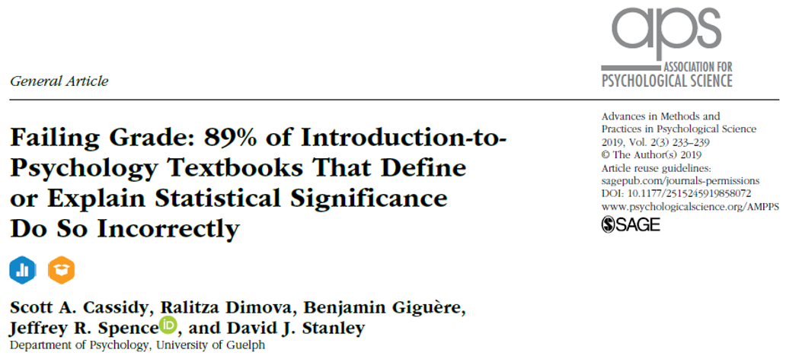
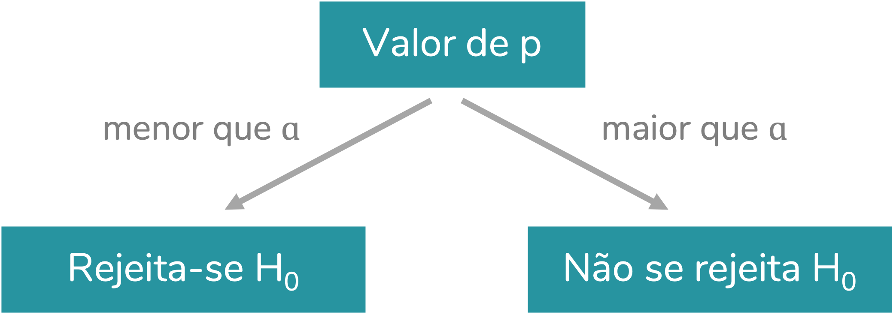
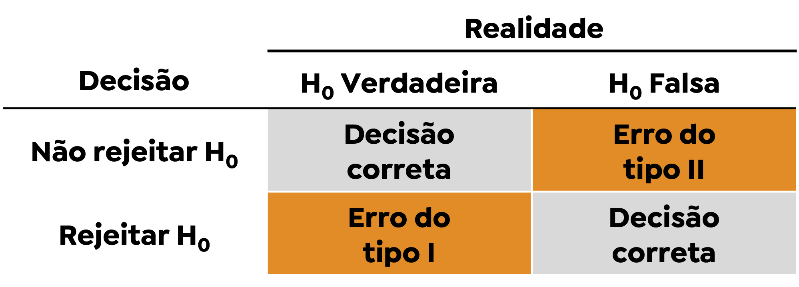

  
```{r, include=FALSE}
knitr::opts_knit$set(upload.fun = knitr::imgur_upload)
knitr::opts_chunk$set(fig.width = 5, fig.height = 5, cache = TRUE)
```
  
O valor de p está entre os conceitos de estatística mais difíceis de interpretar corretamente, na minha opinião. Mas, uma vez que tomamos decisões baseadas nele diariamente, não dá para fugir de entender exatamente o que ele significa e quais as suas limitações.  
  
Em dois posts anteriores, discuti a definição e interpretação corretas do valor de p. Para ler o post no qual eu defino valor de p e nível de significância no contexto do experimento "Uma senhora toma chá", clique [aqui](https://fernandafperes.com.br/blog/doutora-toma-cha/). Para ler a explicação do cálculo do valor de p quando realizamos um teste estatístico, como o teste-t para amostras independentes, clique [aqui](https://fernandafperes.com.br/blog/valor-de-p-calculo/).  
  
O objetivo desse post é discutir tudo aquilo que o valor de p **não** é: todas as interpretações equivocadas - mas muito comuns - associadas a ele.  
  
> Esse também é um conteúdo que eu já produzi em vídeo, no meu [canal no YouTube](https://youtube.com/c/FernandaPeres).  
Se prefere consumir esse tipo de conteúdo em vídeo, clique [aqui](https://youtu.be/lNLKfi51eEk).  
  
Nesse post, então, iremos discutir as **falácias** associadas ao valor de p.  
  
> **Falácia:**  
Qualquer enunciado ou raciocínio falso que aparente ser verdadeiro.  
Um raciocínio verossímil, porém inverídico.  
  
Ah, um aviso importante: eu não cunhei nenhuma dessas falácias. Todo o conteúdo discutido aqui é baseado no trabalho do Rex Kline[^1][^2] e em um curso de curta duração ministrado pelo Prof. Marcus Vinícius C. Baldo na reunião da SBNeC de 2018 [^3].

[^1]: Kline, R. B. (2015). Principles and practice of structural equation modeling. Guilford publications.  
[^2]: Kline, R. B. (2008). Becoming a behavioral science researcher: A guide to producing research that matters. Guilford Press.
[^3]: Curso “A abolição do valor de p: a hora e a vez de uma “nova estatística”?”, ministrado por Marcus Vinícius C. Baldo na XLI Reunião Anual da Sociedade Brasileira de Neurociências e Comportamento (SBNeC), 2018.  
  
Um artigo publicado em 2019[^4] investigou a forma como os principais livros-texto de introdução à psicologia explicam o conceito de valor de p. Os autores observaram que 89% desses livros traziam uma definição incorreta, fazendo uso de alguma falácia.  

[^4]: Cassidy, S. A., Dimova, R., Giguère, B., Spence, J. R., & Stanley, D. J. (2019). Failing grade: 89% of introduction-to-psychology textbooks that define or explain statistical significance do so incorrectly. Advances in Methods and Practices in Psychological Science, 2(3), 233-239.
  
```{r, echo=FALSE, fig.align='center', out.width = '500px'}

```
  
Sendo elas tão comuns - mesmo em materiais didáticos - é fundamental entendê-las.  
  
### O que o valor de p representa, afinal?  
  
Antes de falarmos sobre as falácias do p, vale a pena relembrar o que esse valor significa. O valor de p é calculado em testes de hipóteses, nos quais temos uma hipótese nula (H<sub>0</sub>) e uma hipótese que contraria a hipótese nula, chamada de hipótese alternativa (H<sub>1</sub> ou H<sub>a</sub>). **O valor de p corresponde à probabilidade de termos obtido aqueles resultados, ou resultados ainda mais extremos, considerando-se que a H<sub>0</sub> é verdadeira**.  
  
Para isso ficar mais palpável, vamos trabalhar com um exemplo. Imagine que temos em mãos uma moeda e queremos saber se ela é honesta ou viciada. Para avaliar essa honestidade, podemos jogar a moeda algumas vezes e analisar o resultado. Nesse caso, nossas hipóteses serão:  
  
* H<sub>0</sub>: a moeda é honesta
* H<sub>1</sub>: a moeda **não** é honesta
  
  
Vamos imaginar que jogamos a moeda 10 vezes e em todas as vezes obtivemos cara. O que isso indica?  
É importante entender que esse resultado poderia ser observado mesmo que tivéssemos uma moeda honesta, cuja probabilidade de sair cara ou coroa é idêntica. Esse seria um resultado improvável, mas possível.  
  
Vamos calcular a probabilidade de obtermos 10 resultados cara jogando uma moeda honesta (probabilidade do resultado cara = $\frac{1}{2}$).  
Ao jogarmos uma moeda, temos 2 resultados possíveis. A quantidade de sequências diferentes que podem ser obtidas ao jogarmos a moeda 10 vezes será: $2^{10} = 1024$.
Dessas 1024 possibilidades, apenas uma corresponde a 10 resultados cara. Logo, a probabilidade de obtermos 10 resultados cara é dada por:  
$$\frac{1}{1024} = 0,000976 = 0,098\%$$
  
O valor de p corresponde a essa probabilidade: a probabilidade de termos obtido aquele resultado (10 caras em 10 lançamentos) considerando a hipótese nula verdadeira (ou seja, assumindo que a moeda em questão é honesta).  
  
> Se o conceito de valor de p ainda não está muito claro para você, recomendo a leitura de outros exemplos [aqui](https://fernandafperes.com.br/blog/doutora-toma-cha/) e [aqui](https://fernandafperes.com.br/blog/valor-de-p-calculo/).  
  
### As falácias  
  
Eu numerei as falácias apenas para facilitar a explicação. Elas estão em uma ordem que eu considerei mais didática. Mas esses números são arbitrários, ok? Você não vai encontrar "falácia 6" na literatura.
  
#### Falácia 1. A falácia da probabilidade inversa (*inverse probability fallacy*)  
  
> Falácia: "O valor de p corresponde à probabilidade de a H<sub>0</sub> ser verdadeira, dado que obtivemos esses resultados".

Essa é, para mim, uma das principais falácias. Tive contato com ela em mais de um curso/ disciplina de estatística. E qual o **erro** nesse raciocínio?  
O problema nessa frase é que ela inverte uma probabilidade condicional. Como assim? Vamos resgatar a **definição correta** de valor de p:  
  
> Definição correta: "O valor de p é a probabilidade de termos obtido aqueles resultados, ou resultados ainda mais extremos, dado que a H<sub>0</sub> é verdadeira."
  
  
Trata-se de uma probabilidade condicional - uma probabilidade que está atrelada a uma condição (no caso, a H<sub>0</sub> ser verdadeira). Probabilidades condicionais podem ser escritas na forma de: P(A|B), probabilidade de A, dado B.  
  
Usando essa nomenclatura, podemos resumir a definição **correta** de valor de p como:  
<center>P(resultados | H<sub>0</sub> é verdadeira)  
<p class = "caption">Definição correta do valor de p</p></center>  
  
O que a frase **falaciosa** diz é o inverso:  
<center>P(H<sub>0</sub> é verdadeira | resultados)    
<p class = "caption">Definição falaciosa do valor de p</p></center>  
  
À primeira vista, pode parecer que essas probabilidades são equivalentes, mas isso não é verdade. Probabilidades condicionais não podem ser invertidas dessa forma.  
Para isso fazer mais sentido, vejamos um exemplo.  
Pense na seguinte situação: qual a probabilidade de uma pessoa falar português, dado que está lendo esse post?  
Uma probabilidade bem alta, concorda? Eu diria que muito próxima a 100%, já que se trata de um post escrito em português.  
Vamos agora inverter essa probabilidade condicional: qual a probabilidade de uma pessoa ler esse post, dado que ela fala português?  
Bom, agora estamos falando de uma probabilidade bem baixa. De todos os falantes de português, podemos imaginar que poucos se interessam por um tema tão específico como "falácias do valor de p".  
  
Portanto, o valor de p **não indica** a probabilidade de a hipótese nula ser verdadeira. Seria ótimo termos acesso a essa probabilidade, mas, infelizmente, não temos.  
  
O artigo de Cassidy e colaboradores resume o problema com essa falácia na seguinte frase: *"if the null is assumed to be true, there is no likelihood of it being true; it is a given"*. Em tradução livre: "se estamos assumindo que a hipótese nula é verdadeira, não há a probabilidade de ela ser verdadeira; trata-se de um fato".
  
  
#### Falácia 2. A falácia do erro do tipo I (*local type I error*)  
  
Antes de explicar essa falácia, vale a pena lembrar o que é o erro do tipo I.  
Tomamos a decisão de rejeitar ou não a H<sub>0</sub> ao compararmos o valor de p ao nível de significância  ($\alpha$):  
  
```{r, echo=FALSE, fig.align='center', out.width = '400px'}

```
  
Tomamos essa decisão com base nos dados que temos à nossa disposição. Mas, sempre podemos estar cometendo um erro. Uma comparação que eu gosto é que essa tomada de decisão - rejeitar ou não a H<sub>0</sub> é semelhante ao trabalho de uma juíza. Com base nas informações disponíveis, a juíza tomará a decisão de inocentar ou condenar o réu. Mas, a juíza - assim como nós - não tem acesso à realidade, e pode cometer um de dois erros: inocentar uma pessoa culpada ou condenar uma pessoa inocente. E perceba que ela não tem como saber se a decisão tomada está coreta ou foi um erro.
Nossos possíveis erros ao tomar a decisão de rejeitar ou não a H<sub>0</sub> podem ser resumidos como:  
  
```{r, echo=FALSE, fig.align='center', out.width = '480px'}

```
  
Ou seja, caso a gente rejeite a H<sub>0</sub>, mas na realidade a H<sub>0</sub> era verdadeira, estamos cometendo o chamado **erro do tipo I**. Caso a gente opte por não rejeitar a H<sub>0</sub>, mas na realidade a H<sub>0</sub> era falsa, estamos cometendo o erro denominado **erro do tipo II**.  
Por sorte, ao contrário da juíza, nós temos como controlar a nossa probabilidade de erro. A probabilidade de cometermos um erro do tipo I é dada pelo nível de significância ($\alpha$). Como normalmente é usado um valor de $\alpha$ de 5%, estamos aceitando uma probabilidade de 5% de cometermos esse erro (rejeitar a H<sub>0</sub> quando, na realidade, ela é verdadeira).  
  
Voltando à falácia, a falácia do erro do tipo I corresponde à seguinte interpretação:  
  
> Falácia: "O valor de p corresponde à probabilidade de cometermos um erro ao rejeitarmos a hipótese nula (erro do tipo I)".  
  
Portanto, o erro nessa frase está em confundir os conceitos de nível de significância ($\alpha$) e valor de p. A probabilidade de cometermos um erro do tipo I é dada pelo valor de $\alpha$, um valor fixo, definido antes da análise dos dados, e não pelo valor de p.  
  
  
#### Falácia 3. A falácia da probabilidade do acaso (*odds against chance fallacy*)  
  
Essa é, provavelmente, a falácia mais comum. O artigo que investigou essas falácias em livros-texto de psicologia identificou que, de todos os livros que continham definições erradas de valor de p, mais de 80% continham a falácia da probabilidade do acaso.  
A falácia da probilidade do acaso corresponde à seguinte interpretação:  
  
> Falácia: "O valor de p corresponde à probabilidade de o resultado ter acontecido por acaso."  
  
Qual a falha nesse raciocínio?  
Vamos voltar ao exemplo do lançamento da moeda. Ao lançarmos uma moeda 10 vezes, há 1024 sequências de resultados (cara/ coroa) possíveis. Note que **todos esses resultados são consequência do acaso**.  
Quando calculamos o valor de p, estamos considerando que a H<sub>0</sub> é verdadeira e que, portanto, **todos** terão sua ocorrência determinada pelo acaso. Em outras palavras, já estamos partindo do pressuposto de que a probabilidade de o resultado ser dado pelo acaso é 100%.  
  
Como resumem Cassidy e colaboradores: *"(...) failure to recognize that the null hypothesis is always assumed to be true is responsible for the odds-against-chance and inverse-probability fallacies. Specifically, because the null is assumed to be true, random sampling (i.e., chance) is the only explanation for any result"*.  
Em tradução livre: "A falha em compreender que a hipótese nula é sempre considerada verdadeira é responsável pelas falácias da probabilidade do acaso e da probabilidade inversa. Especificamente, como assume-se que a hipótese nula é verdadeira, a amostragem aleatória (ou seja, o acaso) é a única explicação para qualquer resultado".
  
  
#### Falácia 4. A falácia da validade (*validity fallacy*)
  
A falácia da validade é de alguma forma semelhante à da probabilidade inversa. A falácia da validade diz que:  
  
> Falácia: "Se rejeitamos a hipótese nula (o valor de p obtido foi menor que nível de significância), a probabilidade da hipótese alternativa ser verdadeira é dada por (1 – p)".
  
Qual a falha de raciocínio dessa falácia? O valor de p não traz informações sobre as probabilidades de nenhuma das hipóteses, seja a nula ou a alternativa. O cálculo das probabilidades das hipóteses não é possível quando usamos a estatística frequencista.  
  
  
#### Falácia 5. A falácia da replicabilidade (*replication fallacy*)  
  
A falácia da replicabilidade consiste em fazer a seguinte interpretação em cima do valor de p:  
  
> Falácia: "Se rejeitamos a hipótese nula (o valor de p obtido foi menor que 0,05), a probabilidade de encontrar o mesmo resultado em uma replicação é dada por (1 – p)".  
  
Para essa falácia fazer mais sentido, um exemplo de raciocínio incorreto em cima dela seria: "se p = 2%, então a probabilidade de eu chegar à mesma conclusão ao repetir o estudo com outras amostras é de 98%".  
  
Qual o erro nessa interpretação? O valor de p traz informações apenas sobre a amostra a partir da qual foi calculado. Ou seja, o seu resultado não pode ser extrapolado para outras amostras.  
Você encontra uma ótima discussão sobre a replicabilidade do valor de p nesse artigo do Cummings[^5]. Spoiler: a replicabilidade do valor de p é **bem baixa**. 

[^5]: Cumming, G. (2008). Replication and p intervals: p values predict the future only vaguely, but confidence intervals do much better. Perspectives on psychological science, 3(4), 286-300.
  
  
#### Falácia 6. A falácia da magnitude (*magnitude fallacy*)  
  
> Falácia: "Quanto menor o valor de p, maior o efeito observado".  
  
O que está errado com o raciocínio acima?  
Primeiramente, é importante entender que o valor de p é de fato influenciado pela **magnitude (tamanho) do efeito**. No entanto, o **tamanho da amostra** também tem impacto sobre o valor de p.  
  
Vamos nos basear em um exemplo para isso fazer sentido. Imagine que queremos comparar as médias de glicemia de dois grupos: um composto por pessoas sedentárias e outro por pessoas que praticam exercícios físicos.  
  
```{r, echo=FALSE, fig.align='center', out.width = '280px'}

```
  
Observe que as médias de glicemia foram 104,5 mg/dl (para o grupo sedentário) e 99,3 mg/dl (para o grupo exercício físico). Logo, obtivemos uma diferença entre os grupos de 5,2 mg/dl.  
Podemos testar se essa diferença é **estatisticamente significativa**. Vamos supor que obtivemos, em cada grupo, um desvio-padrão de 10 mg/dl. Uma vez que cada grupo era composto por 10 participantes, ao fazermos um teste estatístico - nesse caso, um teste-t independente - obtemos:  
  
<center>p = 0,26</center>  
  
Ou seja, considerando um nível de significância ($\alpha$) de 5%, não rejeitaríamos a H<sub>0</sub>. Ou ainda: não consideraríamos que as médias dos grupos são diferentes.  
  
Mas, e se ampliássemos a nossa amostra? Vamos agora considerar que cada grupo é composto por 50 pessoas (n total = 100). O que mudaria?  
  
```{r, echo=FALSE, fig.align='center', out.width = '280px'}

```
  
Ainda que a diferença entre as médias seja a mesma, o valor de p seria muito diferente:  
  
<center>p = 0,01</center>  
  
Observe que, ao incluirmos 50 pessoas em cada grupo, chegaríamos a um valor de p inferior ao nível de significância ($\alpha$) de 5%. Isso significa que, nesse experimento, rejeitaríamos a H<sub>0</sub>. Ou seja, chegaríamos a uma conclusão diferente da qual chegamos no experimento com 10 pessoas por grupo.   
  
Observe que nessas duas situações temos os mesmos tamanhos de efeito - nesse caso, a diferença entre as médias dos grupos. Mas, os valores de p são muito diferentes. O valor de p, portanto, **não pode** ser pensado como uma **medida da magnitude do efeito** observado. É por isso que se recomenda que, além do valor de p, sejam reportadas em artigos medidas de tamanho de efeito.  
A própria diferença entre as médias, 5,2 mg/dl, é um tamanho de efeito. Trata-se de um tamanho de efeito *não-padronizado*, porque está na unidade de medida da variável glicemia. É possível também calcular tamanhos de efeito padronizados, sem unidade de medida, como o d de Cohen.  
  
  
#### Falácia 7. A falácia da significância (*significance fallacy*)  
  
> Falácia: "Se um efeito é estatisticamente significativo, então ele também é significativo clinicamente/ na prática".  
  
Como vimos na discussão da falácia anterior, o valor de p - no qual baseamos a significância estatística - não representa adequadamente a magnitude do efeito. Logo, também não poderemos usá-lo para inferir a significância clínica do efeito detectado.  
Como assim? Vamos voltar ao nosso exemplo da comparação das médias de glicemia dos dois grupos. Ao usarmos uma amostra de 100 pessoas, chegamos a uma diferença estatisticamente significativa. Mas, isso não significa que a diferença observada é clinicamente relevante. Uma diferença de 5,2 mg/dl na glicemia provavelmente não é grande o suficiente para justificar a implementação de alguma intervenção. Ou seja, não é relevante na prática.  
  
A falácia da significância também pode ser descrita como a crença de que *rejeitar a hipótese nula implica em confirmar a hipótese alternativa*. Isso também **não é verdade**. Nós estamos sempre trabalhando com probabilidades, não com certezas. A análise estatística é capaz de reduzir a incerteza, mas não eliminá-la.  
  
  
#### Falácia 8. A falácia da insignificância (*nullification fallacy*)  
  
A falácia da insignificância consiste em acreditar no seguinte raciocínio:  
  
> Falácia: "A não rejeição da hipótese nula implica em sua confirmação, ou seja, significa que não há efeito".  
  
Ou ainda poderíamos descrever essa falácia como "determinado efeito não foi estatisticamente significativo, então não há efeito".  
  
Qual a falha nesse raciocínio?  
Lembre-se que, na estatística, estamos trabalhando com probabilidades, não com certezas. Logo, a não rejeição da H<sub>0</sub> não significa que ela seja obrigatoriamente verdadeira.  
Vale lembrar que o valor de p é muito influenciado pelo tamanho da amostra. Por isso, um efeito - como uma diferença entre médias - não ser estatisticamente significativo não significa que se trata de uma diferença clinicamente irrelevante. A não-rejeição da H<sub>0</sub> pode ser consequência de um baixo poder estatístico - ou seja, estarmos usando uma amostra de tamanho insuficiente para o tamanho de efeito que desejamos detectar.
  
Importante lembrar que: *ausência de evidência não significa evidência de ausência*.  
  
  
#### Falácia 9. A falácia da santificação (*sanctification fallacy*)
  
A falácia da santificação consiste no seguinte pensamento:  
  
> Falácia: "Se p = 0,049, tenho um efeito significativo; se p = 0,051, não tenho".  
  
O problema que dessa falácia é o pensamento dicotômico para um valor contínuo, como o valor de p.  
Uma probabilidade de 4,9% não é muito diferente de uma de 5,1%. O ponto de corte de 5% (0,05), nosso nível de significância ($\alpha$), é arbitrário.  
Isso enfatiza a importância de não analisarmos o valor de p isoladamente, e sim em conjunto com outras informações relevantes como o tamanho de efeito.  
  

<br><br>
  
***
<br><br>

E aí, você já tinha ouvido falar em alguma dessas falácias? Cometia algum desses erros de interpretação?  
  
Uma coisa que eu percebo quando produzo conteúdo sobre esse tema, é que ele tende a deixar as pessoas na defensiva. E, acho importante deixar claro que: tá tudo bem você ter interpretado errado o valor de p, e agora ter aprendido algo novo. Aprender coisas novas, mudar de opinião, faz parte da vida de um cientista. Como já comentei por aqui, eu mesma sinto que aprendi de verdade valor de p nesse curso que fiz em 2018. Nessa época eu já tinha até canal no YouTube!  
  
Eu também acho importante dizer que eu não estou jogando embaixo do ônibus professores que usam algumas falácias para explicar valor de p. Eu mesma já tentei ensinar valor de p para uma turma de graduação usando a definição correta, com a história “uma doutora toma chá”, e não funcionou. Os alunos ficaram super confusos. Eu acho que principalmente quando aquele é o primeiro contato do aluno com os conceitos teste de hipóteses e valor de p, definições não tão precisas podem ter um papel didático importante.  
Mas, acho que quando a análise de dados faz de fato parte do nosso cotidiano, precisamos entender o que o valor de p de fato significa - e, mais importante, tudo aquilo que ele não significa. Isso é fundamental para uma análise mais crítica dos nossos resultados e uma ciência com mais qualidade.
  
Abaixo você encontra outras referências, além das já citadas no texto, para caso tenha interesse em se aprofundar no assunto.  
  
<br><br>
  
***
  
### Referências:  
  
* Greenland, S., Senn, S. J., Rothman, K. J., Carlin, J. B., Poole, C., Goodman, S. N., & Altman, D. G. (2016). Statistical tests, P values, confidence intervals, and power: a guide to misinterpretations. European journal of epidemiology, 31(4), 337-350.  
* Kühberger, A., Fritz, A., Lermer, E., & Scherndl, T. (2015). The significance fallacy in inferential statistics. BMC Research Notes, 8(1), 1-9.  
* Sterne, J. A., & Smith, G. D. (2001). Sifting the evidence—what's wrong with significance tests?. Physical therapy, 81(8), 1464-1469.  
* Wasserstein, R. L., Schirm, A. L., & Lazar, N. A. (2019). Moving to a world beyond “p< 0.05”.

<br><br><br>