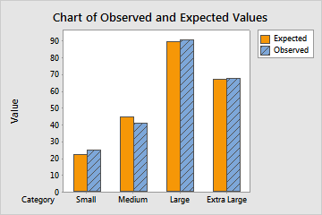
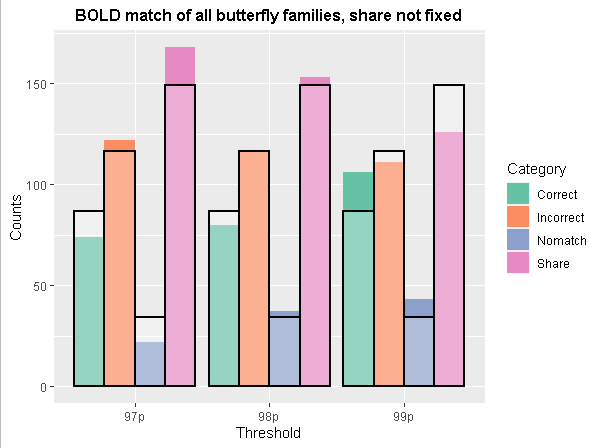

```{r, include=FALSE, results='asis'}
# hugodown::md_document
# knitr::opts_knit$set(upload.fun = knitr::imgur_upload, base.url = NULL)
knitr::opts_chunk$set(fig.width = 5, fig.height = 5, cache = TRUE)
library(tidyverse)
library(knitr)
library(kableExtra)
devtools::install_github("fernandaperes/fstat")
library(fstat)
```

  
Recentemente eu me deparei com um dilema: eu queria representar graficamente os resultados do teste qui-quadrado, mas não sabia como estruturar essa representação.  
  
> Ah, um aviso: esse texto assume que você tem familiaridade com o teste qui-quadrado de independência. E, mais do que isso: que você entende a lógica da comparação entre as frequências observadas e esperadas que está por trás desse teste.  
Se quiser entender isso melhor antes de seguir com o texto, recomendo a leitura [deste post](https://www.instagram.com/p/CTzfJS7AmyF/?utm_source=ig_web_copy_link) no meu Instagram.
  
  
Eu uso testes qui-quadrado com frequência nas minhas análises. Sempre representei os resultados em tabelas acompanhadas por um texto explicando quais categorias haviam diferido significativamente. Mas, nunca achei essa solução ideal, já que o leitor vai levar um tempo para entender quais diferenças foram encontradas.  
  
Eu queria achar uma forma de representar esses resultados em gráficos. Então, a ideia desse post é te contar a minha solução, e compartilhar o script criado para isso. Ah, eu não faço ideia se essa é mesmo a melhor solução. Fique à vontade para compartilhar outras.
  
<br>
  
Para discutir as possibilidades de representação do qui-quadrado, vou usar o famoso [banco de dados do Titanic](https://web.stanford.edu/class/archive/cs/cs109/cs109.1166/problem12.html). Apenas o traduzi para o exemplo ser mais acessível, e selecionei as colunas de interesse:  
  
```{r, include=FALSE}
dados <- read.csv2("titanic_traduzido.csv", stringsAsFactors = T)
dados$Classe <- factor(dados$Classe)
```

```{r, eval=FALSE}
head(dados)
```

```{r, echo=FALSE}
head(dados) %>% flextable::regulartable() %>%
  flextable::autofit() %>% 
  flextable::align(align = "center", part = 'all')
```
  
#### Há associação entre ter sobrevivido ao desastre do Titanic e a classe da passagem?
  
Essa é a pergunta que iremos responder com a nossa análise.  
  
Vamos começar fazendo o teste qui-quadrado.  
(Se quiser se aprofundar em como fazer um teste qui-quadrado no R, recomendo [esse vídeo](https://youtu.be/u2mXKHQAOQE))  
  
```{r}
tabela <- table(Sobreviveu = dados$Sobreviveu,
                Classe = dados$Classe)

qui <- chisq.test(tabela)
qui
```
  
O teste qui-quadrado apresentou um p < 0,001. Logo, iremos rejeitar a hipótese nula do teste e consideraremos que há associação entre ter sobrevivido ao Titanic e a classe da passagem.  
  
Para aprofundarmos essa análise, podemos avaliar os resíduos padronizados ajustados:  
  
```{r}
qui$stdres
```
  
Todos os resíduos estão fora do intervalo [-1,96; 1,96]. Logo, todas as células apresentam frequências observadas que diferem estatisticamente as esperadas.  

<br>
  
> Se quiser entender melhor essa questão dos resíduos, recomendo [esse vídeo](https://youtu.be/u2mXKHQAOQE) e o artigo de Sharpe (2015).

<br>
  
Observe também que os resíduos de "sim" para as classes 1 e 2 são positivos - indicando que foram observadas mais pessoas dessas classes na categoria "sim" do que seria esperado - e, para a classe 3, são negativos, indicando que sobreviveram menos pessoas dessa classe do que seria esperado.  
Importante lembrar: esse "esperado" se refere à frequência esperada caso não houvesse associação entre as variáveis - no caso, caso classe e sobrevivência não estivessem associadas.  
  
Agora vem a grande questão: **como representar graficamente esses resultados?**
  
#### Opção 1: gráficos de frequências  
  
Uma boa opção, que eu sempre utilizei, é representar esses dados em gráficos de frequências. 
  
##### Gráfico de frequências absolutas (n) e relativas (%)
  
```{r, echo=FALSE, fig.width=6, fig.height=3.2, fig.align='center'}
fstatix::graf_barra_com_porc_grupo(dados, x = Classe, g = Sobreviveu,
                                   nome_grupo = "Sobreviveu\nao desastre\ndo Titanic?",
                                   titulo_x = "Classe da passagem",
                                   cor = "cadetblue", horizontal = F)
```
  
Essa é uma opção interessante: ao mesmo tempo em que mostra a frequência absoluta (eixo y, altura das barras), mostra também a proporção (%).  
Conseguimos observar que não ter sobrevivido é muito mais frequente (75,56%) entre as pessoas que estavam na 3ª classe do que entre as que estavam na 1ª (apenas 37,04% não sobreviveram) ou na 2ª (52,72% não sobreviveram).  
O meu incômodo com essa representação é a dificuldade em representar quais categorias apresentam frequências observadas que diferem das esperadas.  
  
##### Gráfico de barras empilhadas com as frequências relativas (%)  
  
Outra opção, bastante usada, é o gráfico com barras empilhadas que somam 100%.  
Para uma situação como essa, em que só há duas categorias na variável que dará a cor das barras, esse tipo de gráfico funciona muito bem.  
  
```{r, echo=FALSE, fig.width=6, fig.height=4, fig.align='center'}
dados %>% 
  ggplot(aes(x = Classe, fill = Sobreviveu)) +
  geom_bar(position = "fill") +
  geom_text(aes(label = scales::number(100*..count../tapply(..count.., ..x.. ,sum)[..x..], accuracy = 0.01, decimal.mark = ",", suffix = "%")),
            position = position_fill(vjust = 0.5),
            stat = "count", size = 3.2) +
  scale_y_continuous(expand = expansion(mult = c(0, 0.05)),
                     labels = scales::percent_format()) +
  scale_fill_manual(values = c("cadetblue", colorspace::lighten("cadetblue", 0.4))) +
  labs(y = "Frequência (%)", x = "Classe da passagem", fill = "Sobreviveu\nao desastre\ndo Titanic?") +
  theme_classic()
```
  
Na minha opinião, o gráfico de barras empilhadas facilita as comparações das proporções entre os grupos. Como desvantagem, ele não mostra as frequências absolutas. E, assim como a opção anterior, não é um gráfico adequado para representar as diferenças entre os valores observados e esperados.  
  
#### Opção 2: gráfico das frequências observadas e esperadas  
  
Procurando na internet uma solução para essa representação, eu encontrei o gráfico abaixo, no [site do MiniTab](https://support.minitab.com/pt-br/minitab/21/help-and-how-to/statistics/tables/how-to/chi-square-goodness-of-fit-test/interpret-the-results/all-statistics-and-graphs/).
  
```{r, echo=FALSE, fig.align='center', out.width = '400px'}

```
  
Na verdade, trata-se de um gráfico para o teste [qui-quadrado de aderência](https://www.instagram.com/p/CR6YTuLjfaq/?utm_source=ig_web_copy_link). Mas, eu pensei que daria para adaptar para o de independência.  
Seguindo essa proposta, cheguei ao gráfico abaixo. Vou compartilhar o script completo ao final do post, mas, transformei esse script em uma função, que está no meu pacote `fstat`, para facilitar o uso.  
Ah, todos os scripts deste post estão na linguagem R e todos os gráficos foram construídos usando o pacote `ggplot2`.  
  
O primeiro passo será instalar e carregar o pacote:  
```{r, warning=FALSE, message=FALSE}
devtools::install_github("fernandaperes/fstat")
library(fstat)
```
  
Então, vamos criar o gráfico. Veja que eu usei a função e acrescentei uma legenda para explicar os asteriscos e qual teste havia sido feito.  
A função inclui a colocação de asteriscos quando os resíduos padronizados estão fora do intervalo [-1,96; 1,96]. Se não quiser os asteriscos, inclua como argumento `asterisco = FALSE`.    
  
```{r, warning=FALSE, message=FALSE, fig.width=4.6, fig.height=4.2, fig.align='center'}
fstat::graf_obs_esp_ind(dados, Classe, Sobreviveu, cat_graf_v2 = "Sim",
                        cor = "cadetblue", xlab = "Classe da passagem") +
  labs(caption = "Frequências observadas e esperadas para aqueles que sobreviveram\nao desastre do Titanic, de acordo com a classe da passagem.\n* para frequências observadas que diferem estatisticamente\ndas esperadas. Teste qui-quadrado de independência.")
```
O problema desse gráfico é que ele só permite a visualização de uma das categorias da variável. Nesse caso, escolhi a categoria "sim" para a variável `Sobreviveu`, e expliquei isso na legenda.  
Para a variável `Sobreviveu`, essa é uma alternativa válida. Isso porque, como essa variável tem apenas duas categorias, os resíduos da categoria "não" serão numericamente iguais aos da categoria "sim", mas com sinal oposto.  
  
Observe que visualizando o gráfico conseguimos perceber que:  

* Para as classes 1 e 2, sobreviveram mais passageiros do que seria esperado;  
* Para a classe 3, sobreviveram menos passageiros do que seria esperado.  
  
Perceba que, para esse caso, não precisamos visualizar os dados referentes a "não sobreviveram" porque serão obrigatoriamente complementares ao "sobreviveram".  
  
Mas, e se tivermos mais de duas categorias nas duas variáveis? Como proceder?  
  
#### Opção 3: gráfico das frequências observadas e esperadas para variáveis com mais de duas categorias  
  
Pensando nessa possibilidade, criei uma outra versão, que usa o `facet` do `ggplot2`.  
  
```{r, warning=FALSE, message=FALSE, fig.width=5.5, fig.height=4.2, fig.align='center'}
fstat::graf_obs_esp_ind_2(dados, Classe, Sobreviveu,
                          cor = "cadetblue",
                          xlab = "Classe da passagem /\n Sobreviveu ao desastre do Titanic") +
  labs(caption = "* para frequências observadas que diferem estatisticamente\ndas esperadas. Teste qui-quadrado de independência.")
```
  
Vantagem dessa versão: mostra todas as categorias, o que significa que funciona bem para variáveis com mais de duas categorias. Desvantagem: a depender da quantidade de categorias, pode ficar poluído.  
  
#### Opção 4: gráfico das frequências observadas e esperadas, com barras vazadas  
  
Segui procurando outras ideias, quando, [em um fórum de R](https://community.rstudio.com/t/any-effective-way-of-visualizing-expected-results-from-chi-square-test-onto-grouped-bar-graph/130305/2), me deparei com esse gráfico abaixo.  
  
```{r, echo=FALSE, fig.align='center', out.width = '500px'}

```
  
A ideia de representar as frequências esperadas como barras vazadas e as frequências observadas como barras preenchidas me pareceu uma ótima solução para representar variáveis com múltiplas categorias sem poluir a figura.  
  
```{r, warning=FALSE, message=FALSE, fig.width=5, fig.height=4.5, fig.align='center'}
fstat::graf_obs_esp_ind_3(dados, Classe, Sobreviveu, cor = "cadetblue",
                          xlab = "Classe da passagem",
                          filllab = "Sobreviveu ao desastre do Titanic") +
  labs(caption = "As barras preenchidas correspondem às frequências\nobservadas e as barras vazadas, às frequências esperadas.\n* para frequências observadas que diferem estatisticamente\ndas esperadas. Teste qui-quadrado de independência.")
```
  
Eu gosto dessa solução para situações com múltiplas categorias. Mas, acho também que o gráfico, dessa forma, é menos intuitivo que os anteriores.  
  
  
<br>
  
***  
  
<br>
  
Essas foram as soluções que encontrei. Cada uma delas tem suas vantagens e desvantagens, mas tenho gostado de representar os resultados em forma de gráfico.  
  
#### O script completo  
  
Para finalizar, como prometido, segue o script completo para gerar aquele primeiro gráfico. Os demais são resultado de pequenas modificações nele. Você também tem acesso ao script dessas funções pelo [repositório do pacote no meu GitHub](https://github.com/fernandaperes/fstat).  
  
```{r, warning=FALSE, message=FALSE, fig.width=4.6, fig.height=4.2, fig.align='center'}
library(reshape2)
library(ggplot2)
library(dplyr)

tabela <- table(dados$Classe, dados$Sobreviveu)

quiqua <- chisq.test(tabela)

esp <- as.data.frame(melt(cbind(quiqua$expected)))
esp$v <- "Esperado"
obs <- as.data.frame(melt(cbind(quiqua$observed)))
obs$v <- "Observado"
banco_graf <- rbind(esp, obs)
colnames(banco_graf) <- c("Classe", "Sobreviveu", "Valor", "Resultado")

asteriscos <- as.data.frame(quiqua$stdres) %>%
    mutate(sinal = case_when(between(Freq, -1.96, 1.96) ~ "",
                             TRUE ~ "*")) %>%
    filter(Var2 == "Sim")
asteriscos <- asteriscos$sinal
vazios <- rep("", length(asteriscos))
rotulos <- c(vazios, asteriscos)

banco_graf %>% filter(Sobreviveu == "Sim") %>%
    ggplot(aes(x = Classe, y = Valor, fill = Resultado)) +
    geom_bar(position = "dodge", stat = "identity") +
    geom_text(aes(y = Valor+2, label = rotulos),
              position = position_dodge(width = 0.9), size = 4.5) +
    labs(y = "Frequência (n)", x = "Classe da passagem", fill = NULL,
         caption = "Frequências observadas e esperadas para aqueles que sobreviveram\nao desastre do Titanic, de acordo com a classe da passagem.\n* para frequências observadas que diferem estatisticamente\ndas esperadas. Teste qui-quadrado de independência.") +
    scale_fill_manual(values = c("cadetblue", colorspace::lighten("cadetblue", 0.4))) +
    scale_y_continuous(expand = expansion(mult = c(0, 0.05))) +
    theme_classic() +
    theme(legend.position = "bottom")
```


#### Como citar esse post, nas normas da ABNT
  
  
> PERES, Fernanda F. **Como representar os resultados do qui-quadrado em um gráfico?**. Blog Fernanda Peres, São Paulo, 08 abr. 2022. Disponível em: https://fernandafperes.com.br/blog/grafico-qui-quadrado/.
  
  
<br>

***

#### Referências
  
* SHARPE, Donald. Chi-square test is statistically significant: Now what?. Practical Assessment, Research, and Evaluation, v. 20, n. 1, p. 8, 2015.  
  

