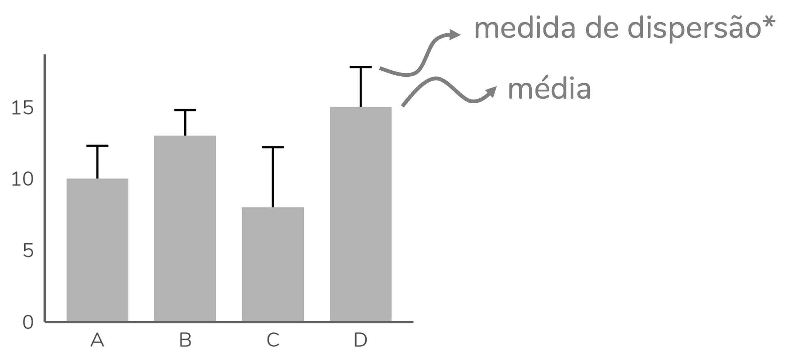
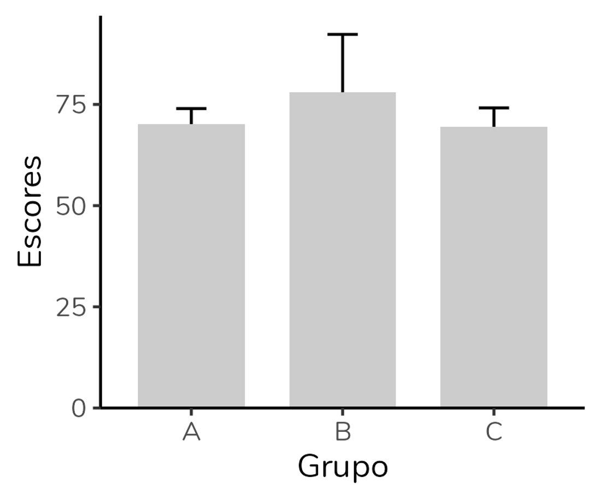
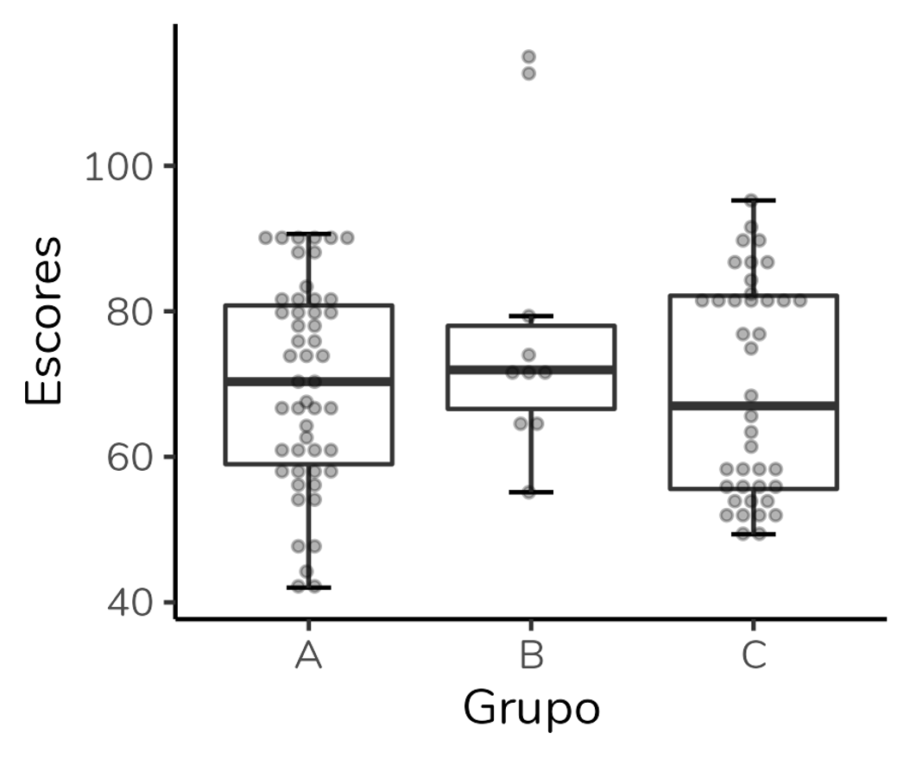

```{r, include=FALSE}
# hugodown::md_document
# knitr::opts_knit$set(upload.fun = knitr::imgur_upload, base.url = NULL)
knitr::opts_chunk$set(fig.width = 5, fig.height = 5, cache = TRUE)
library(tidyverse)
library(data.table)
library(truncnorm)

rnormFixed <- function(n, mean, sd) {
  mean + sd * scale(rnorm(n))
}


set.seed(1808)
n1 <- 50
n2 <- 10
n3 <- 40
datasets <- 5

dt1 <- lapply(1:datasets,
              function(x) {data.table(
                Escores = c(rnormFixed(n = n1, mean = 70, sd = 14),
                           rnormFixed(n = n2, mean = 78, sd = 20),
                           c(rtruncnorm(n3/2, a=28, b=120, mean=57, sd=4),
                             rtruncnorm(n3/2, a=28, b=120, mean=82, sd=5))),
                Grupo = rep(x = c("A", "B", "C"),
                            times = c(n1, n2, n3)), 
                dataset = x)})
dt1 <- bind_rows(dt1)
dados <- dt1 %>% filter(dataset == 4)
```

  
Se você já teve contato com algum artigo científico, é provável que você tenha visto um gráfico como o acima. Trata-se de um gráfico de barras usado para representar **medidas numéricas** em diferentes grupos. Nesses gráficos, a **altura** da barra é determinada pela **média** do grupo e o **T** que se projeta para além da barra representa uma **medida de dispersão baseada na média**, como o desvio-padrão, o erro-padrão da média ou o intervalo de confiança para essa média.  
  
<br>
```{r, echo=FALSE, fig.align='center', out.width='450px'}

```
  
No entanto, apesar de muito utilizado - principalmente em contextos acadêmicos - esse tipo de gráfico é alvo de críticas, algumas vezes fervorosas, e tem sido chamado pejorativamente de **gráfico dinamite**. O nome é uma brincadeira com a semelhança desse tipo de gráfico com um detonador de dinamite antigo, aqueles que aparecem em desenhos animados.  
  
<br>
```{r, echo=FALSE, fig.align='center', out.width='300px'}
knitr::include_graphics("g2.png")
```

Uma breve busca pelo termo em inglês, *dynamite plots*, traz textos com títulos como [Por que gráficos dinamite são péssimos](https://hausetutorials.netlify.app/posts/2019-02-22-why-we-should-never-use-barplots-use-geomquasirandom-instead/), [Gráficos dinamite: um mal absoluto?](http://emdbolker.wikidot.com/blog:dynamite) e até uma *open letter* intitulada [Gráficos dinamite têm que morrer](https://simplystatistics.org/posts/2019-02-21-dynamite-plots-must-die/).  
  
O que eu sinto é que essa discussão é ainda bem rara aqui no Brasil. E mesmo publicando em revistas internacionais, apenas uma vez ouvimos da editora: "os gráficos têm que ser refeitos porque eu não publico gráficos de barras". E nós ficamos meio perdidas: como representar os dados, então? Curiosamente, pesquisar outros artigos da mesma revista não ajudou muito porque, adivinhem, só tinha gráfico de barras, rs. Mas no fim deu tudo certo.  
  
A proposta do post é: explicar quais as críticas aos "gráficos dinamite" e discutir quais as alternativas e esse tipo de gráfico (explicando como fazê-las).  
  
### Por que gráficos de barra não são ideais para representar variáveis numéricas?  
  
Uma das principais críticas é que esse tipo gráfico resume o conjunto de dados a **apenas duas informações**: a média e a medida de variação. Dada essa simplificação, mesmo conjuntos de dados com **distribuições bem diferentes** podem dar origem ao **mesmo gráfico** de barras – desde que apresentem a mesma média e desvio-padrão, por exemplo.  
  
O gráfico de barras também **não** permite a visualização dos **dados brutos** – ao olharmos um gráfico de barras, não sabemos o tamanho de cada grupo, se há *outliers* (valores discrepantes) ou se a distribuição tem mais de uma moda.  
  
Além disso, é importante lembrar que esses gráficos representam a **média** e medidas de dispersão baseadas nela. Mas, há dados que **não são adequadamente representados** pela média. Isso acontece quando temos distribuições assimétricas, ou conjuntos de dados com *outliers*. Nesses casos, a **mediana** será uma medida mais apropriada e devemos usar gráficos que se baseiem nela (os quais discutiremos a seguir).  
  
  
### Quais as alternativas ao gráfico de dinamite?  
  

Fazer gráfico de barras para variáveis numéricas é **errado**? Não. Por mais que você vá encontrar pessoas que digam que sim - mas, veja, isso é a opinião delas, não um fato ou um consenso. O que é um fato é que esse tipo gráfico não será a escolha mais adequada para representar dados numéricos em muitas situações. Então, vejamos as alternativas ao gráfico de barras, com seus prós e contras.  
  
Para discutir as alternativas, vamos construir diferentes gráficos utilizando um mesmo banco de dados. Abaixo, temos um gráfico de barras com a altura da coluna representando a média e a barra de erros representando o desvio-padrão. Observe como os grupos A e C apresentam barras idênticas:  
  
```{r, echo=FALSE, fig.align='center', out.width='280px'}

```
<center><font size ='3'>Gráfico de barras ("gráfico dinamite") representando as médias e os desvios-padrão de três grupos: A, B e C.</font></center><br><br>
  
  
#### Gráficos dot plot  
  
Uma alternativa ao gráfico dinamite é o dotplot. Nesse gráfico, cada sujeito é representado por um ponto – ou seja, estamos visualizando os dados brutos.  
  
Além disso, é comum sobrepor a esses pontos uma linha horizontal representando a média e uma barra de erros indicando uma medida de dispersão (que, assim como no gráfico de barras, pode ser o desvio-padrão, o erro-padrão da média ou o intervalo de confiança para a média).
  
```{r, echo=FALSE, fig.align='center', out.width='280px'}
knitr::include_graphics("g4.png")
```
<center><font size ='3'>Gráfico dot plot representando as médias e os desvios-padrão de três grupos: A, B e C.</font></center><br><br>
  
  
Note que o dot plot mostra muito mais informações que o gráfico de barras. Ao analisarmos o dot plot, conseguimos perceber que o grupo B é bem menor que os outros dois, sendo formado por apenas 10 sujeitos. Também notamos que nesse grupo parece haver valores discrepantes, bem superiores aos demais. O grupo C parece ser formado por dois subgrupos: há um grupo de pontos acima da média que está separado dos pontos abaixo da média. Esse padrão não é observado no grupo A (apesar de os grupos A e C terem médias e desvios-padrão praticamente idênticos).  
  
O que eu vejo como vantagens do dot plot? Além de ser um gráfico que nos permite visualizar os dados brutos, é um gráfico baseado em média. Se usamos um teste paramétrico para comparar os grupos, como o teste-t ou a ANOVA, a análise será baseada na média e em medidas de dispersão baseadas na média. Portanto, eu gosto de poder visualizar essas medidas no gráfico.  
  
Por outro lado, é um gráfico que não mostra diretamente quais pontos são *outliers* (ao contrário do boxplot, que discutiremos a seguir). Além disso, se estivermos trabalhando com amostras muito grandes, teremos **muitos pontos** no gráfico e a visualização ficará comprometida.  
  
Ah, outra desvantagem, na minha opinião, é que não conseguimos fazer um gráfico como esse no Excel, o software usado pela maior parte das pessoas para construção de gráficos. Para fazê-lo, precisamos partir para softwares mais específicos, como o Graphpad Prism (que eu considero bem limitado para análise estatística, mas ótimo para construção de gráficos), o SPSS ou o R.  
  
  
Em resumo:  
  
  
**Vantagens do dotplot:**  
  
* Permite visualizar dos dados brutos  
* Inclui a média e uma medida de dispersão baseada na média - medidas utilizadas pelos testes paramétricos em seus cálculos  
  
<br>
**Desvantagens do dotplot:**  
  
* Não mostra diretamente os outliers  
* É de difícil visualização quando os grupos são grandes – deve ser usado preferencialmente em amostras menores  
  
  
##### Como fazer um dot plot no R?  
  
Segue o código usado para gerar o dot plot acima, usando o `ggplot2`.  
Se você não tem o hábito de usar o `ggplot2`, o código abaixo pode parecer assustador. Mas, ele é razoavelmente simples quando se entende a lógica de funcionamento do `ggplot2`. Se tiver interesse no pacote, recomendo minha playlist explicando [como construir gráficos no ggplot2 do zero](https://youtube.com/playlist?list=PLOw62cBQ5j9X5eOavzeu9CaHMO6TFsPkY).
  
```{r, eval=FALSE}
ggplot(dados, aes(x = Grupo, y = Escores)) +
  geom_dotplot(binaxis = "y", stackdir = "center", alpha = 0.3,
               dotsize = 1, binwidth = 2, stackratio = 1.4,
               position = position_dodge(width = 0.9), show.legend = F) +
  geom_errorbar(stat = "summary", fun.data = mean_cl_normal,
                position = position_dodge(width = 0.9), width = 0.15) +
  geom_crossbar(stat = "summary", fun = "mean", aes(ymin = ..y.., ymax = ..y..),
                fatten = 0.2, width = 0.5, position = position_dodge(width = 0.9),
                show.legend = F) +
  theme_classic()
```

  

#### Gráficos boxplot 
  
Outra alternativa é o boxplot, um gráfico que eu discuti em detalhes no [último post aqui do blog](https://fernandafperes.com.br/blog/interpretacao-boxplot/). O boxplot resume, em uma única figura, cinco medidas de posição: limite inferior, quartil 1 (percentil 25%), mediana, quartil 3 (percentil 75%) e limite superior. Além disso, ele é um gráfico excelente para visualizar valores discrepantes (outliers).  
  
```{r, echo=FALSE, fig.align='center', out.width='450px'}
knitr::include_graphics("g5.png")
```
<center><font size ='3'>Estrutura básica de um gráfico boxplot.</font></center><br><br>
  
Aplicando aos nossos dados, obtemos o gráfico abaixo. Observe que rapidamente conseguimos detectar que o grupo B apresenta dois valores outliers acima do limite superior:

  
```{r, echo=FALSE, fig.align='center', out.width='280px'}
knitr::include_graphics("g6.png")
```
<center><font size ='3'>Gráfico boxplot para três grupos: A, B e C.</font></center><br><br>
  
Assim como o dot plot, o boxplot mostra muito mais informações que o gráfico de barras: cinco medidas de posição + *outliers*. Além disso, conseguimos avaliar a dispersão dos dados através da altura da caixa (que representa a amplitude interquartil) e da distância entre o limite inferior e o superior.  
  
Porém, é importante entender que as medidas representadas em um boxplot **não são aquelas usadas em testes paramétricos** - o que significa que esse pode não ser o gráfico ideal para representar dados analisados por esses testes. Além disso, o boxplot só pode ser usado em **amostras maiores**. O n mínimo para estimar as 5 medidas é n = 5, mas o ideal mesmo é usá-lo em amostras superiores a isso (ainda que não haja na literatura um consenso de qual seria esse n ideal).  
  
E, assim como o gráfico de barras, o boxplot **não** mostra os **dados brutos**. Ao olharmos para o boxplot não temos como saber o tamanho dos grupos ou se a distribuição tem mais de uma moda.  
  
Uma vantagem do boxplot em relação ao dot plot é que ele pode ser [feito no Excel](https://youtu.be/DWs98A0yCMQ). Mas, eu tendo a preferir fazê-lo [no R com o pacote `ggplot2`](https://youtu.be/-XQPlOG12vc).  
  
  
Em resumo:  
  
  
**Vantagens do boxplot:**  
  
* Inclui cinco medidas de posição  
* Mostra os valores que são outliers  
 
  
<br>
**Desvantagens do boxplot:**  
  
* Não mostra os dados brutos  
* Não deve ser usado quando o tamanho do grupo é pequeno (n < 5)  
* Não mostra as medidas avaliadas por testes paramétricos  
  
  
Ah, dada essa limitação do boxplot não mostrar os dados brutos, sugere-se que um dotplot seja sobreposto a ele (o que não conseguiremos fazer no Excel), como no gráfico abaixo:  
  
```{r, echo=FALSE, fig.align='center', out.width='280px'}

```
<center><font size ='3'>Gráfico boxplot com dot plot sobreposto representando três grupos: A, B e C.</font></center><br><br>
  
  
##### Como fazer um boxplot com dot plot sobreposto no R?  
  
Segue o código usado para gerar o boxplot acima, usando o `ggplot2`.  
  
```{r, eval=FALSE}
ggplot(dados, aes(x = Grupo, y = Escores)) +
  geom_errorbar(stat = "boxplot", width = 0.2) +
  geom_boxplot(fill = "white", outlier.alpha = 0) +
  geom_dotplot(binaxis = "y", stackdir = "center", alpha = 0.3,
               dotsize = 1, binwidth = 1.6, stackratio = 1.4,
               position = position_dodge(width = 0.9), show.legend = F) +
  theme_classic()
```
  

  
#### Gráficos violino (*violin plot*) 
  
A terceira alternativa é o gráfico violino, em inglês *violin plot*. O gráfico violino é um gráfico que mostra a distribuição dos dados através de uma curva de densidade. Além disso, esse gráfico pode incluir em seu interior um boxplot. Eu ainda pretendo fazer um post detalhado sobre gráfico violino por aqui, mas neste post focaremos em uma interpretação mais geral, combinado?    
  
Aplicando aos nossos dados, obtemos o gráfico a seguir:
  
```{r, echo=FALSE, fig.align='center', out.width='280px'}
knitr::include_graphics("g8.png")
```
<center><font size ='3'>Gráfico de violino representando as distribuições de três grupos: A, B e C.</font></center><br><br>
  
O gráfico nos permite observar que, apesar de terem a mesma média e desvio-padrão, os grupos A e C apresentam distribuições diferentes. Além disso, o grupo C apresenta uma distribuição bimodal (há dois picos).  
  
Por ter um boxplot em seu interior, o gráfico violino apresentará muitas das mesmas vantagens e desvantagens. Além disso, o n exigido para um gráfico de violino é superior ao n necessário para um boxplot. O gráfico violino **não** deve ser usado quando o tamanho do grupo é **pequeno**, já que nesses casos não será possível determinar corretamente a distribuição.  
  
Outras duas desvantagens são: trata-se de um gráfico recente e muito pouco conhecido (poucas pessoas declaram saber interpretá-lo) e não pode ser feito no Excel - temos que recorrer a outros programas, em particular o R.  
  
  
Em resumo:  
  
  
**Vantagens do gráfico de violino:**  
  
* Permite visualizar a distribuição dos dados  
* Se incluir um boxplot em seu interior, mostra cinco medidas de posição  
 
  
<br>
**Desvantagens do gráfico de violino:**  
  
* Não deve ser usado quando o tamanho do grupo é pequeno – nesses casos, não será possível determinar corretamente a distribuição  
* Não mostra as medidas avaliadas por testes paramétricos  
* Não mostra os dados brutos  
  
  
  
##### Como fazer um gráfico violino no R?  
  
Segue o código usado para gerar o gráfico violino acima, usando o `ggplot2`.  
  
```{r, eval=FALSE}
ggplot(dados, aes(x = Grupo, y = Escores)) +
  geom_violin(fill = "grey90", trim = F) +
  geom_boxplot(width = 0.1, outlier.shape = 1) +
  theme_classic()
```

### Afinal, usar ou não o gráfico de barras para variáveis numéricas?
  
Uma desvantagem que se aplica a todas as alternativas ao gráfico de barras, na minha opinião, é: são gráficos muito menos difundidos e, por isso, uma audiência não-técnica terá dificuldade em interpretá-los. Acho esses gráficos incríveis para artigos científicos, para uso pelo time de análise de dados em uma empresa? Com certeza. Acho que são gráficos adequados para matérias jornalísticas ou para divulgação científica? Não. Nesses últimos cenários, mesmo com todas as críticas (válidas) ao gráfico de barras, eu tendo a preferi-lo. Afinal, um gráfico só é bom quando ele comunica com a sua audiência.  
  
O gráfico mais adequado vai depender: do teste estatístico que foi feito, do tamanho dos grupos, do seu público.  
  
Se gráficos são um assunto que te interessa, recomendo um livro que ganhou meu coração: o livro [Storytelling com dados](https://amzn.to/3qKr4Xf), escrito pela Cole Nussbaumer Knaflic.  
   
Recomendo também a leitura do artigo de @weissgerber2019reveal, que resume as informações discutidas aqui.  

  
  
***
  
### Referências:  

