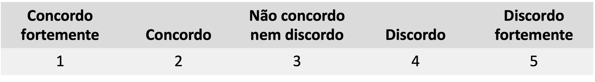
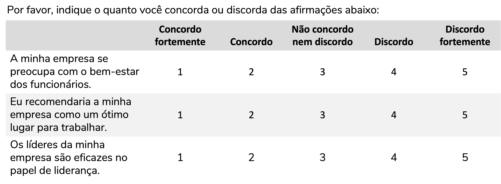
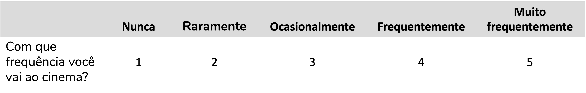

```{r, include=FALSE}
# knitr::opts_knit$set(upload.fun = knitr::imgur_upload, base.url = NULL)
knitr::opts_chunk$set(fig.width = 4, fig.height = 3.3, cache = FALSE,
                      fig.align = "center")
library(tidyverse)
library(ggpubr)
library(flextable)
library(ggstats)
source("/Users/fernandafperes/Documents/Blog_/content/blog/render_toc.R")
fstatix::paleta_f()
```
   
   
O grande objetivo desse post é te ensinar a **interpretar** e a **criar** um gráfico de barras divergentes, como o que você vê acima, adequado à representação de itens Likert. Mas, conforme eu fui estruturando esse post, eu percebi que não tinha como fugir totalmente de algumas questões que geram uma grande crise existencial. O que, afinal, é uma **escala Likert**? O que diferencia uma **escala** Likert de um **item** Likert? Ou ainda, o que os diferencia da escala ou item **tipo-Likert**?  
  
Por isso, esse post está dividido nos seguintes tópicos:  
  
```{r toc, echo=FALSE}
render_toc("index.Rmd", toc_header_name = NULL, toc_depth = 1, base_level = 3)
```
  
Você pode pular para os tópicos de interpretação e criação do gráfico, se assim desejar, ok?  
   
   
### O que, afinal, é uma escala Likert?
  
A origem da escala Likert é um artigo de 1932 chamado "A Technique for the Measurement of Attitudes" (em tradução literal: "Uma técnica para medir atitudes"), escrito por Rensis Likert [@likert1932technique]. Sim, a escala recebe o **nome do autor** que a propôs. E uma informação interessante: a palavra Likert deve ser lida **como leríamos em português**, *"Li-quer-ti"*, e **não** como *"Lai-quer-ti"*. Mas esse é um detalhe.  
  
Como o nome do artigo nos indica, Rensis Likert queria medir atitudes. Após múltiplas tentativas ele chegou a um questionário composto por **múltiplos itens** (questões) cujas **respostas** poderiam ser:  
  
```{r, echo=FALSE, fig.align='center', out.width = '550px'}

```
  
Para isso fazer mais sentido, imaginemos alguns itens que podem compor um questionário para avaliar a opinião de funcionários sobre a empresa em que trabalham:  
  
```{r, echo=FALSE, fig.align='center', out.width = '700px'}

```
  
  
Likert propôs uma escala que seria composta pela soma de múltiplos itens (questões, afirmações) que estivessem relacionados, aferindo um mesmo **constructo**. Um constructo é uma variável **não-observável**, que não conseguimos medir diretamente. É o caso de depressão, inteligência ou mesmo atitude.  
  
  
#### Escala Likert x item Likert
  
Para aprofundarmos a nossa discussão, é importante diferenciarmos "escala" de "item". O item (em inglês, *Likert item*) é a questão, a **afirmação** a ser avaliada ou ainda a **resposta** a essa afirmação. A escala (em inglês, *Likert scale*) é a **soma (ou média)** de todos os itens que compõem aquele constructo. Essa é a definição correta. Mas é comum encontrarmos materiais com o termo "escala" sendo utilizado para se referir a um item, o que gera um ruído de comunicação.  
  
  
#### Que tipo de variável é uma escala Likert?
  
Essa é uma das perguntas mais controversas da literatura no que diz respeito a escala Likert. Mas aqui eu tendo a concordar com @batterton2017likert (e muitos outros): depende.  
  
Se estamos falando do **item Likert**, como a resposta a essa afirmação abaixo, estamos falando de uma variável **categórica ordinal**. Perceba que ainda que a resposta seja representada por número de 1 a 5, não se trata de uma variável quantitativa. Não podemos afirmar que a distância entre "Concordo fortemente" e "Não concordo nem discordo" é exatamente a mesma que entre "Concordo" e "Discordo". O que podemos afirmar é que quanto maior o valor atribuído, maior a discordância. A resposta é uma **categoria** e há uma **ordem** entre essas categorias. Se essa variável é categórica, para descrevê-la devemos calcular as **frequências** absolutas (n) e relativas (%) de cada categoria.  
   
  
```{r, echo=FALSE, fig.align='center', out.width = '700px'}

```
  
  
Por outro lado, se estamos falando da **escala Likert**, ou seja, se estamos nos referindo à **soma das pontuações** de múltiplos itens Likert que se propõem a medir um mesmo constructo, aí temos em mãos uma variável que **pode ser considerada numérica**. Aqui, sim, podemos descrever a variável com medidas como **média, mediana, desvio-padrão, quartis**.  
  
  
>E já adiantando uma pergunta que pode estar passando pela sua cabeça: qual **teste de hipóteses** aplicar?  
Se estamos falando de analisar um item Likert, usamos testes adequados a dados ordinais, como os testes não-paramétricos (Mann-Whitney, Kruskal-Wallis, etc).  
Se queremos analisar uma escala Likert (ou seja, a soma das pontuações), podemos aplicar testes paramétricos, como teste-t e ANOVA, desde que os dados atendam aos pressupostos desses testes.  
Ah, isso é um consenso? Claro que não, né? Já viu algo ser consenso em estatística? Mas é uma das recomendações mais comuns [@batterton2017likert].
  
  
  
#### O que define um item Likert? E o que seria um item tipo-Likert?
  
##### Item Likert
  
Bom, essa é uma definição que nunca esteve muito clara para mim. Mas um dos textos mais didáticos que eu li sobre isso foi "Likert Scales: Dispelling the Confusion", do John S. Uebersax ([link](https://john-uebersax.com/stat/likert.htm) para o texto completo).  
  
Um **item Likert** deve ter as seguintes características:  
  
1. As possibilidades de resposta estão organizadas horizontalmente
2. As possibilidades de resposta são representadas por números inteiros consecutivos
3. As possibilidades de resposta são representadas por rótulos verbais que indicam gradações espaçadas de forma aproximadamente uniforme
4. Os rótulos verbais são bivalentes e simétricos em relação a um rótulo central neutro
  
  
Perceba que o item abaixo se encaixa em todos esses critérios. 1) Suas respostas estão organizadas na horizontal; 2) As possibilidades de resposta são representadas por números inteiros consecutivos, no caso, 1 a 5; 3) As possibilidades de resposta são representadas também por rótulos verbais ("concordo fortemente", "concordo", etc.) que estão espaçados de forma aproximadamente uniforme; 4) os rótulos são simétricos em relação a um rótulo central neutro ("não concordo, nem discordo") e são bivalentes (ou seja, expressam direções opostas em relação a esse ponto neutro -- de um lado temos "concordo fortemente", do outro, "discordo fortemente").  
  
```{r, echo=FALSE, fig.align='center', out.width = '700px'}

```
  
A **escala Likert** seria, portanto, uma escala composta por itens Likert.  
  
  
##### Item tipo-Likert
  
Caso o item atenda a todos os pontos acima exceto o ponto 4, podemos chamá-lo de item tipo-Likert (em inglês, *Likert-type item*).  
  
Ou seja, seria um item Likert aquele que atende aos pontos 1 a 3, mas:  
  
* Apresenta uma quantidade par de respostas (isso é, sem não tem um neutro central)
* Não tem dois polos opostos (ou seja, não é bivalente) 
  
  
O item abaixo não é bivalente, não podemos dizer que "Nunca" é o exato oposto de "Muito frequentemente". Mas ainda assim o item atende aos critérios 1 a 3 e traz categorias espaçadas de forma aproximadamente uniforme:  
  
```{r, echo=FALSE, fig.align='center', out.width = '700px'}

```
  
  
Por outro lado, podemos ter um item com uma quantidade par de respostas, ou seja, sem um neutro central. Veja que, apesar de ter da quantidade par de respostas, o item abaixo atende aos critérios 1 a 3 e traz categorias espaçadas de forma aproximadamente uniforme:  
  
```{r, echo=FALSE, fig.align='center', out.width = '600px'}

```
  
  
Uma escala composta por itens tipo-Likert é, portanto, uma **escala tipo-Likert** (em inglês, *Likert-type scale*).  
  
  
##### Escala visual analógica discreta
  
E se os meus itens **não atenderem aos critérios 1 a 3**? Aí a [recomendação](https://john-uebersax.com/stat/likert.htm) é tratá-los como variáveis categóricas ordinais, mas não como itens Likert ou tipo-Likert. O nome mais genérico que pode ser aplicado é "escala visual analógica discreta" (que vou abreviar como EVAD, uma tradução do inglês: *discrete visual analog scales*).  
  
  
  
É o caso do item abaixo, que não atende ao critério 3:
  
```{r, echo=FALSE, fig.align='center', out.width = '700px'}

```
  
  
  
  
Ou ainda desse item, que não atende aos critérios 2 ou 3:  
  
```{r, echo=FALSE, fig.align='center', out.width = '700px'}

```
  
  
### Como representar os resultados de itens Likert (ou tipo-Likert ou EVAD)?
  
Como discutimos acima, os itens Likert (ou tipo-Likert ou EVAD) são variáveis categóricas ordinais. Portanto, utilizamos frequências absolutas (n) e relativas (%) para descrever esses resultados.  
  
  
#### Representando os dados em tabela
  
Vamos usar como exemplo uma base de dados (adaptada do [Kaggle](https://www.kaggle.com/datasets/annettecatherinepaul/likert-survey-for-job-satisfaction-psc)) que avalia a satisfação com a empresa. A escala tem 13 questões, mas vamos focar em apenas 3. Veja como podemos descrever esses resultados em tabela, indicando a quantidade de funcionários (n) e quantos porcento deles (%) deu determinada resposta:  
  
```{r, echo=FALSE}
dados <- readxl::read_xlsx("Banco_Likert.xlsx")

dados$`Tamanho da empresa` <- factor(dados$`Tamanho da empresa`,
                                     levels = c("Menos de 200 funcionários",
                                                "Entre 200 e 1000 funcionários",
                                                "Mais de 1000 funcionários"),
                                     ordered = T)

dados[,1:13] <- lapply(dados[,1:13], factor, levels = 1:5,
                       labels = c("Discordo fortemente", "Discordo",
                                  "Não concordo nem discordo",
                                  "Concordo", "Concordo fortemente"),
                       ordered = T)

nomes <- readxl::read_xlsx("Banco_Likert.xlsx", sheet = 2)
colnames(dados)[1:13] <- nomes$Nome[1:13]

dados |> pivot_longer(cols = 1:3, names_to = "Questão",
                      values_to = "Resposta") |> 
  filter(!is.na(Resposta)) |> 
  group_by(Questão) |> 
  count(Resposta) |> 
  mutate(`%` = fstatix::arred(100*n/sum(n), dm = ",", digitos = 1),
         n = fstatix::arred(n, bm = ".", manter_inteiros = T)) |> 
  flextable::regulartable() |>
  flextable::align(j = -c(1:2), align = "center", part = "all") |>
  flextable::bold(part = "header") |>
  flextable::merge_v(part = "header") |>
  flextable::merge_v(j = 1, part = "body") |>
  flextable::valign(valign = "bottom", part = "header") |>
  flextable::valign(valign = "top", part = "body") |>
  flextable::autofit() |>
  flextable::width(width = c(2.5, 2.3, 0.8, 0.8)) |> 
  flextable::fix_border_issues(part = "all")
```
  
  
#### Representando os dados em gráfico
  
Ok, mas e graficamente? Como podemos representar esses resultados?  
  
Vou te apresentar um gráfico que eu amo -- e que por muitos anos eu não soube que existia: o **gráfico de barras divergentes** (em inglês, *diverging bar plot*). Aqui vou recomendar o excelente artigo de @robbins2011plotting que discute as possibilidades de representação de itens Likert e conclui que o gráfico de barras divergentes é a ferramenta mais apropriada ([acesse o PDF aqui](https://www.montana.edu/msse/Old_Data_analysis/Likert%20Survey%20Graphs.pdf)).  
  
O que seria um gráfico de barras divergentes?  
  
Bom, um gráfico de barras divergentes é semelhante a um gráfico de barras empilhadas, em que as frequências -- em geral, as relativas (%) -- de todas as categorias são empilhadas de forma que uma barra representa o total.  
  
Se quiséssemos criar um gráfico de barras empilhadas com as frequências relativas das respostas às três questões acima, ele ficaria assim:  
  
```{r, echo=FALSE, warning=FALSE, message=FALSE, fig.width=5.8, fig.height=4.3}
paleta <- RColorBrewer::brewer.pal(5, "RdBu")
paleta[3] <- "#DFDFDF"

dados_graf <- dados |> pivot_longer(cols = 1:3, names_to = "Questão",
                      values_to = "Resposta") |> 
  filter(!is.na(Resposta)) |> 
  group_by(Questão) |> 
  count(Resposta) |> 
  mutate(prop = n/sum(n),
         rotulo = paste0(fstatix::arred(100*prop, digitos = 1), "%"),
         rot1 = ifelse(Resposta %in% c("Discordo fortemente", "Concordo fortemente"),
                       NA, rotulo),
         rot2 = ifelse(!Resposta %in% c("Discordo fortemente", "Concordo fortemente"),
                       NA, rotulo))

ggplot(dados_graf, aes(x = Questão, fill = Resposta, y = prop)) +
  geom_bar(stat = "identity", position = position_stack()) +
  geom_text(aes(label = rot1), position = position_stack(vjust = 0.5),
            color = "black", size = 3) +
  geom_text(aes(label = rot2), position = position_stack(vjust = 0.5),
            color = "white", size = 3) +
  scale_y_continuous(labels = scales::percent_format()) +
  scale_x_discrete(labels = \(x) stringr::str_wrap(x, 15)) +
  scale_fill_manual(values = paleta) +
  labs(y = "Frequência", x = "Item") +
  theme_minimal()
```
  
Perceba como as porcentagens batem com as calculadas na tabela e como a soma de todas as porcentagens de uma mesma barra dá 100%. Veja também como eu atribui cores que estão normalmente associadas a concordo (algo "positivo", azul) e discordo (algo "negativo", vermelho). E perceba também que nesse caso o "concordo" indica de fato uma opinião positiva em relação à empresa.   
  
  
Podemos melhorar um pouco esse gráfico. Uma excelente possibilidade é deixar as afirmações no eixo y e a porcentagem no eixo x. Dessa forma, facilitamos a leitura. Vou também colocar a legenda com as cores na parte inferior do gráfico, para ela pegar menos espaço, e vou deixar o eixo y sem título (afinal, é meio óbvio que ele traz os itens):    
  
```{r, echo=FALSE, warning=FALSE, message=FALSE, fig.width=6, fig.height=3.8}
ggplot(dados_graf, aes(y = Questão, fill = Resposta, x = prop)) +
  geom_bar(stat = "identity", position = position_stack(reverse = T)) +
  geom_text(aes(label = rot1), position = position_stack(vjust = 0.5, reverse = T),
            color = "black", size = 3) +
  geom_text(aes(label = rot2), position = position_stack(vjust = 0.5, reverse = T),
            color = "white", size = 3) +
  scale_x_continuous(labels = scales::percent_format()) +
  scale_y_discrete(labels = \(x) stringr::str_wrap(x, 30)) +
  scale_fill_manual(values = paleta) +
  guides(fill = guide_legend(ncol = 2)) +
  labs(x = "Frequência", y = NULL) +
  theme_minimal() +
  theme(legend.position = "bottom")
```
  
  
Como tornar a informação ainda mais visível? Geralmente quando trabalhamos com itens Likert (ou tipo-Likert) estamos interessados em avaliar a proporção de concordâncias (sejam fortes ou não) e discordâncias (fortes ou não). É para facilitar essa visualização que entra a parte "divergente" do gráfico de barras sugerido para esses itens.  
  
O gráfico de barras divergentes centraliza a resposta neutra, deixando discordâncias de um lado (no nosso caso, ficarão à esquerda) e concordâncias do outro (aqui, à direita). Além disso, ele nos mostra a soma das porcentagens das categorias de discordância (à esquerda) e concordância (à direita). No centro, vemos a porcentagem da categoria neutra. Veja como isso facilita identificarmos as questões com maiores e menores proporções de concordância (seja forte ou não):    
  
```{r, echo=FALSE, warning=FALSE, message=FALSE, fig.width=6.5, fig.height=3.8}
dados_graf_lik <- likert::likert(as.data.frame(dados[1:3]))

likert::likert.bar.plot(dados_graf_lik) +
  labs(y = "Frequência (%)") +
  scale_fill_manual(values = paleta,
                    breaks = levels(dados_graf$Resposta)) +
  scale_x_discrete(labels = function(x) str_wrap(str_replace_all(x, "foo" , " "),
                                                 width = 30)) +
  guides(fill = guide_legend(nrow = 3, reverse = F, title = "Resposta")) +
  theme_minimal() +
  theme(panel.grid = element_blank(),
        plot.background = element_rect(fill = "white", color = "white"),
        legend.position = "bottom")
```
  
  
Esse é o famoso gráfico de barras divergentes recomendado por @robbins2011plotting.  
  
  
### Tá, mas como eu construo esse gráfico?
  
  
Eu construí o gráfico acima em R. Já vi vídeos ensinando a construir esse gráfico em Excel, com base em algumas gambiarras. Mas, honestamente? Me parece muito mais trabalhoso ir pelo caminho Excel + gambiarras do que aprender o pouco necessário para construir esse gráfico no R.  
  
>Se você prefere assistir a tutoriais em vídeo, recomendo [esse vídeo](https://youtu.be/7jTswtTURc8?si=ih5F532_scq-uh_c) do meu canal, em que eu explico passo-a-passo como construir esse gráfico no R. No canal você também encontra vídeos ensinando a instalar o R e a dar os seus primeiros passos com ele.
>
>**Não tem tempo** para aprender a fazer esse gráfico, mas precisa construí-lo? Eu ofereço um serviço de análise de dados em que você pode **me contratar** para realizar as análises descritivas dos seus itens Likert. O contato é via formulário que está [nesta página](https://fernandafperes.com.br/servicos).

  

Para construir esse gráfico, vamos inicialmente ler a base de dados. Você a encontra disponível para [download aqui](https://docs.google.com/spreadsheets/d/1KNG7md82mKR4oQ_iZLtO1GJfYtCqtxXC/edit?usp=sharing&ouid=100689045933075254062&rtpof=true&sd=true). 
  
```{r}
# Instalando e carregando os pacotes que serão utilizados
if(!require(pacman)){install.packages("pacman")}
pacman::p_load(tidyverse, readxl, likert, RColorBrewer)


# Lendo a base de dados
dados <- readxl::read_xlsx("Banco_Likert.xlsx")


# Visualizando as primeiras 10 linhas dessa base
head(dados, n = 10)
```
  
  
Veja que na base as respostas estão representadas por números. Mas esses números significam o grau de concordância. Portanto, antes de construirmos o gráfico, vamos renomear as categorias desses itens Likert:  
  
```{r}
# Atribuindo os rótulos (discordo, concordo) às questões 1 a 13
dados[,1:13] <- lapply(dados[,1:13], factor, levels = 1:5,
                       labels = c("Discordo fortemente", "Discordo",
                                  "Não concordo nem discordo",
                                  "Concordo", "Concordo fortemente"),
                       ordered = T)

# Visualizando as primeiras 10 linhas dessa base
head(dados, n = 10)
```
  
  
Agora que os rótulos estão adequados e estabelecemos que esses itens são variáveis categóricas (`factor`) ordinais (`ordered = T`), podemos montar o nosso gráfico. Vamos, para isso, utilizar duas funções do pacote `likert`:  
  
```{r, fig.height=4.5, fig.width=7}
# Criando a base de dados no formato adequado para construção do gráfico
# Para isso, usamos a função "likert" do pacote "likert"
# Veja que selecionamos as colunas 1 a 13 (dados[1:13])
dados_graf <- likert::likert(as.data.frame(dados[1:13]))

# Para criar o gráfico, basta usarmos a função likert.bar.plot, também do pacote likert
likert::likert.bar.plot(dados_graf)
```
  
  
O gráfico está criado! Tudo que vamos modificar a partir daqui são detalhes estéticos. O pacote `likert` constroi esse gráfico com o pacote `ggplot2` (que carregamos quando carregamos o tidyverse lá no começo). Por isso, podemos fazer todos os ajustes estéticos utilizando funções do `ggplot2`.  
  
>O `ggplot2` é meu pacote favorito do R, mas não é o pacote mais intuitivo do mundo. Eu tenho uma [playlist no YouTube](https://youtube.com/playlist?list=PLOw62cBQ5j9X5eOavzeu9CaHMO6TFsPkY&si=XuXfUy1akqVJLuHV) justamente ensinando o bê-a-bá do `ggplot2`. Recomendo fortemente caso você tenha aí o sonho de ser fluente nesse pacote!
  
Bom, o primeiro passo aqui será tirar esse fundo cinza (que eu odeio). Para isso, basta adicionarmos um tema que não tenha fundo cinza, como o `theme_minimal()`. Perceba que esse tema também modifica a posição da legenda, deixando-a à direita do gráfico, não mais na parte inferior.   
  
Vou também já alterar as palavras em inglês (afinal, estamos construindo um gráfico em português). Para trocar o "Percentage" por "Frequência (%)" vamos adicionar uma camada `labs()` e trocar o rótulo do eixo y. E, sim, é bem contraintuitivo alterar o eixo y, sendo que "Percentage" está no eixo x, mas internamente o pacote `likert` constroi a porcentagem no eixo y e depois inverte os eixos. Portanto, é assim que conseguimos modificar o texto.  
  
Para trocar "Response" por "Resposta", a solução é um pouco menos óbvia. Precisamos adicionar uma camada `guides()` e trocar o título do preenchimento (`fill`).  
  
```{r, fig.height=4.5, fig.width=7}
likert::likert.bar.plot(dados_graf) +
  guides(fill = guide_legend(title = "Resposta")) +
  labs(y = "Frequência (%)") +
  theme_minimal()
```

  
Já está um gráfico bem decente, vai? E com pouquíssimas linhas de código!  
  
Por fim, vou mudar as cores para deixar as concordâncias em tons de azul e as discordâncias em tons de vermelho. Para isso, vou usar uma paleta chamada "RdBu" (de Red Blue) do pacote `RColorBrewer`. Vou pedir por 5 cores e vou alterar a do centro (a terceira cor) para ser um cinza claro, porque eu acho o padrão da paleta muito branco. Para adicionar a nova paleta ao gráfico, adicionamos uma camada `scale_fill_manual()`:
  
```{r, fig.height=4.5, fig.width=7}
paleta <- RColorBrewer::brewer.pal(n = 5, name = "RdBu")
paleta[3] <- "#DFDFDF"

likert::likert.bar.plot(dados_graf) +
  guides(fill = guide_legend(title = "Resposta")) +
  labs(y = "Frequência (%)") +
  scale_fill_manual(values = paleta) +
  theme_minimal()
```
  
E prontinho! 🎉
Veja que, por padrão, a função `likert.bar.plot` ordena os itens da maior para a menor concordância. Caso queira deixá-los na ordem do questionário, você pode adicionar o argumento `group.order = colnames(dados)[1:13]` a essa função:  
  
```{r, fig.height=4.5, fig.width=7}
paleta <- RColorBrewer::brewer.pal(n = 5, name = "RdBu")
paleta[3] <- "#DFDFDF"

likert::likert.bar.plot(dados_graf, group.order = colnames(dados)[1:13]) +
  guides(fill = guide_legend(title = "Resposta")) +
  labs(y = "Frequência (%)") +
  scale_fill_manual(values = paleta) +
  theme_minimal()
```
  
  
E aí, já conhecia esse gráfico? O post foi útil? Me conta nos comentários?
Aproveito para reforçar a indicação: no [vídeo do YouTube](https://youtu.be/7jTswtTURc8?si=ih5F532_scq-uh_c) eu detalho ainda mais a construção desse gráfico e te explico também como construir um gráfico Likert com barras por grupo.  
  
  
  
#### Como citar esse post, nas normas da ABNT
  
  
> PERES, Fernanda F. **Como representar dados em escala Likert?**. Blog Fernanda Peres, São Paulo, 29 abr. 2025. Disponível em: https://fernandafperes.com.br/blog/graficos-likert/.
  
  
<br />

*** 
  
  
### Referências  
  


