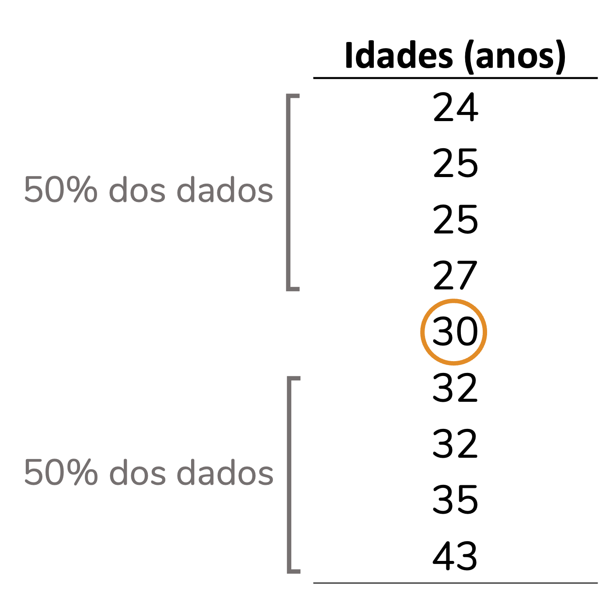
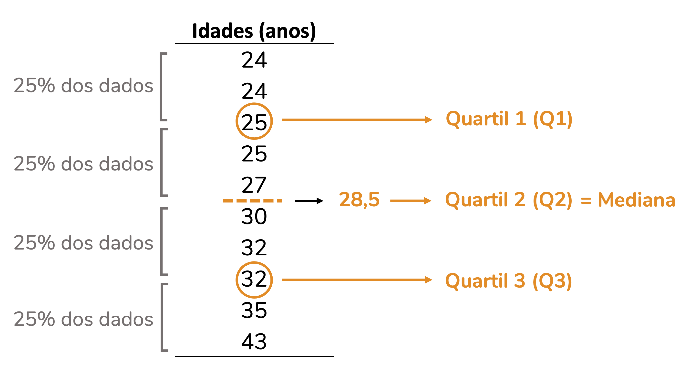
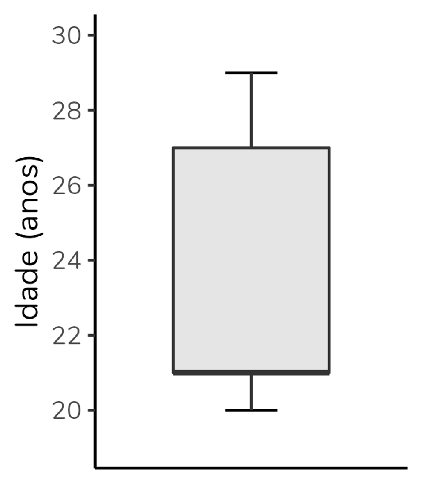

 
```{r, include=FALSE}
knitr::opts_chunk$set(fig.width = 5, fig.height = 5, cache = TRUE)
library(tidyverse)
```
  
Se você está na área de análise de dados ou na área acadêmica, é provável que você já tenha visto um gráfico com aparência um tanto peculiar, como o acima, inspirado no artigo de Schenk & Steppan (2014).  
Trata-se de um gráfico cujo nome em português é “diagrama de caixas,” mas que é muito mais conhecido pelo seu nome em inglês: boxplot.  
Ok, mas como interpretá-lo? O boxplot é composto por seis elementos: limite inferior, quartil 1, mediana (= quartil 2), quartil 3, limite superior e outliers. Portanto, para interpretá-lo antes precisamos entender cada um desses elementos.  
  
```{r, include=FALSE}
Páginas <- c(4, 5, 6, 6, 11, 1, 4, 6, 13, 15, 15, 18, 19,
             32, 2, 4, 6, 13, 18, 18, 21, 21, 25)
Grupo <- c(rep("Graduação", 5), rep("Pós-graduação", 9), rep("Pós-doutorado", 9))

dados <- as.data.frame(Páginas)
dados$Grupo <- factor(Grupo, levels = c("Graduação", "Pós-graduação", "Pós-doutorado"))

g1 <- ggplot(dados, aes(x = Grupo, y = Páginas)) +
  geom_boxplot(linetype = "dashed", outlier.shape = 1) +
  stat_boxplot(aes(ymin = ..lower.., ymax = ..upper..), outlier.shape = 1) +
  stat_boxplot(geom = "errorbar", aes(ymin = ..ymax..), width = 0.4) +
  stat_boxplot(geom = "errorbar", aes(ymax = ..ymin..), width = 0.4) +
  labs(y = "Quantidade de páginas") +
  theme_classic() +
  theme(text = element_text(family = "Nunito"))

ggsave(plot = g1, "g1.png", width = 3.4, height = 2.8, dpi = 400)
```
  
```{r, echo=FALSE, fig.align='center', out.width = '350px'}
knitr::include_graphics("g2.png")
```
<center><font size = '3'>Elementos que compõem um boxplot.</font></center>
  
  
### Os quartis e a mediana  
  
Os quartis são as medidas que delimitam a caixa em um boxplot (como você pode ver na figura acima). Mas, o que são quartis?  
Eu acho mais fácil entender o conceito de quartis a partir do conceito de mediana. Então, vamos a ela.  
  
#### A mediana  
  
A mediana é o valor central de um conjunto de dados, quando esse conjunto está organizado de forma crescente. A mediana divide o conjunto em duas partes: 50% dos valores serão iguais ou inferiores a ela, e os outros 50% serão iguais ou superiores. Vejamos isso na prática. Observe que no conjunto de dados abaixo (já organizado de forma crescente) o valor **30** é o valor central: 50% dos dados estão abaixo e 50% estão acima dele.  
  
```{r, echo=FALSE, fig.align='center', out.width= '220px'}

```
  
Se o conjunto de dados tiver uma quantidade par de valores, então a mediana será a média entre os dois valores centrais, como no caso abaixo, em que a mediana é **28,5**:
  
```{r, echo=FALSE, fig.align='center', out.width= '330px'}
knitr::include_graphics("g4.png")
```
  
#### Os quartis  
  
A lógica por trás dos quartis é muito semelhante à lógica da mediana. Mas, ao invés de dividir o conjunto de dados em duas partes iguais, como a mediana, os quartis dividem esse conjunto em quatro (daí vem o nome quartis), cada um contendo 25% (um quarto) dos dados. Veja no exemplo abaixo. Note que o quartil 2 corresponde à mediana.    
  
```{r, echo=FALSE, fig.align='center', out.width= '470px'}

```
  
Apesar da lógica ser sempre a mesma, há mais de uma forma de calcular os quartis. Por isso, os valores de quartis calculados por diferentes softwares estatísticos podem divergir – e, possivelmente, vão diferir do cálculo manual que vimos aqui. Se quiser ler a respeito, recomendo o artigo de @hyndman1996sample.
  
O segundo quartil (ou seja, a mediana) será a linha que corta a caixa do boxplot. Já o primeiro quartil (Q1) será a base da caixa e o terceiro quartil (Q3) o topo. Observe o gráfico boxplot abaixo, construído com os valores da tabela. Note que a base da caixa corresponde ao valor 25, o topo ao 32 e a linha central ao 28,5.   
  
Outro ponto interessante: a altura da caixa corresponde à diferença entre o terceiro e o primeiro quartil (Q1 - Q3). Essa diferença recebe o nome de **amplitude interquartil**, um termo que eu abreviarei aqui como AIQ, mas que também é comumente abreviada como IQR (que vem do termo em inglês, *interquartile range*). Note que no boxplot abaixo a AIQ, ou seja, a altura da caixa, é igual a 32 - 25 = 7.  
  
```{r, echo=FALSE, fig.align='center', out.width = '200px'}
df <- c(24, 24, 25, 25, 27, 30, 32, 32, 35, 43)
df <- as.data.frame(df)

g6 <- ggplot(df, aes(x = "", y = df)) +
  geom_errorbar(stat = "boxplot", width = 0.3) +
  geom_boxplot(outlier.shape = 1, width = 0.6) +
  scale_y_continuous(breaks = seq(24, 44, by = 2)) +
  labs(y = "Idade (anos)", x = NULL) +
  theme_classic() +
  theme(text = element_text(family = "Nunito"),
        axis.ticks.x = element_blank(),
        panel.grid.major.y = element_line(color = "grey90"))

ggsave(plot = g6, "g6.png", width = 2, height = 2.8, dpi = 400)

knitr::include_graphics("g6.png")
```
  
### Os limites superior e inferior  
  
Além dos quartis, um boxplot é composto pelos **limites superior e inferior**. Esses limites correspondem, respectivamente, ao **maior e menor valor do conjunto de dados que não sejam *outliers***. Um *outlier* é um valor que destoa do conjunto de dados, o que podemos chamar em português de "valor discrepante" - mas aqui, de novo, o termo em inglês é mais conhecido e usado.  
  
E como definir se um valor é *outlier*? Para isso, precisamos calcular os limites superior e inferior **teóricos**. Esses limites são definidos com base na amplitude interquartil (AIQ). Da seguinte forma:  
  
<center>
> Limite inferior teórico = $Q1 - 1,5 \times AIQ$  
Limite superior teórico = $Q3 + 1,5 \times AIQ$  

</center>
  
Na verdade, esse 1,5 pode variar. Mas, 1,5 é o **valor padrão** para o cálculo desses limites. Ao usarmos o valor de 1,5 estamos criando o **boxplot de Tukey** (que é o que sai por padrão nos softwares). Cerca de 0.7% dos valores serão considerados outliers se usarmos esse critério - se quiser se aprofundar, há uma discussão [nesse link](https://www.kaggle.com/general/129242).  
  
Bom, para isso fazer mais sentido, vamos calcular os limites para os nossos dados:  
  
<center>
Limite inferior teórico = $Q1 - 1,5 \times AIQ$  
Limite inferior teórico = $25 - 1,5 \times 7$  
Limite inferior teórico = $25 - 10,5$  
Limite inferior teórico = $14,5$  
  
<br><br>

Limite superior teórico = $Q3 + 1,5 \times AIQ$  
Limite superior teórico = $32 + 1,5 \times 7$  
Limite superior teórico = $32 + 10,5$  
Limite superior teórico = $42,5$  
  
</center>
  
Agora o que faremos será comparar os nossos limites teóricos com os nossos dados.  
Observe que não há no nosso banco valores abaixo do nosso limite inferior teórico. Logo, nosso limite inferior verdadeiro - que irá para o gráfico - será o menor valor do banco, o 24.  
Por outro lado, há um valor que está acima do limite superior teórico, o valor 43. Esse valor será considerado um *outlier*. O limite inferior verdadeiro, que será plotado no gráfico, será, portanto, o maior valor do banco exceto o outlier. No caso, o valor 35. O 43, por ser um *outlier* será representado por um círculo (em geral, aberto) na altura do eixo y (vertical) correspondente ao 43.  
  
```{r, echo=FALSE, fig.align='center', out.width= '450px'}
knitr::include_graphics("g7.png")
```
  
Veja como o gráfico traz exatamente essas informações:  
  
```{r, echo=FALSE, fig.align='center', out.width = '200px'}
knitr::include_graphics("g6.png")
```
  
### Boxplots na horizontal  
  
É possível (e até comum em algumas áreas) representar boxplots na horizontal, ou seja, com a variável de grupo no eixo y (vertical) e a variável numérica no eixo x (horizontal).  
A interpretação será a mesma. Veja abaixo o mesmo boxplot que construímos, mas na horizontal:  
  
```{r, echo=FALSE, fig.align='center', out.width = '330px'}
g8 <- ggplot(df, aes(x = "", y = df)) +
  geom_errorbar(stat = "boxplot", width = 0.3) +
  geom_boxplot(outlier.shape = 1, width = 0.6) +
  scale_y_continuous(breaks = seq(24, 44, by = 2)) +
  labs(y = "Idade (anos)", x = NULL) +
  coord_flip() +
  theme_classic() +
  theme(text = element_text(family = "Nunito"),
        axis.ticks.y = element_blank(),
        panel.grid.major.x = element_line(color = "grey90"))

ggsave(plot = g8, "g8.png", height = 2, width = 2.8, dpi = 400)

knitr::include_graphics("g8.png")
```
  
Eu confesso que sou tradicional e tendo a preferir os boxplots na vertical, mas é uma questão de estilo. Sinta-se livre para usar como preferir.  
  
### E os boxplots esquisitinhos?  
  
Quando eu fiz um conteúdo no [Instagram](https://instagram.com/estatisticaaplicada) explicando a construção e interpretação de boxplots, a pergunta que eu mais recebi foi: "tá, mas e aqueles boxplots com pedaços faltando?".  
As pessoas se referiam a boxplots como o do grupo "Graduação" no gráfico abaixo, mostrado no início do post:  
  
```{r, echo=FALSE, fig.align='center', out.width = '350px', fig.cap=paste0('Gráfico boxplot, inspirado no gráfico do artigo de @schenk2014too.')}
knitr::include_graphics("g1.png")
```
  
Mas, não há muito segredo. Todos os elementos que vimos - limite inferior, Q1, Q2, Q3, limite inferior - sempre estarão no boxplot. Se você não está enxergando um deles, é porque seu valor coincide com outro, e haverá sobreposição no gráfico.  
No caso do grupo "Graduação", a mediana está sobreposta ao Q3 e ao limite superior - ou seja, para esse grupo a mediana, o Q3 e o limite superior são valores idênticos. É por isso que não estamos vendo o T se projetando para além do topo da caixa e é também por isso que o topo da caixa está representado por uma linha mais grossa que a base da caixa (indicando que a mediana está lá).  
  
Vejamos mais alguns exemplos.  
  
No gráfico abaixo, a mediana se sobrepõe ao Q1 (note que a base da caixa está representada por uma linha mais grossa):  
  
```{r, echo=FALSE, fig.align='center', out.width = '180px'}

```
  
Já nesse gráfico, a mediana se sobrepõe ao Q1 (a base da caixa está representada por uma linha mais grossa) e o limite superior está sobreposto ao Q3 (não há o clássico T se projetando paa além do limite superior):  
  
```{r, echo=FALSE, fig.align='center', out.width = '180px'}
knitr::include_graphics("g10.png")
```
  
  
### Quando usar um gráfico boxplot?  
  
Em quais situações faz sentido usar um gráfico boxplot?  
Trata-se de um gráfico usado quando queremos representar a distribuição de uma **variável numérica ou, pelo menos, ordinal**. No caso, representamos a distribuição da variável idade na nossa amostra.  
Além da variável numérica/ ordinal, podemos **incluir uma variável de grupo**, como o boxplot do começo do post. Esse boxplot que mostra a distribuição da quantidade de páginas de artigos selecionados por alunos divididos em três grupos: graduação, pós-graduação e pós-doutorado. Basta uma rápida olhada para percebermos que a mediana de páginas do grupo “Graduação” é inferior às medianas dos demais grupos. Podemos também observar que o grupo com maior variação absoluta (ou seja, maior diferença entre o maior e menor valor) é o grupo "Pós-graduação". Já o grupo "Pós-doutorado" apresenta a maior amplitude interquartil (ou seja, a caixa mais alta). Poderíamos também usar o boxplot para avaliar a simetria da distribuição, mas essa discussão fica para outro post.  
  
  
```{r, echo=FALSE, fig.align='center', out.width = '350px'}
knitr::include_graphics("g1.png")
```
<center>Gráfico boxplot, inspirado no gráfico do artigo de @schenk2014too.</center><br>
  
  
Além disso, perceba que o boxplot não é baseado em média nem em medidas de dispersão derivadas da média (como desvio-padrão e variância). Portanto, é um gráfico excelente para **distribuições que não são bem representadas pela média**, sendo ótimo para distribuições não-normais.  
  
Mas, claro, não é um gráfico para todas as audiências. Veja quantos parágrafos eu gastei para explicá-lo nesse texto. O boxplot é excelente para uso pelo time de dados, para publicações acadêmicas, mas em geral péssimo para contextos como divulgação científica e matérias jornalísticas.  
  
### Como fazer um boxplot?  
  
Nas suas últimas versões, o Excel implementou o boxplot. [Nesse vídeo](https://youtu.be/DWs98A0yCMQ) eu explico como fazê-lo.  
  
Se você for um amante do R (como eu), minha sugestão é montar o boxplot pelo pacote `ggplot2`. Eu tenho um vídeo bem detalhado sobre [boxplot no ggplot2](https://youtu.be/-XQPlOG12vc).  
Se ggplot2 é algo que te angustia (socorro, por que tantas linhas para gerar um único gráfico?), eu tenho uma playlist com vários vídeos ensinando a construir [gráficos no ggplot2 do zero](https://youtube.com/playlist?list=PLOw62cBQ5j9X5eOavzeu9CaHMO6TFsPkY). Efeitos colaterais de aprender a mexer no ggplot2: amor incondicional e não querer fazer sequer um gráfico de barras em outro software, haha!  
  
Mas, vou deixar um código simples, para você usar como base. Partindo de um `data frame` chamado `dados` contendo os grupos em uma coluna e a quantidade de páginas em outra, temos:
  
  
```{r, include=FALSE}
g11 <- ggplot(dados, aes(x = Grupo, y = Páginas)) +
  geom_errorbar(stat = "boxplot", width = 0.3) +
  geom_boxplot(outlier.shape = 1, fill = "grey95") +
  labs(y = "Quantidade de páginas") +
  theme_classic()

ggsave(plot = g11, "g11.png", height = 2.5, width = 3.4, dpi = 400)
```
  

```{r, eval=FALSE}
ggplot(dados, aes(x = Grupo, y = Páginas)) +
  geom_errorbar(stat = "boxplot", width = 0.3) +
  geom_boxplot(outlier.shape = 1, fill = "grey95") +
  labs(y = "Quantidade de páginas") +
  theme_classic()
```
```{r, echo=FALSE, fig.align='center', out.width='400px'}
knitr::include_graphics("g11.png")
```

  

#### Como citar esse post, nas normas da ABNT
  
  
> PERES, Fernanda F. **Como interpretar (e construir) um gráfico boxplot?**. Blog Fernanda Peres, São Paulo, 29 mar. 2022. Disponível em: https://fernandafperes.com.br/blog/interpretacao-boxplot/.

  
***
  
### Referências:  
  
