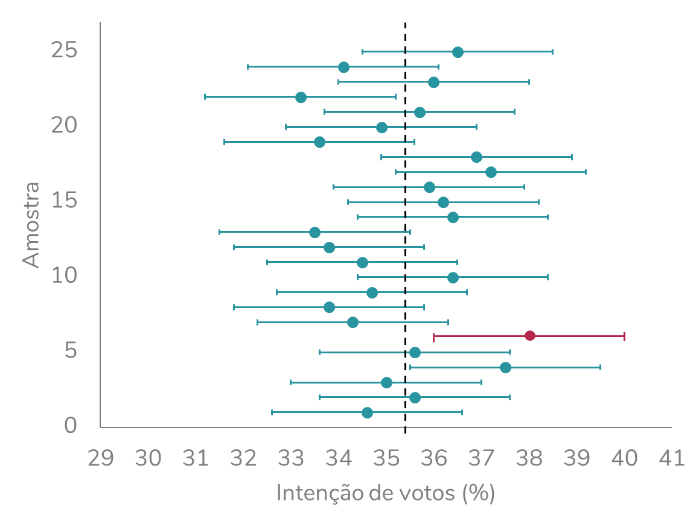

  
Um conceito muito usado – e consideravelmente mal interpretado – em estatística é o **intervalo de confiança**. Para entender o conceito de intervalo de confiança, precisamos antes compreender (ou pelo menos relembrar) os conceitos de população e amostra.  
  
### População x amostra  
  
Chamamos de população o conjunto de todos os sujeitos experimentais que interessam ao pesquisador. Vamos usar como exemplo uma pesquisa eleitoral para o cargo de governador do estado da Bahia. Nesse caso, a população será composta por **todos os eleitores desse estado**. No entanto, uma pesquisa que incluísse todos os eleitores seria extremamente cara e demorada. A alternativa, portanto, é incluir na pesquisa eleitoral apenas uma parcela dos eleitores do estado da Bahia (ou seja, uma parcela da nossa população). Essa parcela corresponde à **amostra**.  
Chamamos de amostra o subconjunto da população de que fato é estudado. A partir dos resultados obtidos em uma amostra, podemos chegar a conclusões sobre a população. Isso é chamado de **inferência estatística**. O processo de seleção da amostra a partir da população recebe o nome de **amostragem**.  
  
```{r, echo=FALSE, fig.align='center', out.width = '450px'}
knitr::include_graphics("img1.png")
```
  
As informações extraídas da **população** – como média, desvio-padrão, proporções – são chamadas de **parâmetros** e são, em sua maioria, representadas por letras gregas. Já as informações provenientes de uma **amostra** recebem o nome de **estatísticas**, e são representadas por letras do nosso alfabeto, o romano.  
  
```{r, echo=FALSE, fig.align='center', out.width = '450px'}
knitr::include_graphics("img2.png")
```
  
### A relação entre o erro estatístico e o intervalo de confiança  
  
É importante entender que sempre que usamos amostras, estamos trabalhando com uma chance de erro. Esse erro é chamado de **erro estatístico**. Voltando ao exemplo da pesquisa eleitoral, imagine que uma determinada candidata tem 34% das intenções de votos na amostra que estudamos. É improvável que, ao perguntarmos a intenção de votos a toda a população, obtenhamos exatamente essa mesma porcentagem. Essa divergência entre as proporções será observada mesmo quando a amostra for selecionada adequadamente – sem erros ou má intenção. A vantagem é que, usando a estatística, conseguimos **estimar esse erro** quando estamos usando amostras aleatórias.  
  
```{r, echo=FALSE, fig.align='center', out.width = '450px'}
knitr::include_graphics("img3.png")
```
  
Uma forma de estimação que considera esse erro é o **intervalo de confiança**. No caso da pesquisa eleitoral, por exemplo, poderíamos, a partir da intenção de votos obtida na amostra, calcular um intervalo dentro do qual é provável que a intenção de votos da população se encontre.  
Estamos aqui usando um exemplo com proporção, mas o intervalo de confiança pode ser usado para estimar qualquer parâmetro de uma população a partir das estatísticas de uma amostra. Podemos calcular intervalos de confiança para médias, para tamanhos de efeito – como a razão de chances, o coeficiente de correlação –, entre muitas outras possibilidades.  
  
### Nível de confiança  
  
O intervalo de confiança está sempre associado a um **nível de confiança**, pré-estabelecido. Esse nível de confiança é **sempre complementar ao nível de significância (α)**. Ou seja, quando usamos um α de 5%, utilizamos um intervalo de confiança (IC) 95% (100% - 5%). Podemos também usar outros níveis de confiança, como 90% (quando usamos $\alpha$ = 10%) ou 99% (quando usamos $\alpha$ = 1%).  
  
### A interpretação correta do intervalo de confiança  
  
Como interpretar esse intervalo? Vamos imaginar uma situação em que intenção de votos para um determinado candidato a governador, na população, é de 35,5%. Mas, nós não temos acesso a toda a população. Portanto, selecionamos uma amostra de 2000 eleitores e analisamos a intenção de votos deles, chegando a uma proporção de 34%.  
Sabendo que temos a limitação de estar trabalhando com uma amostra, calculamos um intervalo de confiança para essa intenção de votos. Com isso, definiremos um intervalo dentro do qual é provável que a intenção de votos da população se encontre. Esse intervalo dependerá da porcentagem obtida e do tamanho da amostra.  
Vamos imaginar que calculamos o IC e obtivemos:  


<center>IC 95%: 32% - 36%</center>
  
<br><br>

> Como calcular um intervalo de confiança para proporções? Se a matemática por trás não te interessa, fique à vontade para pular essa caixa – isso não vai atrapalhar o seu entendimento do conceito.  
Para calcularmos um intervalo de confiança para proporções, usamos a fórmula:
$$IC(1-\alpha) = \hat{p} \pm z_{\alpha/2} \times \sqrt\frac{\hat{p} \times (1-\hat{p})}{n}$$
Na qual $\hat{p}$ corresponde à proporção observada na amostra, n corresponde ao tamanho da amostra e z corresponde ao valor de z para determinado valor de nível de significância ($\alpha$). O valor de z pode ser encontrado em tabelas, ou obtido em programas como R ou Excel.  
Para um nível de significância de 5% (portanto, para calcularmos um intervalo de confiança 95%), z equivale a 1,96.  
No R, z pode ser obtido usando a função `qnorm`, a qual deve receber como argumento: 1 – $\alpha$/2.
  
<br><br>
Como interpretar esse intervalo?  
É comum as pessoas pensarem que há uma probabilidade de 95% da intenção de voto populacional estar contida nesse intervalo. **Essa interpretação está errada**.  
O intervalo de confiança, na verdade, se refere a um **cenário hipotético** em que tivéssemos coletado várias amostras dessa mesma população.  
Vamos imaginar que:  
  
* Coletamos 1000 amostras de 2000 pessoas dessa população;
* Obtivemos a intenção de votos de cada amostra;
* Calculamos para cada uma delas um intervalo de confiança 95%.  
  
Dos 1000 intervalos de confiança calculados, espera-se que 95% deles (no caso, 950 intervalos) contenham a intenção de votos da população, 35,5%.  
  
Vejamos isso em um gráfico:  
  
```{r, echo=FALSE, fig.align='center', out.width = '450px'}

```
  
Os círculos representam a intenção de votos e as linhas horizontais representam o intervalo de confiança (IC) 95% de cada uma das amostras coletadas. Observe que, das 25 amostras coletadas, 95% delas, ou seja, 24 (em azul), incluem o parâmetro populacional (linha pontilhada, 35,5%) no seu intervalo de confiança. Já uma amostra (em rosa) não inclui.  
Fizemos um gráfico com apenas 25 amostras para facilitar a visualização. Mas, se o gráfico incluísse 1000 amostras, esperaríamos a mesma proporção: das 1000 amostras, seria esperado que 50 delas não incluíssem a intenção de votos populacional no seu IC 95%. Uma **limitação** é que quando coletamos uma amostra, não temos como saber se ela é uma das 95% das amostras que contém o parâmetro populacional no seu IC ou não.  
  
### A margem de erro  
  
É provável que você já tenha ouvido falar em **margem de erro**. A margem de erro é um conceito intimamente associado ao intervalo de confiança. A margem de erro corresponde à metade da amplitude do intervalo de confiança.  
No exemplo anterior, temos uma margem de erro de 2%. Isso significa que o intervalo de confiança se estende em 2% para mais e para menos, a partir do valor amostral - no caso, os 34% de intenção de votos obtidos na amostra.  
Observe que no exemplo, temos os seguintes limites para o intervalo de confiança:  
  
<center>Limite inferior: 34% - 2% = 32%  
Limite superior: 34% + 2% = 36%</center>  
  
  
### A relação entre a margem de erro e o tamanho da amostra  
  
A forma de calcular o intervalo de confiança/ margem de erro depende de qual o parâmetro que pretendemos estimar: se é uma média, uma proporção, uma razão de chances, etc. Mas, todos esses cálculos têm em comum levarem em consideração o **tamanho da amostra** e o **nível de confiança**.  
Quanto maior o tamanho da amostra, menor será a margem de erro. Ou ainda podemos pensar: quanto maior for a amostra, mais estreito será o intervalo de confiança.  
É importante também entender que **essa relação não é linear**. Observe as simulações abaixo, realizadas com base na fórmula que vimos acima. Os cálculos da tabela abaixo consideram uma proporção de 50% e um nível de significância de 5%:  
  
```{r, echo=FALSE, fig.align='center', out.width = '350px'}

```
  
> Para esse cálculo, usamos a fórmula que já vimos acima:  
$$IC(1-\alpha) = \hat{p} \pm z_{\alpha/2} \times \sqrt\frac{\hat{p} \times (1-\hat{p})}{n}$$  
A seguinte porção da fórmula corresponde ao erro:  
$$Erro = z_{\alpha/2} \times \sqrt\frac{\hat{p} \times (1-\hat{p})}{n}$$  
Elevando os dois lados ao quadrado, teremos:  
$${Erro}^2 = {(z_{\alpha/2})}^2 \times \frac{\hat{p} \times (1-\hat{p})}{n}$$  
Isolando o n, temos:
$$n = {(z_{\alpha/2})}^2 \times \frac{\hat{p} \times (1-\hat{p})}{{Erro}^2}$$
  
O que é menos intuitivo é que o tamanho da amostra não depende do tamanho da população. Observe que esse parâmetro não está incluído na fórmula.  
  
#### A margem de erro e as pesquisas eleitorais  
  
Geralmente, pesquisas eleitorais optam por uma margem de erro de 2% ou 3%. Por isso, normalmente incluem cerca de 2000 pessoas. É comum vermos pessoas argumentando que é impossível que as 2000 pessoas representem os 146,4 milhões de eleitores brasileiros. Mas, podem representar. Por que eu disse “podem”? Bom, porque é importante fazer uma ressalva: esses cálculos **são válidos para amostras aleatórias**. Não é o caso das pesquisas eleitorais brasileiras, que usam a amostragem por cotas.  
Portanto, a desconfiança tem sentido. Mas não pelo tamanho da amostra, e sim pela forma como ela é selecionada a partir da população.  
  
### A relação entre a margem de erro e o nível de confiança  
  
Outro fator que influencia a margem de erro é o nível de confiança. Quanto maior for o nível de confiança, mais amplo será o intervalo de confiança. Ou ainda: maior será a margem de erro.  
Observe as simulações abaixo, as quais consideraram uma proporção na população de 50% e mantêm constante um tamanho de amostra de 1000 sujeitos:  
  
```{r, echo=FALSE, fig.align='center', out.width = '350px'}
knitr::include_graphics("img6.png")
```
  
Para isso fazer mais sentido, observe o gráfico abaixo, que já discutimos nesse post. Nesse gráfico, 95% das amostras contêm o parâmetro populacional no seu IC. Se quiséssemos que 99% das amostras o contivessem, precisaríamos ampliar o intervalo – em outras palavras, precisaríamos aumentar a margem de erro.  

```{r, echo=FALSE, fig.align='center', out.width = '450px'}

```
  
  
#### Como citar esse post, nas normas da ABNT
  
  
> PERES, Fernanda F. **Como interpretar o intervalo de confiança?**. Blog Fernanda Peres, São Paulo, 08 jun. 2021. Disponível em: https://fernandafperes.com.br/blog/intervalo-de-confianca/.
  
  
  
<br><br><br>