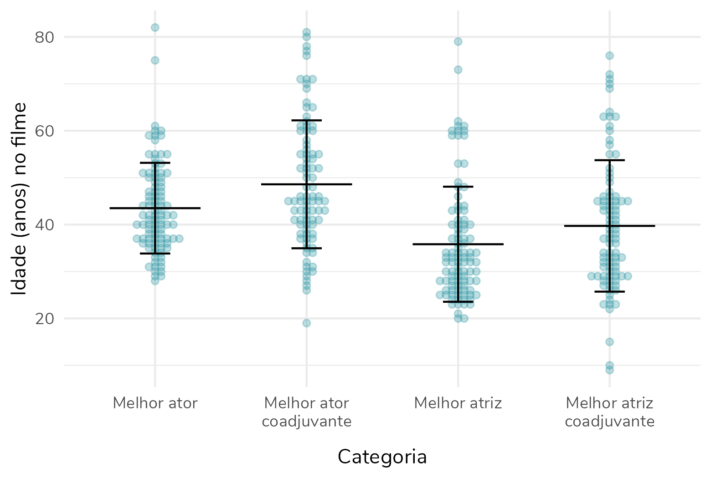
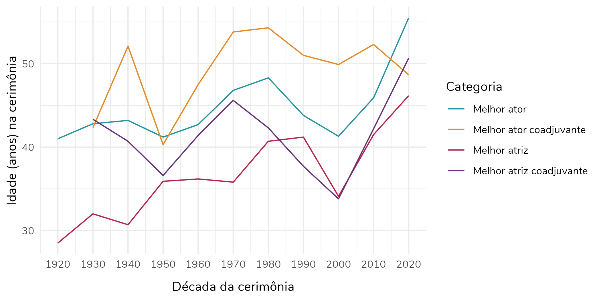

<div class = "parentfaq">
<div class = "faq">
<center>
*Michelle Yeoh, vencedora do Oscar de Melhor atriz na cerimônia de 2023, aos 60 anos.*
</center>
</div></div>
  
#### A hipótese a ser investigada
  
Desde que Mikey Madison ganhou o Oscar de melhor atriz no dia 03 de março de 2025, aos 25 anos, uma discussão tem tomado conta das redes sociais. Muitas pessoas argumentam que as mulheres premiadas nas categorias de melhor atriz e melhor atriz coadjuvante **tendem a ser mais jovens** que os homens premiados nas categorias correspondentes.  
  
Por outro lado, outros defendem que isso não é bem verdade e que **mulheres mais velhas têm sido premiadas com frequência nos últimos anos** -- uma das mulheres utilizadas como exemplo para essa tese é a Michelle Yeoh, ganhadora do Oscar de melhor atriz aos 60 anos.  
  
Esse último argumento me incomodou particularmente. Com certeza existem mulheres que foram premiadas mais velhas, acima dos 50 ou 60 anos. Mas, a existência dessas premiações não é **evidência suficiente para rejeitar a hipótese** em questão: em geral (e aqui vamos pensar "em média") as mulheres que são premiadas nas categorias de melhor atriz são mais jovens que os homens premiados nas categorias de melhor ator?  
  
  
#### Como testar essa hipótese?
  
Para avaliar se esse é mesmo o caso precisamos de... Dados. Aqui a academia não nos ajuda. O [site](https://awardsdatabase.oscars.org/) oferece um "database" que não gera uma planilha, o que dificulta consideravelmente a análise.  
  
Portanto, para avaliar as idades dos homens e mulheres ganhadores dos Oscars nas categorias de atuação eu trabalhei com as seguintes bases de dados:  
  
<br />
  
1. The Oscar Award, 1927 - 2024 - Extraída do [Kaggle](https://www.kaggle.com/datasets/unanimad/the-oscar-award)
  - Essa base inclui os indicados ao Oscar em todas as categorias, de 1927 (primeira cerimônia) até 2024 (penúltima cerimônia). Aqui temos uma lista com todos os indicados ao Oscar nesse período, em todas as categorias. Há o nome do indicado, o filme ao qual a indicação se refere, e uma coluna que indica se essa pessoa venceu ou não o Oscar daquele ano.
  - Como você já deve ter percebido, ainda que seja uma base de dados excelente, ela ainda não nos permite responder à nossa pergunta, porque não traz informações sobre a idade ou data de nascimento dos indicados. Portanto, considerei também uma segunda base...
  
<br />
  
2. Demographics of Academy Awards (Oscars) Winners - Também extraída do [Kaggle](https://www.kaggle.com/datasets/fmejia21/demographics-of-academy-awards-oscars-winners)
  - Essa base inclui apenas os vencedores do Oscar -- ou seja, ao contrário da base anterior não inclui aqueles que foram indicados, mas não venceram. Isso me fez decidir avaliar apenas os vencedores.
  - A base inclui a data de nascimento de todos os vencedores -- o que, ótimo, vai nos ajudar a responder à nossa pergunta. Mas... Ela só tem dados das premiações de 1927 a 2014. O que nos leva a uma terceira etapa de coleta dos dados.
  
<br />
  
3. Preenchimento manual com base em pesquisa na Wikipedia das seguintes informações:
  - Os vencedores do Oscar de 2025, que não constavam na base -- inclui seus nomes, nomes dos filmes e suas datas de nascimento.
  - Datas de nascimento dos vencedores de 2015 a 2024, bem como de alguns poucos atores/ atrizes cuja data de nascimento não constava na base 2. Aqui, como eu mencionei, eu usei como base a data fornecida pela Wikipedia. Sim, eu sei que a data de nascimento fornecida pela Wikipedia não é 100% confiável. Mas eu assumi que, como eu precisava de informações mais recentes, as datas de nascimento seriam mais confiáveis.
  - E, sim, eu poderia ter feito um *web scraping* ao invés de um preenchimento manual. Mas, as minhas habilidades com *web scraping* são tão limitadas que eu com certeza demoraria mais indo por esse caminho.  
  
<br />
  
Isso tudo foi unido e devidamente processado -- por exemplo, as datas fornecidas pela base 2 não seguiam um padrão e tiveram que ser ajustadas.  
  
<details>
<summary>Clique para ver o código de download e organização das bases</summary>
```{r, eval=FALSE, warning=FALSE, message=FALSE}
library(tidyverse)

# Leitura da base baixada em: https://www.kaggle.com/datasets/unanimad/the-oscar-award
dados <- read_csv("the_oscar_award.csv") |> 
  dplyr::filter(grepl('ACTOR|ACTRESS', category)) |>
  filter(winner == T)
# Essa base resulta em 370 vencedores nas categorias de atriz ou ator

# Leitura da base baixada em: https://www.kaggle.com/datasets/fmejia21/demographics-of-academy-awards-oscars-winners
dados2 <- read_csv("Oscars-demographics-DFE.csv") |> 
  dplyr::filter(grepl('Actor|Actress', award)) |> 
  select(c(date_of_birth, person)) |> 
  distinct()
# Essa base resulta em 283 vencedores nas categorias de atriz ou ator distintos, com suas respectivas datas de nascimento

# Renomeando a coluna "person" da base 2, para uni-la com a base 1
colnames(dados2)[2] <- c("name")

# União das duas bases
dados <- dplyr::left_join(dados, dados2)

# Filtragem dos dados que tinham data de nascimento e organização dessa data
dados_com_data <- dados |> 
  filter(!is.na(date_of_birth)) |> 
  separate_wider_delim(cols = 8, delim = "-",
                       names = c("d", "m", "y")) |> 
  mutate(d = ifelse(as.numeric(d) < 10, paste0("0", d), d),
         y = ifelse(as.numeric(y) > 1000, y,
                    paste0("19", y)),
         date_of_birth = as.Date(paste0(d, "-", m, "-", y),
                                 format = "%d-%b-%Y")) |> 
  select(-c("d", "m", "y"))

# Filtragem dos dados sem data de nascimento para preenchimento manual
dados_sem_data <- dados |> 
  filter(is.na(date_of_birth))

# Salvando os dados sem data de nascimento para preenchimento manual
# dados_sem_data |> 
#   writexl::write_xlsx("dados_para_adicionar_data.xlsx")

# Lendo a base de dados preenchida manualmente
dados_sem_data <- readxl::read_excel("dados_para_adicionar_data.xlsx")

# Unindo as bases com e sem data
dados <- rbind(dados_com_data, dados_sem_data)
rm(dados_com_data, dados_sem_data, dados2)

# Cálculo das idades dos atores e atrizes no ano da cerimônia e do lançamento do filme
# Considerei que a cerimônia aconteceu sempre em março, para simplificar
dados <- dados |> 
  mutate(age_filming = as.numeric(difftime(as.Date(paste0(year_film,"-01-01")),
                                           date_of_birth)/365.25),
         age_ceremony = as.numeric(difftime(as.Date(paste0(year_ceremony,"-03-01")),
                                            date_of_birth)/365.25)) |> 
  mutate(age_filming = floor(age_filming),
         age_ceremony = floor(age_ceremony))

# Criação da variável gênero, de acordo com a categoria
dados$gender <- ifelse(stringr::str_detect(dados$category, "ACTRESS"),
                       "Feminino", "Masculino")

# Organização da variável categoria
dados$category <- factor(dados$category,
                         levels = c("ACTOR",
                                    "ACTOR IN A LEADING ROLE",
                                    "ACTOR IN A SUPPORTING ROLE", 
                                    "ACTRESS",
                                    "ACTRESS IN A LEADING ROLE",
                                    "ACTRESS IN A SUPPORTING ROLE"),
                         labels = c("Melhor ator",
                                    "Melhor ator",
                                    "Melhor ator coadjuvante", 
                                    "Melhor atriz",
                                    "Melhor atriz",
                                    "Melhor atriz coadjuvante"))

# Renomeando as colunas para português
colnames(dados) <- c("Ano do filme", "Ano da cerimônia", "Cerimônia",
                     "Categoria", "Nome", "Filme", "Vencedor",
                     "Data de nascimento", "Idade (anos) no filme",
                     "Idade (anos) na cerimônia", "Gênero")
```
</details>
  
  
```{r, echo=FALSE, warning=FALSE, message=FALSE}
library(tidyverse)

# Leitura da base baixada em: https://www.kaggle.com/datasets/unanimad/the-oscar-award
dados <- read_csv("the_oscar_award.csv") |> 
  dplyr::filter(grepl('ACTOR|ACTRESS', category)) |>
  filter(winner == T)
# Essa base resulta em 370 vencedores nas categorias de atriz ou ator

# Leitura da base baixada em: https://www.kaggle.com/datasets/fmejia21/demographics-of-academy-awards-oscars-winners
dados2 <- read_csv("Oscars-demographics-DFE.csv") |> 
  dplyr::filter(grepl('Actor|Actress', award)) |> 
  select(c(date_of_birth, person)) |> 
  distinct()
# Essa base resulta em 283 vencedores nas categorias de atriz ou ator distintos, com suas respectivas datas de nascimento

# Renomeando a coluna "person" da base 2, para uni-la com a base 1
colnames(dados2)[2] <- c("name")

# União das duas bases
dados <- dplyr::left_join(dados, dados2)

# Filtragem dos dados que tinham data de nascimento e organização dessa data
dados_com_data <- dados |> 
  filter(!is.na(date_of_birth)) |> 
  separate_wider_delim(cols = 8, delim = "-",
                       names = c("d", "m", "y")) |> 
  mutate(d = ifelse(as.numeric(d) < 10, paste0("0", d), d),
         y = ifelse(as.numeric(y) > 1000, y,
                    paste0("19", y)),
         date_of_birth = as.Date(paste0(d, "-", m, "-", y),
                                 format = "%d-%b-%Y")) |> 
  select(-c("d", "m", "y"))

# Filtragem dos dados sem data de nascimento para preenchimento manual
dados_sem_data <- dados |> 
  filter(is.na(date_of_birth))

# Salvando os dados sem data de nascimento para preenchimento manual
# dados_sem_data |> 
#   writexl::write_xlsx("dados_para_adicionar_data.xlsx")

# Lendo a base de dados preenchida manualmente
dados_sem_data <- readxl::read_excel("dados_para_adicionar_data.xlsx")

# Unindo as bases com e sem data
dados <- rbind(dados_com_data, dados_sem_data)
rm(dados_com_data, dados_sem_data, dados2)

# Cálculo das idades dos atores e atrizes no ano da cerimônia e do lançamento do filme
# Considerei que a cerimônia aconteceu sempre em março, para simplificar
dados <- dados |> 
  mutate(age_filming = as.numeric(difftime(as.Date(paste0(year_film,"-01-01")),
                                           date_of_birth)/365.25),
         age_ceremony = as.numeric(difftime(as.Date(paste0(year_ceremony,"-03-01")),
                                            date_of_birth)/365.25)) |> 
  mutate(age_filming = floor(age_filming),
         age_ceremony = floor(age_ceremony))

# Criação da variável gênero, de acordo com a categoria
dados$gender <- ifelse(stringr::str_detect(dados$category, "ACTRESS"),
                       "Feminino", "Masculino")

# Organização da variável categoria
dados$category <- factor(dados$category,
                         levels = c("ACTOR",
                                    "ACTOR IN A LEADING ROLE",
                                    "ACTOR IN A SUPPORTING ROLE", 
                                    "ACTRESS",
                                    "ACTRESS IN A LEADING ROLE",
                                    "ACTRESS IN A SUPPORTING ROLE"),
                         labels = c("Melhor ator",
                                    "Melhor ator",
                                    "Melhor ator coadjuvante", 
                                    "Melhor atriz",
                                    "Melhor atriz",
                                    "Melhor atriz coadjuvante"))

# Renomeando as colunas para português
colnames(dados) <- c("Ano do filme", "Ano da cerimônia", "Cerimônia",
                     "Categoria", "Nome", "Filme", "Vencedor",
                     "Data de nascimento", "Idade (anos) no filme",
                     "Idade (anos) na cerimônia", "Gênero")

write.csv2(dados, "Dados_Oscar_Fernanda_Peres.csv", row.names = F)
```
  
#### Qual a média de idade dos homens e mulheres que vencem nas categorias de atuação?
  
A média de idade ao receber o prêmio de melhor atriz, durante todo o período (1927 a 2025) foi de **36,9 anos** (*versus* **44,6 anos** para melhor ator). Esse padrão se mantém quando olhamos para a mediana: 33,5 anos para as mulheres e 43 anos para os homens. A interpretação desse dado é: metade das mulheres que ganharam o Oscar de melhor atriz tinham menos de 34 anos no momento da premiação. Para homens, esse valor aumenta em 10 anos: metade dos homens premiados nessa categoria tinham 43 anos ou menos. Isso mostra que os **homens** que ganham o prêmio máximo de atuação são, em geral, **mais velhos** que as mulheres.  
  
Quando avaliamos os prêmios de atrizes e atores coadjuvantes, novamente a média de idade das mulheres é menor: **40,9 anos** *versus* **49,8 anos**. A mediana, mais uma vez, segue a tendência da média. Metade das mulheres premiadas na categoria de atuação coadjuvante tinham até 39 anos no momento da premiação. Entre os homens, metade dos premiados tinham 46 anos ou menos.  
    
```{r, echo=FALSE, message=FALSE, warning=FALSE}
library(flextable)

dados |> 
  group_by(Categoria) |> 
  summarise(`Média` = mean(`Idade (anos) na cerimônia`),
            `Desvio-padrão` = sd(`Idade (anos) na cerimônia`),
            Mínimo = min(`Idade (anos) na cerimônia`),
            Máximo = max(`Idade (anos) na cerimônia`),
            Mediana = median(`Idade (anos) na cerimônia`)) |> 
  mutate(across(c(2:3,6), \(x) scales::number(x, accuracy = 0.1,
                                            decimal.mark = ","))) |> 
  flextable::flextable() |> 
  flextable::bold(part = "header") |> 
  flextable::align(j = -c(1), align = "center", part = "all") |> 
  flextable::autofit()
```

<details>
<summary>Clique para ver o código de que gerou a tabela acima</summary>
```{r, eval=FALSE, message=FALSE, warning=FALSE}
dados |> 
  group_by(Categoria) |> 
  summarise(`Média` = mean(`Idade (anos) na cerimônia`),
            `Desvio-padrão` = sd(`Idade (anos) na cerimônia`),
            Mínimo = min(`Idade (anos) na cerimônia`),
            Máximo = max(`Idade (anos) na cerimônia`),
            Mediana = median(`Idade (anos) na cerimônia`)) |> 
  mutate(across(c(2:3,6), \(x) scales::number(x, accuracy = 0.1,
                                              decimal.mark = ",")))
```
</details>
  
  
<br />
  
E, por mais estranho que pareça, essa análise que fizemos até agora **basta para afirmar** que as mulheres que recebem prêmios na categoria de atuação são em média mais jovens que os homens.  
  
Mas, Fernanda, e os **testes estatísticos**? Não vamos fazer um teste-t, calcular o valor de p? Então... Não vamos!  
  
>E antes que alguém me acuse de não querer fazer o teste porque ele não mostraria diferenças estatisticamente significativas entre as médias, saiba que, sim, ele mostraria. Os valores de p para as duas comparações (melhor atriz x melhor ator e melhor atriz coadjuvante x melhor ator coadjuvante) são menores que 0,001.
  
  
#### Por que não devemos fazer testes estatísticos nesse caso?
  
Para entender o porquê não devemos fazer testes estatísticos aqui -- ou ainda, o porquê a análise das médias basta -- precisamos lembrar de dois conceitos de estatística: população e amostra. Vou discuti-los brevemente, mas já adianto que não é o foco desse post discutir esses conceitos -- caso queira uma discussão mais aprofundada, recomendo [esse post](https://fernandafperes.com.br/blog/intervalo-de-confianca/).  
  
Em resumo, chamamos de **população** a totalidade dos elementos que nos interessam para responder à nossa pergunta de pesquisa. Em muitos casos, é inviável estudar toda a população e, portanto, investigamos apenas uma parcela dessa população, que recebe o nome de **amostra**. Os testes estatísticos são utilizados para fazer inferências -- ou seja, **extrapolar** os resultados obtidos em uma amostra para a população. Perceba que só faz sentido utilizarmos testes estatísticos quando trabalhamos com amostras.  
  
No nosso caso, a **população** é composta por **todos os ganhadores do Oscar** de atuação, no período de 1927 a 2025. E, sim, nós temos acesso a toda a população. Portanto, não precisamos utilizar recursos para fazer inferências. Nossa pergunta é respondida com uma simples análise descritiva.  
  
Nossa pergunta era: "a média de idade de mulheres é menor que a média de idade de homens que ganham Oscar por atuação?". A resposta, como vimos, é **sim**.  
  
  
#### Visualizando as idades nas quatro categorias de interesse
  
No gráfico abaixo cada ponto corresponde a um vencedor do Oscar. As linhas horizontais indicam a média e as barras de erro correspondem ao desvio-padrão. É possível notar que os pontos das duas categorias femininas estão **deslocados para baixo** em relação às categorias masculinas correspondentes -- ou seja, mulheres tendem a tem idades menores quando vencem nessas categorias.  
  
```{r, include=FALSE}
fstatix::paleta_f()
library(ggpubr)

ggplot(dados, aes(y = `Idade (anos) no filme`, x = Categoria)) +
  ggbeeswarm::geom_beeswarm(color = azul, alpha = 0.3) +
  geom_crossbar(stat = "summary", fun = "mean", fatten = 1, width = 0.6) +
  geom_errorbar(stat = "summary", fun.data = "mean_sd", width = 0.2) +
  scale_x_discrete(labels = \(x) fstatix::separar_texto(x, 20)) +
  theme_minimal() +
  theme(text = element_text(family = "Nunito"),
        axis.title.x = element_text(margin = margin(10,0,0,0)))

ggsave("plot1.png", width = 5.2, height = 3.5)
```
  
```{r, echo=FALSE, fig.align='center', out.width = '500px'}

```
  
  
#### Qual a tendência da média de idade ao longo das décadas?
  
Outra pergunta interessante a se responder com esses dados é: o padrão de idades das mulheres premiadas têm mudado ao longo dos anos? Para responder a essa pergunta, eu calculei as médias de idade (na cerimônia) ao longo das décadas.  
  
Podemos observar que para a categoria principal (melhor atriz e melhor ator), **as médias de idade dos homens são superiores às das mulheres em todas as décadas**. E, curiosamente, nos anos 2020 vemos as maiores médias históricas, tanto para os homens quanto para as mulheres.  
  
Para a categoria de atuação coadjuvante, os homens são em média mais velhos em quase todas as décadas, exceto em 1930 e 2020 -- décadas nas quais as médias de idade das mulheres são ligeiramente superiores. Vale destacar que nas demais décadas as médias de idade dos homens são bem superiores às das mulheres.  
  
```{r, include=FALSE}
library(plotly)
dados |> 
  mutate(`Década da cerimônia` = `Ano da cerimônia` - `Ano da cerimônia` %% 10) |> 
  ggplot(aes(x = `Década da cerimônia`,
             y = `Idade (anos) na cerimônia`,
             color = Categoria)) +
  geom_line(stat = "summary", fun = "mean") +
  scale_x_continuous(breaks = seq(1920, 2020, by = 10)) +
  scale_color_manual(values = c(azul, amarelo, rosa, roxo)) +
  theme_minimal() +
  theme(text = element_text(family = "Nunito"),
        axis.title.x = element_text(margin = margin(10,0,0,0)))

ggsave("plot2.png", width = 7, height = 3.5)
```
  
```{r, echo=FALSE, fig.align='center', out.width = '750px'}

```

  
#### Um gráfico interativo para você explorar os dados
  
  
O gráfico abaixo traz todos os dados mencionados aqui. Se você **passar o cursor** pelos pontos, verá quem é o vencedor, qual a sua idade no momento da cerimônia, em que ano essa cerimônia aconteceu e qual o filme pelo qual ele recebeu o Oscar.  
  
  
```{r, include=FALSE}
graf <- ggplot(dados, aes(y = `Idade (anos) na cerimônia`, x = Categoria)) +
  ggbeeswarm::geom_beeswarm(color = azul, alpha = 0.7,
                            aes(text = paste0("Idade: ", `Idade (anos) na cerimônia`,
                                              "<br>", Nome, "<br>",
                                              "Filme: ", Filme, "<br>",
                                              "Ano da cerimônia: ", `Ano da cerimônia`))) +
  # geom_crossbar(stat = "summary", fun = "mean", fatten = 1, width = 0.6) +
  # geom_errorbar(stat = "summary", fun.data = "mean_sd", width = 0.2) +
  scale_x_discrete(labels = \(x) fstatix::separar_texto(x, 20)) +
  theme_minimal() +
  theme(text = element_text(family = "Nunito"),
        axis.title.x = element_text(margin = margin(10,0,0,0)))
```

  
<center>
```{r, echo=FALSE, fig.width=6, fig.height=3.5, fig.align='center', out.width = '500px'}
ggplotly(graf, tooltip = c("text"))
```
</center>

  
  
#### Créditos e base para download
  
Quer utilizar algum gráfico que eu mostrei aqui ou usar a base de dados que eu organizei? Sem problemas, **desde que você me dê os créditos**.  
  
Como baixar a base de dados? A versão final está disponível para [download no meu GitHub](https://raw.githubusercontent.com/fernandaperes/Blog_/refs/heads/master/content/blog/oscar-idades/Dados_Oscar_Fernanda_Peres.csv). Eu não me responsabilizo por quaisquer erros de digitação meus ou das pessoas que disponibilizaram as bases 1 e 2, ok?  
  
  
  
<br />

  
#### Como citar esse post, nas normas da ABNT
  
  
> PERES, Fernanda F. **As idades de atores e atrizes vencedores do Oscar diferem?**. Blog Fernanda Peres, São Paulo, 05 mar. 2025. Disponível em: https://fernandafperes.com.br/blog/oscar-idades/.

