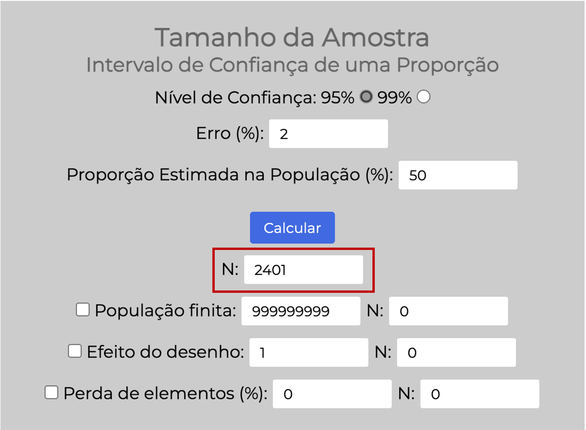
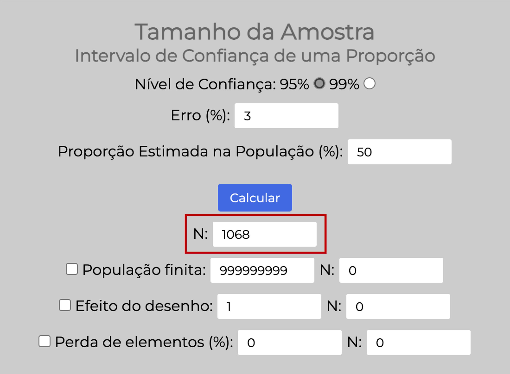
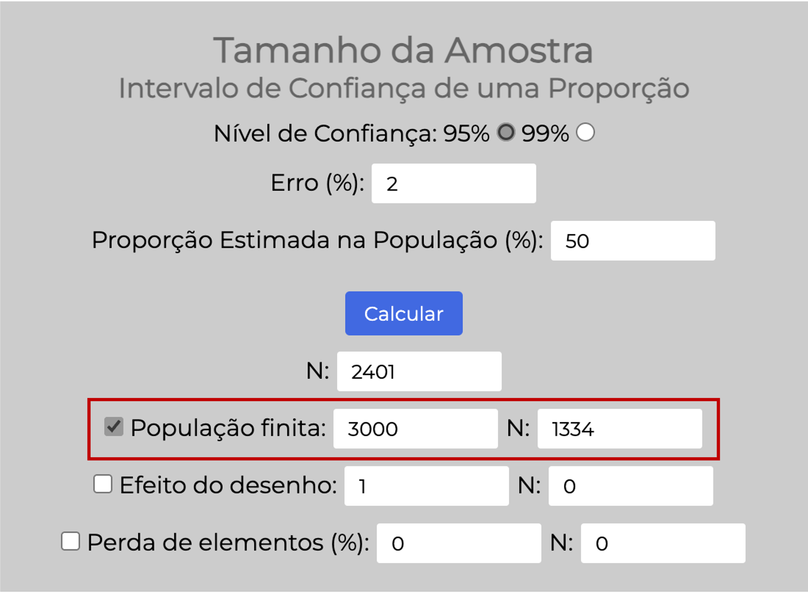
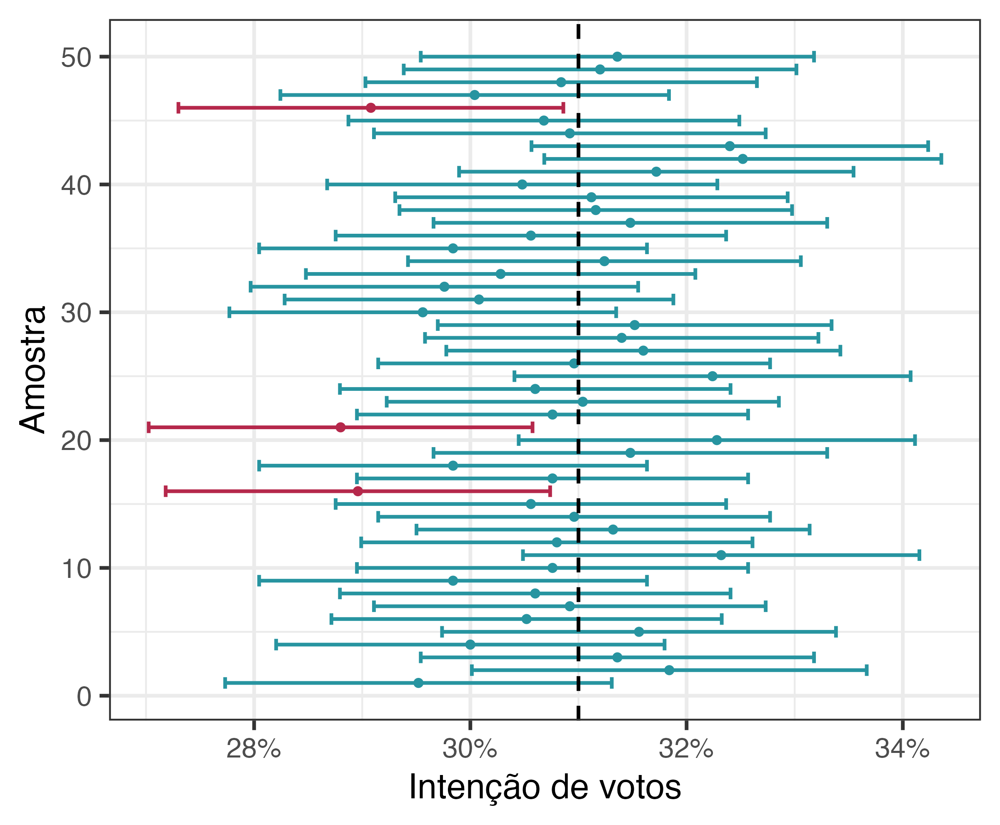

```{r, include=FALSE}
# knitr::opts_knit$set(upload.fun = knitr::imgur_upload, base.url = NULL)
knitr::opts_chunk$set(fig.width = 5, fig.height = 5, cache = TRUE)
```
  
Eu estou escrevendo esse texto em agosto de 2024, poucos meses antes das eleições municipais. E estou deixando aqui a minha previsão: as pesquisas eleitorais vão "errar", para além da margem de erro. Como todas as pesquisas eleitorais podem "errar". E esse é um texto para discutirmos **os porquês**.  
  
>Antes, algumas considerações. Eu não sou estatística. Caso você tenha caído nesse texto por acaso, deixa eu me apresentar: eu sou a Fernanda, bacharel em biomedicina, mestre e doutora em farmacologia e especialista em estatística aplicada. Você consegue informações mais detalhadas sobre a minha formação [aqui](https://fernandafperes.com.br/sobre). Desde 2017 eu produzo conteúdo sobre análise de dados e há alguns anos eu consumo conteúdo sobre a estatística por trás das pesquisas eleitorais. E confesso que eu demorei um bom tempo para entender tudo que eu pretendo discutir com você aqui. Ah, todos os conceitos e hipóteses discutidos aqui não são de minha autoria. No final do post, você encontra uma bibliografia consultada.  
  
<br>
  
Vamos lá: **por que as pesquisas eleitorais "erram"**? A resposta a essa pergunta depende do entendimento de conceitos estatísticos que até fazem parte do nosso dia-a-dia, mas a maior parte das pessoas não compreende em sua totalidade. Então, para responder a essa pergunta com **responsabilidade**, não poderemos fugir desses conceitos.  
  
  
```{r, include=FALSE}
library(tidyverse)

eleitores <- read.csv2("quantidade_de_eleitores.csv", fileEncoding = "latin1")

eleitores$Quantidade_num <- as.numeric(gsub("\\.", "", eleitores$Quantidade))

eleitores |>
  dplyr::filter(Município == "SÃO PAULO") |> 
  reframe(eleitores = sum(Quantidade_num))
```

  
  
## População x amostra
  
Na estatística, chamamos de população o conjunto dos elementos que nos interessam. Por exemplo, se queremos prever os resultados das eleições municipais de São Paulo, a nossa população será composta por **todos os eleitores** da cidade de São Paulo. Trata-se de uma população de aproximadamente 8.628.989 pessoas (dá para consultar a quantidade estimada de eleitores por zona eleitoral e cidade [aqui](https://www.tse.jus.br/eleicoes/estatisticas/estatisticas-de-eleitorado/consulta-por-municipio-zona)).  
  
Como você já deve ter imaginado, na maior parte das situações é inviável estudarmos toda a população. Uma pesquisa eleitoral que entrevistasse os quase 9 milhões de eleitores da cidade de São Paulo seria extremamente cara e demorada. Qual a alternativa, então? Nessas situações, a alternativa é trabalharmos com uma **amostra**.  
  
A estatística define amostra como um **subconjunto** da população que de fato é estudado. No contexto da pesquisa eleitoral, a amostra corresponde a uma parcela dos eleitores (ou seja, da população) que de fato é entrevistada. Podemos **extrapolar** os resultados obtidos em uma amostra para uma população. Isso recebe o nome de **inferência estatística**.
  
>Pode soar estranho chegar a uma conclusão sobre a população a partir de uma pequena parcela dela. No entanto, a inferência faz parte do nosso cotidiano. Imagine que você fez um belo **curry** (amo!) e quer saber se o sal colocado foi suficiente. Você experimenta o curry todo para chegar a uma conclusão? Não, certo? O que você faz é mexê-lo bem e experimentar uma colher de curry, ou seja, uma amostra do que está na panela. Com base nessa colher, você avalia se o curry precisa de mais sal. A mesma lógica se aplica a **exames de sangue**. Para saber se o seu LDL (o "colesterol ruim") está elevado, não há necessidade de retirar todo o seu sangue e quantificar o LDL. O que fazemos é coletar uma amostra de sangue e, com base nos resultados dessa amostra, chegamos a uma conclusão sobre o sangue como um todo. Fez sentido?  
  
Voltemos à pesquisa eleitoral. Concluímos que não é possível entrevistar toda a população e que, portanto, vamos entrevistar uma amostra. Aqui surgem duas perguntas, cujas respostas influenciam a nossa capacidade de fazer inferências:  
  
1. Quantas pessoas vamos incluir na amostra? Ou seja, quantos eleitores serão entrevistados?
2. Como faremos a seleção dos eleitores que irão compor a amostra?
  
  
## Quantas pessoas incluir na amostra?
  
A resposta a essa pergunta depende de algumas definições:  
  
* Qual será o nível de confiança?
  - Aqui, o padrão é considerarmos um **nível de confiança de 95%**. Vamos aprofundar a conversa sobre nível de confiança ao longo do texto. Por enquanto, consideraremos o nível de confiança padrão.
  
* Qual será a margem de erro?
  - É aqui que as pesquisas eleitorais variam. Quanto menor for a margem de erro, mais precisão teremos, mas maior será a amostra necessária. Em geral, as pesquisas eleitorais trabalham com **margens de erro de 2% ou 3%**. O conceito de margem de erro também será aprofundado ao longo do texto.  
  
* Qual a proporção esperada de votos?
  - Como não temos ideia -- afinal, é para estimar essa proporção que estamos fazendo a pesquisa! -- usamos a proporção **mais conservadora**, que resulta na maior amostra possível, a **proporção de 50%**.
  
  
#### Tamanho da amostra para uma margem de erro de 2%
  
Existe uma fórmula para definir esse tamanho ideal da amostra. Essa fórmula foi implementada por diversas calculadoras online, como [esta](http://estatistica.bauru.usp.br/calculoamostral/ta_ic_proporcao.php) da USP de Bauru, que foi usada para elaborar este post. Para que a margem de erro seja 2%, a amostra deve incluir 2.401 pessoas:
  
```{r, echo=FALSE, fig.align='center', out.width = '450px'}

```
  
  
#### Tamanho da amostra para uma margem de erro de 3%
  
Muitos institutos de pesquisa não têm verba suficiente para entrevistar 2.401 pessoas. O que esses institutos fazem é trabalhar com uma margem de erro maior, de 3%. Isso resulta em uma amostra de 1.068 pessoas a serem entrevistadas:   
  
```{r, echo=FALSE, fig.align='center', out.width = '450px'}

```
  
  
##### Mas é impossível que 2.401 pessoas representem quase 9 milhões de eleitores!
  
Bom... Não é. Esse cálculo considera uma população infinita -- o que é o equivalente a dizer que não importa o tamanho da população. Só precisamos considerar o tamanho da população no cálculo quando essa população é **pequena**. Nesses casos, há um ajuste para reduzir o tamanho da amostra.  
  
Por exemplo, imagine que estamos trabalhando com uma população de apenas 3.000 eleitores. Entrevistar 2.401 pessoas corresponde a entrevistar 80% dessa população, o que pode ser inviável. Nesses casos, ajustamos o cálculo para uma **população finita** de 3.000 pessoas, o que resulta em uma amostra de 1.334 pessoas a serem entrevistadas:  
  
```{r, echo=FALSE, fig.align='center', out.width = '450px'}

```
  
Mas, antes de concluirmos que essas 2.401 pessoas representam perfeitamente os quase 9 milhões de eleitores da cidade, precisamos avaliar a resposta à segunda pergunta: como essa amostra será **selecionada**.  
  

## Como selecionar quem irá compor amostra?
  
O processo de seleção da amostra recebe o nome de amostragem. Há várias técnicas de amostragem, que resultam em amostras mais ou menos representativas da população.  
  
```{r, echo=FALSE, fig.align='center', out.width = '450px'}

```
  
#### A amostragem aleatória simples
  
Uma das principais formas de selecionar a amostra é por amostragem aleatória simples. Nesse tipo de amostragem, todos os elementos da população **têm a mesma probabilidade de serem selecionados**. Se pensarmos no contexto da pesquisa eleitoral, para selecionarmos uma amostra por essa técnica precisaríamos: 1) ter uma lista com todos os eleitores e seus contatos; 2) sortear 2.401 eleitores para responderem à pesquisa; 3) entrevistar todos os eleitores selecionados.  
  
Perceba que essa técnica traz algumas dificuldades. Primeiramente, implica em termos uma lista atualizada de todos os eleitores e uma forma de contatá-los. Uma outra dificuldade é que podem ser sorteadas pessoas em locais muito diferentes, o que implica em um gasto considerável com deslocamento do entrevistador (se a entrevista for feita pessoalmente). Além disso, para que de fato a amostra seja aleatória simples, todas as pessoas sorteadas têm que ser incluídas -- isso é, têm que aceitar responder. Em um país grande como o Brasil, esse tipo de amostragem tende a ser inviável. Por isso, a técnica usada nas nossas pesquisas eleitorais é outra: a por cotas.  
  
  
#### A amostragem por cotas
  
Como funciona a amostragem por cotas? A amostragem por cotas visa a simplificar a seleção da amostra e garantir que todos os **estratos** importantes estarão representados nessa amostra. Chamamos de estratos os subgrupos com características semelhantes que sejam importantes para a pergunta experimental, como gênero e faixa etária.  
  
Na amostragem por cotas, o primeiro passo é dividir a população em estratos. De forma geral, as pesquisas consideram os seguintes estratos, baseados em dados demográficos: sexo, faixa etária e grau de instrução. A partir da estimação da **proporção** desses estratos na população de eleitores, são criadas **cotas**. Vejamos um exemplo, referente à pesquisa SP-03279/2024 do DATAFOLHA para a prefeitura de São Paulo, divulgada em 08/08/2024, que pode ser consultada [aqui](https://www.tse.jus.br/eleicoes/pesquisa-eleitorais/consulta-as-pesquisas-registradas):  
  
>Essa pesquisa considerou as seguintes proporções para a criação das cotas:
>
>* **Sexo**: 46% masculino e 54% feminino
* **Idade**: 11% de 16 a 24 anos, 19% de 25 a 34 anos, 21% de 35 a 44 anos, 25% de 45 a 59 anos e 14% de 60 anos ou mais.
* **Grau de instrução**: 63% até nível médio completo ou incompleto e 37% nível superior (completo ou incompleto).  
  
A pesquisa em questão incluiu uma amostra 1.092 pessoas -- eles optaram por uma margem de erro de 3%. Considerando-se as proporções acima, podemos criar a cota para mulheres de 25 a 34 anos com ensino superior:  
  
<center>
$1.092 \times 54\% \times 19\% \times 37\% = 41,5$
</center>
  
</br>
  
Ou seja, devem ser entrevistadas 42 mulheres com esse perfil.  
  
A amostragem por cotas é uma técnica de seleção **não-aleatória**. A partir da definição da cota, pessoas são recrutadas e entrevistadas. Essas entrevistas podem ser domiciliares ou em pontos de fluxo. No caso das **domiciliares**, em geral sorteia-se bairros/ setores censitários e são realizadas entrevistas nas casas dessas regiões. Mas, o mais comum é a seleção em **pontos de fluxo**, que podem ser uma praça, um shopping, a saída do metrô. O entrevistador fica em um desses locais movimentados e vai abordando pessoas para serem entrevistadas. Por exemplo, na pesquisa que eu citei anteriormente, foram definidos 78 pontos de abordagem.  
  
Os questionários aplicados trazem perguntas que permitem identificar a qual cota cada pessoa pertence. As entrevistas são conduzidas até que todas as cotas sejam preenchidas.  
  
> **Qual a diferença entre a amostragem por cotas e a estratificada?**  
>
> Se você já ouviu falar sobre amostragem estratificada, é bem provável que tenha se perguntado se essa técnica é equivalente à amostragem por cotas. A resposta é: **não**! Essas duas técnicas diferem em algo fundamental: a aleatoriedade.  
>
> Tanto na amostragem por cotas quanto na estratificada, começamos dividindo a população em estratos. No entanto, na amostragem estratificada, são realizados sorteios dentro desses estratos. Portanto, trata-se de uma técnica de amostragem aleatória. Já na amostragem por cotas, como conversamos, a seleção dos elementos (por exemplo, pessoas) que irão compor a cota não é aleatória, não envolve sorteio. A não-aleatoriedade da amostragem por cotas é a maior crítica a ela, como discutiremos a seguir.
  
  
#### Quais as críticas à amostragem por cotas?
  
A principal crítica é se tratar de uma **amostragem não-aleatória**, dado o método de seleção dos sujeitos. Isso é um problema porque o tamanho da amostra e a **margem de erro** das pesquisas eleitorais são calculadas considerando uma amostragem aleatória simples. Logo, esses cálculos **não são válidos** para amostragens por cotas. Não é possível calcular a margem de erro quando são usadas amostras não-aleatórias.  
  
Vou reforçar: o cálculo do tamanho da amostra e a estimação da margem de erro se baseiam em fórmulas criadas para amostras aleatórias. **Não temos** como estimar uma margem de erro para amostras não-aleatórias!
  
Além disso, a amostra selecionada por cotas está associada a **vieses**. Chamamos de viés algo que leva a uma diferença entre os valores estimados na amostra e os valores reais (da população). Quais vieses são esses?  
  
1. Cabe ao entrevistador a seleção dos sujeitos. Portanto, a amostragem depende de **critérios subjetivos** desse profissional. Discute-se que isso se torna um problema principalmente quando quase todas as cotas já estão preenchidas. Nessa situação, o entrevistador passará a abordar pessoas que, na sua concepção, pertencem às cotas ainda não preenchidas.  
Imagine que a cota a ser preenchida é a de homens com 60 anos ou mais. É provável que o entrevistador tenda a abordar homens mais velhos, de forma a garantir que pertençam à cota -- afinal, é difícil diferenciar uma pessoa com 59 anos de uma com 60.  
  
2. Nem todas as pessoas têm a mesma probabilidade de serem entrevistadas. Por exemplo, se a seleção ocorre em pontos de fluxo, pessoas que trabalham em *home office* -- e que, portanto, estão em casa nos horários em que as entrevistas ocorrem -- **não serão incluídas** e estarão **subrepresentadas** na amostra final.  
  
3. O resultado está sujeito ao **viés de não-resposta**. Isso não é exclusividade da amostragem por cotas, mas vai ocorrer nesse tipo de delineamento. O que acontece é que muitas pessoas vão se recusar a participar da pesquisa. Faz parte. Mas precisamos considerar que as pessoas que aceitaram participar podem diferir daquelas que se recusaram.  
O problema se agrava quando os eleitores de um determinado candidato apresentam uma probabilidade maior de recusar responder à pesquisa. Nesses casos, os eleitores desse candidato estarão subrepresentados na amostra -- e, portanto, a intenção de votos desse candidato será subestimada pela pesquisa. Essa é, inclusive, uma das hipóteses mais aceitas para explicar a discrepância entre os resultados das pesquisas e os resultados da eleição presidencial de 2022. Recomendo [essa entrevista](https://www.dw.com/pt-br/por-que-as-pesquisas-indicaram-resultados-t%C3%A3o-diferentes-do-das-urnas/a-63324735) excelente com o Raphael Nishimura, caso você tenha interesse em se aprofundar nesse tópico.  
  
4. A amostra selecionada por cotas é representativa da população **apenas** com relação aos fatores considerados na criação das cotas. No caso das pesquisas eleitorais, a amostra será representativa em termos **demográficos**. No entanto, isso não garante que a amostra será representativa da população em relação a outras variáveis. Ela pode **não ser representativa** com relação à intenção de votos.  
Eu sou uma mulher com idade entre 25 a 34 anos e com nível superior -- como vimos, uma cota que corresponde a 42 pessoas na pesquisa que estamos usando como exemplo. Mas, será as mulheres que se encaixam nessa cota têm uma intenção de votos semelhante? Provavelmente não. Quando recrutamos uma mulher para compor essa cota e essa seleção é feita de forma não-aleatória, estamos assumindo que essa mulher representa bem o estrato ao qual pertence. Mas, isso só seria verdade se a intenção de votos nesse estrato fosse homogênea, o que tende a não acontecer.  
  
  
## A margem de erro e o intervalo de confiança
  
Eu tenho um post bem completo por aqui sobre [intervalo de confiança](https://fernandafperes.com.br/blog/intervalo-de-confianca/). Recomendo a leitura caso você queira se aprofundar no assunto. A seguir, discutiremos os pontos fundamentais para analisarmos criticamente as pesquisas eleitorais.  
  
Imagine que observamos que em uma amostra a intenção de votos para um determinado candidato foi de 34%. Será que obteremos essa mesma proporção ao perguntarmos a intenção de votos de toda a população?  
  
```{r, echo=FALSE, fig.align='center', out.width = '450px'}
knitr::include_graphics("img5.png")
```
  
É bem provável que não, concorda? Essa divergência entre as proporções da amostra e da população será observada mesmo quando a amostra for selecionada adequadamente -- sem erros ou má intenção. O intervalo de confiança é uma ferramenta para estimarmos, a partir da proporção obtida na amostra, um intervalo dentro do qual é provável que a proporção da população esteja.  
  
O intervalo de confiança está sempre associado a um nível de confiança. Esse nível de confiança é complementar ao nível de significância, que eu explico com mais detalhes [aqui](https://fernandafperes.com.br/blog/doutora-toma-cha/) e [aqui](https://fernandafperes.com.br/blog/valor-de-p-calculo/). O padrão é utilizarmos um nível de significância de 5%. Portanto, o nível de confiança padrão será:  
  
<center>
$100\% - 5\% = 95\%$
</center>
  
<br>
  
Ok, geralmente usamos um nível de confiança de 95% para calcularmos o intervalo, que passa a ser chamado de "intervalo de confiança 95%". Mas o que isso significa? Como interpretamos esse intervalo? É nessa interpretação que a maior parte das pessoas erra.  
  
Vamos imaginar que calculamos o intervalo de confiança 95% para a amostra do exemplo, para a qual tínhamos uma intenção de votos de 34%, e obtivemos o seguinte intervalo:  
  
<center>
IC 95% = [31%; 37%]
</center>
<br>
  
  
> A fórmula utilizada para calcular o intervalo de confiança não é o foco desse post, mas se tiver curiosidade você encontra uma explicação [aqui](https://fernandafperes.com.br/blog/intervalo-de-confianca/).
  
  
A interpretação aqui é que é provável que a intenção de votos da população esteja entre 31% e 37%. Mas, **cuidado**! Isso **não significa** que há 95% de probabilidade de essa intenção estar entre 31% e 37%!  
  
O intervalo de confiança se refere a um cenário **hipotético**. Ele se refere a uma situação em que tenhamos selecionado várias amostras aleatórias simples a partir da população e estimado os intervalos de confiança para cada uma dessas amostras. Nessa situação, 95% das amostras conterão, em seu intervalo de confiança, o parâmetro populacional.  
  
É bem confuso, eu sei. Mas se a gente quer analisar criticamente as pesquisas eleitorais, é nossa obrigação entender esse conceito sem recorrer a falácias.  
  
Então, vamos imaginar um cenário. Imagine que a intenção de votos real, na **população**, de um determinado candidato é de **31%**. Se extraíssemos 100 amostras aleatórias dessa população, estimássemos a intenção de votos nessas amostras, e calculássemos o intervalo de confiança para cada uma delas, aproximadamente 95 dos intervalos de confiança conteriam o valor populacional (31%) nos seus intervalos de confiança.  
  
Vamos visualizar isso? Na figura abaixo temos essa simulação. Na população, a intenção de votos é 31% (linha vertical pontilhada). Extraímos, a partir dessa população, 50 amostras, dispostas no eixo vertical y. Para essas 50 amostras, foram calculadas as intenções de votos (representadas pelos pontos) e os intervalos de confiança (representados pelas barras de erros, linhas horizontais que se estendem a partir dos pontos). Perceba que apenas três dessas amostras (destacadas em rosa) não contêm o valor de 31% em seu intervalo de confiança, o que corresponde a aproximadamente 5% das amostras.  
  
  
```{r, echo=FALSE, fig.align='center', out.width = '550px'}

```
  
  
Repito: entender intervalo de confiança não é simples. Mas a interpretação correta é essa.  
  
Vamos trazer essa explicação para o cenário da pesquisa eleitoral. Caso fizéssemos 100 pesquisas eleitorais com o mesmo delineamento e no mesmo momento, esperaríamos que 95 delas contivessem a intenção de votos real (da população) em seu intervalo de confiança 95%.  
  
Perceba que quando estamos estudando uma amostra, não temos como saber se ela é uma das amostras em azul (que contém o parâmetro populacional em seu intervalo de confiança) ou uma das rosas (que não o contém). Portanto, é possível -- e consideravelmente provável -- que a amostra que estamos estudando **não contenha** o valor populacional no seu intervalo de confiança. Ainda que ela tenha sido adequadamente selecionada.  
  
  
#### E a margem de erro?
  
Se você já entendeu o conceito de intervalo de confiança, entender margem de erro é simples: ela corresponde a metade do intervalo de confiança. Assim como esse intervalo, a margem de erro está sempre associada a um nível de confiança.  
  
No exemplo anterior, vimos que o intervalo era [31%; 37%]. Perceba que o intervalo é de 6%. Portanto, temos uma margem de erro de 3% (6 dividido por 2).  
  
Quando falamos que a margem de erro é de 3% estamos dizendo que o intervalo de confiança para essa proporção se estende 3% para cima e para baixo, a partir da proporção estimada na amostra -- no nosso exemplo, 34%:  
  
* 34% - 3% = 31%
* 34% + 3% = 37%
  
#### Limitações da margem de erro nas pesquisas eleitorais
  
Agora vem um problema que eu já tinha te adiantado uns parágrafos atrás: os intervalos de confiança -- e, consequentemente, as margens de erro -- **só podem ser calculados** para amostras aleatórias! A essa altura você já sabe que a amostragem utilizada nas pesquisas eleitorais **não é aleatória**. Portanto, margem de erro e intervalo de confiança **não podem** ser calculados para pesquisas eleitorais.  
  
Mas, Fernanda, não temos como calcular um intervalo de confiança para uma amostra não-aleatória? Não temos. Justamente porque ela está sujeita a vieses (discutidos acima), o que torna esse cálculo impossível.  
  
A conclusão aqui é que aquela margem de erro reportada pelos jornais deve ser interpretada apenas como um guia. Devemos olhar para os resultados já considerando que é **esperado que eles se desviem da margem de erro**. E que essa divergência não reflete uma manipulação da pesquisa eleitoral.  
  
  
## Outros fatores a se considerar
  
A discrepância entre os resultados da pesquisa eleitoral e os resultados das eleições é explicada também por outros fatores.  
  
1. As pessoas **mentem**. Sempre que entrevistamos pessoas, temos que considerar que suas respostas podem não ser verdadeiras.  
Uma das hipóteses levantadas para explicar a divergência entre os resultados das pesquisas e os resultados das eleições é o "**voto envergonhado**". Ou seja, acredita-se que algumas pessoas já decidiram o seu voto, mas têm vergonha de revelá-lo ao entrevistador. Portanto, dizem que ainda não se decidiram ou que votarão em branco. Se essa "vergonha" acomete mais os eleitores de um determinado candidato, os votos nesse candidato serão **subestimados**.  
Vale dizer que essa é apenas uma hipótese, que não foi confirmada nem refutada no Brasil. O Raphael Nishimura comenta essa hipótese na sua [entrevista](https://www.dw.com/pt-br/por-que-as-pesquisas-indicaram-resultados-t%C3%A3o-diferentes-do-das-urnas/a-63324735).  
  
2. Pessoas **definem o seu voto em cima da hora**. Principalmente para cargos "menores", como os cargos de vereador e deputado.  
Eu adoraria dizer que eu decido em quem vou votar com bastante antecedência. Mas isso tende a ser verdade apenas para os cargos de presidência, prefeitura e senado. Em geral, eu decido minha candidata a vereadora e minhas candidatas a deputada federal e estadual apenas algumas semanas antes das eleições. E eu não estou sozinha nessa.  
Como o padrão de decisão de votos é esse, para os cargos de vereador e deputado as pesquisas costumam "errar" muito mais. A pesquisa é um recorte daquele momento, ela não tem como prever a nossa decisão futura.  
  
3. As pessoas **mudam de ideia**. Esse é um dos principais pontos para discutirmos. A pesquisa eleitoral nos informa a intenção de votos **naquele momento** em que ela foi realizada. Podemos pensar na pesquisa eleitoral como uma foto daquele dia. O objetivo dela não é prever o futuro. Perceba, inclusive, que eu coloquei ao longo do texto o termo "errar" sempre entre aspas. Não podemos dizer que as pesquisas estão erradas simplesmente porque os seus resultados diferem daqueles obtidos nas eleições. Elas **não se propõem** a prever os resultados das eleições.   
A intenção de votos futura é algo que **não conseguimos prever** porque depende de fatores, em geral, imprevisíveis. Por exemplo, a uma semana das eleições um escândalo envolvendo um determinado candidato pode vir à tona. Isso levará a uma migração de votos que a pesquisa realizada anteriormente a esse escândalo jamais conseguiria prever.  
Ainda nessa linha, temos que considerar que o próprio **resultado da pesquisa** pode levar pessoas a mudarem os seus votos. Por exemplo, em 2018 houve uma campanha na internet para que as pessoas que votariam no Lula migrassem os seus votos para Ciro Gomes, apontado pelas pesquisas eleitorais como o único com chances de vencer Bolsonaro no segundo turno.  
Ok, esse é um exemplo mais extremo. Mas é comum que os resultados das pesquisas influenciem os votos. Uma pessoa pode decidir nem se dar ao trabalho de ir votar quando sabe que o seu candidato não tem nenhuma chance de se eleger (de acordo com as pesquisas). Ou pode decidir migrar seus votos para alguém que tenha chance.  
  
  
## Então as pesquisas eleitorais são inúteis?
  
Claro que não. Mas elas apresentam limitações, como qualquer estudo. Se você, que está lendo esse texto, é acadêmico, eu te proponho um exercício: liste as limitações do seu estudo. Acredite, existirão várias. Se você não conseguiu listar nenhuma, pode se preocupar. Porque com certeza elas existem, e a sua banca perguntará sobre elas.  
  
As pesquisas eleitorais são importantes e há muitos institutos sérios as realizando. Além disso, a pesquisa precisa ser registrada no Tribunal Superior Eleitoral (TSE) e ter um estatístico responsável. Toda a metodologia empregada é disponibilizada publicamente no [site do TSE](https://www.tse.jus.br/eleicoes/pesquisa-eleitorais/consulta-as-pesquisas-registradas). Só não dá para esperar delas algo que nunca se propuseram a nos entregar.  

  
<br>
  
  
  
#### Como citar esse post, nas normas da ABNT
  
  
> PERES, Fernanda F. **Por que as pesquisas eleitorais erram?**. Blog Fernanda Peres, São Paulo, 13 ago. 2024. Disponível em: https://fernandafperes.com.br/blog/pesquisas-eleitorais-erram/.
  
  

<hr>

### Artigos consultados:  
  
* Kamradt, J. (2017). É possível confiar nas pesquisas eleitorais? Análise das intenções de votos nas eleições para governadores no Brasil em 2014. Compolítica, 7(1), 157-188.
  
* Pesquisa Eleitoral por Cota. Nota Nº 1. Luiz Carlos da Rocha. 2015. Disponível em: http://www.confe.org.br/pesquisaeleitoralnota1.pdf
  
* Margem de erro, empate técnico e eleições. Cléber da Costa Figueiredo. Disponível em: https://notaalta.espm.br/fala-professor/margem-de-erro-empate-tecnico-e-eleicoes/
  
* Validade e confiabilidade das pesquisas eleitorais. Rogério J. Barbosa. Disponível em: https://sociaisemetodos.wordpress.com/2014/09/04/validade-e-confiabilidade-das-pesquisas-eleitorais/
  
* A metodologia dos institutos de Pesquisa. Disponível em: http://sleekdata.blogspot.com
  
<br><b><br>  
  

