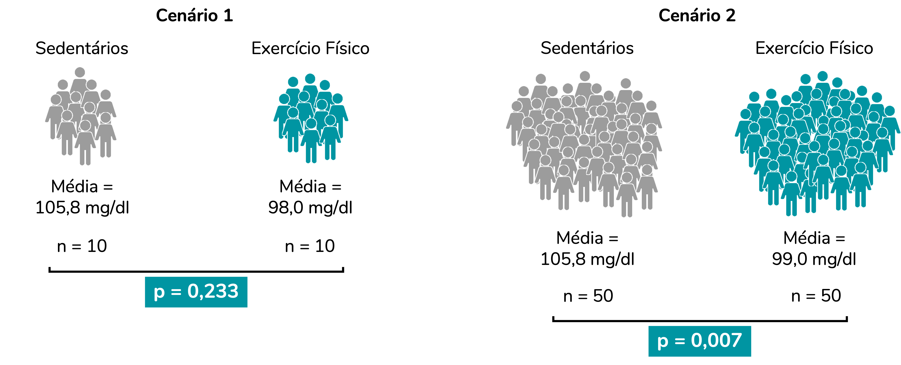
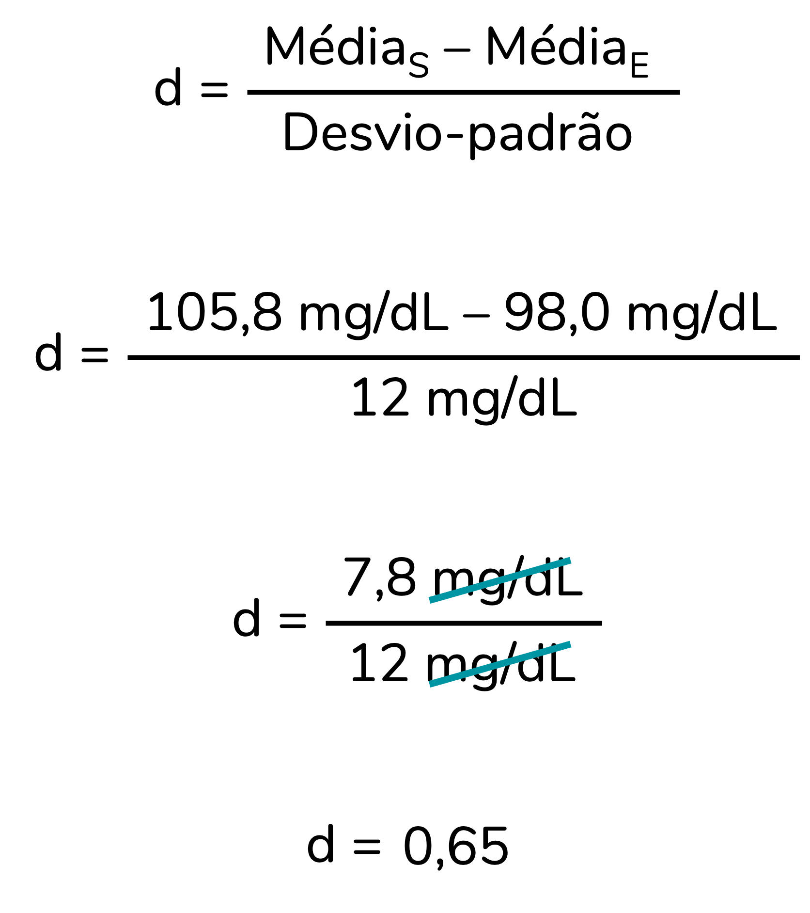

```{r, include=FALSE}
# knitr::opts_knit$set(upload.fun = knitr::imgur_upload, base.url = NULL)
knitr::opts_chunk$set(fig.width = 4, fig.height = 3.3, cache = FALSE,
                      fig.align = "center")
library(tidyverse)
library(ggpubr)
fstatix::paleta_f()
```
   
   
A resposta **resumida** à pergunta que abre o post é: tamanhos de efeito são medidas que refletem a **magnitude do efeito detectado** (por exemplo, a magnitude da diferença entre dois grupos). Mas, para que isso faça mais sentido e você entenda o porquê você deveria calculá-los na sua pesquisa, eu vou ter que partir para um exemplo...
   
   
#### O problema de pesquisa
   
Imagine que você quer investigar se a glicemia de pessoas que praticam exercício físico regularmente **difere** da glicemia de pessoas sedentárias. Para isso, você recruta pessoas que se encaixam nesses critérios, dosa suas glicemias e chega nos resultados abaixo:  
  
```{r, include=F}
set.seed(1234)
dados <- as.data.frame(
  list(Grupo = c(rep("Sedentário", 10),
                 rep("Exercício físico", 10)),
       Glicemia = c(90, 92, 97, 101, 102,
                    102, 114, 116, 118, 126,
                    93, 85, 88, 101, 114,
                    98, 92, 86, 87, 136)))


# t.test(Glicemia ~ Grupo, data = dados)
# 
# write.table(dados, pipe("pbcopy"), sep = "\t")
```
  
```{r, echo=FALSE, fig.align='center', out.width = '300px'}

```
  
  
Se calcularmos as médias, perceberemos que, para essa amostra de pessoas, a média de glicemia das pessoas sedentárias é de 105,8 mg/dL e a das pessoas que praticam exercício é de 98,0 mg/dL. Portanto, **na amostra** investigada, pessoas que praticam exercício físico aprensentam uma média de glicemia **menor** que a de pessoas sedentárias. Há uma **diferença de 7,8 mg/dL** entre os grupos.  
  
  
```{r, echo=FALSE, fig.align='center', out.width = '400px'}
knitr::include_graphics("img2.png")
```
   
   
Mas aqui precisamos entender algo importante: estamos analisando uma **amostra** de pessoas. Ao compararmos numericamente essas médias (98,0 é menor que 105,8) podemos afirmar apenas que as médias diferem **nesta amostra**.  
  
No entanto, em geral, quando investigamos uma amostra, estamos querendo chegar a uma conclusão sobre a **população**. Ou seja, nesse caso queremos responder à pergunta: pessoas que praticam exercícios físicos regularmente têm uma média de glicemia diferente da média de pessoas sedentárias? Perceba que o nosso objetivo é **extrapolar esses achados** para todas as pessoas que praticam exercícios regulares e todas as pessoas sedentárias -- essas pessoas compõem a nossa população. E, provavelmente, as médias dessa população não serão idênticas às médias obtidas na amostra. 

Podemos usar a inferência estatística fazer essa **extrapolação** e avaliar se, na população, é esperado que os valores de glicemia difiram entre esses grupos. É aí que entram os **testes de hipóteses**. Nesse caso, como queremos comparar as médias de dois grupos independentes -- isso é, compostos por pessoas diferentes -- podemos usar um teste chamado **teste-t independente**.  
   
   
>Esse é um post focado em discutir tamanho de efeito. Portanto, eu vou assumir que você tem alguma familiaridade com os conceitos de população, amostra, testes de hipóteses e valor de p.  
>  
>Caso queira uma explicação mais detalhada sobre população e amostra, recomendo [esse post](https://fernandafperes.com.br/blog/intervalo-de-confianca/).  
>  
>Para entender a fundo o que é valor de p, recomendo essa série de posts aqui do blog (que devem ser lidos nessa ordem): ["Uma doutora toma chá"](https://fernandafperes.com.br/blog/doutora-toma-cha/), ["Valor de p, nível de significância e testes uni vs. bicaudais"](https://fernandafperes.com.br/blog/valor-de-p-calculo/) e ["Falácias do valor de p"](https://fernandafperes.com.br/blog/falacias-valor-de-p/).
   
   
O teste-t independente vai gerar um valor de p. E esse valor de p é a **base da nossa decisão**: rejeitar ou não a hipótese nula. Nesse caso, considerar ou não que esses grupos **diferem na população**. Usando aqui o ponto de corte (nível de sigificância) padrão de 0,05, poderíamos esquematizas a nossa decisão da seguinte forma:  
  
  
```{r, echo=FALSE, fig.align='center', out.width = '320px'}

```
  
  
>Reforço: o foco desse post não é discutir testes de hipóteses, valor de p e essa tomada de decisão. Mas isso está bem detalhado [aqui](https://fernandafperes.com.br/blog/valor-de-p-calculo/).
   
   
Podemos rodar um teste-t independente com esses dados. Vou rodá-lo pelo R, mas se você não tem familiaridade com esse software, não se preocupe. O que vamos discutir se aplica à análise realizada em qualquer software.  
   
```{r}
t.test(Glicemia ~ Grupo, data = dados, var.equal = T)
```
  
  
Perceba que o valor de p (p-value) foi igual a 0,233. Ou seja, um valor de p maior que o nosso ponto de corte de 0,05. Nossa **tomada de decisão** aqui seria a de não rejeitar a H~0~. Portanto, consideraríamos que os grupos **não diferem** estatisticamente.  
   
   
No entanto, o valor de p apresenta **limitações importantes**, que têm sido alvo de críticas fervorosas nas últimas décadas [@sullivan2012; @cohen1994earth; @zhu2012sadly]. Uma dessas limitações é **não representar** adequadamente a **magnitude do efeito** detectado.  
  
É comum a gente considerar que quanto menor o valor de p, maior o efeito observado -- no nosso exemplo, pensaríamos "mais diferentes os grupos são". Mas esse raciocínio está **errado**. O valor de p depende, sim, da magnitude do efeito. No entanto, esse valor é também muito influenciado pelo **tamanho da amostra** [@sullivan2012].
   
   
#### Valor de p x tamanho da amostra
   
   
Para isso tudo fazer mais sentido, vamos comparar dois cenários:  

1. Um primeiro cenário idêntico ao exemplo do tópico anterior: comparação das médias de dois grupos (sedentários x exercício físico), com **10 pessoas** em cada grupo (n = 10).
2. Um segundo cenário com os mesmos dois grupos, apresentando exatamente as **mesmas médias e desvios-padrão** do cenário 1. A diferença aqui será o tamanho da amostra. Nesse segundo cenário, cada grupo incluirá **50 pessoas** (n = 50).
  
Como os valores de p irão se comportar nesses dois cenários?  
  

```{r, echo=FALSE, fig.align='center', out.width = '800px'}

```
  
  
Note que quando **aumentamos** o tamanho da amostra, o valor de p **reduziu** bastante. Inclusive, no segundo cenário tomaríamos uma **decisão** diferente da que tomamos no primeiro cenário, já que agora o valor de p é inferior a 0,05. E o mais importante: observe que chegamos a conclusões diferentes ainda que as diferenças entre os grupos sejam **idênticas** nesses dois cenários.  
  
A conclusão aqui é: o valor de p **não reflete** adequadamente a **magnitude do efeito** (nesse caso, a magnitude da diferença entre os grupos). Isso porque esse valor é influenciado também pelo tamanho da amostra. Então, o que reflete essa magnitude? Você já deve ter adivinhado: o tema da nossa conversa, o **tamanho de efeito**.  
  
Os tamanhos de efeito podem ser divididos em dois tipos: os **padronizados** e os **não-padronizados**. Vamos entendê-los melhor.

  
#### Tamanho de efeito não-padronizado
   
Por mais que "tamanho de efeito" soe como algo complexo, os tamanhos de efeito já fazem parte do nosso dia-a-dia.  
  
No exemplo acima, o efeito corresponde à diferença entre os grupos. A **diferença entre as médias** (7,8 mg/dL) é uma medida de tamanho de efeito. A partir dela, especialistas podem avaliar a diferença detectada entre esses dois grupos é **clinicamente relevante**.  
  
A diferença entre as médias é um tamanho de efeito **não-padronizado**, porque apresenta **unidade de medida** (no caso, mg/dL). Exatamente por estarem na mesma unidade de medida que os dados originais, os tamanhos de efeito não-padronizados tendem a ser mais fáceis de interpretar.  
  
  
```{r, echo=FALSE, fig.align='center', out.width = '500px'}

```
<center>
<font size="2">  
*Traduzido de [https://www.accountingexperiments.com/post/effect_size/](https://www.accountingexperiments.com/post/effect_size/)*  
*Veja, você não precisa ser um especialista em sono para perceber que 47 segundos a mais não é um aumento clinicamente relevante...*
</font>
</center>
  
  
#### Tamanho de efeito padronizado
  
  
Em alguns casos, pode ser interessante calcular tamanhos de efeito **padronizados**, que são tamanhos de efeito adimensionais, **sem unidade de medida**. Isso é particularmente útil para compararmos tamanhos de efeito de estudos diferentes.  
  
Há muitos tamanhos de efeito padronizados **diferentes**. Você já deve ter ouvido falar de vários deles. É o caso do d de Cohen, do eta-quadrado, do V de Cramer... Cada um desses tamanhos de efeito padronizado é **adequado a uma situação diferente**. Por exemplo, o d de Cohen é adequado à comparação de médias de dois grupos independentes (ou seja, é um dos tamanhos de efeito que calculamos após um teste-t independente). Já o eta-quadrado é calculado para dados analisados pela ANOVA de uma via -- ou seja, quando comparamos mais de dois grupos independentes. O V de Cramer é calculado quando utilizamos o teste qui-quadrado para investigar a associação entre duas variáveis categóricas.  
  
Nesse post, eu não vou detalhar os diferentes tamanhos de efeito. Tenho a intenção de fazer posts específicos para eles (me conta nos comentários se isso te interessa?). Mas quero discutir com você a **lógica** do tamanho de efeito d de Cohen, aplicado ao nosso exemplo, para que a parte do "padronizado" faça sentido para você.  
  
Para calcular o d de Cohen devemos dividir a diferença entre as médias dos grupos (S para sedentário e E para exercício, na imagem abaixo) pelo desvio-padrão. Para simplificar as nossas contas, vou considerar que os dois grupos têm o mesmo desvio-padrão, de 12 mg/dL.  
  
```{r, echo=FALSE, fig.align='center', out.width = '190px'}

```
  
Perceba que ao fazermos a conta as unidades de medida "se cancelam", resultando em um d adimensional:  
  
```{r, echo=FALSE, fig.align='center', out.width = '280px'}

```
  
  
O valor de d = 0,65 significa que a diferença entre as médias é de **0,65 vezes o desvio-padrão**. E os tamanhos de efeito padronizados podem ser classificados. Por exemplo, para o d de Cohen há a seguinte **sugestão de classificação** [@cohen1988]:  
  
* d ≥ 0,2 = efeito pequeno
* d ≥ 0,5 = efeito médio
* d ≥ 0,8 = efeito grande
   
No entanto, vale destacar que essas classificações são, de fato, apenas **sugestões**. É possível que um tamanho de efeito classificado como grande corresponda a uma alteração de magnitude clinicamente irrelevante. Da mesma forma, um tamanho de efeito classificado como irrisório pode representar uma alteração de magnitude significativa na prática. Portanto, recomenda-se que a interpretação do tamanho de efeito leve em consideração o contexto [@thompson2007effect; @schafer2019meaningfulness].
   
   
#### Então, eu sempre deveria calcular medidas de tamanho de efeito?
  
Na minha opinião, sim. E, veja, não necessariamente você precisa calcular tamanhos de efeito padronizados. Os não-padronizados já são extremamente relevantes. Mas, eu acho fundamental incluir uma medida da magnitude do efeito observado, além do clássico valor de p -- que eu amo, mas a gente sabe que tem lá as suas limitações.  
  
  
   
   

#### Como citar esse post, nas normas da ABNT
  
  
> PERES, Fernanda F. **O que é e por que calcular um tamanho de efeito?**. Blog Fernanda Peres, São Paulo, 12 fev. 2025. Disponível em: https://fernandafperes.com.br/blog/tamanho-de-efeito/.
  
  
<br />

*** 
  
  
### Referências  
  


