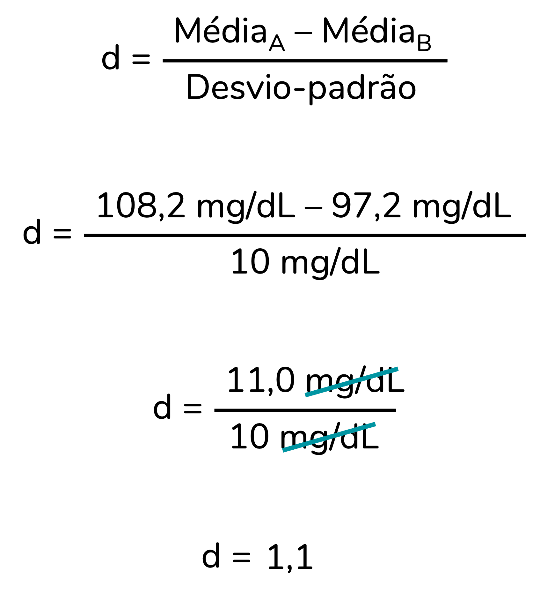

```{r, include=FALSE}
# knitr::opts_knit$set(upload.fun = knitr::imgur_upload, base.url = NULL)
knitr::opts_chunk$set(fig.width = 4, fig.height = 3.3, cache = FALSE,
                      fig.align = "center")
library(tidyverse)
library(ggpubr)
source("/Users/fernandafperes/Documents/Blog_/content/blog/render_toc.R")
fstatix::paleta_f()
```
   
   
Em um [post anterior](https://fernandafperes.com.br/blog/tamanho-de-efeito/) eu te expliquei o que é tamanho de efeito e o porquê você deveria calculá-lo nas suas análises. Nesse post, vamos discutir os tamanhos de efeito adequados a situações em que comparamos as **médias** de **dois grupos independentes**, ou seja, situações em que aplicamos o teste-t independente.  
  
Este post está dividido nos seguintes tópicos:  
  
```{r toc, echo=FALSE}
render_toc("index.Rmd", toc_header_name = NULL, toc_depth = 2, base_level = 3)
```
  
   
### O tamanho de efeito não-padronizado
   
No [post anterior](https://fernandafperes.com.br/blog/tamanho-de-efeito/), eu te expliquei que os tamanhos de efeito podem ser divididos em padronizados e não-padronizados. Os **não-padronizados** são aqueles que apresentam **unidade de medida**. Essa unidade de medida é a mesma dos dados coletados, da média, o que torna esse tipo de tamanho de efeito mais **interpretável**. É mais fácil pensarmos na **relevância clínica/ prática** de um achado ao avaliarmos o seu tamanho de efeito não-padronizado. Já o tamanho de efeito **padronizado** é adimensional, **sem unidade de medida**. Isso facilita comparações entre estudos, mas leva a uma perda de interpretabilidade.  
  
Quando comparamos as médias de dois grupos independentes, o tamanho de efeito não-padronizado é simplesmente a **diferença entre essas médias**. Seguindo com o exemplo do post anterior (mas mudando os valores para fazermos cálculos diferente), imagine que recrutamos 10 pessoas sedentárias e 10 pessoas que praticam exercícios físicos regularmente. Então, quantificamos a glicemia de cada uma dessas pessoas e calculamos a média de cada grupo. A diferença entre essas médias é o tamanho de efeito não-padronizado desta análise, conforme representado abaixo:  
    
```{r, echo=FALSE, fig.align='center', out.width = '500px'}
knitr::include_graphics("img1.png")
```
  
Vou repetir a piadinha para que essa informação fique na sua cabeça. Perceba pela tirinha abaixo, que descreve um tamanho de efeito não-padronizado (com unidade de medida, segundos), como mesmo sem sermos especialistas na área conseguimos perceber que a diferença entre os grupos não é clinicamente relevante.  
  
```{r, echo=FALSE, fig.align='center', out.width = '500px'}
knitr::include_graphics("img2.png")
```
<center>
<font size="2">  
*Traduzido de [https://www.accountingexperiments.com/post/effect_size/](https://www.accountingexperiments.com/post/effect_size/)*  
</font>
</center>
  
  
### Os tamanhos de efeito padronizados
  
Mas, sem dúvida, os tamanhos de efeito mais famosos são os padronizados, adimensionais. Para o teste-t independente, temos três tamanhos de efeito sugeridos:  
  
* d de Cohen (em inglês, *Cohen's d*)
* g de Hedges (em inglês, *Hedges' g*)
* delta de Glass (em inglês, *Glass' delta*)
  
Vamos discuti-los um a um e ao final do post eu trago um resumo de quando usá-los, combinado?
  
  
#### d de Cohen
  
O tamanho de efeito d de Cohen padroniza a diferença entre os grupos ao dividir essa diferença entre as médias pelo desvio-padrão. Uma versão resumida da fórmula, com A e B representando os dois grupos independentes, é:  
  
```{r, echo=FALSE, fig.align='center', out.width = '195px'}
knitr::include_graphics("img3.png")
```
  
Como a média e o desvio-padrão estão na mesma unidade de medida, ao dividirmos esses valores no cálculo do d, obtemos um valor adimensional, sem unidade de medida. Assumindo um desvio-padrão igual a 10 mg/dL, obtemos:
  
```{r, echo=FALSE, fig.align='center', out.width = '280px'}

```
  
##### Como interpretar esse valor?
  
Como estamos dividindo a diferença entre as médias pelo desvio-padrão, um d = 1,1 indica que **a diferença entre as médias equivale a 1,1 desvios-padrão**.  
  
De fato, se multiplicarmos o desvio-padrão (10 mg/dL) pelo valor de d (1,1), obteremos a diferença entre as médias: 10 x 1,1 = 11.
  
Um detalhe importante aqui: observe que o numerador do cálculo corresponde à diferença entre as médias. Aqui, ao montar o cálculo, eu considerei o grupo sedentário como A e o grupo exercício como B. Por isso, a diferença -- e, consequentemente, o numerador do cálculo -- foi positiva. Mas eu poderia ter considerado o grupo exercício como grupo A e o grupo sedentário como B. O que mudaria?  
  
```{r, echo=FALSE, fig.align='center', out.width = '280px'}
knitr::include_graphics("img5.png")
```
   
Perceba que o valor de d passaria a ser **negativo**, mas que o d seria idêntico em valor absoluto (em módulo). Os dois cálculos estão corretos. O valor de d ser negativo não é um problema. Isso vai acontecer quando a média do grupo A for inferior à média do grupo B. Ao interpretarmos o d, analisamos o seu **valor absoluto**.  
  
##### Classificação do valor de d
  
O valor de d pode ser classificado como pequeno, médio ou grande, de acordo com a sugestão do Cohen em seu livro de 1988 [@cohen1988]:  
  
* d ≥ 0,2 = efeito pequeno
* d ≥ 0,5 = efeito médio
* d ≥ 0,8 = efeito grande
   
No entanto, vale destacar que essa ou outras classificações são, de fato, apenas **sugestões**. É possível que um tamanho de efeito classificado como grande corresponda a uma alteração de magnitude clinicamente irrelevante. Da mesma forma, um tamanho de efeito classificado como irrisório (inferior a pequeno) pode representar uma alteração de magnitude significativa na prática. Portanto, recomenda-se que a interpretação do tamanho de efeito leve em consideração o contexto [@thompson2007effect; @schafer2019meaningfulness]. O próprio Cohen enfatiza bastante isso no seu livro [@cohen1988].
   
   
##### Outras fórmulas para o d de Cohen
  
Até aqui te mostrei a fórmula abaixo. Ela está correta, mas ela se aplica apenas à seguinte situação: dois grupos com o mesmo n e os mesmos desvios-padrão. Quando o n e/ ou os desvios-padrão variam entre os grupos, precisamos ajustar a fórmula para considerar essa variação. Ela passa a ser [@lakens2013; @espiritosanto2015]:  
  
```{r, echo=FALSE, fig.align='center', out.width = '450px'}
knitr::include_graphics("img6.png")
```
   
Eu sei, não é uma fórmula muito simpática. Mas tudo o que discutimos anteriormente, inclusive a interpretação do valor de d, **segue válido** mesmo quando aplicamos essa fórmula.  
  
##### Como calcular o valor de d?
  
Bom, como você já deve ter imaginado, basta aplicar a fórmula acima. Mas, vou te indicar outras duas opções:  
  
**1. Usando uma planilha de Excel**
  
Eu desenvolvi uma planilha de Excel que realiza esses cálculos e inclusive calcula o intervalo de confiança 95% para o d. Para utilizá-la, faça o download do arquivo Excel que está na descrição [deste vídeo](https://youtu.be/Oy6woi2HALo?si=ba4394oQymLbf9sU).  
Ah, o vídeo explica em detalhes como usar a planilha.  
  
**2. Pelo R**
  
Imagine que temos uma base de dados nomeada como "dados" com uma coluna "Grupo" e outra "Glicemia". A tabela abaixo mostra algumas linhas dessa base:    
  
```{r, echo=FALSE}
set.seed(1234)
dados <- as.data.frame(
  list(Grupo = c(rep("Sedentário", 13),
                 rep("Exercício físico", 15)),
       Glicemia = c(rnorm(13, mean = 108.2, sd = 12),
                    rnorm(15, mean = 97.2, sd = 10)))) |> 
  mutate(Glicemia = round(Glicemia),
         Grupo = factor(Grupo))

set.seed(1808)
dados |> sample_n(replace = F, size = 8) |> 
  flextable::flextable() |> 
  flextable::bold(part = "header") |> 
  flextable::width(width = c(1.5, 1)) |> 
  flextable::align(align = "center", part = "all")
```
  
Para calcular o valor de d podemos rodar a seguinte função do pacote `effectsize`:  
  
```{r}
effectsize::cohens_d(Glicemia ~ Grupo, data = dados)
```

Ou seja, o valor de d para esses dados é igual a -0,65, com um intervalo de confiança 95% [-1,41; 0,12]. De acordo com a classificação sugerida pelo Cohen [@cohen1988], trata-se de um tamanho de efeito médio.  
  
>Não vou discutir intervalo de confiança 95% neste post, mas você encontra [aqui](https://fernandafperes.com.br/blog/intervalo-de-confianca/) um post bem detalhado sobre esse tema.  
  
   
#### g de Hedges
  
O tamanho de efeito d de Cohen é o mais popular e utilizado no contexto do teste-t independente. No entanto, o d de Cohen **não é adequado a amostras pequenas** (n < 20 no total). Nessas situações devemos usar o tamanho de efeito g de Hedges, que nada mais é do que o d de Cohen corrigido para amostras pequenas [@lakens2013; @espiritosanto2015]:  
  
```{r, echo=FALSE, fig.align='center', out.width = '450px'}
knitr::include_graphics("img7.png")
```
  
Os pormenores da correção não nos interessam. O importante é entender que essa versão corrigida é mais adequada que o d de Cohen para amostras pequenas, com n total inferior a 20.  
  
##### Interpretação e classificação do g de Hedges
  
A interpretação e a classificação do g de Hedges são idênticas às do d de Cohen. Afinal, ele é apenas uma versão do d de Cohen corrigida para ser adequada a amostras menores.  
  
  
##### Como calcular o valor de g?
  
De novo, basta aplicar a fórmula acima. Mas, assim como para o d, podemos realizar esse cálculo usando planilhas em Excel ou o software R:  
  
**1. Usando uma planilha de Excel**
  
A planilha de Excel que eu mencionei anteriormente também calcula o g de Hedges. Para utilizá-la, faça o download do arquivo Excel que está na descrição [deste vídeo](https://youtu.be/Oy6woi2HALo?si=ba4394oQymLbf9sU). O vídeo explica em detalhes como usar a planilha.  
  
**2. Pelo R**
  
Partindo de uma base de dados nomeada como "dados" com uma coluna "Grupo" e outra "Glicemia", o g de Hedges pode ser calculado a partir da seguinte função do pacote `effectsize`:  
  
```{r}
effectsize::hedges_g(Glicemia ~ Grupo, data = dados)
```

Ou seja, o valor de g para esses dados é igual a -0,63 (bem semelhante ao d, mas um pouco menor), com um intervalo de confiança 95% [-1,37; 0,11]. De acordo com a classificação sugerida pelo Cohen [@cohen1988], trata-se de um tamanho de efeito médio.  
  
  
  
  
#### delta de Glass
  
Uma limitação dos tamanhos de efeito d de Cohen e g de Hedges é que eles devem ser usados para grupos com variâncias homogêneas -- isso é, não muito discrepantes. Caso os grupos apresentem **variâncias muito diferentes**, o tamanho de efeito mais recomendado é o **delta de Glass**.  
  
>Variância não é o foco deste post. Mas, caso queira ler mais sobre esse tema, recomendo [esse post](https://fernandafperes.com.br/blog/variancia-desvio-padrao/).
  
O delta de Glass tem uma fórmula simples: ele divide a diferença entre as médias pelo desvio-padrão de um dos grupos [@lakens2013; @espiritosanto2015]. Recomenda-se que o grupo cujo desvio-padrão será adicionado à fórmula seja o grupo controle.  
  
```{r, echo=FALSE, fig.align='center', out.width = '230px'}

```
  
##### E se não existir grupo controle?
  
Caso não exista grupo controle, a recomendação é calcular as duas versões possíveis do delta de Glass -- uma com o desvio-padrão do grupo A e outra com o desvio-padrão do grupo B -- e reportá-las:  
  
```{r, echo=FALSE, fig.align='center', out.width = '550px'}
knitr::include_graphics("img9.png")
```
  
##### Interpretação e classificação do delta de Glass
  
O delta de Glass (Δ) segue a mesma classificação do d de Cohen [@cohen1988]:  
  
* Δ ≥ 0,2 = efeito pequeno
* Δ ≥ 0,5 = efeito médio
* Δ ≥ 0,8 = efeito grande 
  
E a interpretação se mantém. Perceba que novamente estamos dividindo a diferença entre as médias por um desvio-padrão (nesse caso, geralmente o do grupo controle). Portanto, um delta de Glass de 1,1 indica que a diferença entre as médias é 1,1 vezes o desvio-padrão do controle.  
  
  
##### Como calcular o valor de delta?
  
Basta aplicar a fórmula acima ou calculá-lo usando planilhas em Excel/ o software R:  
  
**1. Usando uma planilha de Excel**
  
A planilha de Excel que eu te sugeri também calcula o delta de Glass. Para utilizá-la, faça o download do arquivo Excel que está na descrição [deste vídeo](https://youtu.be/Oy6woi2HALo?si=ba4394oQymLbf9sU). O vídeo explica em detalhes como usar a planilha.  
  
**2. Pelo R**
  
Partindo de uma base de dados nomeada como "dados" com uma coluna "Grupo" e outra "Glicemia", o delta de Glass pode ser calculado a partir da seguinte função do pacote `effectsize`. O segundo grupo mostrado pelo `levels(dados$Grupo)` é o grupo controle. Nesse caso, "Sedentário".   
  
```{r}
levels(dados$Grupo)

effectsize::glass_delta(Glicemia ~ Grupo, data = dados, adjust = F)
```
  
O argumento `adjust`, quando `TRUE`, calcula a versão do delta de Glass adequada a amostras pequenas (n < 20). Uma correção semelhante à que é feita no cálculo do g de Hedges. Aqui escolhi calcular a versão não corrigida.  
  
Ou seja, o valor de delta para esses dados é igual a -0,62, com um intervalo de confiança 95% [-1,36; 0,14]. De acordo com a classificação sugerida pelo Cohen [@cohen1988], trata-se de um tamanho de efeito médio.  
  
Caso você queira trocar o grupo de referência, basta alterar a ordem das categorias:  
  
```{r}
dados$Grupo <- factor(dados$Grupo,
                      levels = c("Sedentário", "Exercício físico"))

effectsize::glass_delta(Glicemia ~ Grupo, data = dados, adjust = F)
```
  
Perceba que agora obtemos outro resultado para o delta de Glass. Assim como o d de Cohen e o g de Hedges, o delta de Glass pode apresentar valores negativos. Isso acontece quando o grupo A apresenta uma média inferior à do grupo B.  
  
  
#### Explicações detalhadas em R
  
Caso você queira calcular esses tamanhos de efeito em R e tenha enfrentado alguma dificuldade com os códigos compartilhados aqui, recomendo que você assista a [esse vídeo](https://youtu.be/IpSuIodj-Bs?si=X3CYaWXPInsDzLlZ).  
  
  
### Resumo e recomendações
  
```{r, echo=FALSE, fig.align='center', out.width = '800px'}
knitr::include_graphics("img10.png")
```

   

### Como citar esse post, nas normas da ABNT
  
  
> PERES, Fernanda F. **Tamanhos de efeito para o teste-t independente**. Blog Fernanda Peres, São Paulo, 24 fev. 2025. Disponível em: https://fernandafperes.com.br/blog/te-teste-t-independente/.
  
  
<br />

*** 
  
  
### Referências  
  


