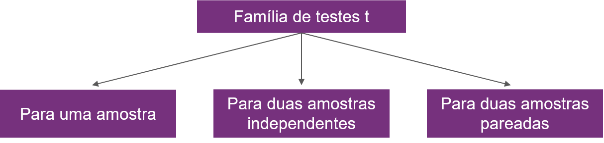
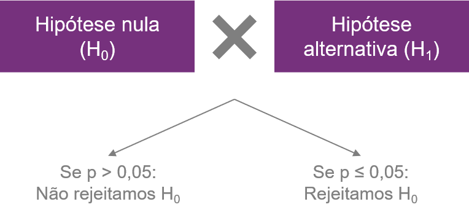

```{r, include=FALSE}
knitr::opts_knit$set(upload.fun = knitr::imgur_upload, base.url = NULL)
knitr::opts_chunk$set(fig.width = 5, fig.height = 5, cache = TRUE)
```
  
Há três principais tipos de testes-t: o teste-t para uma amostra, o teste-t para duas amostras independentes (ou apenas teste-t independente) e o teste-t para duas amostras pareadas (ou teste-t pareado).

```{r, echo=FALSE, fig.align='center', out.width = '600px'}

```

Nesse post, falaremos sobre como fazer o teste-t independente, usando o software R.

> Algumas informações importantes:  
<li>Se você prefere consumir esse conteúdo na forma de vídeo, você encontra um [tutorial](https://youtu.be/62YSVhzDjo8) muito semelhante no meu canal do YouTube.</li>  
<li>Esse tutorial assume que você tem alguns conhecimentos básicos de R, como instalação e carregamento de pacotes. Caso queira aprender essa parte básica, incluindo como instalar os softwares R e RStudio, sugiro os primeiros vídeos desta [playlist](https://www.youtube.com/watch?v=WVogdSlk7gY&list=PLOw62cBQ5j9VE9X4cCCfFMjW_hhEAJUhU).</li><br>


### Quando usar o teste-t independente? Quais as suas hipóteses?
  
O teste-t independente é usado para comparar as médias de **dois grupos independentes**. 
  
O que significa dizer que dois grupos são independentes? Significa que os valores obtidos em um dos grupos não dependem dos valores obtidos no outro. Na prática, dizemos que os grupos são independentes quando são compostos por sujeitos experimentais diferentes. No exemplo que faremos hoje, compararemos as notas de dois grupos de alunos: os alunos que sentam nas primeiras fileiras da sala e os alunos que sentam nos fundos (a galera do fundão). Note que são grupos independentes, uma vez que são compostos por alunos diferentes.  
  
Você pode estar se perguntando: mas, **e se eu tiver mais de dois grupos?** Bom, aí o teste-t não será o teste adequado a você. Você provavelmente terá que usar um teste chamado ANOVA (Análise de Variância).
  
#### Hipóteses nula e alternativa
  
O teste-t independente é um teste de hipóteses. Isso significa que ele apresenta uma hipótese nula e uma hipótese alternativa, que se contradizem.  
Escolhemos a hipótese mais apropriada com base no valor de p do teste, ao comparar esse valor de p com o nível de significância (alfa). O nível de significância mais comumente utilizado (e que usaremos aqui) é o de 5% (0,05).  
Caso o valor de p seja superior a 0,05, não rejeitamos a hipótese nula (H<sub>0</sub>). Caso seja igual ou inferior, rejeitamos a H<sub>0</sub> e aceitamos a hipótese alternativa (H<sub>1</sub>).  
  
Vamos denominar os dois grupos independentes de A e B. As hipóteses por trás de todos os testes-t independente são:

* H<sub>0</sub>: média do grupo A $=$ média do grupo B
* H<sub>1</sub>: média do grupo A $\neq$ média do grupo B

### A pergunta experimental

O banco de dados “Banco de Dados 3.csv” contém informações de 32 alunos da rede pública e privada. Há efeito da posição que o aluno ocupa na sala (se “Frente” ou “Fundo”) sobre as suas notas de Biologia ou História?
  
  
Para responder a essa pergunta, usaremos o teste-t independente. Note que queremos comparar as notas (variáveis numéricas) de dois grupos independentes de alunos (Frente x Fundos).


### Análise estatística

#### Passo 1. Instalação + carregamento dos pacotes que serão utilizados

```{r, message=FALSE, warning=FALSE}
if(!require(dplyr)) install.packages("dplyr")
library(dplyr)

if(!require(rstatix)) install.packages("rstatix")
library(rstatix)

if(!require(car)) install.packages("car")
library(car) 

if(!require(ggplot2)) install.packages("ggplot2")
library(ggplot2) 
```

Vamos usar os pacotes `dplyr`, `rstatix`, `car` e `ggplot2`. O código acima está instruindo que os pacotes sejam instalados caso ainda não tenham sido e, caso já estejam instalados, que sejam carregados.

#### Passo 2. Carregamento e visualização do banco de dados

Para esse tutorial, vamos usar o banco de dados chamado "Banco de Dados 3", que está no formato .csv brasileiro (com vírgulas como separador de decimal e ponto-vírgula como separador de colunas). Todos os dados são fictícios. Para aumentar a reprodutibilidade, hospedei esse banco no meu GitHub, então basta colocar o endereço para que o carregamento aconteça.

```{r}
dados <- read.csv2("https://raw.githubusercontent.com/fernandaperes/bancosdedados/main/Bancos%20em%20csv/Banco%20de%20Dados%203.csv", stringsAsFactors = TRUE)
```

A função `read.csv2` é a adequada ao formato .csv brasileiro. Atribuímos no código acima a denominação `dados` ao nosso banco.
Adicionamos também o atributo `stringsAsFactors = TRUE` para estabelecer que os textos do banco de dados correspondem a fatores.


```{r}
head(dados, 10)
```

Observe que temos no banco 7 variáveis:

* Sujeito, que corresponde a um ID do aluno
* Gênero, classificado como M ou F
* Escola, classificada como Pública ou Privada
* Posição na sala, classificada como Fundos ou Frente
* Nota de biologia, que varia de 0 a 10
* Nota de história, que varia de 0 a 10
* Nota de física, que varia de 0 a 10
  
A **pergunta experimental** é se a posição na sala tem efeito sobre as notas de biologia e história. Logo, usaremos no nosso modelo as variáveis relacionadas a essas notas e a variável "posição na sala".  

Faremos um teste-t para a nota de biologia e um para a nota de história.
  
  
#### Passo 3. Checagem dos pressupostos

O teste-t independente apresenta dois pressupostos:

* Normalidade da variável dependente em cada grupo
* Homogeneidade de variâncias (ou seja, grupos com variâncias homogêneas)
  
  
Para **checar a normalidade** podemos usar o **teste de Shapiro-Wilk**, aplicado a cada grupo. Usaremos para isso o pacote `dplyr`, para separação dos grupos, e o pacote `rstatix` para aplicar o teste de Shapiro (função `shapiro_test`) a cada grupo e nota.

```{r}
dados %>% group_by(Posicao_Sala) %>% shapiro_test(Nota_Biol, Nota_Hist)
```
  
O teste de Shapiro-Wilk tem como hipóteses:
H<sub>0</sub>: os dados seguem a distribuição normal
H<sub>1</sub>: os dados **não** seguem a distribuição normal
  
Como todos os valores de p foram superiores a 0,05, não vamos rejeitar a H<sub>0</sub> em nenhum dos grupos. Logo, vamos considerar que todos apresentam distribuição normal.
  
```{r, echo=FALSE, fig.align='center', out.width = '350px'}

```
  
O segundo pressuposto a ser checado é a homogeneidade de variâncias, que pode ser avaliada pelo teste de Levene (pacote `car`):

**Para a nota de biologia:**
```{r}
leveneTest(Nota_Biol ~ Posicao_Sala, data = dados, center = mean)
```
  

**Para a nota de história:**
```{r}
leveneTest(Nota_Hist ~ Posicao_Sala, data = dados, center = mean)
```

O teste de Levene tem como hipóteses:
H<sub>0</sub>: os grupos apresentam variâncias homogêneas
H<sub>1</sub>: os grupos **não** apresentam variâncias homogêneas
  
Para as notas de biologia, p foi maior que 0,05. Portanto, não rejeitaremos H<sub>0</sub> e consideraremos que os grupos apresentam variâncias homogêneas.  
Já para as notas de história, p foi menor que 0,05, indicando que devemos rejeitar H<sub>0</sub> e, portanto, considerar que o pressuposto da homogeneidade de variâncias foi violado. Nós poderemos seguir com o teste-t, mas deveremos usar um teste-t com correção para essa violação da homogeneidade, a correção de Welch.

#### Passo 4. Realização do teste-t independente

Para as notas de biologia vamos programar com `var.equal=TRUE`, uma vez que o pressuposto da homogeneidade de variâncias foi atendido para essa nota. Para as notas de história, colocaremos `var.equal=FALSE`.

**Teste-t para a nota de biologia:**
```{r}
t.test(Nota_Biol ~ Posicao_Sala, dados, var.equal=TRUE)
```
  
O teste resulta em um valor de t (no caso, t = 4,60) e um valor de p (p-value) que é calculado com base nesse valor de t e nos graus de liberdade (df, do inglês *degrees of freedom*).  
Nesse caso, o valor de p é: 7,136e-05. Isso equivale a: 7,136 x 10<sup>-5</sup>. Ou seja, p = 0,00007136, um valor inferior ao nível de significância 0,05.
  
Para interpretá-lo adequadamente, precisamos relembrar as hipóteses nula e alternativa do teste-t independente:

* H<sub>0</sub>: média do grupo A $=$ média do grupo B
* H<sub>1</sub>: média do grupo A $\neq$ média do grupo B
  
Adaptando para essa situação, teremos:  
  
* H<sub>0</sub>: média das notas de biologia do grupo Frente $=$ média das notas de biologia do grupo Fundos
* H<sub>1</sub>: média das notas de biologia do grupo Frente $\neq$ média das notas de biologia do grupo Fundos
  
Como p < 0,05, vamos rejeitar a H<sub>0</sub> e considerar que os dois grupos apresentam notas de biologia que são, em média, estatisticamente diferentes.
  
Note que o R ainda libera, por escrito, a hipótese alternativa: "a diferença entre as médias é diferente zero", o que equivale a dizer que os grupos apresentam médias diferentes.  
  
Além disso, o R também libera por padrão o intervalo de confiança 95% (IC 95%) para a diferença entre as médias. Essa é uma informação complementar ao valor de p. Nesse caso, o intervalo de confiança 95% foi de [1,41; 3,66]. Observe que o valor zero não está incluído nesse intervalo, o que - da mesma forma que o valor de p - indica que os grupos são estatisticamente diferentes.  
  
Sabendo que as médias são estatisticamente diferentes, podemos analisar qual dos grupos apresenta notas de biologia que são, em média, maiores. Para isso, basta olharmos as médias. A saída do R mostra que o grupo Frente apresenta uma média de 6,52, enquanto que o grupo Fundos uma média de 3,98. Logo, os alunos do grupo Frente apresentam, em média, um desempenho superior em biologia.
  


**Teste-t para a nota de história:**
```{r}
t.test(Nota_Hist ~ Posicao_Sala, dados, var.equal=FALSE)
```

Aplicaremos exatamente o mesmo raciocínio para as notas de história.  
  
Para as notas de história, o valor de t foi de 1,57, com 19,909 graus de liberdade (não estranhe o valor quebrado, isso se deve à correção de Welch que usamos) e um valor de p de 0,1313. Para esse teste, temos como hipóteses:  

* H<sub>0</sub>: média das notas de história do grupo Frente $=$ média das notas de história do grupo Fundos
* H<sub>1</sub>: média das notas de história do grupo Frente $\neq$ média das notas de história do grupo Fundos
  
Note que o valor de p é maior que 0,05. Logo, não devemos rejeitar a H<sub>0</sub>. Isso significa não temos evidências para afirmar que as médias dos grupos Frente e Fundos são estatisticamente diferentes.  
  
De acordo, observe que o IC 95% para a diferença entre médias inclui o zero: [-0,39; 2,76].
  
#### Passo 5. Análise descritiva

Para uma análise descritiva mais completa, vamos primeiramente calcular os valores de média e desvio-padrão para os dois grupos.

```{r}
dados %>% group_by(Posicao_Sala) %>% get_summary_stats(c(Nota_Biol, Nota_Hist), type = "mean_sd")
```

É bem útil também fazermos um gráfico para visualizarmos e representarmos essa diferença.
  
**Gráfico de dispersão (dot-plot) para as notas de biologia**
```{r, fig.width=5, fig.height=4, dpi=300, fig.align='center', out.width='450px', warning=FALSE, message=FALSE}
ggplot(data = dados,
       mapping = aes(x = Posicao_Sala, y = Nota_Biol)) +
  geom_dotplot(binaxis = "y", stackdir = "center",
               fill="#D8D8D8", color="#D8D8D8", dotsize = 0.8) +
  geom_point(stat = "summary", fun = "mean", size = 2) +
  geom_errorbar(stat = "summary", fun.data = "mean_se", width = 0.1) +
  ylab("Notas de biologia") +
  xlab("Posição na sala") +
  scale_y_continuous(limits=c(0,10), expand = c(0,0)) +
  theme_classic(base_size=12)
```
  
**Gráfico de dispersão (dot-plot) para as notas de história**
```{r, fig.width=5, fig.height=4, dpi=300, fig.align='center', out.width='450px', warning=FALSE, message=FALSE}
ggplot(data = dados,
       mapping = aes(x = Posicao_Sala, y = Nota_Hist)) +
  geom_dotplot(binaxis = "y", stackdir = "center",
               fill="#D8D8D8", color="#D8D8D8", dotsize = 0.8) +
  geom_point(stat = "summary", fun = "mean", size = 2) +
  geom_errorbar(stat = "summary", fun.data = "mean_se", width = 0.1) +
  ylab("Notas de história") +
  xlab("Posição na sala") +
  scale_y_continuous(limits=c(0,10), expand = c(0,0)) +
  theme_classic(base_size = 12)
```
  
### Descrevendo os resultados
  
O teste-t para duas amostras independentes mostrou que há efeito da posição na sala sobre as notas de biologia (t<sub>(30)</sub> = 4,60; p < 0,001), mas não sobre as de história (t<sub>(19,91)</sub> = 1,57; p = 0,131). O grupo que senta na frente da sala apresentou, em média, notas de biologia superiores às do grupo que senta nos fundos da sala.  
  

<br><br><br>
  

  